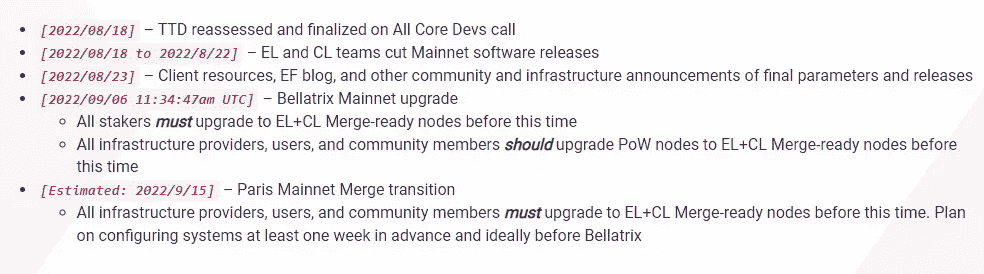
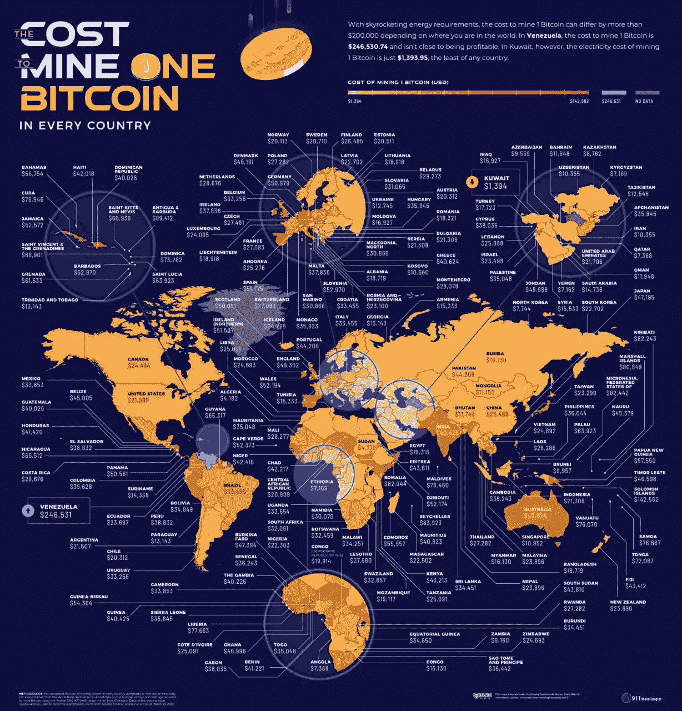

# ETH Merge:您实际需要的剂量

> 原文：<https://medium.com/coinmonks/the-eth-merge-the-dose-you-actually-need-7bc7f55bd19c?source=collection_archive---------3----------------------->

我们的去中心化操作系统以太坊的另一个历史性时刻是全速前进，并在前进的道路上显示出积极的迹象。以太坊合并预计发生在 9 月 15 日左右，或者更准确地说，当总终端难度(TTD)达到 5.875*10 ⁹(目前是 1.208*10 ⁶.)时这显示了工作证明(PoW)上以太坊开采的最后一块所需的总难度。与使用块的数量来确定最后一个 PoW 块相反，TTD 确保在最后一个块上已经做了足够的工作，而不是恶意的参与者提交大量自制的块。一旦开采的区块达到如此程度的难度，所有区块都将按照利益证明(PoS)共识机制进行生产。

让我们更深入地探究合并的技术魔力，毕竟这是网络有史以来最复杂的升级。让我们通过考虑网络的两层来理解它，共识层和执行层。合并是一个两步的过程，它从具有槽高度的一致性层的升级开始，然后将一致性机制转移到执行层的 PoS。在执行层，TTD 将作为一个信号。当它达到一定级别时，所有的节点操作者将升级到新版本。

首先，贝拉特里克斯升级将会进行。这是信标链的行为，即当前运行的 PoS 链为链的安全性积累资本，为升级做准备。然后是巴黎升级，TTD 将宣布完成贝拉特里克斯信令节点运营商为合并做好准备。一旦命中 TTD，客户端就监听所产生块，且从那时起，所有的块都将通过发布一致机制来产生。TTD 会随着工作证明共识的波动而波动，因此一周的误差是可以接受的。作为 ETH 的持有者，你什么都不用担心。硬币转移的机制并没有改变硬币本身。

Source: [https://blog.ethereum.org/2022/08/12/finalized-no-36/](https://blog.ethereum.org/2022/08/12/finalized-no-36/)

还是没弄明白，还是再简化一下吧。想象你自己在建一栋多层公寓。你是在顶层工作的泥瓦匠，而工人们从下面为你提供所有的原材料。一旦你到达不适合工人用手运送材料的楼层高度，你就改变你的策略。也就是说，建筑的具体高度让你宣布必须要有所改变。类似地，在共识层上商定槽高度，并为执行层宣布 TTD 以改变其策略。工人们有了滑轮和电梯，从这里可以看到阳光和彩虹；你得到了完美的加密货币。嗯，不完全是这样。

以太坊使用工作证明来实现安全性，这是通过使用昂贵的硬件来实现的，如 GPU 和 ASICS。你可能因为以下两个原因之一在以太坊采矿:

*   支持这一事业并全身心地投入到游戏中
*   从中赚钱

在这两种情况下，你都被激励成为网络的一部分。每开采一个区块你都会得到奖励。因此，很明显，由于后一个原因，会有更多的人去采矿。此外，即使你支持这项事业，你也希望获得 ETH 值。

在大多数第三世界国家，采矿一直是大多数人的收入来源。矿工们仅在 7 月份就生产了价值 6 . 2 亿美元的乙醚。剥夺矿工的收入来源不会让他们安息。比特币挖矿的观点:

Source: [https://vividmaps.com/cost-to-mine-cryptocurrencies/](https://vividmaps.com/cost-to-mine-cryptocurrencies/)

一个重大的转变刺激了宣传，不管是好是坏，主要是因为观点的冲突。现在，这样一个关于第二大加密货币的大事件不会没有任何反弹。以太坊经典(ETC)是作为一个硬叉子创建的，以对抗偏离原则代码就是法律。一些贪婪伴随着操纵，一些代表着网络的改善。ETC 上升为一种支持原始以太坊的加密货币。一个历史性的事件，在当时，也被分叉以太坊的开发者和热心支持者认为是无用的。随着[以太广场](https://twitter.com/EthereumPoW)的出现，以太广场【PoW】的支持者，矿工，已经上升到[分叉以太广场](https://www.theblock.co/post/163229/ethpow-team-says-its-miner-led-ethereum-fork-is-inevitable#:~:text=The%20team%20behind%20ETHPoW%20today%20published%20an%20open%20letter%20claiming%20its%20proof%2Dof%2Dwork%20fork%20of%20Ethereum%20was%20%E2%80%9Cinevitable.%E2%80%9D)声称这是不可避免的。这个想法之所以受到关注，是因为中国矿商钱德勒郭(Chandler Guo)公开支持分叉以太坊，他说:“我分叉以太坊一次，我还会分叉第二次”。

除此之外，有争议的 TRON 创始人 Justin Sun 已经成为一名投资者，他将通过捐赠其公司拥有的 100 万 ETH 中的一部分来支持 ETHPOW。他还宣布 USDN 是分叉的 ETH 链上第一个稳定的硬币。此外，已知最初支持 ETC 的交易所 Poloniex 也将支持以太坊的分叉，并将上市 ETHW。

然而，另一方面，Vitalik 公开表示，另一个硬叉子的出现是不必要的，只是得到了想快速赚钱的人的支持[。他解释说，对于矿工来说，以太坊经典是一种更好的产品，可以吸收散列率。它已经建立了相当长的时间，他认为它优于任何硬叉子。此外，](https://fortune.com/2022/08/06/vitalik-buterin-ethereum-creator-on-merge-ethpow/#:~:text=%E2%80%9Ca%20couple%20of%20outsiders%20that%20basically%20have%20exchanges%20and%20most%20just%20want%20to%20make%20a%20quick%20buck%2C%E2%80%9D) [Circle 的 USDC 和 USDT 已宣布全力支持 PoS 以太坊](https://fortune.com/2022/08/09/stablecoins-circle-tether-support-ethereum-merge-proof-of-stake/)，考虑到稳定硬币的巨大市场资本及其稳健的使用案例，这对于以太坊的成功至关重要。 [Chainlink 也站出来支持 ETH 的 PoS 版本](https://docs.chain.link/docs/ethereum-proof-of-stake-merge/)，声明这一决定与更广泛的以太坊社区和以太坊基金会一致。

网络是由人经营的。这些人充当矿工来保护分散的账本。人们的非理性根深蒂固。像叉子一样，得出不合逻辑的结论是不可避免的。支持以太坊这样大的东西的二元范式转换肯定是不可能的。当 ETC 出现时，Vitalik 低估了它的成功。这里可以看到类似的说法。然而，以太网在其[地址](https://etherscan.io/address/0xa071Fc107ade6e643AFC2A18CD53Aa9E1d879fFD)收到的捐款也并不乐观。总共捐赠了大约 0.7ETH、价值 11，000 美元的 USDT 和一堆其他小纪念品。以预测卢娜死亡螺旋而闻名的伽罗瓦资本公司的联合创始人周世杰提出了一个声明，即一个艰难的分叉肯定会发生。矿工们希望在以太坊的未来中分得一杯羹。他期待[三叉](https://unchainedpodcast.com/why-kevin-zhou-believes-ethereum-will-have-3-forks-after-the-merge-ep-381/)。基础设施已经在 ETH 上出现，一个分叉的版本可以得到它需要的开发者。

时间只能告诉我们他的传奇将如何展开。对于即将到来的去中心化协议的未来来说，这无疑将是一个历史性的时刻，它将被记录下来，以供他人寻求指导和借鉴。不管有没有叉子，钱都不应该丢。这很重要。

> 加入 Coinmonks [电报频道](https://t.me/coincodecap)和 [Youtube 频道](https://www.youtube.com/c/coinmonks/videos)了解加密交易和投资

# 另外，阅读

*   [如何在 Bitbns 上购买柴犬(SHIB)币？](https://coincodecap.com/buy-shiba-bitbns) | [购买 Floki](https://coincodecap.com/buy-floki-inu-token)
*   [CoinFLEX 评论](https://coincodecap.com/coinflex-review) | [AEX 交易所评论](https://coincodecap.com/aex-exchange-review) | [UPbit 评论](https://coincodecap.com/upbit-review)
*   [十大最佳加密货币博客](https://coincodecap.com/best-cryptocurrency-blogs) | [YouHodler 评论](https://coincodecap.com/youhodler-review)
*   [AscendEx 保证金交易](https://coincodecap.com/ascendex-margin-trading) | [Bitfinex 赌注](https://coincodecap.com/bitfinex-staking)
*   [最好的卡达诺钱包](https://coincodecap.com/best-cardano-wallets) | [Bingbon 副本交易](https://coincodecap.com/bingbon-copy-trading)