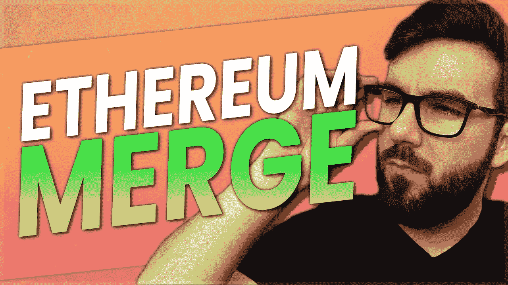

# 以太坊合并和误解解释

> 原文：<https://medium.com/coinmonks/the-ethereum-merge-and-misconceptions-explained-d78c822e711e?source=collection_archive---------23----------------------->

关于 ETH 合并有很多误解。让我们来谈谈它们，并分享到底发生了什么变化以及未来会发生什么。

这是我的第 539 集/文章。我在这个内容上投入了大量的工作，所以如果你觉得它有价值，请喜欢，分享，评论和订阅！

这是一个关于以太坊合并的伟大资源:[https://ethereum.org/en/upgrades/merge/](https://ethereum.org/en/upgrades/merge/)。

以太坊从工作证明转变为利益证明。其他方面没有太大变化，但它已经启动了很多。也就是说，现在是利益相关者而不是矿工在经营网络，但是对终端用户来说没有明显的变化。ETH 将保持不变，你不需要在你的钱包里做任何事情来切换。另一个重大变化是，从工作证明转换到利益证明将减少以太坊约 99.95%的能耗，这是一个巨大的变化，因为区块链对工作证明的主要批评是它们是能源密集型的，不环保。

为了简单起见，我们现在将 Eth1 称为执行层，在这里处理事务，将 Eth2 称为验证器的利益一致性证明。除了命名之外，这不会改变任何东西，所以我们可以更好地讨论和解释以太坊。

# 误解

一个主要的误解是，汽油费会自动提高，而实际上，在第一阶段“激增”完成之前，它们不会受到影响。我们稍后将深入研究这些阶段。所以以太坊并没有降低燃气费，他们只是还没有受到影响。

合并的另一个误解是 ETH 定位需要 32 个 ETH。这是不完全准确的，因为你可以在一个池中的交易所和服务中下注，甚至运行你自己的节点，但是运行你自己的节点而不下注意味着你不会获得奖励。你可以在这里了解更多:【https://ethereum.org/en/run-a-node/】T2。使用提供 ETH staking 的交易所和服务的问题是，他们正在大量整合 ETH，这不利于集中化，并且如果他们被黑客攻击或发生其他事情，也会产生很多风险。还需要注意的是，提款还没有被加入，所以即使在 2 年的锁定期结束后，如果出于某种原因没有加入，你也不能拿回你的 ETH。这不是一个真正的问题，因为它将发展到那时，但重要的是要了解这种风险时，你的股份。然而，验证者仍然会收到费用和 MEV 立即可用，他们只是不会得到他们的股份，直到提款被启用。

当允许撤销时，人们担心每个人都会立即退出，但是对于每个时期(每 6.4 分钟)可以退出的验证器的数量是有限制的，每个时期只有 6 个退出。这相当于每天 1350 个月经周期，或者每天超过 1400 万个月经周期中的大约 43200 个月经周期。这意味着所有验证者退出需要近一年的时间，假设这是他们的意图，所以理想情况下，事情会在这段时间内平衡，因为 APR 也是动态的，如果验证者确实退出，会鼓励更多的人参与进来。

# 集中

根据 https://ethereum.org/en/staking/的数据，在撰写本文时有 432，570 个验证者，总计 14，631，732 ETH。根据 https://dune.com/LidoAnalytical/Lido-Finance-Extended[的统计，丽都是最大的股东，持有 4，195，212 份股权，占所有股权的 30%。Dune 说他们只有 84011 名独立储户，但是 https://lido.fi/的 T4 说他们有 189341 名股东。不管怎样，它占了太多的赌注。虽然与他们打赌更容易，因为你不需要 32，他们会为你做一切，包括给你更高的 APY，但这显然好得不像是真的。把你的以太网给他们 2 年是非常危险的，这样做可以更有效地集中以太坊。此前这一比例远高于 30%，因此至少趋势是正确的。](https://dune.com/LidoAnalytical/Lido-Finance-Extended)

目前，币安、丽都、比特币基地和北海巨妖约占所有股份的 55%。通过这些赌注池，我们确实面临过度集中的威胁，但这是我们可以共同努力改善的事情。

# 以太坊的下四个阶段

我们来谈谈合并后即将到来的主要更新。他们将合并后的变革分为四个阶段，分别称为激增阶段、边缘阶段、清除阶段和挥霍阶段。

这次激增是 2023 年最重要的升级出货，将引入切分，Vitalik 声称这将大规模扩展以太坊，以允许每秒 10 万次交易，并可能将汽油费降至 0.005 美元至 0.05 美元，他在我 8 月份参加的多伦多未来主义者大会上分享了这一点。

碎片化允许以太坊运行侧链或迷你区块链(称为碎片),它可以在捆绑中运行它的事务，然后它可以在主链上压缩成一个事务。他们的目标是创建一个包含 64 个链接数据库的分片系统。因此，鉴于以太坊目前每秒可以运行 15 个交易。我们现在可以用这 64 个数据库每秒运行 960 个事务。最重要的是，我们可以在发送回主链的每个事务中运行许多事务，这样可以将规模扩大近 100 倍，使我们接近每秒 100，000 个事务的目标。这意味着，在一个侧链上，我们将记录大约 100 个事务，然后将其作为一个事务发送回主链。

这是一个非常冗长的说法，我们正在压缩和捆绑所有的交易，以使以太坊的速度超过 6000 倍。它还将引入 rollups，在以太坊的基础层之外执行事务，然后将数据发送到主层。因此，激增阶段主要解决天然气费用和结垢问题。

下一阶段是 Verge，它也通过从 Merkle 证明转换到 Verkle 树的证明来解决可伸缩性问题。这将优化存储并减小节点大小。这是相当技术性的，所以我们不必太深入。

清除阶段侧重于减少不必要的数据，以清理区块链，并帮助最大限度地减少网络拥塞。到这个阶段结束时，以太坊应该每秒处理 100，000 笔交易。

被称为挥霍的最后一个阶段将是实施“有趣的东西”这将主要集中在工作的其他网络更新和更新到以前的部分，不会造成任何问题。

Coindesk 有一个非常深入的细分，我曾经在这里了解了很多关于阶段的内容:[https://www . coin desk . com/tech/2022/08/01/ether eum-after-the-merge-what-comes-next/](https://www.coindesk.com/tech/2022/08/01/ethereum-after-the-merge-what-comes-next/)。

就是这样。合并有点言过其实，即使是对我来说。然而，这标志着以太坊一个重大转变的开始，它将领先于大多数竞争对手，这些竞争对手纯粹是基于以更低的油费进行更多交易来营销自己，而以太坊的目标是摧毁这些连锁店。在接下来的一年里，我预计许多竞争者将会退出。只有那些像 Cosmos 这样有用的应用程序才有机会。

你怎么看待以太坊 2.0？你在下注吗？这对以太坊长期来说是好是坏？你最期待哪个阶段？请在下面的评论中告诉我你对此的看法，别忘了订阅哦！

***免责声明:这不是理财建议，纯属娱乐目的。您看到的、听到的或读到的都是我的个人观点，所做的任何陈述都是基于我的观点，不应被误解为事实。我的加密组合可能是模拟的，也可能不是***

👥支持我&跟随我去别的地方👥

👉http://www.scottcbusiness.com

在我的电报中提问:【https://t.me/cryptoandthings】T4

你可以在[https://cointr.ee/scottcbusiness](https://cointr.ee/scottcbusiness)找到我所有的加密货币地址

你可以在这里找到我所有的推荐链接:[https://linktr.ee/scottcbusiness](https://linktr.ee/scottcbusiness)

> 交易新手？尝试[加密交易机器人](/coinmonks/crypto-trading-bot-c2ffce8acb2a)或[复制交易](/coinmonks/top-10-crypto-copy-trading-platforms-for-beginners-d0c37c7d698c)