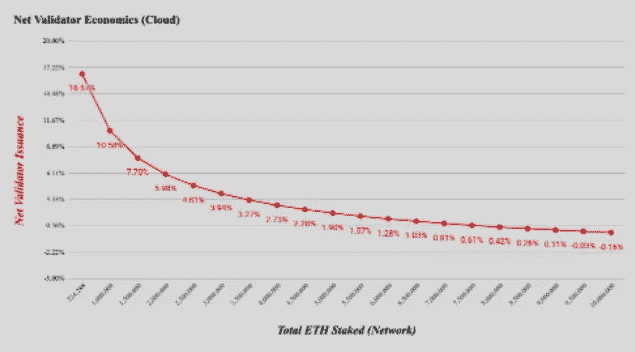

# 以太坊合并

> 原文：<https://medium.com/coinmonks/the-ethereum-merge-e85c095d833d?source=collection_archive---------12----------------------->

## 价格均衡，以及市场波动的原因

经过 5 年的准备，似乎我们终于可以期待以太坊的合并在几周内发生，确切地说是在 9 月 15 日。尽管有些人所称的“在飞行中修理飞机”涉及到技术上的复杂性，但用户和开发者都不会受到重大影响，但投资者和交易者呢？合并是否已计入价格？市场具有前瞻性吗？供求定律是不是只在事后才起作用？

自年初以来，随着超级周期理论的消失，许多投资者发现合并是一种催化剂，将引发对市场最具反射性因素的新一轮兴趣:注意力。许多人将这一事件称为一生一次的机会，“加密货币历史上最大的结构性转变”。就像市场一样，在这篇文章中，我希望达到一个平衡点，让我们尽可能客观地评估当前形势。

在最近的文章中，加密货币行业最老练的投资者之一亚瑟·海斯(Arthur Hayes)根据乔治·索罗斯(George Soros)在《金融炼金术》(Alchemy of Finance)中提出的反身性理论，提出了一个故事。这种叙述预测了一个反馈循环，通过这个循环，市场参与者将对市场在合并预期中的定价施加显著影响。和往常一样，不管是有意还是无意，市场参与者都会影响其他参与者的预期，而其他参与者的偏好会强化价格上涨或下跌的趋势。我们交易的未来实际上是合并成为一个自我实现的预言。

从技术的角度来看，合并是从工作证明向利益一致算法证明过渡的最后一步。目前，一个名为信标链的独立利益证明链正在与原始工作证明链并行运行。信标链于 2020 年 11 月开始接受存款，现在由超过 240，000 个验证器的数百万个 ETH 保护。我们称之为合并的是软件升级，它将摒弃工作证明链，而支持向保存以太坊交易全部历史的利益证明的过渡。在技术方面，这似乎不是什么大事，除了一种 ESG 友好叙事的兴起，这种叙事可能会给以太坊网络带来更多的经济安全性(要比较以太坊股份证明和比特币工作证明之间的经济安全性，请看看这张[电子表格](https://docs.google.com/spreadsheets/d/1KdzhgbTqhRd0LndK4R8c50OK-s6W568Ydd1aytokwbs/edit#gid=0))。然而，事情并不像看上去那样简单，所以让我们把注意力集中在叙述上:

*   该网络的发行率将呈指数级下降。
*   由于每笔交易费用的一部分被烧掉，以太坊将继续经历以太网供应的减少。
*   在上海分叉之前允许提取之前，对 ETH 进行加仓将有助于进一步减少供应。

这就是许多人所说的三等分:

如果我们谈论的是比特币，我们会预期价格走势如下:

[https://coinmetrics.io/](https://coinmetrics.io/)

从历史上看，比特币在减半后不久就进入了牛市。然后是小幅回调和一段时间的横盘或下行交易，最后是强劲的上攻。

*   2012 年 11 月 28 日上半年-> $1，150
*   2019 年 6 月 9 日第二次--> 19，900 美元
*   第三次减半 2020 年 5 月 11 日-> 69，00

在说明这与 ETH 的关系之前，重要的是要打下一些背景基础。仅仅因为市场是前瞻性的，并不意味着某些事件已经被消化。根据道氏理论，一切都被计入价格，但我们继续看到做市商如何一次又一次地遭受逆向选择。

就风险资产而言，与 2008 年或 2020 年相比，没有投降可能有点令人担忧。我们并没有真正看到全球市场的恐慌。

[Capitulation at the market bottom](https://www.investing.com/analysis/capitulation-common-at-market-bottoms-200625898)

如果我们以 real state 这样一个发展缓慢的市场为例，我们就会意识到，Z 世代基本上希望房地产崩盘。杰罗姆·鲍威尔(Jerome Powell)也是如此，他积极宣称“购房者需要一点重置”。显然，美联储的目标是让房地产市场崩溃，让利率回落。这样，下一代就能从低房价和低借贷利率中受益。

在最新的 CPI 数据发布后，每个人似乎都在庆祝通货膨胀率随着油价的下降而下降。让我们来看看期货市场对德国电力的预期:

意大利的燃气和电费呢？

-2021 年 7 月:12 万欧元
-2022 年 7 月:97.9 万欧元

但是谁知道呢？在做出投资或交易决定之前，你永远不会得到你可能需要的所有信息。你也不需要它，所以也许底部已经在了，我们的目标是 9 月份的 50 个基点。如果数据继续显示通胀已经见顶，每个人都涌入风险资产，即使是最怀疑的人也将被迫加入市场，回购更高的股票，对吗？

[https://www.cmegroup.com/trading/interest-rates/countdown-to-fomc.html](https://www.cmegroup.com/trading/interest-rates/countdown-to-fomc.html)

宏观经济前景不是最有利的，但以太坊合并能标志牛市的开始吗？看看过去类似的故事，如 2021 年 10 月的比特币交易所交易基金，或比特币基地的 IPO，我们不会期待太多的上涨。

$BTC price action after ETF announcement in October 2021

$COIN price action after announcing its IPO

所有的风险资产都在下降，通货膨胀变得更加棘手。但是如果 ETH 中的三倍减半没有被计算在内呢？回到反身性的话题，我们可以推断以太坊网络的使用量是一个反身性变量，其中烧掉的煤气费的多少取决于网络的使用量。

*   ETH 通货膨胀=阻止排放-燃烧天然气费用
*   通货膨胀=阻止排放>燃烧的汽油费
*   自 6 月下旬以来，活跃用户一直处于稳步上升趋势。

这可能看起来不一致，因为更多的用户预计会导致更高的[气体](https://dune.com/hildobby/Gas)，但我们必须记住，开发人员越来越有经验。例如，随着海港项目的实施，Opensea 的气体效率提高了 35%。这是相关的，并且在一定程度上，可以解释为什么气体的减少与活动的减少没有很大的关联。

最重要的是，我们可以考虑到，在短期内，价格是由自由供求驱动的，而结构性力量只会在中长期内发挥作用。其他替代 L1 的这种结构性需求解释了为什么如此多的新项目在开始时经历了大幅升值。大部分供给被锁定，可自由支配的需求足以使价格上涨。随后，供给放开，而结构性需求没有跟上，导致初始价格升值大幅下降。

[https://etherscan.io/gastracker](https://etherscan.io/gastracker)

更好的 dapps 带来更多的用户，更多的人使用网络，价格上涨，FOMO 开始发挥作用，更多的工程师被吸引到网络上开发应用程序，等等。

[https://studio.glassnode.com/metrics?a=ETH&ct=linear&m=addresses.ActiveCount&s=1643594400&u=1658095199&zoom=](https://studio.glassnode.com/metrics?a=ETH&ct=linear&m=addresses.ActiveCount&s=1643594400&u=1658095199&zoom=)

到目前为止，我们知道:

通货紧缩的程度取决于燃气费的消耗。

燃气费的多少取决于网络的使用情况。

网络使用取决于用户数量。

*   用户数量取决于应用程序的质量。
*   应用程序的质量取决于开发人员的数量和质量。
*   更好的应用吸引更多的用户。
*   更多的用户给以太网带来更多的关注。
*   瑞士联邦理工学院的表现优于 BTC，尤其是在今年市场触底之后。
*   有了这样一个简约的框架，我们希望:
*   交易者会带着更高价格的预期购买，因为他们相信网络会被更多地使用，这使得 ETH 更具通缩性，这将推高价格。
*   对冲者将被迫回补他们的空头，并净做多，因为投机者将进入三重对冲的叙事。

所有的压力都在买方。

*   唯一的上限是地球上的每个人都拥有一个 ETH 钱包地址。
*   期货市场上的合并前现货溢价(期货价格< spot price) will lead to post-merge contango (futures price >现货价格),因为做市商在对冲其卖出期货合约的风险时会进入市场购买现货。
*   到目前为止，通货紧缩的程度和 ETH 的价格有一种自反关系。更好的 dapps 带来更多的用户->更多的人使用网络->更多的天然气费用被烧掉->供应减少->价格上涨(低供应高需求)。好了，现在耐心听我说，让我们一个接一个地看看每个场景。
*   ETH 发行将会减少
*   合并后，不再需要为验证网络上的交易向矿工支付费用，这将导致每天节省 13，000 ETH。这些矿工将被预算从每天 2,000 ETH 开始的打桩节点所取代。随着更多的验证者加入网络，每天的 ETH 发行将增加到 5000 个 ETH。这意味着每天净储蓄有 8，000 到 11，000 ETH 的显著差异。

合理的假设是，约 85%的矿工发行的债券被出售给市场，而赌注节点不仅面临较低的出售压力，而且只需要矿工发行的一小部分就可以提供相同水平的安全性。这些节点没有固定的电力成本，所以我们可以假设没有必要出售一部分发行来支付费用

## 来自 EIP 的通货紧缩-1559 年？它被定价了吗？

在这一点上，一部分交易费用被烧掉并不是什么新鲜事。EIP-1559 已经实施了一年多，所以这很有可能已经反映在价格中了。快速看一下[超声波。金钱](https://ultrasound.money/)显示当前燃烧率为 0.99 ETH/分钟。

我们可以用来自[watchtheburn.com](https://watchtheburn.com/)的额外信息来支持这些数据。

## 我们可以看到每天燃烧的 ETH 量呈明显下降趋势。这揭示了 EIP-1559 在其早期是相当重要的:燃烧是如此之高，以至于联邦理工学院的供应会变成通货紧缩。现在，这个图表向右下方移动，每天只能燃烧 1600 单位的乙醚。

归根结底，油费是做生意的成本，我们从经验中知道，每个人都喜欢在牛市中做生意。DeFi summer，NFTs，元宇宙……每个人都愿意花 200 美元以上的交易费。突然之间，大家都发现收益率是从哪里来的，为区块空间付费的意愿开始降低。宇迦实验室推出的另一面元宇宙可能是最好的例子。面向 BAYC 股东的元宇宙土地销售产生了 2 . 85 亿美元的销售额，其中 1 . 76 亿美元浪费在了天然气上。看下面的图表，你能猜出这是什么时候发生的吗？

[https://ultrasound.money/](https://ultrasound.money/)

对了，看燃烧分布也有很好的观察。如果/当 L2 开始用他们自己的本地令牌收取汽油费会发生什么？

[https://watchtheburn.com/](https://watchtheburn.com/)

赌注不能收回

[https://watchtheburn.com/insights](https://watchtheburn.com/insights)

加仓供应被锁定，在上海分叉之前不会执行提款。

[https://watchtheburn.com/insights](https://watchtheburn.com/insights)

在获得奖励之前，你已经因为缺乏流动性和可能的合并失败而获得了报酬。

## 合并后，随着更多的乙醚被堆积，实际产量可能会显著下降。

以太坊基金会表示，他们不会在合并前入股，而且在合并前几周，没有人在争论是要入股火箭池还是丽都。叙述已经转向了工作分叉的证明，这使得所有机会主义的参与者匆忙退出。这些参与者不再出售 ETH，而是开始借用 ETH 来获得免费的 ETHw。这使得稳定的 APY 达到 6.75%。不用告诉你，它还会继续上涨。

*   顺便说一下，9 月 25 日到期的名义固定借款利率目前为 4.22%。听起来更划算。
*   总之，目前的计划是在合并后 6 个月到 1 年的软件更新中为 staked ETH 部署取款功能。事实上，我们可以清楚地观察到，在信标链中有一个锁定的 ETH 供应一直在赚取收益。实际上，在 PoW 和 PoS 链上都发放了 ETH 奖励，但只有 PoW 排放面临销售压力。PoS 链上的排放会发生什么变化？一些人可能会重新持股，另一些人可能希望实现利润…这是即将到来的下一个催化剂:后果不明的解锁，可能会出现一些不会被积极买入的下跌。

现在到了有趣的部分，我们应该期待 APY 合并后的赌注是什么？

[Ethereum market on Aave](https://app.aave.com/reserve-overview/?underlyingAsset=0xc02aaa39b223fe8d0a0e5c4f27ead9083c756cc2&marketName=proto_mainnet)

APY 25%的股份？

[Fixed ETH borrowing rate on Notional Finance](https://notional.finance/borrow/ETH/USDC)

ETH 供应高峰在 1.2 亿？

长期 ETH 供应目标 1 亿？

*   首先，这个收益率真的无风险吗？或者它是否考虑了可能不成功的合并所涉及的风险？几个星期后，当不再有关于工作叉证明的叙述，赌注的代币数量增加时…赌注奖励会发生什么变化？
*   当供应的很大一部分被下注时，下注的回报不会很高。基本上，对于那些厌恶风险、没有在合并发生前利用机会下注的人来说，下注的收益是一种惩罚。这些参与者现在正在为他们的风险厌恶和对合并可能失败的担忧付出代价，因此他们没有从赌注回报的净通胀中受益。根据[stakingrewards.com](https://www.stakingrewards.com/)的数据，10.88%的合格代币被下注。
*   合并后会有更多人入股，网络会更安全，因为有人攻击网络会占用更多资源。然而，随着越来越多的参与者加入 ETH，这些赌注回报的收益率将会降低，但整个网络的年通胀率将会提高。

对帮助网络达成共识的行为给予奖励，这样网络就能更强地抵御攻击媒介。你可以在这个[计算器](https://www.stakingrewards.com/calculator/?asset=ethereum-2-0)中自己尝试一下，你会观察到，当你向右移动滑块(增加下注的 ETH 数)时，总奖励率会降低

目前的名义收益率约为 4%，但实际收益率实际上是负的，因为我们必须考虑每年发行的新 ETH 的 4.4%。根据历史数据，以下是 ETH 的净发行量，根据网络费用从-0.5%到-4.5%不等。

[https://www.stakingrewards.com/](https://www.stakingrewards.com/)

这里的关键点是，这种通缩是考虑到了历史数据。如果大多数人都在推断过去的数据来预测 ETH 的发行，他们也可能在计算收益率时得到错误的数字，所以也许有更多的“希望”而不是数据来支持一些说法。

[ETH 2.0 Calculator](https://docs.google.com/spreadsheets/d/15tmPOvOgi3wKxJw7KQJKoUe-uonbYR6HF7u83LR5Mj4/edit#gid=1494215209)

[ETH 2.0 Calculator](https://docs.google.com/spreadsheets/d/15tmPOvOgi3wKxJw7KQJKoUe-uonbYR6HF7u83LR5Mj4/edit#gid=1494215209)

目前，矿商获得 90%的发行，而赌注节点获得剩余的 10%。合并后，staking nodes 将获得 100%的发行费和交易费。然而，问题是假设约 20%的 ETH 赌注回报是不现实的，因为这将考虑到较低的赌注参与率和较大的费用池。目前押了 10.88%的 ETH，押的回报比较低(根据 stakingrewards.com[的](https://stakingrewards.com)年化 4.05%)。

[https://www.stakingrewards.com/calculator/?asset=ethereum-2-0](https://www.stakingrewards.com/calculator/?asset=ethereum-2-0)

[https://www.stakingrewards.com/calculator/?asset=ethereum-2-0](https://www.stakingrewards.com/calculator/?asset=ethereum-2-0)

许多人预计赌注奖励会提高到 20%,但是我们已经解释过这是不可能的，因为在合并后赌注的数目很可能会增加。即使新资本进入等式的需求端，也需要购买和下注更多的代币。每个人都想从高收益中获利，回报将分配给更大的用户群，从而减少个人回报。

[ETH deflation expectations based on historical data](https://pbs.twimg.com/media/FYPdwvcWAAIR9AJ?format=jpg&name=large)

随着时间的推移，赌注年利率似乎可能开始收敛到 2%，其中很大一部分将流向集中交易所(许多人获得高达 25%的奖励)，以及流动赌注提供商(利多获得 10%的 ETH 奖励)。这种方法设想的收益率为 3.5-4%，扣除通胀因素。这将使我们在 2023 年上半年经历约 3%的负通胀，并在 2023 年下半年经历约 2.5%的负通胀。更高的费用意味着更多的 ETH 被烧掉，但是我们已经看到这与现在没有太大关系(记住右边的图表)。这影响了赌注率，但也有助于采用，因为较低的天然气费用将吸引更多的用户(和较少的赌注节点，因为回报将较低)。最理想的情况是汽油费高到足以烧掉所有新发行的汽油吗？有可能，因为这将使天然气供应保持稳定，同时保持足够低的天然气费用，不会抑制采用。

到目前为止，一些投资者对使用传统的股权框架对加密令牌进行估值持怀疑态度。他们的理由是，这些代币倾向于更多地围绕叙事交易，而不是围绕基本价值交易。然而，现在越来越多的人开始同意 Dapps 应该产生收入，并被视为产生收入的企业，我们可以将这种思维过程转换为 PoS 网络如何像股票一样运作。以此类推，实际收益率与投资者通过持有股票获得的潜在股息没有什么不同，后者来自收入方面，而不是成本方面。然而，围绕合并的所有叙述似乎都在关注成本方面，这将被 MEV 搜索者、赌注池、集中交易所捕获……事实上，这些协议确实有作为发行支付的费用，类似于基于股票的补偿。这种发行不会立即减少您的股息支付，但会减少您获得的未来股息份额，从而减少未来现金流的现值。

看到隧道尽头的曙光令人欣慰。以太坊现在正在发布一个期待已久的升级，这可能会导致更多的用户采用，并可能会吸引更多的用户，因为它的 ESG 友好性和日益增加的安全性。这是朝着一系列技术改进迈出的第一步，这些技术改进最终将导致 MEV 降低、汽油费降低、性能提高和价值增加，同时最大限度地实现去中心化、审查阻力和阻止奖励的民主途径。但是谁知道我们要等多久。

[ETH 2.0 calculator](https://docs.google.com/spreadsheets/d/15tmPOvOgi3wKxJw7KQJKoUe-uonbYR6HF7u83LR5Mj4/edit#gid=1494215209)

交易新手？试试[加密交易机器人](/coinmonks/crypto-trading-bot-c2ffce8acb2a)或者[复制交易](/coinmonks/top-10-crypto-copy-trading-platforms-for-beginners-d0c37c7d698c)

Up until now, some investors have been skeptical of using traditional equity frameworks for valuing crypto tokens. They reason that these tokens have a tendency to trade more around narratives, and less around fundamental values. However, now that more people are starting to agree that Dapps should generate revenue and be treated as a business that generates income, we can translate such thought process to how a PoS network operates similar to a stock. By that analogy, real yield is no different that the potential dividend an investor can get by owning a stock, which comes from the revenue side, not the costs side. However, all narratives around the Merge seem to be concerned about the costs side, which will be captured by MEV searchers, staking pools, centralized exchanges… In fact, these protocols do have expenses that are paid as issuance, similar to stock-based compensations. This issuance does not reduce your dividend payments immediately, but reduces the share of future dividends you get, which reduces the present value of future cash flows.

It is alleviating to see light at the end of the tunnel. Ethereum is now shipping a long awaited upgrade that might lead to more user adoption and might attract more users because of its ESG friendliness and increasing security. This is the first step towards a set of tech improvements that will eventually lead to reduced MEV, lower gas fees, higher performance, and more value accrual while maximizing decentralization, censorship resistance, and democratic access to block rewards. But who knows how long we will have to wait for that.

> New to trading? Try [crypto trading bots](/coinmonks/crypto-trading-bot-c2ffce8acb2a) or [copy trading](/coinmonks/top-10-crypto-copy-trading-platforms-for-beginners-d0c37c7d698c)