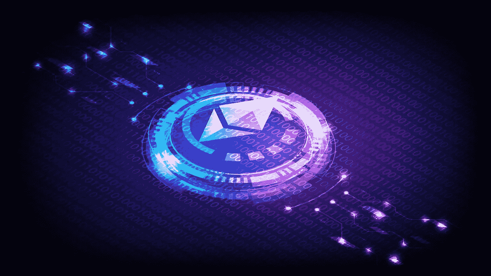
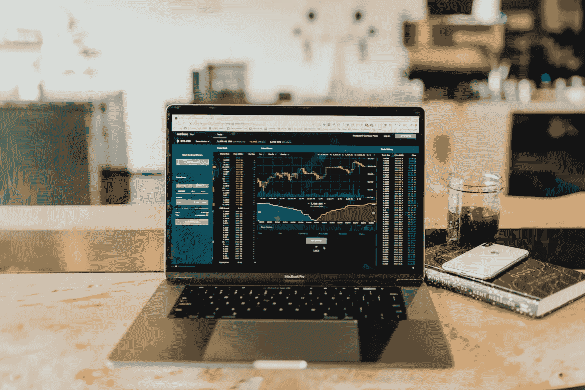
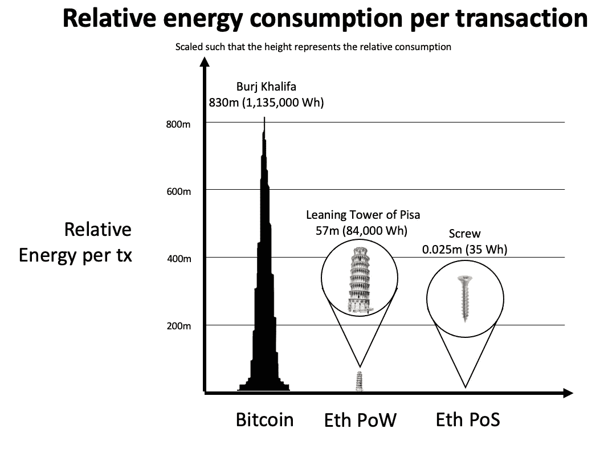
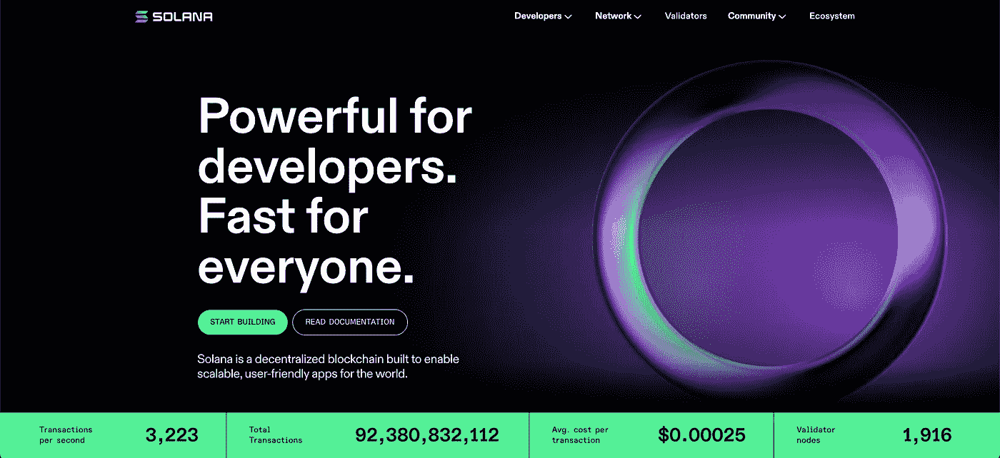

# 合并—您需要知道的

> 原文：<https://medium.com/coinmonks/the-ethereum-merge-what-you-need-to-know-de3fe0cca236?source=collection_archive---------6----------------------->

## 你需要关注以太坊和合并的 7 个理由

Ethreum — The Merge. Credit: [Vecteezy](https://www.vecteezy.com/)

【2022 年 9 月，全球市值第二大的区块链以太坊将进行一次重大的网络升级，使其更加环保、高效，对投资者更具吸引力。这种升级被称为合并。

由于广泛的媒体报道，许多人都知道即将到来的合并，但大多数人不明白它的意义。这一合并标志着加密史上最具影响力的时刻之一，并为任何愿意关注的人提供了巨大的金融机会。在这篇文章中，我将列出为什么合并如此重要以及为什么你应该关心的 7 个原因。但是首先，让我们从技术的角度简要地看一下什么是合并。

# 什么是合并？

> 此次合并是以太坊平台的升级，将以太坊主网与信标链合并，标志着从工作证明到利益证明的转变。

我们来分析一下。

以太坊区块链目前运行在一种被称为工作证明(PoW)的共识机制上。共识机制是验证交易和保护区块链的机制。在 PoW 下，以太坊矿工依靠计算机的处理能力来解决高度复杂的数学难题，以便验证交易。这与比特币网络使用的共识机制类型相同。2020 年，以太坊推出了 Beacon Chain，这是一个与以太坊 Mainnet 并行运行的利益证明(PoS)链，它仍然是 PoW。信标链是新的以太坊共识引擎，并将[的概念引入网络。这是升级到 PoS 的第一步。然而，在过去的两年里，Beacon 连锁店实际上没有处理任何交易。这将在 9 月份信标链与以太坊主网合并时改变。](https://ethereum.org/en/staking/#:~:text=Further%20reading-,What%20is%20staking%3F,new%20ETH%20in%20the%20process.)

# 为什么合并很重要？

这次合并是一个不可思议的机会，它可能是我们技术史上最具历史意义的事件之一(想想拨号上网到 WiFi)。以下是合并将对加密领域产生重大影响的原因:

1.  减少以太网令牌发放
2.  销售压力与购买压力
3.  输入 ESG 投资者
4.  收益承载资产和复合增长
5.  通货紧缩的资产——超声波货币
6.  第二层生长
7.  基本商业原则

让我们开始吧。

## 1.减少代币发行:三倍减半

在战俘区块链上发行代币是安全的代价。矿工通过验证交易为链条提供安全性。他们的奖励是本地代币。这些代币是新发行的，被引入流通领域。另一种描述方式是通货膨胀。从长期来看，大量发行代币是一件棘手的事情，因为它稀释了当前代币持有者的权益，并会随着时间的推移压低代币价格。

Credit: [Vecteezy](https://www.vecteezy.com/).

以太坊有了新的 PoS 共识机制，就不再需要矿工了。验证者将取代他们的位置并[标记他们的 ETH 令牌](/coinmonks/goodbye-savings-accounts-welcome-liquid-staking-1289bb587da4)来保护网络并因此获得报酬。该奖励将来自新发行的 ETH 代币和交易费(汽油费)。此外，发放给验证者的奖励远低于矿工。由于这种机制的效率提高，网络保持安全的成本大大降低，每年的令牌发放量将下降 90%以上！

在比特币的世界里，代币发行减少被称为“减半”。每 4 年，比特币网络会将发给矿工的代币减少一半。历史上，这一事件之后，代币价格会出现一波强劲的牛市。以太坊合并将减少代币供应，相当于一次减少 3 个比特币减半事件。以太坊社区将这种现象称为“三减半”。

## 2.销售压力与购买压力

由于获得和运行采矿钻机(允许人们开采 ETH 令牌的计算设置)的成本很高，矿工在获得奖励后会被激励出售他们的 ETH 令牌。他们需要这样做来弥补他们的硬件和能源成本，并从中获利。战略投资基金 [North Rock Digital](https://northrockdigital.com/) 的创始人哈尔·普雷斯(Hal Press)写了一篇[关于以太坊合并](https://newsletter.banklesshq.com/p/is-the-merge-priced-in)的深度文章，他估计矿商每天在公开市场上出售大约价值 1800 万美元的以太坊。这导致 ETH 令牌每天面临 1800 万美元的卖出压力。使用最基本的经济学原理，这意味着每天至少需要 1800 万美元的需求来购买令牌，以保持价格稳定。

合并后，这种每日销售压力将大大减少，接近 0，因为验证者没有能源或硬件成本来覆盖。更重要的是，押记的以太网令牌被锁定在网络中，押记者将无法解锁这些令牌，直到完整的以太坊升级完成，这可能需要 6-18 个月。即使完成后，赌注者也不能立即解锁奖励。它们被放在解锁队列中。

这不一定是一个问题，因为验证者将被激励去尽可能多的持有 ETH，锁定更多的资金，并将其撤出市场。因为任何人，包括你和我，都可以下注他们的 ETH 代币并获得奖励，ETH 的买入压力将继续上升，而卖出压力保持较低。如果你还不是 ETH 持有者，这些都是非常情况，值得注意。

## 3.收益承载资产和复合增长

如今，押注 ETH 在 APY 的回报率约为 4%。随着以太坊区块链升级为 PoS，网络产生的交易费将从矿工转向赌注者。加上新发行的回报，这一收益率预计将达到两位数。由于其出色的令牌组学和经济活动，ETH 令牌将成为任何投资者投资组合的一项有吸引力的投资，无论它们是否被分配到数字资产。合并后，我预计将会看到寻求可持续收益的全球投资者的大量资本流入。这种涌入将继续锁定赌注合同中的代币，并从市场中带走更多的 ETH，这对代币持有者和供需动态来说是非常乐观的。

Coinbase trading. Credit: [Unsplash](https://unsplash.com/photos/DfjJMVhwH_8).

据说复利是世界第八大奇迹。说到 ETH 令牌和网络经济，它更像是类固醇的复利。如果你能在快速升值的资产中获得两位数的年收益率，你看到的是一个非常难得的增长机会。增加对赌注的需求等于增加对代币的需求，代币将很快被锁定。这减少了流通供给，意味着资产价格上涨。价格涨得越多，就有越多的人被激励去下注，这导致了需求的增加。这是一个永恒的增长周期。当然，我们不想在这里太得意忘形，资产的增长是有限制的。我要说的是，市场动态有利于 ETH，令牌的定位是随着时间的推移持续增长。

## 4.ETH——通货紧缩资产

自从 EIP-1559 (EIP 代表以太坊改进提案)的[实施以来，以太坊交易费用的很大一部分从总供给中烧掉了。这意味着这些令牌被销毁并永久地从存在中移除。](https://help.coinbase.com/en/coinbase/getting-started/crypto-education/eip-1559)

当你把以太坊的三倍减半(每年代币发行的减少)与每年燃烧的 ETH 量相结合，并且无法收回被抵押的 ETH 时，资产就变成了通缩。根据目前的预测，该网络将每年燃烧约 300 万个 ETH，并每年发放约 100 万个新 ETH。新发行的股票取决于赌注的总额，并将根据赌注活动而变化。这可能会造成供应紧张，对作为资产的 ETH 来说是非常有利的。

随着时间的推移，总供应量的百分比，新发行和流通供应将找到它的平衡。如果您想了解更多有关 ETH 令牌供应以及不同变量如何相互影响的信息，我建议您访问 [ultrasound.money](https://ultrasound.money/) ，在那里您还可以看到 200 年后 ETH 令牌供应和赌注率的预计平衡。

## 5.输入 ESG 投资者

正如本文前面提到的，合并到 PoS 链将显著降低网络的总能耗。以太坊将不再要求矿工用高耗能的电脑来保护网络。事实上，合并后以太坊的能源消耗将惊人地下降 99.7%。我从[以太坊博客](https://blog.ethereum.org/2021/05/18/country-power-no-more/)中借用了下面的图片来展示这一点的重要性。

Ethereum vs Bitcoin Energy Consumption. Credit: [Ethereum.org](https://blog.ethereum.org/2021/05/18/country-power-no-more/)

合并后，[以太坊网络每年将消耗大约 2.6 兆瓦](https://blog.ethereum.org/2021/05/18/country-power-no-more/)。相比之下，[比特币每年大约需要 150 万亿瓦特](https://news.climate.columbia.edu/2022/05/04/cryptocurrency-energy/)来运行。给你一些这些数字的背景，以太网 2.6 兆瓦相当于为美国的 2000 个家庭供电。相比之下，150 泰拉瓦的比特币比整个阿根廷一年的消费还要多。

为什么这对资产很重要？嗯，我们大多数人都知道气候变化的毁灭性影响，以及我们珍贵的环境正处于可怕状态的事实。在我们目前的情况下，如果新的创新不是节能和可持续的，它们就不可行。如果我们想看到以太坊成为我们金融系统的下一次进化，它必须以一种可持续的方式进行。一个电力网不能切断它。能源消耗的大幅减少将最终为机构 ESG 投资者打开入党之门。ESG 投资者不允许将资金投入不可持续的技术，这意味着处于电力状态的以太坊对许多投资者来说不是可行的资产。合并后，这不再是障碍。

低能耗对价格有利，对地球有利。

## 6.第二层生长

在 2021 年初，我们看到了第 1 层替代(Alt L1)区块链的指数级增长。这些是区块链，作为以太坊的替代品。这些例子包括[索拉纳](https://solana.com/)、[雪崩](https://www.avax.network/)、[卡尔达诺](https://cardano.org/)和[阿尔格兰德](https://www.algorand.com/)。这些网络以无限低的燃气费承诺与以太坊竞争，这在当时是以太坊的一个大问题。获取新用户和吸引以太坊本地用户离开生态系统的常见方式是通过大量的象征性激励和超高的 DeFi 收益率。

[Solana](https://solana.com/)

以太坊上最大的四家[层 2s](/@callumcarlstrom/layer-2-the-town-square-of-blockchains-ae2c91beeb7d)([Arbitrum](https://portal.arbitrum.one/)、[乐观主义](https://www.optimism.io/)、 [Starknet](https://starkware.co/starknet/) 和 [zKsync](https://zksync.io/) )通过以超低交易成本扩展其充满活力的以太坊应用生态系统来应对这一繁荣。这为第二层带来了数十亿美元的额外投资，因为它们可以提供以太坊本地人已经知道并喜爱的相同应用。不同的是，这些层 2 没有自己的原生令牌(不包括 6 月份推出 OP 令牌的乐观主义)，这种增长是有机发生的。为什么这很重要？

嗯，想象一下，如果这些层 2 决定推动他们的增长，并以类似于 Alt L1s 的策略获得用户，会发生什么。第二层解决方案准备推出自己的令牌，这可能导致 Alt L1 用户涌入第二层，留下以太坊的替代品。这增加了全部在以太坊结算的 L2 交易总量。交易费用总额的增加抬高了赌注的 APY，吸引了更多的投资者购买和持有股票。你明白我的意思了吧。

## 7.ETH —回归基本面

我发现真正令人兴奋的最后一个因素是我们现在可以用来将 ETH 视为投资机会的框架。我们终于开始关注商业基本面，就像我们考虑购买苹果股票时会做的一样。你猜怎么着？基本面看起来非常强劲。

大多数区块链项目都严重依赖于投机，购买代币是希望将来有人会为此付出更多。我认为这就是为什么我们看到投资巨头如沃伦巴菲特声明他们不会将加密货币作为一种投资工具。尽管我认为这些陈述说明了对这项技术缺乏了解，但我还是明白了。但是有了以太坊网络和 ETH 令牌，事情就不一样了。由于许多网络的改进，用户的持续增长，以及金融活动的增加，以太坊正在成为一个健康繁荣的行业。一旦合并完成，我的观点是以太坊不仅将与传统金融资产并驾齐驱，而且实际上在经济质量和可投资性方面开始超越它们。

当然，的这一切都需要生态系统持续增长，付费用户接受以太坊的使用。但这与普通公司在股票市场公开交易没有什么不同。如果他们没有客户，收入就会下降，股价也会跟着下跌。这也是我在 web3 中强调用户体验重要性的原因之一。[你可以在这里查看我在 web3 上写的关于 UX 的文章。](https://bootcamp.uxdesign.cc/why-ux-and-marketing-is-critical-for-web3-adoption-fda0fff63760)当以太坊核心开发者专注于对网络进行完美升级时，生态系统中的构建者需要更加关注如何让以太坊成为令人难以置信的 web3 用户体验。如果发生这种情况，我将很难想象这不是你做过的最好的投资决定。

如果你已经是一个精明的投资者，你可能已经确定金融市场太聪明了，合并已经被消化了。我从根本上不同意，并建议你阅读[这份报告，它提供了为什么合并没有被定价的证据。](https://newsletter.banklesshq.com/p/is-the-merge-priced-in)

当然，这些都不是财务建议。仅出于娱乐目的😉