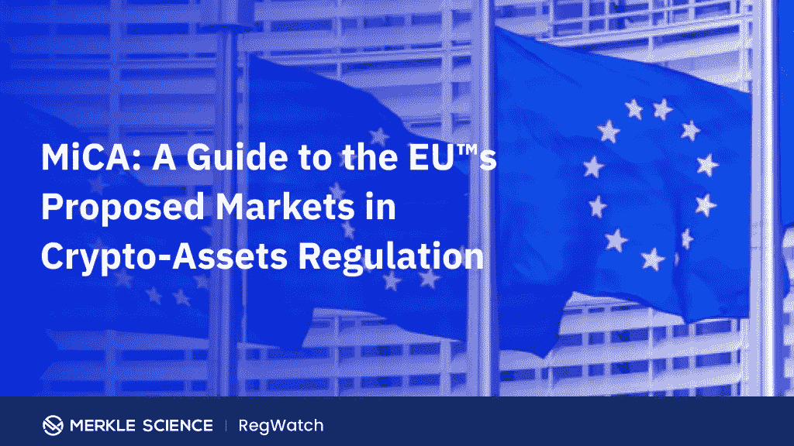

# 欧盟接受加密货币

> 原文：<https://medium.com/coinmonks/the-european-union-embraces-cryptocurrencies-99daaecddca8?source=collection_archive---------35----------------------->

欧盟官员就具有里程碑意义的加密货币立法的最终措辞达成一致，这可能为泛欧洲监管方法铺平道路。

这一发展有望为数字资产被大量采用并成为全球金融体系的一部分铺平道路。

根据委员会主席 Edita Hrdá的一封信，上周三，欧盟大使会议通过了加密货币资产监管市场的完整法律文本。

在给欧洲议会经济和货币事务委员会主席的信中，Irene Tingali 说，议会和理事会之间的合作应该允许该条例在议会一读通过。

按照目前的形式，该法规将要求任何寻求发行加密货币的人发布一份“加密货币资产白皮书”，其中包含有关他们项目的信息。

# 稳定币的覆盖范围

与此同时，稳定的硬币发行者将受到某些资本要求的约束。这意味着，项目将被要求持有主权货币储备，以支持其硬币的价值，其数额与发行的数量相当。

此外，如果地方当局认为数字资产有风险，他们将有能力增加所需资本的数量。

# 2024 年生效

法律文本现在将提交给欧洲议会，在那里，如果获得批准，它可能会在明年年初发表在欧盟官方杂志上，这些规则将于 2024 年在**生效。**

# EUCI 的立场

加密货币的倡导者对这一消息表示欢迎，但表示该立法尚未解决几个关键问题，包括不可交换的数字资产(NFTs)和分散金融的未来(DeFi)。

> “这标志着欧盟共同立法者之间激烈但必要的辩论结束了，这场辩论已经持续了两年多，”总部位于布鲁塞尔的欧洲加密倡议(EUCI)在一份声明中说。

该组织指出，对 stablecoin 的大力关注是对脸书 Diem(前 Libra)项目的回应，基于此，立法者采取了“非常防御性”的方法。

EUCI 补充说，NFT 被排除在 MiCA 的范围之外，这就造成了每个欧盟成员国的监管机构是否会对这些数字资产使用不同的解释的不确定性。

DeFi 项目也不会受到该法规的影响，但 EUCI 表示担心这些没有在最终文本中得到适当的定义。

# 积极影响

尽管有这些批评，EUCI 联合创始人 Marina Markezic 对 MiCA 将对行业产生的影响持乐观态度:

> “它为加密货币项目创造了一套全新的规则——这些规则将改变加密货币目前作为‘局外人’的地位，使其成为金融服务领域的全面参与者，”她说，并补充说，“与此同时，我们认为该行业必须保持创新能力，而不会带来不必要的负担。”

# 欧盟将与美国讨论加密货币规则

欧盟金融服务专员梅里德·麦克吉尼斯表示，加密货币监管将是下周与美国官员讨论的首要议题。

她在彭博的一次活动上发表讲话时表示，欧盟正寻求在下周的国际货币基金组织和世界银行年会上与美国交流看法和经验:

> “我肯定他们想知道我们做了什么，进展如何，存在什么问题。我将非常乐意分享我们的经验，并听取他们在美国的计划”。

今年早些时候，麦克吉尼斯在美国政治网站 The Hill 的一篇文章中呼吁就加密货币的监管达成全球协议:

> 她当时写道:“我相信欧盟和美国能够共同达成监管加密货币的国际共识。”。

*原载于 2022 年 10 月 7 日*[*【https://bitnewsbot.com】*](https://bitnewsbot.com/the-european-union-embraces-cryptocurrencies/)*。*

> 交易新手？尝试[加密交易机器人](/coinmonks/crypto-trading-bot-c2ffce8acb2a)或[复制交易](/coinmonks/top-10-crypto-copy-trading-platforms-for-beginners-d0c37c7d698c)