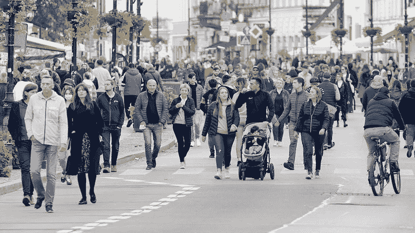

# 日常生活社区第 2 部分，共 8 部分

> 原文：<https://medium.com/coinmonks/the-everyday-people-community-part-2-of-8-e5fd20627ee?source=collection_archive---------30----------------------->

Pixabay

隐密体正在扩张。当加密货币成为最热门的商品，替代硬币(除比特币之外的任何东西)兴起时，我开始了我意想不到的加密空间之旅。

今天，你可以沿着 NFT(不可替代代币)之路、游戏之路或元宇宙之路前行。您可以参与非投资赌注或产量耕作路径。尽管 2022 年已被证明是隐世中流血的一年，但就业路径是向下的。

你可以在 cryptoverse 中遵循几条创造性的道路，这将产生一个收入流。这些溪流开始时是涓涓细流，虽然有些已经干涸，但其他的在西伯利亚的冬天还在坚持着。

如果你经济拮据，缺乏创造力，并且相信生活比你现在拥有的更多，那么日常社区是你的一条路。

这是一条与和你有同样感受和想法的人一起走过的路。这是一条能让你一路学习和赚钱的道路。

日常人社区只对某些人开放。它不适合那些抱怨自己的处境却不做任何改变的人。以消极态度对待变革的人不会认为变革会失败——就像往常一样。

日常社区是为那些愿意做出改变并坚持足够长时间以看到改变对他们生活产生积极影响的人而设的。

每个人都有一个角度，钱是底线。在这个旅程阶段，唯一的钱是你为你的投资带来的金额——无论你想走什么样的隐世之路。

我会提供我理解的指导，并在我不懂的时候从有指导的人那里找到答案。

你的成本就是你决定投入的时间。

我希望“日常人”社区成长为一个人们互相帮助的网络，同时找到你渴望的任何程度的财务自由。

如果日常人民社区足够增长，我愿意提供一个日常人民社区元宇宙。如果发生这种情况，可能会有会员费来支付元宇宙的费用。(但那是那时，这是现在)

从你开始。让我知道你的想法。邀请其他可能同意你的人。它要么成长为一个社区，要么在不断扩张的隐星世界中消失。

> 交易新手？试试[加密交易机器人](/coinmonks/crypto-trading-bot-c2ffce8acb2a)或者[复制交易](/coinmonks/top-10-crypto-copy-trading-platforms-for-beginners-d0c37c7d698c)