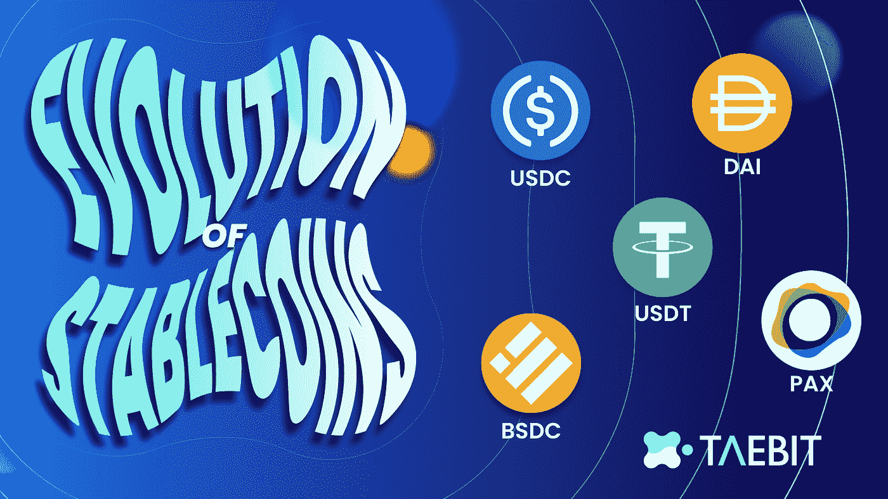
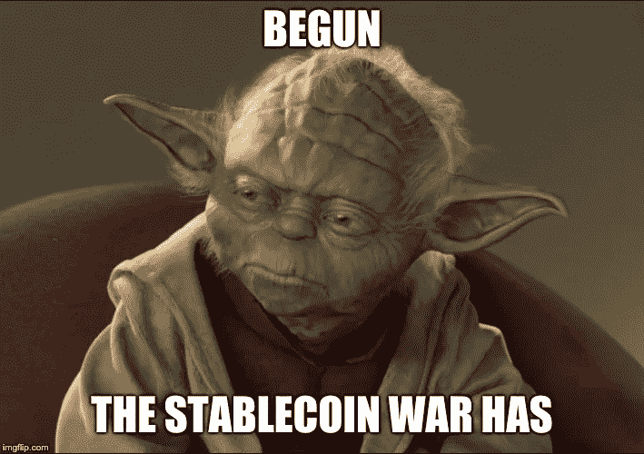

# 马厩的演变和景观

> 原文：<https://medium.com/coinmonks/the-evolution-and-landscape-of-stablecoins-3f280de875c8?source=collection_archive---------17----------------------->

# 为什么密码市场需要稳定的密码？

Stablecoins 的创建是为了使加密货币更具可预测性，并为加密交易者提供一种便捷的方式来保护其法定价值，而不必将资金撤回到本国货币。稳定的货币主要用作稳定的价值储存手段——尤其是在市场波动时期。许多稳定的硬币甚至被用来购买日常商品和服务，而不会使加密预算成为一项困难的脑力练习。

# **稳定的硬币是如何工作的？**

绝大多数 stablecoins 的功能相同:它们是在区块链铸造的加密货币，用户可以像其他加密货币一样在交易所购买、出售和交易。Stablecoins 可以存储在加密货币钱包中，无论是热的还是冷的，类似于比特币或其他主要的加密资产。

大多数稳定货币都与某种外部资产储备相关，无论是法定货币储备、黄金等大宗商品还是商业票据等债务工具。在大多数情况下，发行或开发稳定币的公司或实体拥有的储备等于其流通中的代币数量。这种结构是适当的，因此任何稳定币持有者总是可以用一个稳定币代币兑换它的菲亚特支持的等价物。

# **四种类型的稳定曲线**

*   菲亚特支持的
*   加密货币支持
*   算法的
*   商品支持的

## **菲亚特支持的 Stablecoins**

市场上最受欢迎的稳定货币是由法定货币支持的。例如，美元硬币或 USDC 是法定货币，以 1:1 的比率与美元挂钩。其他稳定货币与欧元、英镑、日元和人民币挂钩。

## **加密货币支持的 Stablecoins**

加密支持的稳定货币是与另一种更成熟的加密货币挂钩的加密货币。例如，MakerDAO 是最受欢迎的加密支持的 stablecoins 之一。它使用智能合约——一种自动执行的基于代码的合约——以及以太坊区块链来汇集足够的以太(ETH)作为其稳定币的抵押品。然后，一旦抵押品的数量达到智能合约中的特定水平，用户就可以铸造“戴”MakerDAO stablecoin。

## **商品支持稳定债券**

顾名思义，商品支持的稳定债券与贵金属、工业金属、石油或房地产等商品的价值挂钩。大宗商品投资者喜欢大宗商品支持的稳定债券，因为这让他们可以投资黄金，而不必担心寻找和储存黄金的麻烦。系绳黄金(XAUT)是商品支持的稳定货币的一个例子。这种货币由存放在瑞士金库里的黄金储备支持。一盎司黄金等于一先令。

## **算法稳定积分**

与之前讨论的稳定硬币类别不同，算法稳定硬币没有任何现实世界的货币或商品支持，而是这一类别的稳定硬币使用算法根据市场需求调节供应。这些稳定硬币中的大部分被烧掉(永久地从流通中除去硬币)或铸造新的硬币，这是基于在任何给定时间对稳定硬币的波动需求。最著名的算法稳定币之一是 UST 或月球区块链上的 Terra 稳定币。

对算法稳定机制的一个很好的比喻:

> 你可以把一个算法稳定币想象成一个放在外面的喂鸟器，里面标有食物高度。为了使桶内的食物保持在完全相同的水平，您设置了一个机制，根据食物水平偏离标记的程度来添加或移除食物。这由计算机算法控制，使得如果添加更多的食物并且桶开始装满，该算法指示该机构将食物从桶的底部释放出来，直到其达到食物水平标记。相反，如果有更多的鸟从喂食器进食，计算机算法将指示该机构向喂食器添加更多的食物，直到恢复到正确的水平。

# **稳定的货币市场状态**

## **稳定币** [**市值**](https://www.google.com/search?q=Market+Cap:+The+combined+market+cap+of+the+top+5+stable+coins+currently+sits+at+$136.616b+as+of+7.22+with+growth+of+%2B25%25+y/y+MTD.+Not+surprisingly,+there+has+been+a+decline+in+overall+stable+coin+market+cap,+dropping+13%25+from+peak+to+today,+though+this+remains+well+above+pre-COVID+levels.+USDT+has+been+losing+share+to+USDC,+no+surprise+given+the+underlying+concern+around+Tether%E2%80%99s+backing,+but+the+speed+of+decline+is+notable+with+USDT+losing+nearly+10pp+of+share+since+the+beginning+of+22%E2%80%99+to+sit+at+48%25+of+the+total+stable+coin+market+share+as+of+July.+USDT+growth+remains+the+largest+at+$65.345b+but+growth+has+been+anemic+at+%2B2%25+y/y+in+both+June+and+July.+USDC+continues+to+have+the+most+robust+market+cap+growth+of+the+group+at+%2B72%25+y/y+MTD,+from+%2B93%25+y/y+in+June.+DAI+has+not+been+able+to+follow+USDC%E2%80%99s+lead+in+terms+of+taking+USDT%E2%80%99s+share,+and+still+sits+at+5%25+of+crypto+market+share.&spell=1&sa=X&ved=2ahUKEwjI14rh5-P5AhUgD1kFHW03CyEQBSgAegQIARA2)

截至 2012 年 8 月 22 日，USDT、USDC、戴、派克斯和五大稳定品牌的总市值为 1，366.16 亿美元，同比增长 25%。毫不奇怪，总体稳定的硬币市场价值有所下降，从峰值到今天下降了 13%，尽管这仍然远远高于 COVID 之前的水平。USDT 的份额一直在输给 USDC，考虑到对 Tether 支持的潜在担忧，这并不奇怪，但下降的速度是值得注意的，USDT 自 22 '年初以来损失了近 10%的份额，截至 8 月底，占稳定的硬币市场份额的 48%。USDT 的增长仍然是最大的，达到 653.45 亿美元，但 7 月和 8 月的增长率都只有+2%。USDC 继续保持该集团最强劲的市值增长，从 6 月份的+93%同比增长到+72%。在抢占 USDT 的市场份额方面，戴未能赶上 USDC，其加密市场份额仍为 5%。

## USDT 和 USDC:领先的稳定竞争对手

USDC 和 USDT 占据了整个 stablecoin 市场的最大份额，USDT 的市值为 6534 亿美元，USDC 以 484 亿美元略微落后。这些 stable coin 都是由菲亚特支持的 stable coin，被整个行业视为存放加密货币的两个最安全的地方。法币支持的 stablecoins 代表了安全、保障和以熟悉的法币命名你持有的加密货币的能力。

# **对新稳定系统的需求**

## **分散稳定储备控制的需求**

尽管像 USDT 和 USDC 这样稳定的货币巨头有利于分散化金融体系的整体功能，但它们代表了中央集权的重要载体。Circle 是创造和发行稳定的 USDC 币或美元 Circle 的公司，Tether 是创造 USDT 币或美元 Tether 的公司。虽然每天都有数百万个人使用基础 stablecoins 来浏览加密货币景观，但它们的母公司对这些“分散”资产拥有总体控制权，并可以选择实施某些政策，在出现问题时改变它们的结构或冻结它们的部分代币。

加密货币是作为一种转移资金和扩散完全不受政府或公司控制的经济体验的手段而创建的。因此，完全链上、分散的稳定货币代表了加密货币领域中最独立的储值方法。

## **对防审查平台的需求**

Taebit 团队认识到人们对易变加密货币的兴趣日益增长，并意识到迫切需要一个分散的平台，为任何地理位置或司法管辖区的用户提供以更相关和代表现实生活风险的面值进行交易的能力。人们曾多次尝试创造一种稳定币，这种币保持真正的长期稳定性和分散性，但不可避免地依赖于第三方资产的稳定性(即由不同资产支持或最终成为由其他稳定币支持的稳定币)。

## **对非美元稳定货币的需求**

此外，整个全球稳定的货币市场主要关注美元。虽然美元是最强大的传统储备货币，占[外汇储备的 59%](https://www.bloomberg.com/opinion/articles/2022-03-03/dethroning-the-dollar-as-the-world-s-reserve-currency-won-t-be-easy#:~:text=According%20to%20the%20International%20Monetary,above%20the%20euro%20at%2020.5%25),但当作为稳定的货币在区块链复制时，它仍然容易出现不稳定、通货膨胀、集中化和局限性。这些完全抵押的稳定币或者有保管风险，由一方或一个组织单独负责系统的功能，或者它们需要链上的过度抵押，这模糊了稳定币的价值。

## **需要更好的算法稳定性**

在光谱的另一端，没有支持的算法稳定积分的激增有了新的发展。这些完全算法化的、没有后台支持的 stablecoins 面临着不同的限制和风险。Taebit 模型提供了一个高度不可信和可扩展的货币生态系统，具有强大的去中心化功能，并为面额和 DeFi 活动提供了有用的稳定性。当前算法设计的缺陷在于，它们难以启动，增长缓慢，并表现出极端的波动性，这降低了人们对它们作为“稳定”资产的有用性的信心。

# **Taebit 提供的服务**

Taebit 计划成为首批 stablecoin 协议之一，实现算法和抵押 stable coin 的设计原则，以创建高度可伸缩、不可信、可靠和思想上纯粹的链上货币。这种多方面的方法以前已经成功实施过，但是 Alkemy 通过建立第一个**omni**-货币稳定铸币平台进一步扩展了这个概念。Alkemy 的目标是成为第一个通过利用我们的共享储备创造任何潜在货币的 DeFi 平台。

Taebit 是完全去中心化的，抗审查，有多种货币的能力，并为算法控制提供了更好的方法。Taebit 在区块链上运行，系统的底层机制完全由智能合约技术控制。任何公司或实体都不能用不透明的收费结构或第三方干预来迷惑这个平台。相反，创建 Taebit 的目的是使稳定的社区民主化，把权力放回用户手中。Taebit 还具备多币种能力；这意味着用户可以在 genesis 和 mint aUSD、aKRW 和 aEUR 上贡献 PRIMA 和 USDC。这是第一次，许多个人将能够在他们的本地账户上进行区块链交易，该平台的目标是使分散化的体验更加全球化。在 Taebit 平台上创建的 Stablecoins 运行在一个半算法模型上，该模型确保了稳定性，同时也提供了最分散的交易体验。

## **关注我们🌟**

[*推特*](https://twitter.com/TaebitDEX?source=about_page-------------------------------------) *🐦/* [*不和*](https://discord.gg/gBjqjFXmn2?source=about_page-------------------------------------) *👾/* [*电报*](https://t.me/+4kkLYgMPtZw3NjJl?source=about_page-------------------------------------)*✈️/*[*网站*](https://taebit.io/?source=about_page-------------------------------------) *🚀*

> 交易新手？尝试[加密交易机器人](/coinmonks/crypto-trading-bot-c2ffce8acb2a)或[复制交易](/coinmonks/top-10-crypto-copy-trading-platforms-for-beginners-d0c37c7d698c)