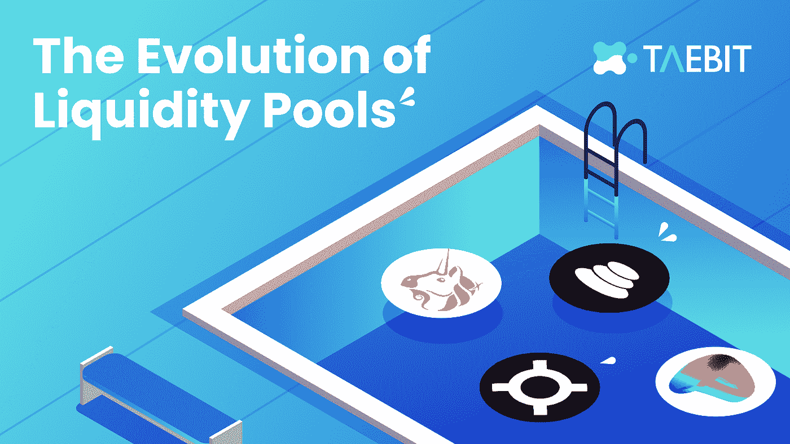

# 流动性池的演变

> 原文：<https://medium.com/coinmonks/the-evolution-of-liquidity-pools-88486c2309c?source=collection_archive---------25----------------------->

## **简介**

在 DeFi 成立之前，投资者只能选择在中央交易所购买、出售或持有代币。随着一个更加稳健的分散化金融体系的出现，出现了[自动做市商](/coinmonks/inter-stable-swap-deep-liquidity-amm-3-0-78330936517e) (AMM)和流动性供应。这些高度自动化的工具使投资者能够从他们持有的代币中赚取收益，并为分散的交易所提供更好的机制，以确保流动性和维持盘中交易功能。

## **什么是流动性拨备和流动性池？**

[**流动性提供者**](https://minterteam.medium.com/what-is-a-liquidity-provider-the-mbank-case-fd99de2c5f19) ，也被称为做市商，是指向平台提供其加密资产以帮助确保交易分散化的人。作为回报，这些有限合伙人从该平台的交易中获得费用，这可以被视为一种被动收入。

值得注意的是，在用户决定提供流动性的时间内，有限合伙人提供的资产通常会被平台锁定。

简单地说，一个 [**流动性池**](/apy-vision/what-is-liquidity-providing-a-crypto-guide-1287ac276cad) 是一个智能合约，你可以在其中存放代币(通常是 2 个代币，每个代币的金额相等)，以期获得回报。这类似于传统金融市场中的做市，但有一个关键区别——流动性池通过智能合约技术实现自动化。下面是这个过程的详细解释——每个流动性池都是一对代币的交易场所。当创建池契约时，每个令牌的余额为 0；为了让资金池开始促进交易，必须有人用每个代币的初始存款来播种它。第一个流动性提供者是设定资金池初始价格的人。他们被激励将两个代币的等值存入池中。

## **为什么需要流动性池？**

流动性池与传统的订单簿交易所相似，因为它们都促进交易，但所使用的机制存在显著差异。流动性池自动化了传统金融市场做市商花费大量时间和资源的参与和管理功能。通过在区块链建立这些资金池，任何有多余流动性(代币)的人都可以以不可信的方式成为做市商。这是革命性的，因为一旦不具备只有特定金融家群体才具备的密集型资本，就很难成为做市商。blockchain-native fluid protocol 能够利用可信的代码执行和自主且永久运行的虚拟机(区块链)，以创建一个包容性的环境，在这个环境中，无论向池中贡献了多少资金，每一个 LP 都会获得做市商奖励。

## **AMM 简介**

自动化做市商(AMMs)是一种使用算法交易队列的[分散交易所(DEX)](https://blog.chain.link/dex-decentralized-exchange/) ，使得个人交易者可以很容易地买卖加密资产。用户不再像传统的订单那样直接与他人交易，而是直接通过 AMM 进行交易。支撑 AMM 的是流动性池，这是一个众包的加密资产集合，AMM 用它与购买或出售这些资产的人进行交易。将资产存入资金池的用户被称为流动性提供者(LPs)。

流动性对于 AMM 的正常运作至关重要。如果 AMM 没有足够的流动性池，当交易者买卖 DeFi AMM 的资产时，会对价格造成很大影响，导致资本低效和短暂的损失。为了激励流动性提供者将他们的加密资产存放在协议中，AMM 会从 AMM 产生的费用中抽取一部分作为奖励，通常作为 LP 令牌分发。通过存放资产获取回报的做法被称为[高产农业](https://chain.link/education/defi/yield-farming)。

AMM 的资产价格会根据需求自动变化。例如，一个流动性池可以容纳 1000 万美元的 ETH 和 1000 万美元的 USDC。交易者可以用价值 50 万美元的 USDC 换成联邦医疗保险，这将提高联邦医疗保险在 AMM 的价格。

## **AMM 的进化**

第一代自动做市商都严重依赖于常数函数，即池中交易对的组合资产储备必须保持不变。因为流动性池，交易发生的场所，是高度动态的——恒定功能系统[经历了高度低效的时期](https://blog.chain.link/automated-market-maker-amm/)。在 AMM 的第一次迭代中，最广泛采用的常量系统是常量产品做市商(CPMM)、常量总和做市商(CSMM)和常量均值做市商(CMMM)。这些系统中的每一个都被迫牺牲流动性或资本效率来实现。

*   **CPMM** 提供无限的流动性，但价格越来越高，
*   **CSMM** 的特色是零价格影响交易，但不提供持续可用的流动性。
*   CMMM 允许流动性池在一个特定的池中拥有三种资产，但资本效率较低。

新一代 AMM 已经能够通过实施创新的解决方案来增强流动性，同时在交易期间保持相对较低的价格影响，从而超越以前迭代的缺点。这些新 AMM 都有一个共同点:它们不再依赖常量函数。混合 CFMM、动态自动做市商(DAMM)、主动做市商(PMM)和虚拟自动做市商(vAMM)都利用先进的公式为用户创造最佳的交易体验。

混合 CFMM 被称为 stableswap 变体，是曲线协议的一个特征，它结合了 CPMM 和 CSMM，以创造更密集的流动性，并降低价格影响。

*   **DAMM** 利用隐含的市场波动性沿着价格曲线动态分配流动性。在低波动时期，该系统可以将流动性集中在市场价格附近并提高资本效率，然后在高波动时期扩大流动性，以帮助保护交易者免受减值损失。
*   **PMM** 模仿人类做市行为，根据市场变化主动移动每种资产的价格曲线。
*   **vAMM** 通过让交易者将资金存入智能合约而不是直接存入流动性池，最大限度地降低价格影响，减少非永久性损失，并实现合成资产的单一象征性风险。

## **以指数形式提供流动性**

提供流动性的过程可以根据 DEX 而变化，但在大多数情况下，在 DEX 上提供流动性就像选择一个资产池，购买每种资产的相应数量，并将这些资产存入流动性池一样简单。对于许多加密用户来说，成为流动性提供商使他们能够从其加密资产中赚取收益，同时保持对其令牌的完全控制。许多 DeFi 平台能够提供远超传统金融平台的诱人收益率，这使它们成为一种安全而明智的投资。

## **结论**

在过去的四年中，流动性池已经成为寻求存放加密资产并获得稳定收益的投资者的主要中心。这些资金池的结构已经发展，AMM 的基础技术已经将分散的交易所变成了使用最广泛的加密货币协议，据[估计，每天有 300 亿美元](https://www.coinbase.com/learn/crypto-basics/what-is-a-dex)通过主要的 dex 流动。值得注意的是，并不是所有的指标都是平等的。排名前三的 DEX——Curve、uni Swap&Pancake Swap——接收了超过 90%的每日交易量，因此在参与协议之前，最好充分了解分散式交易所的结构。

# 加入我们的行列

[推特](https://twitter.com/TaebitDEX?source=about_page-------------------------------------)🐦/ [不和](https://discord.gg/gBjqjFXmn2?source=about_page-------------------------------------)👾/ [电报](https://t.me/+4kkLYgMPtZw3NjJl?source=about_page-------------------------------------) ✈️ / [网站](https://taebit.io/?source=about_page-------------------------------------)🚀

> 交易新手？尝试[加密交易机器人](/coinmonks/crypto-trading-bot-c2ffce8acb2a)或[复制交易](/coinmonks/top-10-crypto-copy-trading-platforms-for-beginners-d0c37c7d698c)