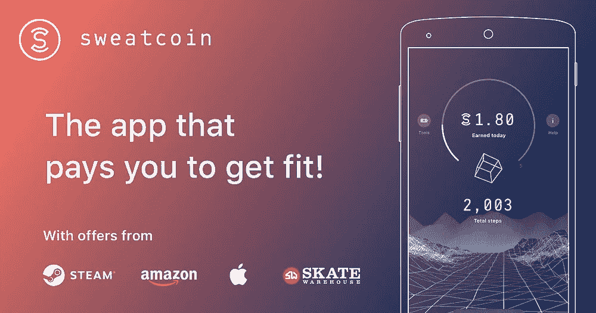
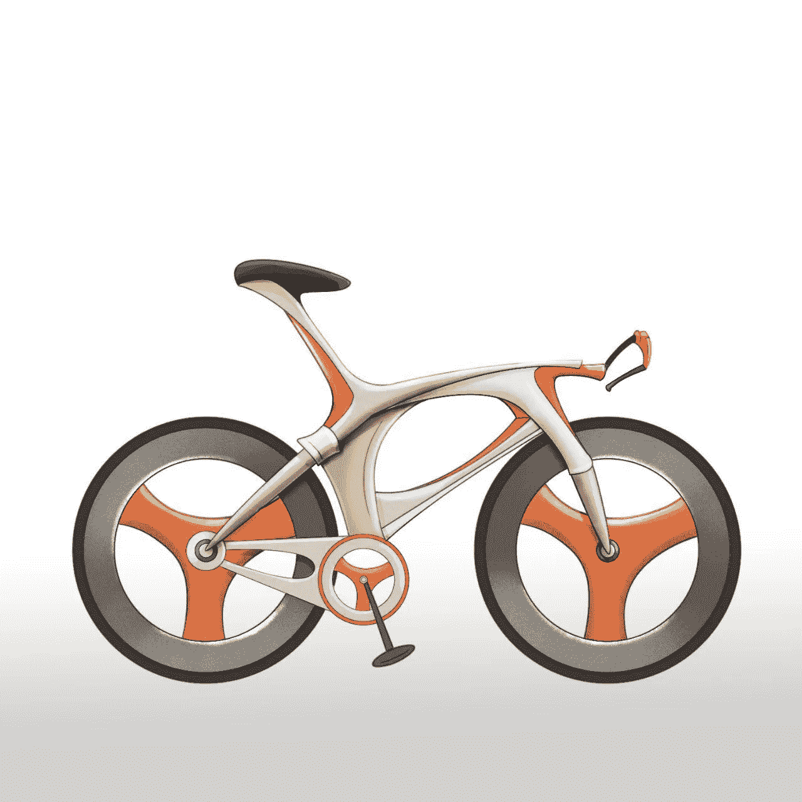

# Move2Earn 和 Web3 Games4Good 的演变

> 原文：<https://medium.com/coinmonks/the-evolution-of-move2earn-and-web3-games4good-744dc460a9b1?source=collection_archive---------5----------------------->

尽管处于一个秘密的熊市，许多伟大的团队继续建立和发展他们的社区。或许过去几个月最热门的领域是元宇宙和 Web3 游戏。

最近几个月，我深入元宇宙的兔子洞，寻找可以连接虚拟世界和现实世界(IRL)的用例，特别是我们正在构建的 web3 移动网络的正确战略是什么。我们在元宇宙的第一个商业合作伙伴是 Next Earth，这是第一个基于 web 3 的元宇宙，我们在那里的第一个客户是 Vueling Airlines 。

我们希望将移动网络的互联网延伸到“游戏”环境中，这一愿望现在让我们陷入了一个新的兔子洞:移动挣钱(M2E)。

**什么是移赚？**

就像 crypto 中的所有东西一样，当涉及到定义时，没有什么是非黑即白的。事实上，有些人会认为第一个 M2E 游戏是 Pokemon Go(即使没有直接的加密或财务奖励)。然而[来自 Phemex](https://phemex.com/academy/top-move-to-earn-apps-free-crypto#:~:text=Move%2Dto%2DEarn%20is%20a,in%20the%20form%20of%20cryptocurrency.) 的这个定义和任何定义一样好:

> Move-to-Earn 是一个快速发展的概念，为用户进行健身活动奖励加密货币。它结合了 GameFi、NFTs 和 GPS 技术来跟踪用户的运动；这些数据存储在区块链上，并转换成奖励，通常是加密货币的形式。

正如那些读过我以前在元宇宙发表的帖子的人，或者对我们正在建设的分散式移动互联网网络有所了解的人，你会知道我们对区块链技术如何影响我们的现实生活以及改善我们与地球的关系特别感兴趣。这是一个在 PFP 型 NFT 项目的持续投机性质和加密中普遍存在的 token up 心态(尤其是在牛市中)中探索不足的话题。

但是世界上有那么多聪明的人对更大的东西的加密感兴趣。我们如何生活，我们的经济如何更具包容性，以及我们如何与自然更和谐地生活，这是一个伟大的重置。我很高兴 IoM 选择在 Cosmos 上构建我们的应用链，其中一个原因是我们与创始团队在这些主题上的深度价值观一致。

**M2E 的当前状态**

许多人实际上指出，6 年多前发布的《口袋妖怪 Go》取得了巨大成功，这是 M2E 运动的起点。当然，这不是一个基于加密的解决方案，收入部分更加间接。快进到过去几年，我们已经看到 m2e 项目的爆炸式增长，这些项目似乎是从 Play2Earn (P2E)空间获得灵感的。

两个最成功的 M2E 项目是 SweatCoin 和 STEP'N，它们的迅速崛起令人印象深刻。SweatCoin 成立于 2016 年，根据用户的步数奖励积分(尚未加密)。自发布以来，SweatCoin 已经积累了惊人的 1 亿次下载(不确定他们的每日活跃用户数)。

截至今天，SweatCoin 允许用户用积分兑换赞助商的促销商品。然而，预计他们将在 9 月份发布自己的令牌，因此用户也将获得加密。像大多数 M2E 项目一样，SweatCoin 以激励用户通过更多锻炼来改善健康为荣。

与此同时，STEP'N 最近得到了最多的关注，因为它是一个加密的原生 M2E 项目，最初是在大约一年前的 Solana hackathon 期间构建的。在很短时间内，STEP'N 已经取得了一些令人印象深刻的成就:超过 10 万的日活跃用户，[报告的 1.2 亿第二季度利润](https://www.coindesk.com/business/2022/07/12/solana-based-stepn-reports-1225m-in-q2-profits/#:~:text=STEPN%2C%20a%20Solana%2Dbased%20game,in%20a%20Medium%20post%20Tuesday.)(是的，我写的是利润而不是收入！)以及目前超过 5 亿美元的象征性市值。所有这些都发生在不到一年的时间里。STEP'N 还声称，他们的大多数玩家实际上都是第一次使用 crypto，因此已经开始利用他们作为入职平台的角色来推出针对这些用户的新产品，包括针对 Solana 的 DEX 和针对新 NFT 市场的计划(不仅针对他们自己的 NFT，也针对其他项目)。

**M2E 的未来及其更大的影响**

M2E 作为一种项目类型，开始成为一个值得关注的合法垂直领域。事实上，它帮助人们将 IRL(在现实生活中)与 crypto 联系起来，就像 STEP'N 的情况一样，鼓励人们到户外去触摸草地，同时赚取-并了解-crypto 是非常棒的。对 M2E 最大的批评就是我们听到的对 P2E 的批评。代币经济学可能经常过于庞氏风格(创造一个无限代币收入的循环，与购买 NFT、升级等的更多代币支出相关联。在这个游戏中，项目生存和发展的唯一途径就是大肆宣传和不断增长的用户……)。

这个领域的所有项目，包括 STEP'N，都在采取积极措施，引入更多的水槽和燃烧机制，试图创造一个更可持续的长期模式。这必须发生。

我感到兴奋的另一件事是，越来越多的人认识到，M2E 还可以通过让人们选择更可持续的出行方式来减少我们的集体碳足迹。目前还没有透露太多，请继续关注 IoM 即将宣布的最新举措:WheelCoin，它将利用 M2E 机制(没有庞氏骗局)来鼓励人们做出更可持续的移动选择。我们预计测试版将于九月底上线！

请保持关注，因为这个空间才刚刚开始。

**关于作者**

*Boyd Cohen 是 Iomob 的首席执行官和联合创始人，Iomob 是一个分散的移动互联网(IoM)网络。自 2001 年在科罗拉多大学获得战略和创业博士学位以来，他在过去的二十年里致力于加速实现低碳可持续经济。这包括出版了 3 本书，多篇同行评审的文章，经常为 Fast Company 投稿，并在智能城市和可持续发展领域创办了一些企业。*

> 交易新手？试试[密码交易机器人](/coinmonks/crypto-trading-bot-c2ffce8acb2a)或[复制交易](/coinmonks/top-10-crypto-copy-trading-platforms-for-beginners-d0c37c7d698c)