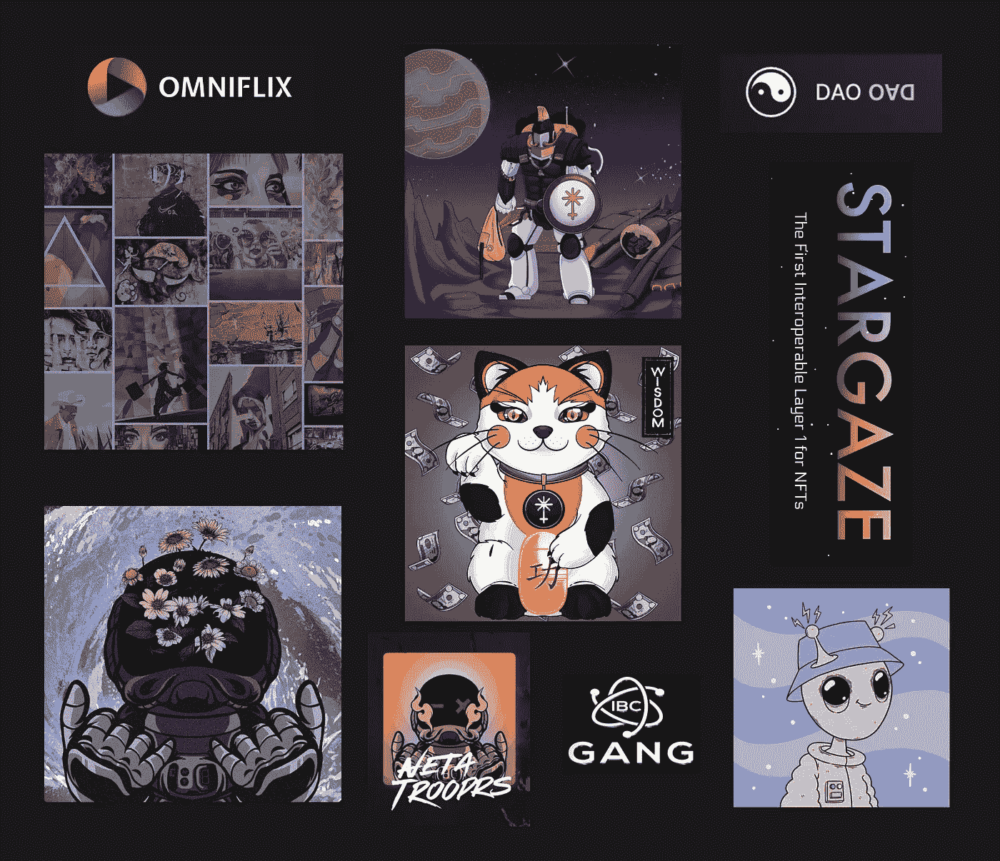

# NFTs 的发展

> 原文：<https://medium.com/coinmonks/the-evolution-of-nfts-31638a06c75?source=collection_archive---------28----------------------->

不可替代令牌(NFT)普及了数字资产，开创了互联网的新时代，被恰当地命名为 Web3。更类似于原始网络的开放性，在我们日益数字化的世界中，开发者们正在拓展可能的边界。

在过去的两年里，我们见证了非森林交易的收集、交易和销售的增长。一个全新的行业已经蓬勃发展！工作室专门支持艺术家和创作者将他们的作品数字化。市场已经敞开大门铸造、上市和出售非功能性食品。新一代的营销者已经成熟，将这一新的资产类别带给热切的新受众。

大多数当前流行的非功能性测试包括:

*   个人资料图片(PFPs)
*   神使
*   一对一的艺术品
*   生成艺术
*   收藏品
*   游戏化的数字资产。

然而，这些类型的 NFT 仅仅代表了对这种新的竞争格局的介绍，并且是这种技术的可能性的一个小样本！NFTs 的发展将跨越许多行业，并颠覆许多传统的商业活动。

为了让我们继续探索下一个开创性的 NFTs，我想在这里强调一些令人兴奋的新进展。在每一类的结尾，我会提供一些令人兴奋的新 NFT 项目的图形例子，你可以在下面的资源部分找到这些例子的链接。

## **事件、社区和 Dao**

发展最快的领域之一是 NFTs 如何形成社区创建和参与的基础。社区可以使用 NFT 来展示包容性，表示成员资格。

利用其令牌门控功能，NFT 可用于访问:

*   仅限会员 dApps
*   元宇宙世界
*   道遗址
*   仅限会员的活动。

而且，它们可以用来接收:

*   当前收益
*   未来特征
*   空投
*   附件 NFT
*   订阅访问
*   奖励。

所有这些都可以与社区或 DAO 的主要或起源 NFT 的所有权联系起来。

以类似的方式，节日、会议、音乐会、主题公园、度假村、演出和集会的活动门票可以通过使用 NFTs 完全数字化。参与者只需将他们的 NFT 放入他们的移动钱包中就可以参加活动。将数字参赛与体育赛事联系起来的优势是丰富而强大的，包括:

*   跟踪出勤情况。
*   开放额外的事件活动。
*   制作事件地图。
*   访问特殊功能。
*   提供事件信息。
*   进行事后营销。
*   支付奖励。
*   接触粉丝。
*   创造收藏机会。

## **电影、音乐、摄影和文学产业的出版和发行**

抱着一本书蜷缩在我最喜欢的椅子上，然后消失在遥远的世界里，这是一件非常令人满足的事情。没有了平板电脑上弹出的通知的干扰，没有了查看我最喜欢的应用程序的冲动，阅读体验提升到了一个全新的水平。

不幸的是，这不再是分发书面文字和新文学作品的成本有效的方法。我们也见证了长篇内容不再是最受欢迎的出版形式。类似的发展正在改变电影(视频和短片)、音乐(数字图书馆和播放列表，专注于单首歌曲)和摄影(在线共享体验)行业。

NFTs 将改进这些现有的传统模式，不仅提供数字格式的内容，还创建商业渠道和市场来有效地分发内容。最重要的是，随着生产成本的降低和众多组织的被削减，内容创作者最终将能够从其创作的销售收入中获得公平的份额。

## **文档数字化、人才获取和证书**

走进任何一个会计、人力资源、登记员、记录员或医疗办公室，你都会被大量的纸质文件淹没。你是谁，你欠了什么，你付了什么，你做了什么，以及你的健康状况的证明仍然大部分储存在纸上。尽管这看起来有些过时，但如果你留在当地社区处理自己的事务，这种方法仍然很有效。但是，一旦您跨州、省和国家边界走出去，所有这些纸面信息就会成为高效记录、信息共享和身份验证的限制因素。医疗行业在数字化患者数据和健康记录方面迈出了最大的步伐；不幸的是，这些努力仍然是地方性的。

NFTs 将通过将所有这些信息整合到身份、健康、凭证、声誉和所有权信息的数字组合中来解决这个问题。由图像、文档、健康和财务数据组成的一组独特的 NFT 将可以在瞬间被传输到任何地方。最重要的是，可通过以下方式部分或全部访问(使用查看钥匙或许可证):

*   人力资源专业人员在做出招聘决定时
*   注册教育课程的学生时的注册员
*   提供信贷和开立账户的金融机构
*   经销商访问资产库存和所有权
*   政府雇员核实财产所有权
*   医务人员在管理卫生保健时。

## **可替代与不可替代相遇的地方**

一种新的 NFTs 正在形成，它将 DeFi 的基本概念与不可替代资产的强大功能结合在一起。

将此应用到 a16z 的 Michael Blau 提出的框架中，NFT 的顶层吸引了我们:图像、艺术或媒体内容。然而，一个不可替代的令牌包含了丰富的功能，我认为这些功能可以为 DeFi 带来强大的特性。托管 NFT、元数据和功能的基础智能合约可用于解锁这些属性。

通过这种方式，NFTs 可以用于:

*   通过分配要发行的令牌的未来值来捕获协议库。
*   通过授予令牌发射来保护协议价值。
*   控制初始令牌启动，消除泵和转储方案并锁定 bot 活动。
*   确保未来数周、数月和数年的协议流动性。
*   设定赌注参数，包括预定义的到期日和固定的奖励。
*   支付可预测的、持续的象征性奖励。
*   出租数字资产，保留所有权并收取收入。

可替代和不可替代的令牌组学设计的交叉路口才刚刚开始被探索。随着进一步的实验，这种可能性肯定会远远超出这里列出的清单，为这类非功能性测试带来光明的未来。

## **多层令牌的演变**

NFT 给数字世界带来的一些好处已经在当前的 NFT 中实现了。其他因素和优势标志着这里讨论的新类别的兴起。总之，非功能性测试的主要好处包括:

*   让新用户加入 crypto。
*   建立和发展有凝聚力的社区。
*   构建、培养和增殖团队和团队合作。
*   让艺术家和创作者公平分享他们作品的货币化和分配。
*   相对便宜地生产和复制。
*   以经济有效的方式分配。
*   生成可组合的功能。

由多层组成，NFTs 可以打开许多用例的大门。它们可用于:

*   创建令牌门控机制。
*   提供效用。
*   融入独特性和稀有性的收藏元素。
*   链接到存储的离线信息。
*   执行智能合约中的嵌入式代码。
*   建立自我主权身份。
*   创建可验证的凭证。
*   包含当前和未来价值的 DeFi 成分。

这种新型非功能性思维的进化引导我们播下今天种下的种子，并让我们独特地捕捉我们未来的经历、成就和社会互动。NFT 的发展速度非常快。我们刚刚见证了一种新的资产类别的诞生，现在是时候系好安全带了，因为才华横溢的开发人员、创作者和艺术家将迎来下一波浪潮，将不可替代的代币编织到我们的日常生活中。

Tot ziens — Opa。

## **资料来源、参考文献和进一步阅读**

https://www.stargaze.zone/

omniflix—[https://omniflix . network/](https://omniflix.network/)

nots—【https://nots.art/ 

https://www.ibcfrens.com/ IBC 法国人—

网刀—[https://netadaozone-backup.neocities.org/](https://netadaozone-backup.neocities.org/)

万木宇宙—[http://www.manekicosmos.com/](http://www.manekicosmos.com/)

刀刀—[https://daodao.zone/](https://daodao.zone/)

黄心—[https://yh.io/](https://yh.io/)

迪斯科饼干—[http://www.discobiscuits.com/](http://www.discobiscuits.com/)

获取协议—[https://www.get-protocol.io/](https://www.get-protocol.io/)

胆量—[https://guts.tickets/](https://guts.tickets/)

https://bitsong.io/

镜头协议—[https://lens.xyz/](https://lens.xyz/)

迪斯科—[https://www.disco.xyz/](https://www.disco.xyz/)

https://nft.loop.markets/ NFT 环路市场

> 加入 Coinmonks [电报频道](https://t.me/coincodecap)和 [Youtube 频道](https://www.youtube.com/c/coinmonks/videos)获取每日[加密新闻](http://coincodecap.com/)

# 另外，阅读

*   [如何购买 Monero](https://coincodecap.com/buy-monero) | [IDEX 评论](https://coincodecap.com/idex-review) | [BitKan 交易机器人](https://coincodecap.com/bitkan-trading-bot)
*   [尤霍德勒 vs 考尼洛 vs 霍德诺特](/coinmonks/youhodler-vs-coinloan-vs-hodlnaut-b1050acde55a) | [Cryptohopper vs 哈斯博特](https://coincodecap.com/cryptohopper-vs-haasbot)
*   [顶级付费加密货币和区块链课程](https://coincodecap.com/blockchain-courses)
*   [MXC 交易所评论](/coinmonks/mxc-exchange-review-3af0ec1cba8c) | [Pionex vs 币安](https://coincodecap.com/pionex-vs-binance) | [Pionex 套利机器人](https://coincodecap.com/pionex-arbitrage-bot)
*   [如何在印度购买比特币？](/coinmonks/buy-bitcoin-in-india-feb50ddfef94) | [WazirX 评论](/coinmonks/wazirx-review-5c811b074f5b)