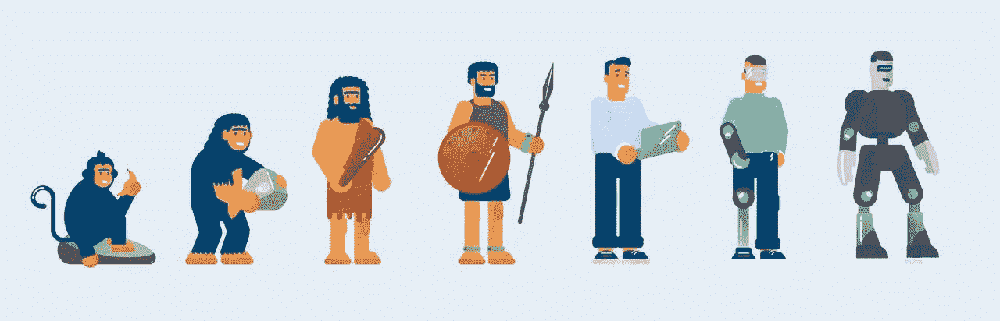
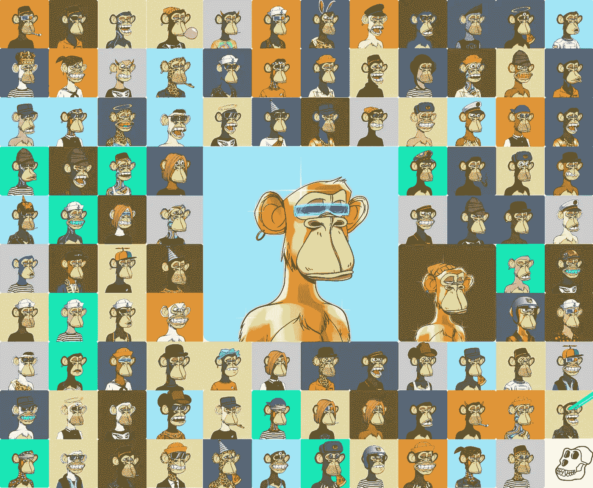

# NFTs 的发展(上)

> 原文：<https://medium.com/coinmonks/the-evolution-of-nfts-part-1-ec61eb37eba9?source=collection_archive---------39----------------------->

NFTs exploded into the web3 scene like Snoop Dogg crashing a party, but will it still be there when the party is over?

现在将是一个伟大的时间来评估和谈论非功能性测试…再次。

但这一次，让我们缩小范围。

让我们飞到 30，000 英尺的高空，看看在过去一年左右的时间里，NFT 变成了什么样子。

让我们分析一下 NFTs 自几年前诞生以来的演变。

试图对如此新生的事物进行分类并不是精确的科学，所以请原谅我。

要描述 NFTs 的发展需要不止一篇文章，但是让我们试试。

它始于 2017 年的 CryptoPunks，NFTs 的 O.G .

他们中最伟大的父亲。

CryptoPunks is a non-fungible token (NFT) collection on the Ethereum blockchain. The project was launched in June 2017 by the Larva Labs studio, a two-person team consisting of Canadian software developers Matt Hall and John Watkinson.

简单，像素化的朋克脸的数字图形，你真的不能做太多。

信不信由你，CryptoPunks 背后的公司免费给了他们。

然后是迷因文化。

迷因是互联网的基本语言。

这真的很优雅，这些照片讲述了一百万个单词，捕捉了当时的社会事件，被全世界的网民传播和分享，让他们开怀大笑。

有 Nyan 猫，查理咬我的手指，成功的孩子，过分重视女朋友和持有我的啤酒。

The original 2007 video “Charlie Bit My Finger,” a standard-bearer of viral internet fascination, has sold as a nonfungible token for $760,999, and the family who created it will take down the original from YouTube for good.

然后更有事业心的人决定模仿 CryptoPunks 的成功。

CryptoPunks 是 10K 系列的先驱，这基本上意味着每个系列有 10，000 个图形。

人们开始意识到不可能单独设计和创造每一个图形。

于是 10k 算法生成的 NFT 集合诞生了。

好家伙，他们带着它进城了。

随着对 NFT 的大肆宣传开始升温，你能想象到的任何东西，猿、机器人、狗、热狗、城市等等似乎一夜之间就出现了。

10K·NFT 收藏把所有权给了人们，让开发商赚了很多钱，随着像 Eth 这样的区块链新技术的进步，这意味着版税可以永久地从每笔销售中获得。

Yuga Labs are creators of the popular Bored Ape Yacht Club NFT collection. This most recent funding round values the company at $4 billion.

巨型公司诞生了，艺术家被放大了，智能合约的开发者需求旺盛，资金源源不断地涌入 NFT。

然后，还有对 pfp 或个人资料图片的迷恋。

甚至还有 NFT 系列，给你一个 AR 过滤器，你可以在缩放通话中使用。

与此同时，诈骗、网络钓鱼和欺诈充斥着整个场景，每一次尝试都变得越来越大胆和激烈。

我们谈到了它是如何从 OG CryptoPunks 开始的，然后是 Meme 文化，然后是 10k collections，然后是骗局和欺诈。

请继续关注第二部分。

-

NFTs 是 Web3 不可或缺的一部分吗？

-

# startups # business # startupx # growth # success # social media # culture # entrepreneurs # strategy # eth #比特币#加密货币# bayc # nft # airdrop #品牌化#进化#革命#web3

> 交易新手？试试[加密交易机器人](/coinmonks/crypto-trading-bot-c2ffce8acb2a)或者[复制交易](/coinmonks/top-10-crypto-copy-trading-platforms-for-beginners-d0c37c7d698c)