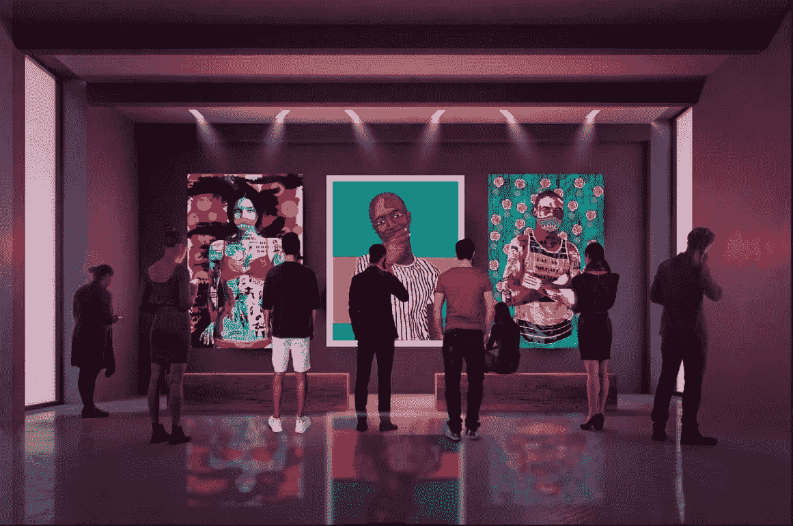
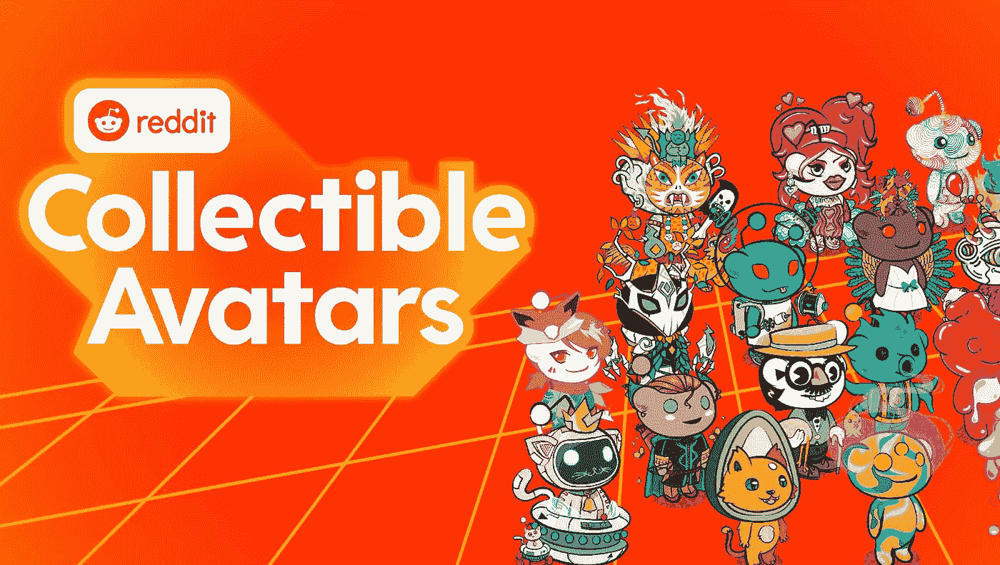
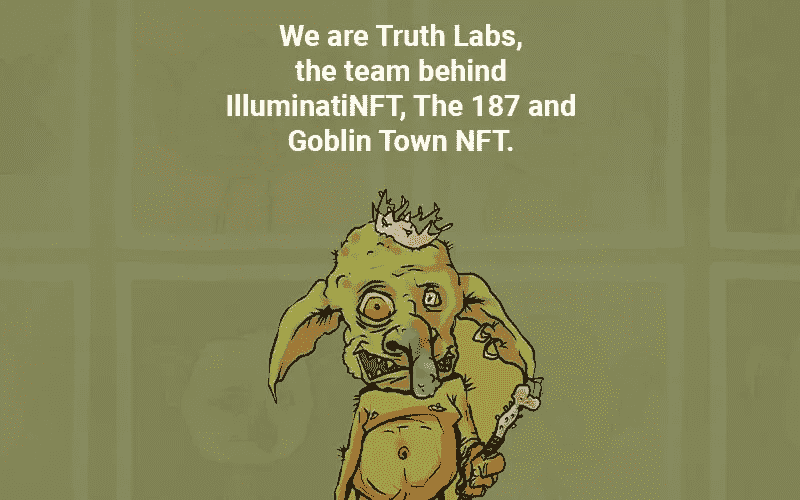
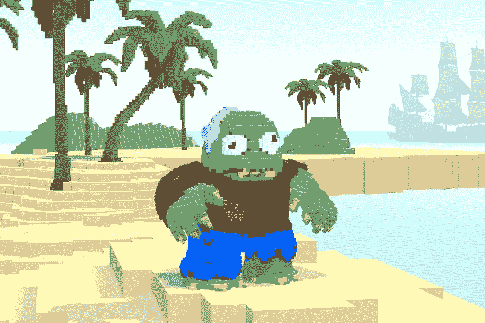

# NFTs 的发展(下)

> 原文：<https://medium.com/coinmonks/the-evolution-of-nfts-part-2-1e3c798d604e?source=collection_archive---------29----------------------->

Will NFTs ever be truly considered real art by mainstream collectors?

我们谈到了它是如何从 OG CryptoPunks 开始的，然后是 Meme 文化，然后是 10k collections，然后是骗局和欺诈。

这是关于 NFTs 发展的第 2 部分。

NFT 在 2021 年蓬勃发展，突然之间，交易、收集、拥有和建造 NFT 项目成为一项可行的、严肃的业务。

它产生了大规模的亚文化和经济，有专门的市场，新的人才涌入现场，名人用 brio 支持他们。

但是当有很多钱可以赚的时候，你可以打赌坏演员会出现。

人们在不和谐的骗局中失去了宝贵的 NFT，钱包被掏空，看着项目所有者在筹集了数百万美元后消失。

突然，集体市场决定他们已经受够了这种废话，并要求具有真正效用的 NFT。

功利主义的非功能性食物风靡一时。

Since they launched in July, Reddit Avatars have seen some big numbers. There are now a total of 4.4m total Digital Collectible Avatars.

仅仅拥有一个数字图像作为 NFT 是不够的。

NFT 必须授予实体俱乐部、餐厅、音乐会门票、超级跑车的会员资格，或者购买未来收藏品的机会。

我想我们应该已经开始了，但是哦，这是一个进步。

最近，cc0 NFT 项目风靡一时。

GoblinTown 风靡一时，允许人们免费铸造和拥有 NFT，他们可以用它做任何事情。

GoblinTown burst into the scene out of nowhere and nobody knew who was behind it, until Truth Labs came out to stake their claim.

这包括拥有版权，制作电影，歌曲，印刷商品并从中获利。

项目所有者只需从 NFTs 的销售中赚取丰厚的版税，并随着更多的人共享、构建和使用它，看着这个品牌日益壮大。

相当激进。

哦，这些年来，NFT 是如何进化得如此美丽的。

我们有 OG CrpytoPunks，Meme culture，10k collections，PFPs，utility NFTs，cc0 项目…

一个比一个有趣、新颖、可爱。

Except for Kevin, from one of the worst NFT project ever: Pixelmon, which earned a whopping USD $70 Million.

现在有了 NFT 租赁、知识产权许可，以及对高效社区建设的更深入关注。

在这一切的基础上，社区和成员将继续增长。

当然，仍然会有骗局和障碍，自然的事情来来去去。

前方的路不会平坦，但会很好玩。

出去玩吧。

-

NFT 还酷吗？

-

# startups # business # startupx # growth # success # social media # culture # entrepreneurs # strategy # eth #比特币#加密货币# bayc # nft # airdrop #品牌化#进化#革命#web3

> 交易新手？试试[加密交易机器人](/coinmonks/crypto-trading-bot-c2ffce8acb2a)或者[复制交易](/coinmonks/top-10-crypto-copy-trading-platforms-for-beginners-d0c37c7d698c)
> 
> 加入 Coinmonks [电报频道](https://t.me/coincodecap)和 [Youtube 频道](https://www.youtube.com/c/coinmonks/videos)获取每日[加密新闻](http://coincodecap.com/)

## 另外，阅读

*   [复制交易](/coinmonks/top-10-crypto-copy-trading-platforms-for-beginners-d0c37c7d698c) | [加密税务软件](/coinmonks/crypto-tax-software-ed4b4810e338)
*   [网格交易](https://coincodecap.com/grid-trading) | [加密硬件钱包](/coinmonks/the-best-cryptocurrency-hardware-wallets-of-2020-e28b1c124069)
*   [密码电报信号](/coinmonks/top-3-telegram-channels-for-crypto-traders-in-2021-8385f4411ff4) | [密码交易机器人](/coinmonks/crypto-trading-bot-c2ffce8acb2a)
*   [最佳加密交易所](/coinmonks/crypto-exchange-dd2f9d6f3769) | [印度最佳加密交易所](/coinmonks/bitcoin-exchange-in-india-7f1fe79715c9)
*   [开发人员的最佳加密 API](/coinmonks/best-crypto-apis-for-developers-5efe3a597a9f)
*   最佳[密码借贷平台](/coinmonks/top-5-crypto-lending-platforms-in-2020-that-you-need-to-know-a1b675cec3fa)
*   [免费加密信号](/coinmonks/free-crypto-signals-48b25e61a8da) | [加密交易机器人](/coinmonks/crypto-trading-bot-c2ffce8acb2a)
*   杠杆代币的终极指南