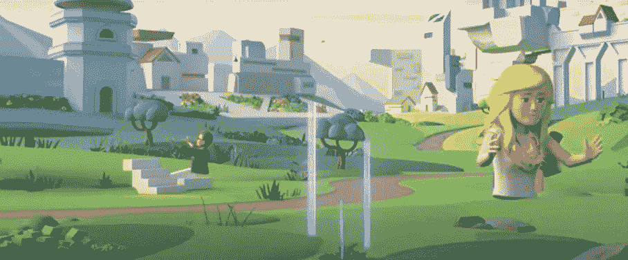
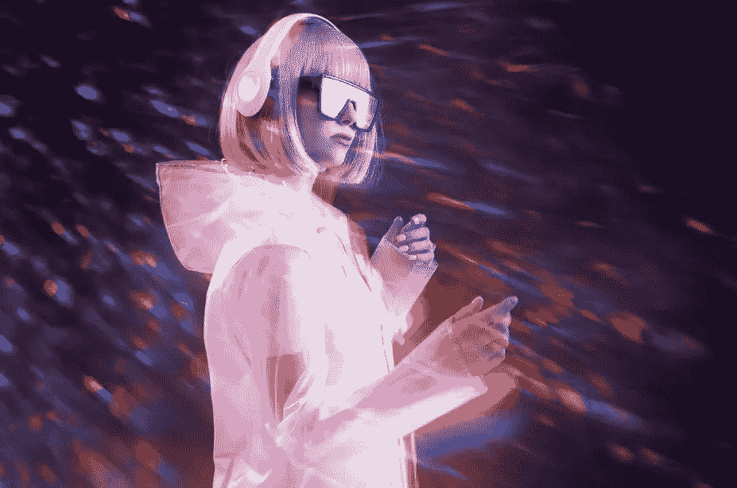

# 元宇宙的演变

> 原文：<https://medium.com/coinmonks/the-evolution-of-the-metaverse-8baf21df6779?source=collection_archive---------35----------------------->

## 个人电脑的出现与元宇宙有什么关系？

Horizon Worlds by Meta

当脸书宣布更名为 Meta 时，我一直最喜欢的播客之一 Ben Thompson 发布了一集《指数》。虽然本对许多元宇宙冠军的说法持怀疑态度，但他确实在个人电脑方面为 Oculus 提出了一个很好的类比。

最初，个人电脑太贵了，普通家庭买不起。它最初是一种商业实用工具——一种企业工具。然而，它变得如此强大和无处不在，以至于渗透到我们的个人生活中。价格点继续下降，并且编写了如此多的消费软件，以至于现在很难想象在家里(或在我们的口袋里)没有个人电脑的生活。

# 田园诗般迷人

Web 3 和元宇宙概念背后的理想是田园诗般的、高尚的和诱人的。谁不想要一个用户所有的互联网？谁不想在一个一切皆有可能的沉浸式数字空间里闲逛呢？与不再见面的朋友进行协作和重新联系的更好方式。

企业受制于对利润永无止境的追求。无限的增长和收入是可以预期的，如果一家公司必须以牺牲利润为代价来保护用户，那么将会出现这样一种情况，即使是首席执行官、董事会和任何高管都会输给这种激励制度，即(1)用股票留住员工，(2)用现金留住员工。

> 交易新手？试试[加密交易机器人](/coinmonks/crypto-trading-bot-c2ffce8acb2a)或者[复制交易](/coinmonks/top-10-crypto-copy-trading-platforms-for-beginners-d0c37c7d698c)

# 用户保护

因此，政府是唯一能够真正保证用户保护的实体，但我们都知道这有多有效。这不是什么新鲜事；这只是我们在拥有现代技术平台的现代资本主义中面临的一个问题，也是一个用户拥有的互联网可能解决的问题。Signal 的创始人莫邪很好地阐述了当前 Web 2 技术平台的一些问题。

当前的 Web 3 冠军超越了他们自己。由于 Web 2 发展如此迅速，下一代创始人希望产生更大的影响，而新老投资者希望有机会分一杯羹。更糟糕的是，密码狂热者相信——并且在经济上需要——它成功的现实是真实的，不管它是否真实。

我怀疑它会像目前支持者预测的那样发展。长期以来，crypto 一直是 SV 最优秀和最聪明的人的白热化焦点，但除了“购买、HODL 和相信”之外，它尚未提供任何主流用例:为您的金融梦想和愿望提供价值存储。虽然某种形式的元宇宙很有可能出现，但它会真正去中心化，主要存在于虚拟现实中，还是 Meta(以前的 FB)会发挥重要作用？我有疑问。

# 元宇宙

在某些方面，元宇宙已经存在了。我们的数字生活分散在大量的应用程序、平台和游戏中。我已经可以建造一个 3D 房子，邀请我的朋友过来，不和谐地聊天，在一个完全虚构的世界里社交。每天，数以百万计的游戏玩家这样做，不仅仅是在 Rust、《我的世界》、Valheim 或动物穿越中，在数百个其他游戏中也是如此。目前的社交锚是 Discord 的语音聊天和 Slack-neighborhood 服务器/频道，但我相信随着体验的发展，界面、集成和数据可移植性将会改善。很快，你就可以在你的数字空间里建造的房子的墙上播放 YouTube 视频了。

它将不仅限于游戏。有了数字白板和屏幕共享，人们将能够实时协作。他们将审查代码和经营业务。他们既会听音乐，也会创作音乐。在他们的数字客厅里，他们将一起看电影、体育、单口喜剧和直播 Twitch 流。他们会发微博，大笑，学习，胡说八道。

在我看来，元宇宙是第三地的进化，这是我们在家时预先存在的数字生活。最相似的类比是不和谐的演变，以及脸书、Slack、YouTube 等完全不同的体验整合到某种单一的、3D 的、可定制的社交空间中。

# 虚拟现实

马克·扎克伯格声称元宇宙已经以流行视频游戏的形式出现了。虚拟现实以创建数字感知为中心，许多专家认为这对于开发有趣的体验和留住用户至关重要。

我不相信这种体验可以在无缝编排、管理和运营的同时大规模分散，也不相信虚拟现实——一种奢侈、笨重、令人质疑的相关技术——会成为其中的一部分。当然，人类最终会达到一个点，虚拟现实不仅实用，而且负担得起，在许多方面优于现实生活。一种完整的感官体验，类似于黑客帝国或在线剑术，在这种体验中，我们的身体与互联网相连，但在我们的脑海中，我们在跳跃、飞行，并表演我们在现实生活中永远无法完成的运动技能。从而探索比我们自己的世界更宏伟的世界。但是那个“VR”和我们现在拥有的很不一样。