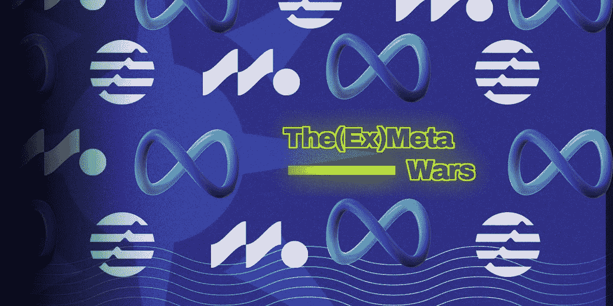
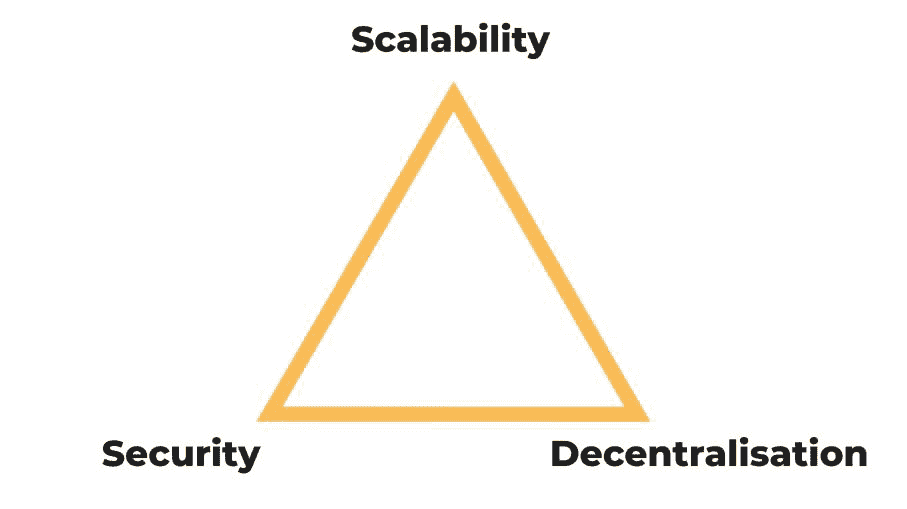
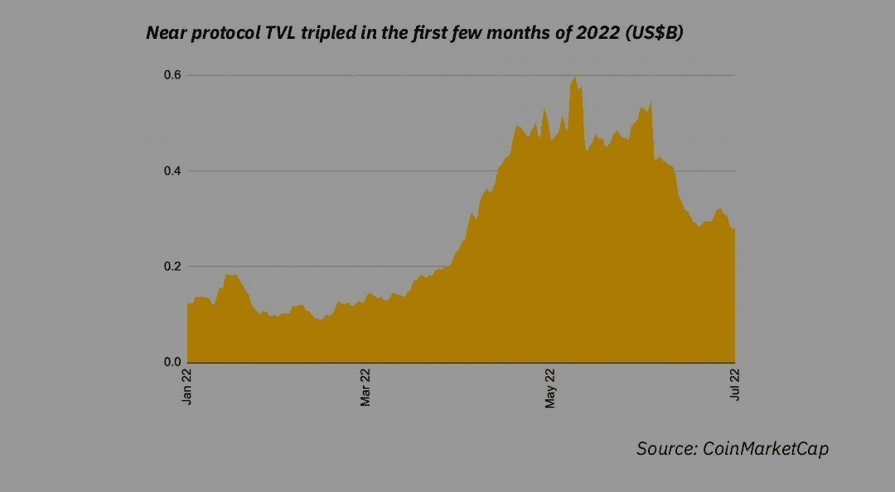
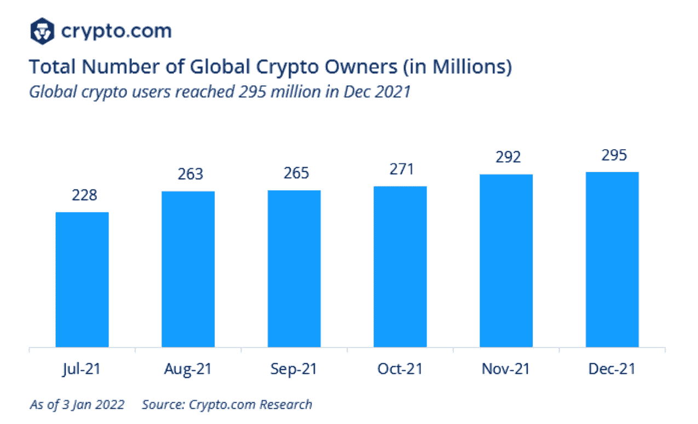
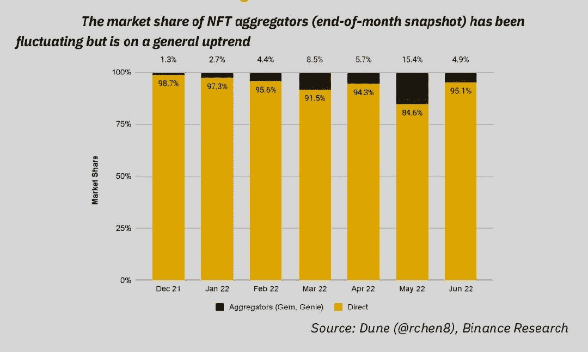
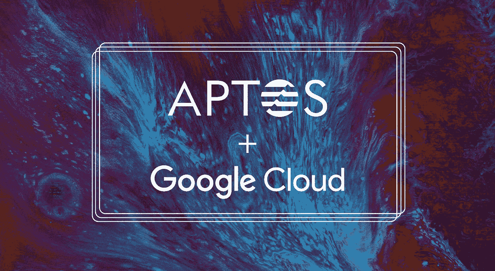
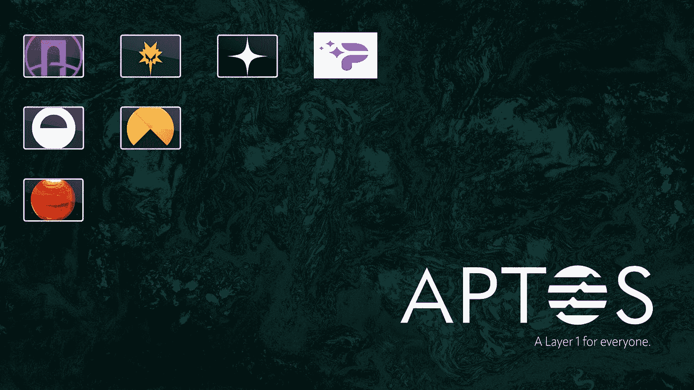
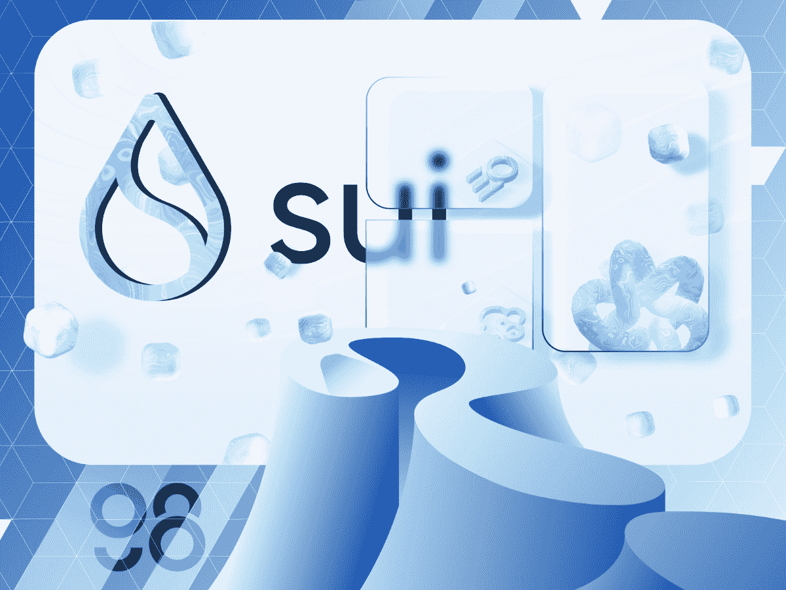
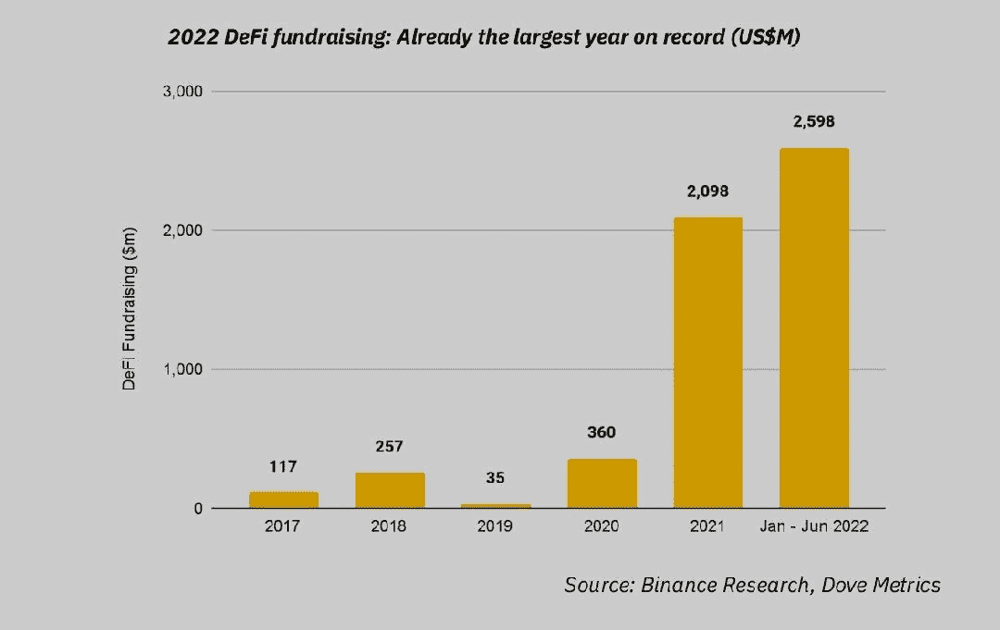
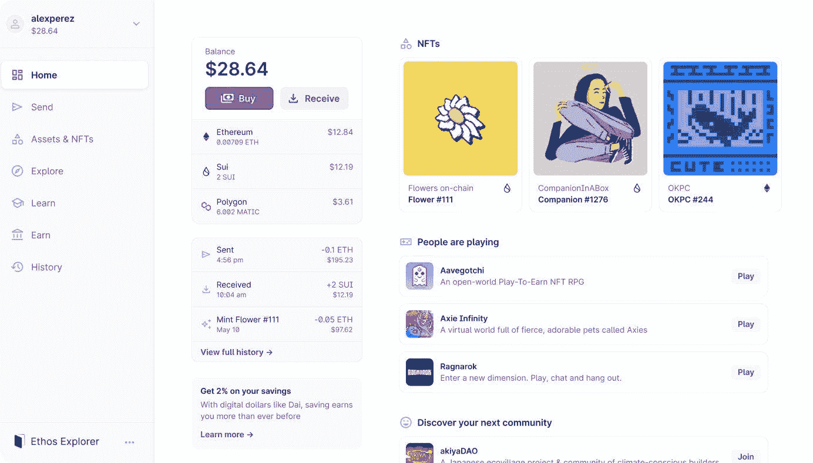

# (前)元战争？

> 原文：<https://medium.com/coinmonks/the-ex-meta-wars-c75ea51e1c6a?source=collection_archive---------24----------------------->

正如你可以从标题中读到的，今天我向你展示了一个后 Meta 趋势——但是 Meta 到底和 Web3 空间有什么关系呢？让我们开始吧

# 介绍

密码和区块链空间经历了一个值得注意的需求，从去年开始，进入市场；对可扩展性的追求，尤其是通过高性能的第 1 层区块链。

这最后一个导致了一个垂直承诺，面向由于创新而克服以太坊的可能性，同时与它区分开来，成为区块链宇宙中的一颗新星，并最终拥抱一个多链环境，其中每个环境或区块链生态系统都因其强度和自身特征而得到增强，并通过管理有效和高效互操作性的通信协议与其他环境建立关系，最终带来价值创造连接(宇宙无疑是这种叙事和哲学的推动者)。

现在，这种情况是另类 L1 的一个环节，旨在成为非 EVM，并解决所谓的“区块链三难问题”，必须提供一个伟大的合作关系和三个核心价值观的综合:去中心化、安全性和可扩展性。

许多区块链项目出现了，在 2022 年，其中一些达到了最高市值位置，贯穿了 2021 年和 2022 年第一季度的 L1 热。问题一个接一个，线性幻灭越来越清晰；索拉纳在 2022 年已经离线 5 次，埃尔隆德被剥削，特拉死亡等等。

但由于 L1 竞争，加密市场也引入了创新，看到了可扩展的区块链，以增加 TVL，从而获得更多的市场份额，以进一步提高活跃用户和投资者的特定阈值。

事实上，我们可以看到创新是如何在熊市中依然保持高位的。

因此，在每一个价值中，可扩展性在区块链创新中占据了主导地位，具体来说，就是便宜、快速、UX 大的价值。最后一个价值在两个互补趋势的贡献中扮演了一个基本的角色，这两个趋势的目标是扩大 DeFi 的应用范围，以及更多的一般 Web3 应用。这些计划是由一些高性能的需求产生的，这些高性能的需求可能会提供许多具有相关和附属用例的子计划。另一个需求是对区块链制造的东西有一个“更清晰，但对建筑商和开发商更友好的使用”。

因此，第一种趋势与“大众”相关并面向大众，因为可伸缩性增强了，这种趋势可以处理更多的用户。

现在,“质量”这个词(被认为是出于天文物理学)现在肯定被过度使用了，以至于它通常获得了负面的含义，而实际上质量是由个体组成的无定形物体，上下文赋予了它身份。回到它在区块链空间的使用，以及它如何识别一个趋势，试着注意一下区块链项目或 L1s 的传记；“下一个 10 亿用户的区块链”或者“大众的下一代区块链”。

这个小技巧很快揭示了第二个关联趋势，如前所述，不仅达到了大量的 TPS(每秒事务数)，还构建了一个包含通用逻辑的基础架构。这些类型的项目可以托管 DeFi、GameFi、NFT 等项目，都以 Web3 方法为基础。也有可能将所有项目和应用程序整合到一个巨大的界面中，就像一个菜单，可以有序地访问整个生态系统。

我们可以在 NFT 聚合器中找到统一的平行应用，比如 Genie 或 Gem。同样，2022 年币安半年度报告显示了这一特定领域的市场份额如何呈现上升趋势，从 1%上升到 5%:

也就是说，最近有两家初创公司强烈支持上面介绍的愿景——Aptos Labs 和 Mysten Labs

这两家创业公司有一个共同点；他们是由前 Meta 员工创建的，这些员工在 Meta 位于区块链的 Novi 公司工作。

# Aptos 实验室 Diem 案例

Aptos Labs 是区块链的一个项目(L1)，试图解决区块链的三难问题，其任务是建立一个可扩展的、安全的、去中心化的和廉价的区块链。为了让任何人在 15 分钟或更短的时间内为一个节点供电，已经与谷歌云建立了合作关系。来源:

[https://www . the block . co/post/142883/aptos-labs-strikes-first-cloud-partnership-deal-with-Google](https://www.theblock.co/post/142883/aptos-labs-strikes-first-cloud-partnership-deal-with-google)

该项目部分来自 Meta。事实上，区块链元试图建立，以船上的 20 多亿用户群对这个技术解决方案和“虚拟世界”，已经停止，虽然一部分技术已经出售，其余的变成开源。

因此，Aptos 实验室决定利用已经完成的工作，不浪费技术；因此，他们决定将其作为一个支柱来开发和构建，添加进一步的改进和其他功能。

这两名前 Meta 雇员或 Aptos 创始人莫·谢赫(Mo Shaikh)——Meta 公司前合伙人。和 Avery Ching——Meta 内部区块链解决方案的前首席软件工程师。在 2022 年 3 月确认的一轮融资中，我已经从 Aptos 筹集了 2 亿美元，投资者包括大型风投和投资者，如 MultiCoin Capital、比特币基地风险投资公司、FTX 风险投资公司、币安实验室等，但这些投资者中也有 PayPal，它首次投资于基础层。来源:

[https://www . coin desk . com/business/2022/05/31/paypal-ventures-invested-in-team-reviling-diem-区块链/](https://www.coindesk.com/business/2022/05/31/paypal-ventures-invested-in-team-reviving-diem-blockchain/)

Aptos 区块链的目标是在 2022 年第三季度/第四季度推出。目前，一个 Tesnet 计划正在运行，它分为 4 个 AIT 阶段(Aptos 激励 Tesnet)。这个程序希望扩大验证器的规模，以便为 mainnet 的发布做好准备，发现错误并修复它们，确保大规模的 TPS 数量(目前 testnet 上有 150，000+个)在 mainnet 中也是一样的，并且显然吸引了开发人员和用户来获得更好的开始和引导。

Aptos 的一个独特之处可以在它的代码语言中找到——Move。它建于 3 年多前，旨在实现安全的资产管理。它比坚固性更灵活，使用简单，但对性能和安全性有很强的要求。它允许 Aptos 网络和 Aptos Move 框架的零停机更新。

Aptos 生态系统也得益于 Move 的快速发展。然而，有 100 个项目正在 Aptos 的基础上建设。以下是其中的一些:

许多其他协议正决定建立在 Aptos 之上，所以这个兴趣爱好者真正代表了一个观察和研究生态系统的增长和进化的机会。此外，这将是非常有趣的，看看这个项目将如何影响空间。Aptos 是否会脱离以太坊的现状(比如 L2 叙事、可扩展性解决方案等等)？

# **另一个前 Meta 员工的区块链——Mysten Labs**

Mysten Labs 的诞生方式与 Aptos 相似。这家初创公司实际上是由四名前 Meta 员工组成的，他们决定辞职，在 Diem 留下的灰烬中建立自己的区块链。

Mysten 实验室的区块链被称为 Sui，它的范围是构建完全符合 Web3 哲学和伦理的基础设施，允许高扩展性和大规模采用。像 Aptos 一样，Sui 也将 Move 作为一种语言来使用，因此两者之间的竞争不可忽略。我们将称它们为“元战争”；这可能是另一个需要寻找的案例研究。

谈到融资，Mysten 在 2021 年 12 月由安德森·霍洛维茨(Andreessen Horowitz)牵头的 A 轮融资中筹集了 3600 万美元，现在即将在由 FTX 风险投资公司(Bernstein Ventures)牵头的 B 轮融资中筹集 2 亿美元。来源:

[https://www . coin desk . com/business/2022/07/11/we b-3-startup-my sten-labs-aiming-for-2b-evaluation-in-latest-funding-report/](https://www.coindesk.com/business/2022/07/11/web-3-startup-mysten-labs-aiming-for-2b-valuation-in-latest-funding-report/)

我们可以看到，谁在熊市中遭受的痛苦更少，谁在进行战略投资或收购。与最后一个叙述平行的一个相关数据分析是 DeFi 空间的资金，这在写作的时候是空前的高:

隋区块链在 Twitter 上的媒体曝光率相当高，比其他人都高。至于 Aptos，Sui 见证了越来越多的基于 Aptos 的项目。例如，最近，Ethos wallet 宣布了它的诞生，并解释了他们选择 Sui 的原因，以及简单、友好和直观的和在充满增长潜力的早期项目浪潮中冲浪的可能性。

# 结束语

Aptos 和 Mysten 肯定是两个值得关注的项目，因为他们的投资者是加密和 web3 领域的专家，可以真正帮助他们的进步和发展。

另一个令人感兴趣的点与 zk 卷装技术(zk-EVM)的发展现状有关，参见 Polygon 公告:

【https://twitter.com/0xPolygon/status/1549716947847479302? s = 20&t = u 359 oja 8 F4 zwwzk _ SSI 0 ca

这两家初创企业将如何管理 L2 地铁，这将是一件令人好奇的事情。

最后，竞争和随后的创新和增长策略可能代表或形成新的营销 Web3 相关的激励、吸血鬼攻击设计、应用和偏好制定或偏好切换(从一个协议到另一个协议)设计策略。

我希望你喜欢这个，并学到了一些东西，new✔️

## 请随意留下掌声和关注，这是免费的

> 交易新手？试试[密码交易机器人](/coinmonks/crypto-trading-bot-c2ffce8acb2a)或[复制交易](/coinmonks/top-10-crypto-copy-trading-platforms-for-beginners-d0c37c7d698c)