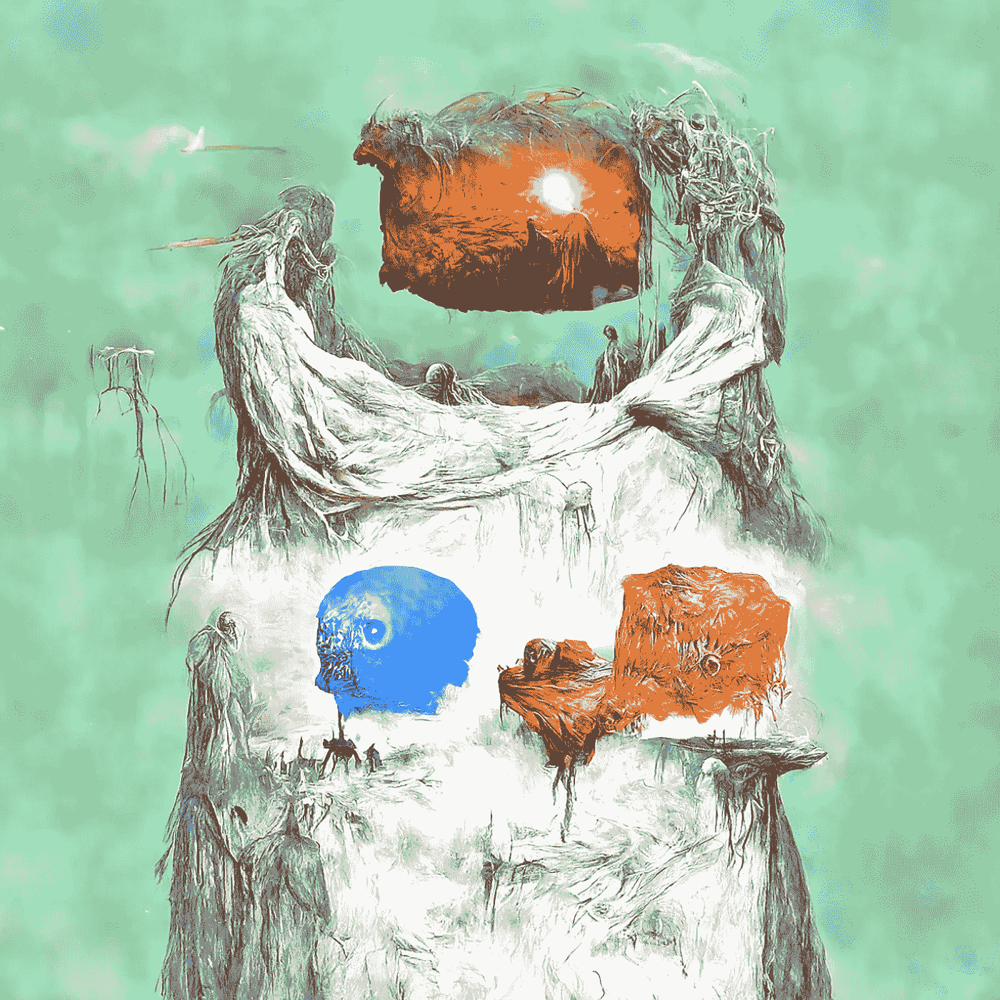
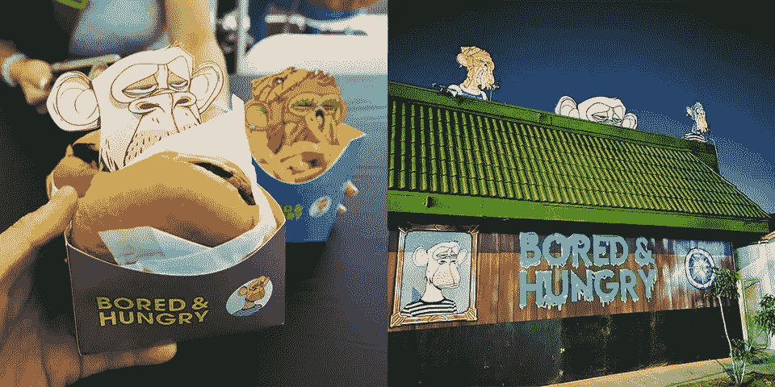
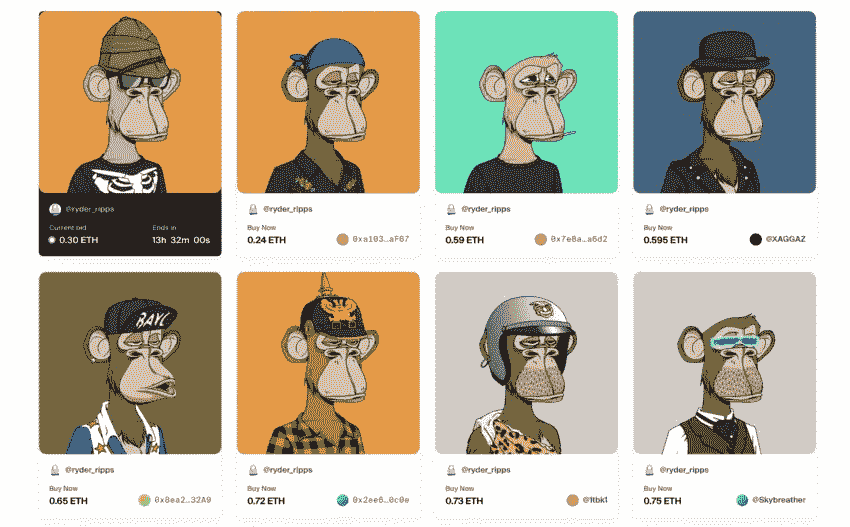

# NFT 知识产权承诺的落空

> 原文：<https://medium.com/coinmonks/the-failed-promise-of-nft-ip-rights-b65737f947b?source=collection_archive---------1----------------------->

当我第一次遇到 AI Moonbirds 系列并看到我的鸟的 AI 版本时，我留下了许多问题。

难道我没有这张照片的版权吗？其他人如何能够出售我的鸟的衍生产品并赚取版税？

从那以后，许多月鸟衍生产品上市了。最初的“知识产权”被用于这些衍生产品集合，而 OG Moonbird NFT 的持有人从未见过一分钱。

在 Moonbirds 迁移到 CC0 之后，有一个关于 NFTs 和 IP 所有权的基本前提的新讨论，

让我解释一下:

自《无聊的猿》于 2021 年初推出以来，知识产权所有权被标榜为 NFT 所有权的价值主张之一。俗话说，“拥有猿猴，就拥有了 IP。”许多人选择将昂贵的 JPEGs 图片用于商业活动。一些人开办了像“无聊饥饿汉堡店”这样的餐馆。其他人如赛斯·格林计划在未来的电视连续剧中使用他的无聊猿。

未来的 NFT 收藏遵循无聊猿的模式，将知识产权的所有权延伸到购买的人。然而，在今年的过程中，我们看到许多收藏开始放弃知识产权主张，走 CC0 路线，其中 Moonbirds 是最值得注意的收藏。

CC0 允许受版权保护的内容的创作者和所有者放弃这些权利，从而将作品置于公共领域。这将允许任何人出于任何目的自由使用作品，而不受版权法的限制。

虽然向 CC0 的转移经常被框定为利他主义的举动，以更好地与 Web 3 的去中心化理想保持一致，但我怀疑这里有更多的作用。我认为，首先，我们可能都被一个错误的承诺骗了。这在本质上并无恶意，毕竟，如果你能拥有可验证的数字资产的知识产权，这似乎是一个理性的推论。然而，从法律角度来看，尤其是在全球范围内，强制执行 NFT JPEG 格式的知识产权完全是另一回事，而且可能非常困难。

RR BAYC 的故事与此相关。赖德·瑞普斯推出了一套 NFT 的一模一样的 BAYC 复制品，作为对明显带有种族主义色彩的无聊猿类收藏品的讽刺和抗议。虽然宇迦实验室能够以商标保护为由拿下这些藏品，但一场正在进行的法律战有可能在这里开创先例。

当 NFT 被改变用途和重用时会发生什么？
NFT 是否可以以讽刺和抗议为目的进行复制？
这里适用合理使用吗？

事实是，像 AI 和 3D Moonbirds 这样的衍生产品系列在迁移到 CC0 之前就已经很流行了。很可能组织不想处理强制执行知识产权的头痛问题，将这些集合放在公共领域只是一个更优雅的解决方案。

时间会证明一切。

感谢您的阅读。

看看我在推特上未经过滤的想法:

[https://twitter.com/wasifmrahman](https://twitter.com/wasifmrahman)

在 LinkedIn 上关注我的职业生涯:

【https://www.linkedin.com/in/wasifmrahman/ 号

我对媒体的另一个想法是:

 [## 瓦西夫·拉赫曼-中等

### 阅读瓦西夫·M·拉赫曼在媒介上的作品。拉面鉴赏家 Gala Games 的 Web 3 营销高级经理。每…

medium.com](/@wasifmrahman) 

> 加入 Coinmonks [电报频道](https://t.me/coincodecap)和 [Youtube 频道](https://www.youtube.com/c/coinmonks/videos)了解加密交易和投资

# 另外，阅读

*   [如何在 Uniswap 上交换加密？](https://coincodecap.com/swap-crypto-on-uniswap) | [A-Ads 评论](https://coincodecap.com/a-ads-review)
*   [WazirX vs CoinDCX vs bit bns](/coinmonks/wazirx-vs-coindcx-vs-bitbns-149f4f19a2f1)|[block fi vs coin loan vs Nexo](/coinmonks/blockfi-vs-coinloan-vs-nexo-cb624635230d)
*   [本地比特币审核](/coinmonks/localbitcoins-review-6cc001c6ed56) | [加密货币储蓄账户](https://coincodecap.com/cryptocurrency-savings-accounts)
*   [什么是保证金交易](https://coincodecap.com/margin-trading) | [美元成本平均法](https://coincodecap.com/dca)
*   [支持卡审核](https://coincodecap.com/uphold-card-review) | [信任钱包 vs 元掩码](https://coincodecap.com/trust-wallet-vs-metamask)