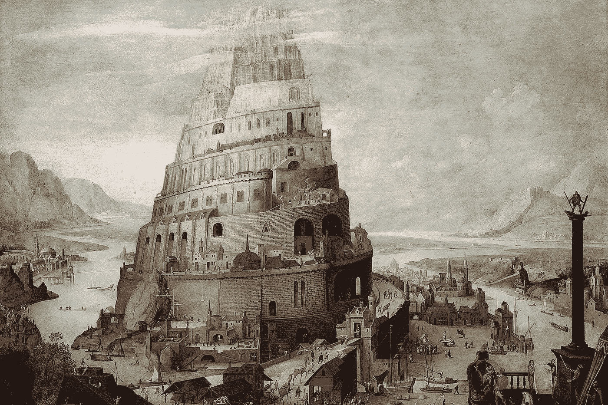
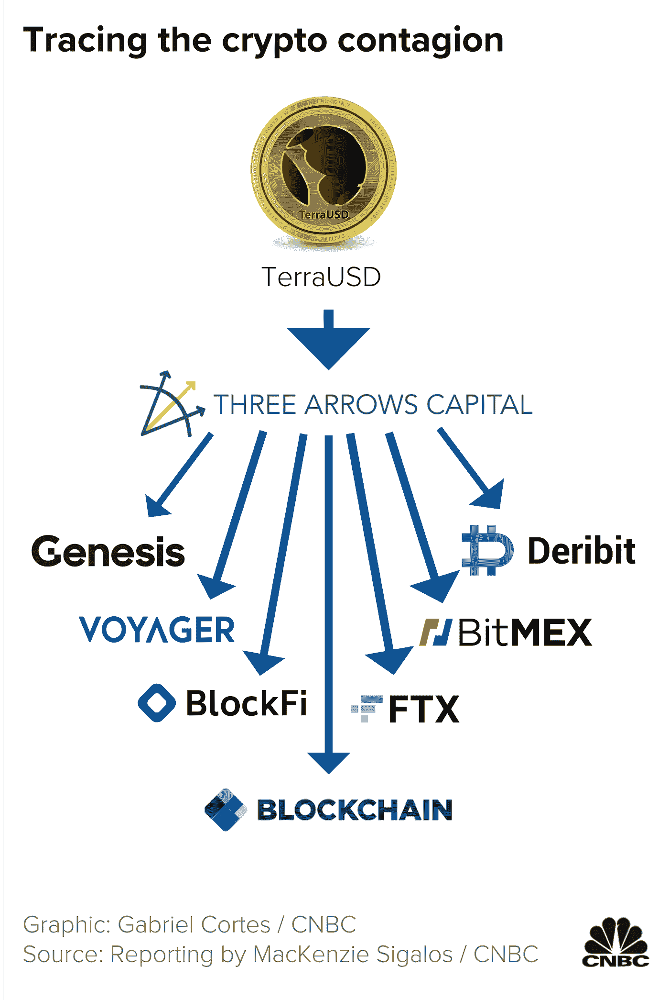
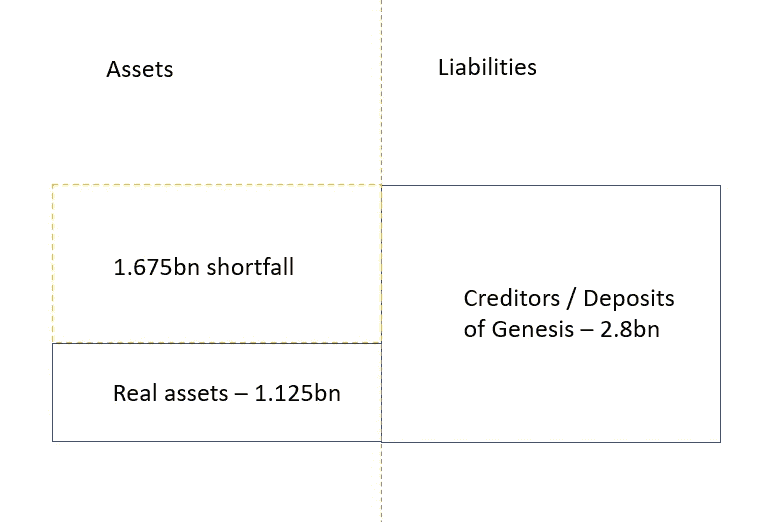
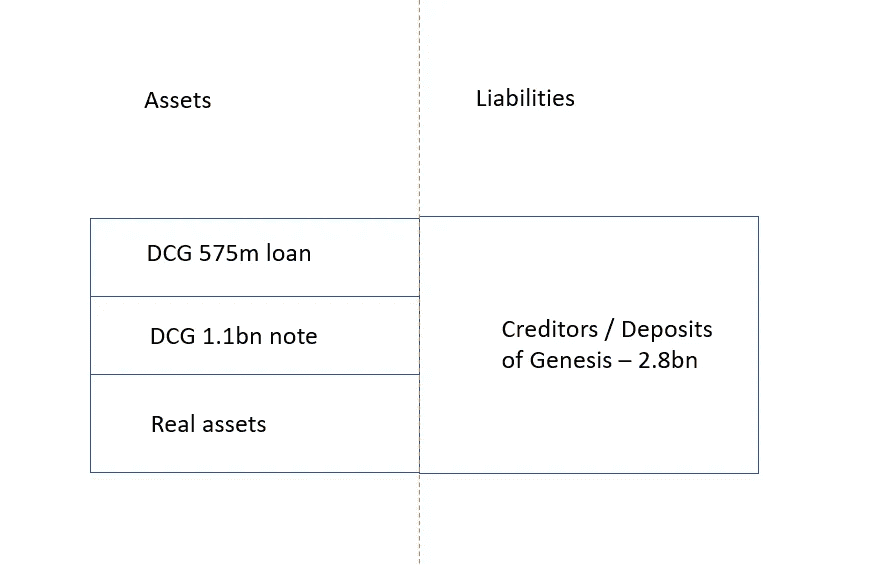
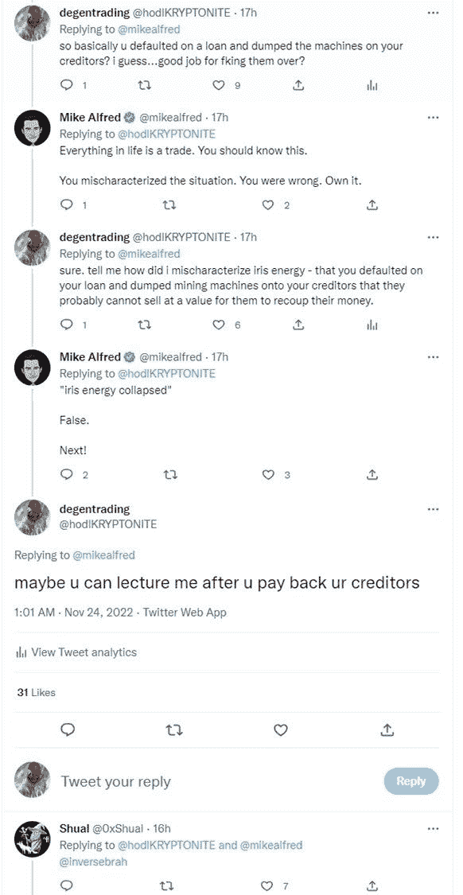
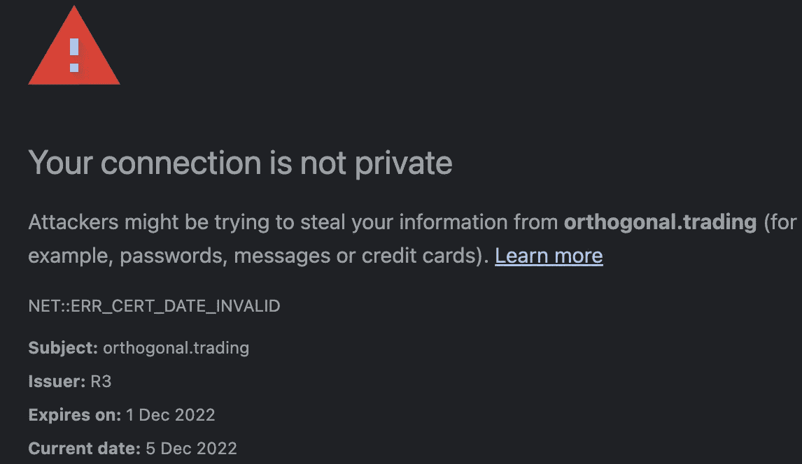

# 巴别塔的陷落——创世纪第 11 章

> 原文：<https://medium.com/coinmonks/the-fall-of-babel-genesis-chapter-11-a43387dd7a9e?source=collection_archive---------26----------------------->

Tower of Babel — Genesis Chapter 11

> “他们的罪不在于建造一条通往天堂的路，而在于他们渴望把上帝降低到他们的水平”——埃文·明顿

我通常不接受迷信，也不过度虔诚。

然而，创世纪的诗意经历第 11 章备案并没有失去我。一点也不。

老实说，我更担心圣经主义。

所以，既然《圣经》规定这是巴别塔倒塌的时刻，我也不妨探索一下这个想法是否有任何成果。

和往常一样，不幸的是…有很多水果。

*卡进去之前，我必须插上*[*@ hodlKRYPTONITE*](https://twitter.com/hodlKRYPTONITE)*。信息丰富的作家，也是本文大部分内容的灵感来源。查看他的子堆栈(链接在他的 twitter 简历中)！*

**创世纪的问题。**

非常简单。

— LUNA 和 TerraUSD 是市值排名前 10 的加密生态系统，在今年早些时候的五月大屠杀中基本上跌至 0 美元。

—三箭资本，在此之前在 LUNA 生态系统和其他项目/DeFi 仪器中借款数十亿。

—他们不仅被指控“没有对冲任何东西”，而且在 Luna 倒闭后，他们还蒸发了债权人的数十亿资金。

—当追加保证金通知到来，3AC 申请破产时，Genesis 意识到他们借给三箭资本的 20 亿美元贷款不再是他们账面上的资产。

他们并不孤单。

Voyager, BlockFi and FTX are already ‘at least’ bankrupt. FTX was a shitshow.

他们需要时间和清白的记录。你看，创世纪扮演了一个伪银行的角色。

并披露:

A)含苏打的资产负债表。
B)应付账款负债大于你的资产。在恐慌的气氛中，A 或 B(更别说两者都是)这些都是银行挤兑的自杀呼吁。

因此，Genesis 跑到他们的母公司 DCG，模仿 08 年的巴克莱银行。

DCG 向 Genesis 申请了 11 亿美元的贷款(后来申请了 5.75 亿美元)*。然后他们“归还”了这笔钱(11 亿美元)，实质上使资产负债表变成这样:

Prior to DCG loan.

**对此:**

Post DCG loan.

这 11 亿美元从未动过，创世纪转移的是**负债、** **而不是** **流动性**。鉴于 DCG 从未偿还创世纪，一切都没有改变。

总的来说，这种会计伎俩让创世纪得以浮上水面，同时给 DCG 的资产负债表泼了一点泥。

*这样问题就解决了对吗？*

*** DCG 的问题**

显然不是，DCG 看起来有流动性问题。

事实上，鉴于 DCG 不得不从 Genesis 获得 5.75 亿美元的贷款来回购股票，我们可以猜测他们手头没有多少现金。

**他们在干什么？**

没有线索，我看到一些猜测，他们正在购买蘸。

然而，尽管前景黯淡，DCG 确实拥有大量 GBTC(BTC 信托公司的股票)。

因此，让我们检查一下他们的选择，因为记住…有一个 16-20 亿美元的漏洞要填补。

1.  筹集资金(17 亿美元)
2.  出售灰度业务
3.  出售 GBTC
4.  解开 GBTC 出售他们的 BTC

**寻址选项**

1.  后 FTX 时代……我怀疑任何首席信息官都不愿意决定筹集资金来填补这个漏洞。假设这笔钱是可以得到的，那么它会带来严重的职业风险。
2.  灰度业务可以卖出相当大一部分差额，但再次购买这是职业风险。据我所知，目前灰度值估计在 10 亿美元左右。这还不够。
3.  出售 DCG 在 GBTC 的个人股份。这可能会超过几亿。下滑和 GBTC 对 BTC 的折价可能会惹恼 DCG，而且这还不足以独自填补漏洞。可能是这个和 1 的某种组合？
4.  不要让我开始…

**数字 4**

它需要自己的部分。

想象一下 GBTC 对 633K BTC 的平仓。
一气呵成。

这是 DCG 合法地将他们的 GBTC 作为 BTC 出售，并规避高滑点和资产净值折扣的唯一方法。

老实说，633k BTC 同时上市会很恐怖。

这在什么时候清楚？

**$8k？**
也许 **$12k？**

我们正在讨论的举措可能会让市场暴跌 50%……你知道这意味着什么。

**巴别塔坠落。**

——迈克尔·塞勒(Michael Saylor)的微观策略在 1.2 万美元时获得了追加保证金通知(上次我是这么检查的)。并被迫在市场上抛售更多的 BTC，以履行自己的义务。

—矿工被彻底消灭。当前的环境足以见证巨擘 Iris Energy 在 1.08 亿美元的贷款上违约，让债权人以二手图形处理器作为抵押。

这是在**$ 16–18k**。

最搞笑的是他们的 CEO 迈克·阿尔弗雷德随后发来的推文。

无论发生什么，我们都可能会看到更多 CeFi 违约。

**更新/编辑:两个小 CeFi 相关默认。**

最近有消息称，奥罗斯在近 3 周前错过了一笔 2000wETH 和 750 万 USDC 的付款。他们还从 Maple Finance 等贷款机构获得了更多的贷款，然后才披露困境(bahaha)。

今天，Orthogonal Trading 还错过了一笔 1000 万美元的付款(12 月 5 日，枫叶金融也是如此)。

更有趣的是，他们的网站证书在违约前 4 天就过期了。

Can’t make this shit up.

我可能会继续编辑这篇文章的默认更新，他们是相当愚蠢的。

无论如何，保持流动的朋友和基督 ***，如果他们不是你的钥匙，那么他们不是你的硬币！***

> *交易新手？试试* [*密码交易机器人*](/coinmonks/crypto-trading-bot-c2ffce8acb2a) *或* [*复制交易*](/coinmonks/top-10-crypto-copy-trading-platforms-for-beginners-d0c37c7d698c)
> 
> *加入 Coinmonks* [*电报频道*](https://t.me/coincodecap)*[*Youtube 频道*](https://www.youtube.com/c/coinmonks/videos) *获取每日* [*加密新闻*](http://coincodecap.com/)*

# *另外，阅读*

*   *[复制交易](/coinmonks/top-10-crypto-copy-trading-platforms-for-beginners-d0c37c7d698c) | [加密税务软件](/coinmonks/crypto-tax-software-ed4b4810e338)*
*   *[网格交易](https://coincodecap.com/grid-trading) | [加密硬件钱包](/coinmonks/the-best-cryptocurrency-hardware-wallets-of-2020-e28b1c124069)*
*   *[密码电报信号](/coinmonks/top-3-telegram-channels-for-crypto-traders-in-2021-8385f4411ff4) | [密码交易机器人](/coinmonks/crypto-trading-bot-c2ffce8acb2a)*
*   *[最佳加密交易所](/coinmonks/crypto-exchange-dd2f9d6f3769) | [印度最佳加密交易所](/coinmonks/bitcoin-exchange-in-india-7f1fe79715c9)*
*   *面向开发人员的最佳加密 API*