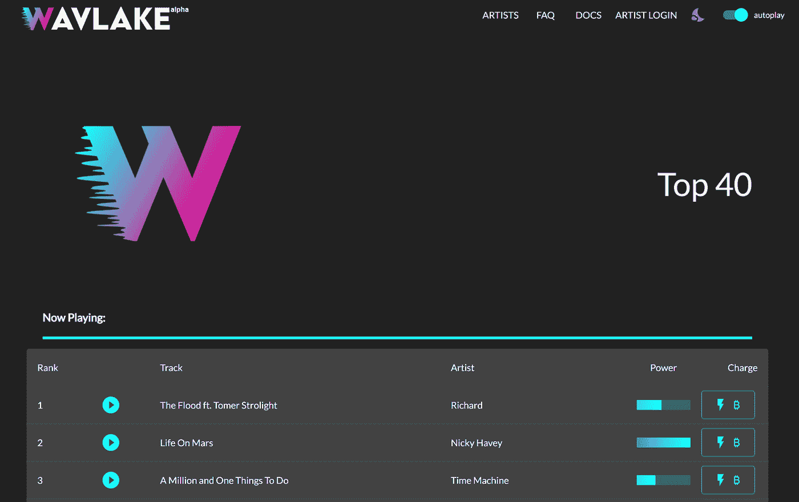
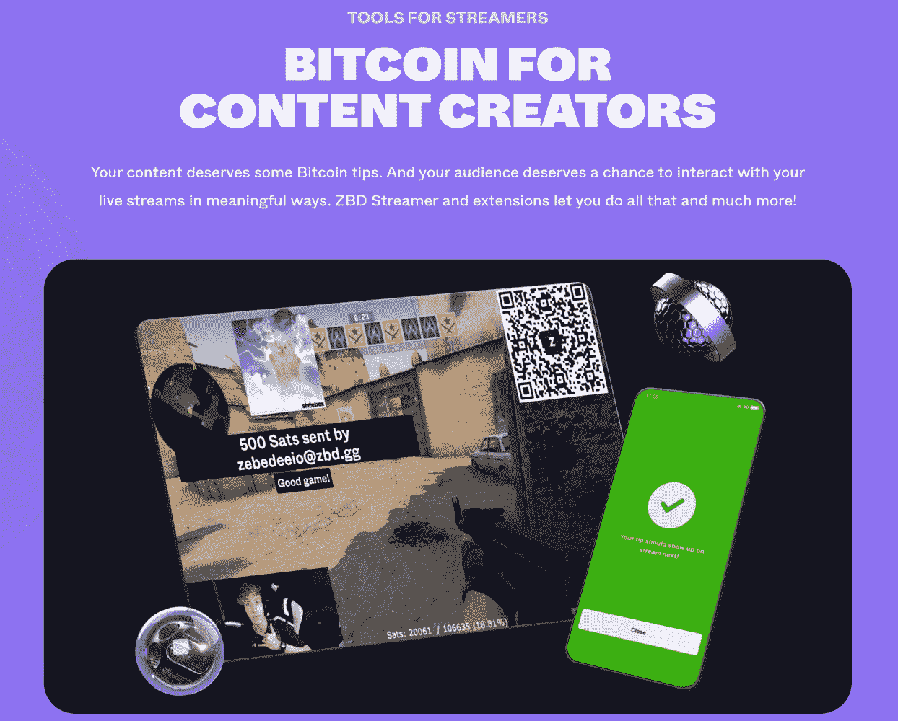

# 闪电网络开发和采用的迷人世界。

> 原文：<https://medium.com/coinmonks/the-fascinating-world-of-lightning-networks-development-adoption-3909fafd6f5a?source=collection_archive---------2----------------------->

pixabay

# 介绍

在过去的一两年里，比特币的闪电网络是加密行业最受关注的发展之一。

闪电网络是建立在比特币网络之上的第二层扩展解决方案。它与 Visa 和 Mastercard 等公司目前使用的结算系统有相似之处。当你为某件事付款时，它不会立即结算。取而代之的是，对买家的资金和卖家的请求进行快速核实——为交易的发生开绿灯。资金的实际结算发生在稍后——在某些情况下，几天或几周之后。

闪电网络由处理支付的节点网络运行，交易通常使用 QR 码进行。它能够以几分之一便士的价格瞬间完成数十万甚至数百万笔交易。

为了了解 Lightning 网络背后的技术、其当前面临的挑战以及如何克服这些挑战以扩展到全球数十亿用户，请考虑阅读:

 [## 闪电网络——比特币升级解决方案背后的技术

### 介绍

medium.com](/coinmonks/the-lightning-network-technology-behind-bitcoins-scaling-solution-915c07455ca8) 

在本文中，我们将分析闪电网络的采用率。

# 世界正变得无现金和数字化

datareportal.com

闪电网络的发展恰逢其时。

根据麦肯锡全球支付报告，2020 年全球现金支付下降了 16%，消费者的支付行为发生了重大转变:现金使用量下降，从店内转移到在线商务，以及采用即时数字支付。

此外，一些国家正在积极禁止现金支付。以色列宣布，从 8 月 1 日起，将禁止 4 400 美元以上的现金交易和 1 760 美元以上的商业交易(或涉及同等数额谢克尔的交易)。

世界本身正在数字化。根据 2022 年的最新统计数据(《我们的数据世界》),全球 66.2%的人口正在使用互联网，自 2000 年以来增长了 1355%。

社交媒体用户约有 44.8 亿，自 2016 年以来几乎翻了一番。全球至少有 45%的人每天观看一个小时或以上的在线内容。

# 闪电网络——总的潜在市场

闪电网络允许系统内参与者之间几乎即时的交易，费用可以忽略不计。

例如，跨境支付，如汇款，几乎是免费的，并且通过闪电即时支付。商家有一个很好的理由来采用 Lightning:它像刷信用卡一样快，而且费用很少。

这是雷电网络可用作解决方案的两个最实际的使用案例。因此，让我们考虑一下全球汇款市场的规模以及全球信用卡支出。

## **汇款市场**

Research and Markets, Dec 2021

汇款是指外国移民通过电子支付方式跨境向他人汇款。此外，大多数汇款服务提供商都将重点放在数字汇款上，以增强其业务，并为客户提供更方便、更快捷的转账服务。

根据研究和市场，预计 2025 年全球汇款流入量将达到 7451 亿美元，2021-2025 年期间的 CAGR 增长率为 1.20%。

## **全球刷卡消费**

RBR 的全球支付卡数据和预测称，全球支付卡支出将以平均每年 10%的速度增长，到 2023 年将达到 45.2 万亿美元。

RBR Global Payment Cards Data & Forecasting to 2025

中国银联在全球采购量上一直领先，在全球用卡支出中份额最大，占市场总份额的 45%。

然而，尽管随着互联网的发展，技术以指数速度发展，支付和汇款并没有以提高效率和降低成本的形式从这种进步中受益，特别是在国际一级。世界在技术上联系在一起，但在金融上没有联系。

尽管 Lightning 网络自 2018 年起才投入使用，但随着人们意识到它相对于现有系统的优势，我们已经看到了世界各地使用的爆炸式增长。

# 当前支付网络的缺点

## **费用**

平均卡处理费从每笔交易的 1.4%到 3.5%不等，尽管最终的百分比取决于许多因素，如使用的卡类型和企业的商户类别代码。除了支付处理费，这些费用还包括交换费和评估费。

对于国际支付，发送跨境支付的平均成本为 10.94%(世界银行，2022 年 3 月)。这些费用包括 SWIFT 费用、交易费用和外币兑换费用。

即使使用汇款组织(MTO ),如 WesternUnion 或 Moneygram，费用也不会好到哪里去。

World Bank — Remittance Prices Worldwide, 2022

根据世界银行的最新数据，Q1 2022 年 MTO 的全球平均每笔交易汇款支付成本为 6.44%，纯数字 MTO 为 3.73%。

司法管辖区越小、越偏僻，汇款成本就越高，例如，撒哈拉以南非洲地区仍然是汇款成本最高的地区，2022 年第一季度汇款 200 美元的平均成本为 7.84%。

然而，使用闪电网络的单笔交易成本约为 Satoshi，或 0.0002 美元，无论你在世界的哪个角落。

## **速度**

支付面临的最大挑战之一是结算需要多长时间。一笔普通的信用卡交易需要 2-3 天才能完成。

对于跨境支付，通常需要 3-5 个工作日才能清算，但在某些司法管辖区可能需要 10 天。

闪电网络交易的结算时间以秒计，甚至可能以毫秒计。

## **缺乏无障碍**

Arcane Research

许多人无法使用用于跨境支付的代理银行网络或汇款运营商，这些解决方案在发展中国家尤其不可用。根据世界银行的全球 Findex 数据，估计全球有超过 17 亿成年人没有银行账户。

bis.org

过去十年中，代理行数量的稳步下降表明，大多数银行无法承受促进跨境支付的高额固定成本，因此关闭，影响了最需要的人的可及性。

由于 Lightning 网络完全是数字化的，交易可以在智能手机上完成，因此根据 Statista 的数据，全球 83.72%的人口都拥有智能手机。

例如，摩洛哥和越南的无银行账户人口分别达到惊人的 71%和 69%(根据 Statista)，然而摩洛哥的智能手机用户比例为 75.7% (ANRT，2019 年)，越南为 73.5% (MIC，2022 年)。

# 闪电网络在行动

让我们看看这位美国消费者新闻与商业频道记者如何在几秒钟内通过闪电网络将比特币从迈阿密发送到波兰的一名乌克兰人手中:

YouTube/Wheatstones — CNBC

# 闪电网络的发展和采用

闪电网络已经有了显著的采用。

最近，闪电网络创下了 4427 比特币(1.02 亿美元)容量里程碑的新纪录，这意味着价值 1.02 亿美元的点对点支付已经准备就绪。

Glassnode.com

为了让闪电网络与主要的支付网络竞争，它必须有类似的能力。例如，2021 年 VISA 的支付量为 10.4 万亿美元。目前，由于锁定了超过 4，400 个 BTC，Lightning 仅能够通过其网络处理超过 1.02 亿美元的交易，这与 VISA 等主要网络相比微不足道。

然而，由于公司和项目的整个生态系统，使用正在迅速增长。仅去年一年，闪电网络的总容量就增加了 130%，自 2018 年 7 月以来增加了 5，900%以上。

Arcane Research

来自 Arcane Research 的数据表明，有权使用闪电支付的用户数量出现了大幅增长。据估计，2021 年 8 月，全球只有约 15 万用户可以使用闪电支付，到 2022 年 3 月，这一数字已增长到 8000 多万。

此外，闪电网络中的大多数交易都被用于真正的经济价值，如支付商品和服务以及个人之间的转账。

Arcane Research

此外，闪电网络的支付量(不包括任何交易、存款和取款)一直在上升。

Arcane Research

通过使用实际交易数据来评估 Lightning 网络的使用情况，我们观察到采用率正在快速上升，以美元计算的支付金额增长了约 480%。

随着越来越多的节点上线，闪电网络的效率提高，流动性增加，更多的产品和服务将建立在它的基础上。随着越来越多的产品和服务的出现，越来越多的用户加入到网络中来。让我们考虑一些在 Lightning 网络上开发的用户友好的应用程序。

# 闪电网络生态系统

Arcane Research

# 闪电网络生态系统—新银行

Neobanks 是数字金融科技公司，利用比特币的闪电网络来发送和接收常规法定货币。这些新银行还让用户可以选择用比特币和法定货币持有资金。本质上，这意味着用户可以通过闪电网络发送和接收法定货币，而不必“看到”比特币。这将立即完成，几乎是免费的。

## **Bottlepay —英国和欧盟**

Bottlepay.com

Bottlepay 于 2021 年推出，是一款基于英国的支付应用程序，允许用户通过闪电网络交易比特币、英镑和欧元。用户可以在欧洲和英国之间免费汇款和收款。此外，Bottlepay 的新应用程序还可以通过 Twitter、Reddit 和 Discord 等平台上的一条推文、消息或社交媒体帖子实现无缝社交支付。

## **Strike App——即将登陆 200 多个国家**

strike.me

由杰克·马勒斯(Jack Mallers)创立的 Strike 是一家总部位于美国的金融科技公司，它允许用户在任何地方即时收发资金，费用可以忽略不计。为了获得好处，消费者和商家甚至不需要接触比特币，因为 Strike 使用闪电网络促进了价值结算。

Strike 最近与电子商务巨头 Shopify 的全球商家网络整合，允许通过比特币闪电网络进行支付——对于那些想要加入的商家来说。使用 Strike，商家将能够通过低成本的支付处理节省开支。

Strike 还与全球最大的销售点供应商 NCR 和支付公司 Blackhawk 合作。

## **现金应用—美国**

altcoinbuzz.io

Cash App 是 2013 年推出的移动支付服务，由杰克·多西旗下的 Block(原名 Square)开发。Cash App 宣布在 2022 年 2 月为其 4000 多万用户整合闪电网络支付。该公司还宣布，现金应用程序用户可以选择用比特币支付。拥有 Cash App 卡的用户可以收到一部分比特币形式的定期支票存款，无需交易费。

## **比特诺布—非洲**

bitnob.com

Bitnob 是一家尼日利亚初创公司，为非洲个人和企业提供比特币支付解决方案。Bitnob 的使命是让每一个非洲人和非洲企业都能轻松连接到比特币区块链。

Bitnob 是一款简单的比特币应用，捆绑了低至 1 美元的比特币储蓄、比特币贷款、比特币支付和虚拟卡等服务。凭借直观的设计，这使得它很容易导航，特别是对于初学者。

## **Bipa —巴西**

bipa.app

Bipa 是第一个集成闪电网络的巴西应用程序。它允许用户以光速创建和支付发票。

# 闪电网络生态系统——支付基础设施

基础设施服务提供商的增长，如为商家和企业实现闪电集成的专业支付解决方案，使用户使用闪电网络和企业将闪电集成到其产品和服务变得更加简单。

以下是一些最著名的基础设施解决方案:

## **Openode**

opennode.com

使用 OpenNode，商家可以选择自动转换接收当地货币，并始终获得即时(闪电网络)最终结算。企业可以接受比特币，并接收比特币或欧元、英镑、美元等当地货币。

## **硬币角**

coincorner.com

比特币金融科技公司成立于 2014 年，它使人们有可能使用名为“Bolt”的实体卡在个人、网站或手机上通过闪电支付。CoinCorner 也为企业提供支付解决方案。

## **野山羊**

ibexmercado.com

IBEX 成立于 2019 年，是比特币闪电网络的基础设施提供商，提供:

*   IBEX Pay——任何企业通过闪电网络接收即时比特币支付的最简单快捷的方式；
*   IBEX Hub——为您现有的平台增加闪电的力量。

2022 年 6 月，IBEX 在迈阿密接纳了 85 家新企业，使它们能够通过闪电接受比特币。

# 闪电网络生态系统——比特币银行

## **Galoy**

galoy.io

Galoy 提供比特币银行基础设施解决方案。该团队由遍布 10 个国家的世界级软件开发人员、教育工作者、设计人员和数据科学家组成，开发并支持开源软件，让任何类型和规模的社区都能像比特币银行一样自我组织。

最近 Galoy 宣布了“stablesats”，这是 stablecoins 或菲亚特银行整合的替代方案。Stablesats 利用衍生品合约创造一种比特币支持的合成美元，与美元挂钩。这使得人们可以在闪电上使用比特币进行日常支付，而不会受到短期汇率波动的影响。

# 闪电网络生态系统——钱包

Wheatstones

闪电钱包是连接到闪电网络的软件解决方案，允许用户通过闪电网络存储、发送和接收 BTC。

Lightning wallets 作为 iOS 和 Android 的移动应用程序提供，可以让你发送和接收闪电支付。通常，这些都是保管或非保管钱包，侧重于简单性和最佳用户体验。

**保管** —不提供钥匙完全控制权的钱包应用

**非保管型** —钱包应用程序，提供钥匙的完全保管

一些最受欢迎的钱包是 BlueWallet、Simple Bitcoin Wallet、Muun、Satoshi 的 Wallet，这些钱包仅在 Google app store 上就有 100k+的下载量，还有下载量超过 500k+的 Electrum wallet。

# 闪电网络生态系统——P2P 市场

## **Paxful**

knowyourmobile.com

点对点数字资产市场 Paxful 整合了闪电网络。全球整合将为超过 700 万 Paxful 用户提供服务，允许他们以低得多的费用在几秒钟内转移比特币。这项服务将可用于个人之间的交易以及支付商品和服务的费用。

# 闪电网络生态系统—流媒体、应用、播客、游戏

## **喷泉应用——播客**

bitcoinmagazine.com

Fountain 于 2021 年推出，是一个面向创作者和消费者的播客平台，因听众和播客为平台带来的价值而奖励他们。所有的交易都是通过闪电网络完成的。

## **Wavlake —音乐流媒体**

wavlake.com

Wavlake 成立于 2021 年 7 月，是一个音乐流媒体平台，整合了比特币的闪电网络，旨在通过“直接资助模式”培育围绕音乐的社区。这对音乐人和音乐粉丝来说意味着，在直播期间，粉丝可以直接向音乐人发送提示，或者在 Wavlake 试图做的事情中，在艺术家跟踪的流媒体上发送提示。

## **Shocknet —闪电网络应用**

shockwallet.app

一个无权限的 Lightning WebApps 的框架，比如 Lightning Video。

## **分散的社交媒体消息传递**

Wheatstones.com

社交媒体消息应用是端到端加密、洋葱路由、抗审查、点对点消息和支付。他们实际上通过闪电网络发送数据(文本或视频流)以及支付。端到端的加密聊天消息可以使用 Lightning 网络发送，无需中央服务器，这意味着用户可以控制自己的数据，而无需以可解释的方式存储在中介处。

## **西庇太——闪电游戏**

zebedee.io

Zebedee 成立于 2019 年，是开发人员将实时比特币交易集成到游戏中的基础设施，也是游戏玩家需要与系统交互的工具，该系统运行在比特币的闪电网络上。2021 年，西庇太已经为其技术的发展筹集了 1150 万美元。

有了 Zebedee，由于费用极低，低至 0.0005 美元的纳米交易在技术上是可能的，在经济上也是可行的。随着数字经济的兴起和比特币提供的新金融范式，游戏开发商有机会将互联网货币融入他们的游戏，作为一种新的货币化方法。

例如，《反恐精英:全球攻势》(CS:GO)的玩家使用 Zebedee Infuse 和 Zebedee Wallet 在世界上最受欢迎的网络游戏之一中争夺比特币。它还证明了在所有类型的游戏中更广泛地集成 Zebedee 的产品的可行性，因为许多开发者现在都在集成 Zebedee 的 API。

Zebedee 在 Google Play 商店的下载量超过了 10 万次。

# 闪电网络生态系统—第 3 层

**不渗透浏览器**

impervious.ai

不可渗透的 API 是一个编程层，位于比特币闪电网络的顶部，即“第 3 层”。开发人员可以利用不受影响的 API 轻松地将安全的 p2p 数据传输和支付构建到他们的应用程序和服务中。

通过将 Lightning、分散标识符(did)、IPFS 等技术结合到一个熟悉的应用程序中，不受影响的浏览器能够提供一整套易于使用的 P2P 功能，例如:

*   浏览器和 DIDs 之间的 P2P 通信和安全的 P2P 文件传输。
*   P2P 音频和视频通话
*   一个匿名、可公开访问、分散的数据存储
*   创建付费播放链接，提示同行完成密钥交换或闪电发票，以查看优质内容

## **RGB**

Bitcoin reddit

也有一些项目试图以安全和负责任的方式将富有表现力的智能合约功能带回比特币。RGB 就是这样一个项目。

RGB 是基于彼得·托德的研究，并由贾科莫·祖科在 2016 年设想为比特币和闪电网络的更好的资产协议。这些想法的进一步发展导致 Maxim Orlovsky 博士将 RGB 开发成一个成熟的智能合同系统，他自 2019 年以来一直在社区参与下领导其实施。

RGB 作为一组开源协议，允许我们以可扩展和保密的方式执行复杂的智能合同。借助 RGB，可以创建复杂高效的智能合同系统。

# 闪电网络——原生赚取比特币收益

闪电网络允许比特币持有者产生被动收入，同时保持托管，没有任何交易对手风险，使比特币成为一种生产性资产。

其中一种方式是路由费，即节点运营商因转发支付而赚取的费用。据 Messari 称，今年上半年，排名前 100 位的节点在 Lightning Network 上的路由交易平均年利率为 2.5%，6 月份为 4%。

*messari.io*

考虑到公共/私人公司和政府持有超过 100 亿美元的比特币，其中大部分被闲置在冷库中，机构很可能会利用其低风险收益率。这可以促进进一步的机构采纳，特别是自从贝莱德最近与比特币基地合作以来，这将允许贝莱德的客户，如养老基金和主权财富基金，直接投资比特币。

闪电网络通过这种方式建立了一个计算比特币无风险利率的框架，这是比特币发展成熟资本市场并有可能达到储备货币地位的必要步骤。

# 摘要

*explorer.acinq.co*

闪电自 2018 年开始运营，用户和流动性迅速增长。随着闪电网络采用率的提高，节点和流动性设置将变得更加简化。这将允许为这些用户提供解决方案的提供商更好地利用规模经济。

围绕比特币和闪电网络的热情主要是因为它可以给世界带来根本性的改善，例如为超过 10 亿没有银行账户或银行服务不足的个人提供即时、抗审查、几乎免费的支付。

如果比特币和闪电网络能够加速金融包容性，长期效应的潜力是难以忽视的。

*免责声明:本文包含的信息仅用于教育目的，并不构成 Wheatstones 的任何形式的建议或推荐，用户在做出(或避免做出)任何投资决定时也不打算依赖这些信息。*

> *加入 Coinmonks* [*电报频道*](https://t.me/coincodecap) *和* [*Youtube 频道*](https://www.youtube.com/c/coinmonks/videos) *了解加密交易和投资*

# 另外，阅读

*   [3 商业评论](/coinmonks/3commas-review-an-excellent-crypto-trading-bot-2020-1313a58bec92) | [Pionex 评论](https://coincodecap.com/pionex-review-exchange-with-crypto-trading-bot) | [Coinrule 评论](/coinmonks/coinrule-review-2021-a-beginner-friendly-crypto-trading-bot-daf0504848ba)
*   [莱杰 vs n rave](/coinmonks/ledger-vs-ngrave-zero-7e40f0c1d694)|[莱杰 nano s vs x](/coinmonks/ledger-nano-s-vs-x-battery-hardware-price-storage-59a6663fe3b0) | [币安评论](/coinmonks/binance-review-ee10d3bf3b6e)
*   [加密交易机器人](/coinmonks/crypto-trading-bot-c2ffce8acb2a) | [Bingbon 评论](https://coincodecap.com/bingbon-review)
*   [Bybit Exchange 审查](/coinmonks/bybit-exchange-review-dbd570019b71) | [Bityard 审查](https://coincodecap.com/bityard-reivew) | [Jet-Bot 审查](https://coincodecap.com/jet-bot-review)
*   [3 commas vs Cryptohopper](/coinmonks/3commas-vs-pionex-vs-cryptohopper-best-crypto-bot-6a98d2baa203)|[赚取加密利息](/coinmonks/earn-crypto-interest-b10b810fdda3)