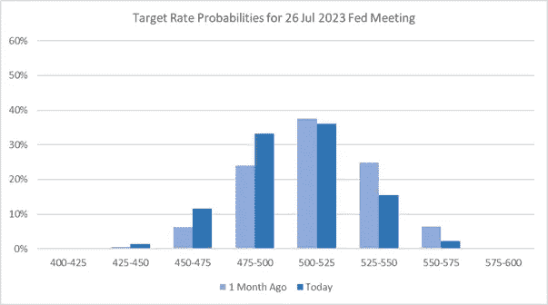
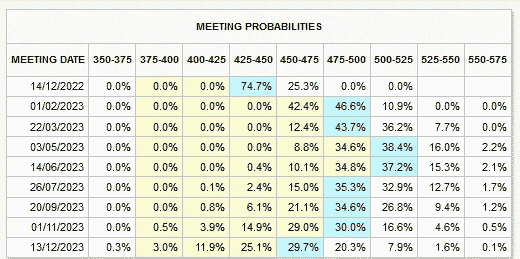
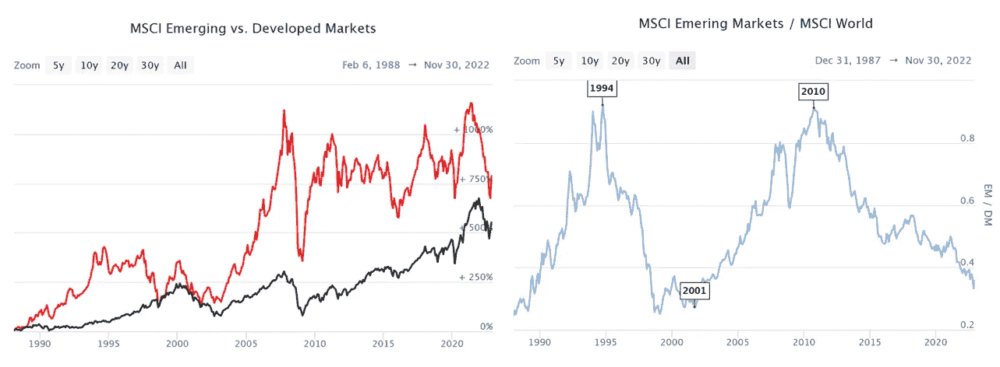
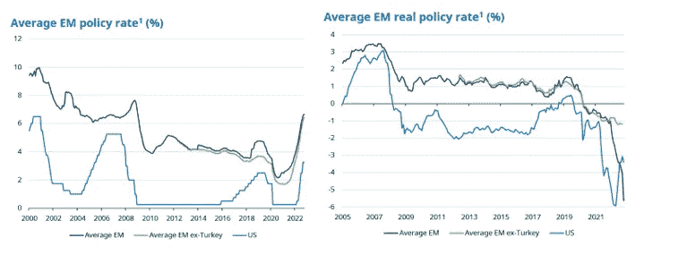
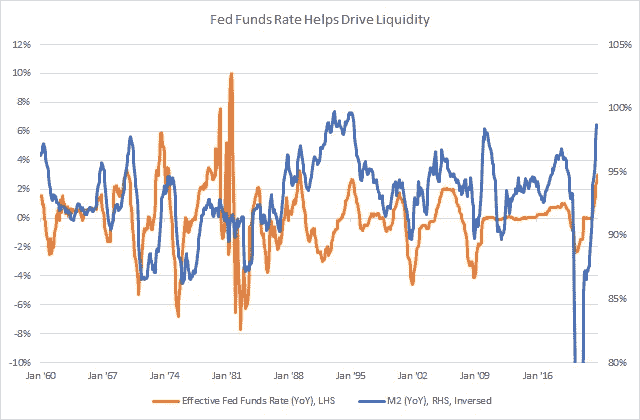
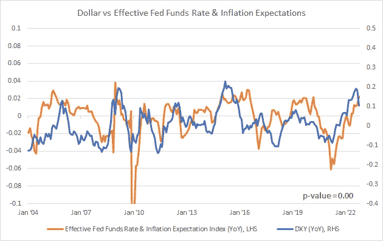
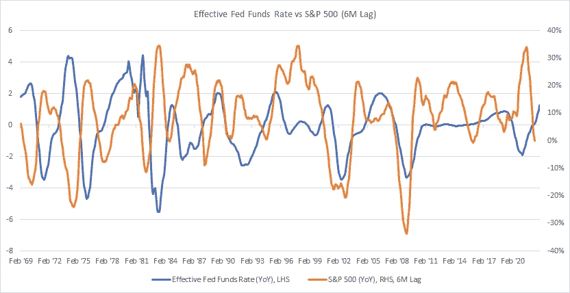
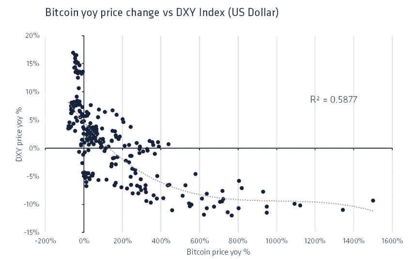
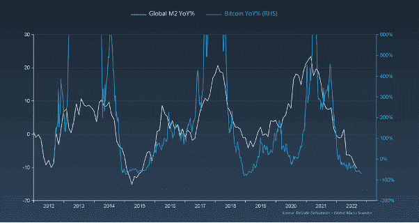
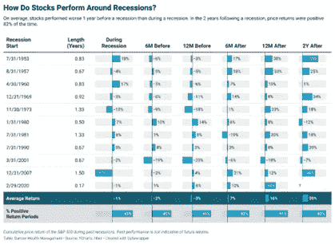

# 美联储正在放缓加息…那又怎样？

> 原文：<https://medium.com/coinmonks/the-fed-is-slowing-rate-hikes-so-what-92d0b2b6db7a?source=collection_archive---------7----------------------->

正如我们今年早些时候提到的，我们的长期观点是，美联储将继续以数据为导向，并将根据他们对通胀动态的预期积极调整前端利率。我们希望这意味着我们将软着陆，并能够避免“全面”衰退。美联储主席鲍威尔最近的鸽派评论强调了这一点，他指出未来加息步伐预计将放缓。

尽管缓慢加息并不等同于暂停或绝对降息，但它是这两种情况的重要前兆。根据联邦基金期货的最新数据，我们可以看到 5.25—5.5%的最终利率(即市场预期利率最终见顶的地方)的市场信念区间已经降低，对“上行”惊喜的预期已经减少。现在，4.75%至 5.00%和 5.00%至 5.25%的终端利率的概率几乎相等，即低 25 至 50 个基点。

Source CME FedWatch Tool, Data as of 05/12/2022

Source CME FedWatch Tool, Data as of 05/12/2022

就市场而言，参与者并不关心利率的绝对水平，而是更关心我们达到这些绝对水平的速度。这方面的一个例子(尽管过于简化)是 MSCI EM(新兴市场国家的代表性指数)与 MSCI World(发达市场国家的代表性指数)的比较。在这里，您可以看到，尽管 MSCI EM 的保单利率一直高于 MSCI DM，但这两个地区的表现却有所不同。

*摩根士丹利资本国际新兴市场与新兴市场的表现:*

Source: MSCI

*摩根士丹利资本国际新兴市场与发达市场政策利率:*

Source: Schroders, Datastream as of 31/10/2022

在这种程度上，较慢的加息速度通常对市场有利，尤其是“有风险”的股票。由于市场是前瞻性的，较慢的加息速度是暂停甚至降低利率的第一步。

较低的利率通常意味着基于传统贴现公式(想想 DCF)中较小分母的资产价格的增加，但这也意味着整体市场流动性的增加。从股票估值的角度来看，你几乎可以认为这是一个 E * P/E = P 的框架，在这个框架中，你既可以看到较低的折扣带来的收益增加，也可以看到流动性增加带来的 P/E 增加。

Source: FRED, data as of 06/12/222

此外，较低的利率也可能转化为较弱的美元…风险资产的另一个顺风。虽然确切的相关性正在激烈辩论中(任何交易过外汇的人都会告诉你)，但短期波动是可以看到的，其中一种下跌导致另一种下跌。最近，我们已经看到，由于市场预期加息将放缓，以及通胀预期的延续，美元走软。

Inflation Expectation defined by 5yr/5yr Forwards, Source: FRED, Bloomberg, data as of 06/12/2022

除了灾难性衰退(如 GFC)，所有这些因素通常会为风险市场的发展创造一个相当不错的环境。因为我们喜欢整数，6 个月通常是观察到的美联储行动和市场反应之间的时滞。

有趣的事实 COVID 引发的崩盘的确切底部是美联储宣布将降息并购买“支持市场平稳运行和货币政策有效传导至更广泛金融环境所需数量”的证券的那一天。你好流动性我的老朋友。

# 太好了…这对 crypto 来说意味着什么？

在所有随联邦基金利率变动的变量中，我们选择了美元(由 DXY 代表)和流动性(由 M2 代表)，因为这两个变量恰好也与加密资产的表现高度相关。与加密(以及许多其他以美元计价的“风险”资产)负相关最大的资产之一是美元，美元在 2022 年的持续走强是加密价格下行压力的驱动力之一。正如我们所知，美元(以及所有外汇表现)很难预测，因为它基本上是基于美国与全球利率，以及对美联储未来加息步伐的看法，通胀预期，全球出口动态等。正如我的前老板会说的，给我看一个说他们能预测外汇的人，我会给你看一个骗子。然而，如果过去的表现是可信的，在其他条件相同的情况下，较低的利率可能导致美元疲软，进入更正常的区域，这可能有助于比特币和以太币价格在 2023 年触底。

Source: CoinShares, Bloomberg, data as of 31/08/2022

同样，我们预计 M2 也会如此。随着流动性状况的缓解，借款变得更便宜，储蓄率下降，投资者将再次希望获得更高的回报，更多的资金将不可避免地通过可投资经济流入风险资产。

Source: GMI, Bloomberg

# 但是等等，如果我们陷入衰退呢？

老实说。没关系。衰退是一个任意的定义，用来猜测我们何时处于经济周期的底部。虽然这是一个可怕的标题，但市场参与者并不真的那么在乎，因为他们已经为它做了大部分准备。原因是因为市场通常是前瞻性的，所以当我们陷入衰退时，市场已经对我们预期退出的时间进行了定价。正如下面的标准普尔 500 指数图表所示，在衰退开始之前，市场往往表现最差，而在整个“衰退”期间，市场总体表现良好。类似性质的其他研究表明，市场往往会在衰退结束前 6 个月触底:

因此，即使我们真的进入衰退，也不用担心。美联储可能会放缓未来加息的步伐(假设通胀和失业继续沿着目前的轨迹发展)，这不可避免地会导致暂停然后降息。当这种情况发生时，预计会看到流动性重返市场，风险资产再次起飞。

> 交易新手？在[最佳密码交易所](/coinmonks/crypto-exchange-dd2f9d6f3769)上尝试[密码交易机器人](/coinmonks/crypto-trading-bot-c2ffce8acb2a)或[复制交易](/coinmonks/top-10-crypto-copy-trading-platforms-for-beginners-d0c37c7d698c)