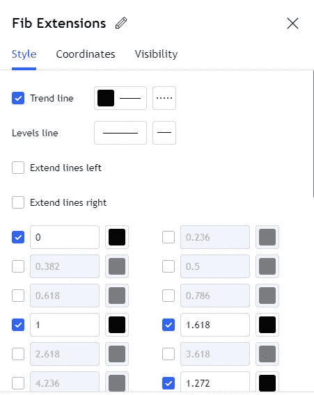

# 斐波纳契工具:交易的必备工具

> 原文：<https://medium.com/coinmonks/the-fibonacci-tool-a-must-have-tool-for-trading-d3d6f42999c3?source=collection_archive---------33----------------------->

> 交易者使用斐波纳契工具来创建支撑位和阻力位，设定目标价格，并设置止损。

在这篇文章中，我将介绍:
斐波纳奇回撤
斐波纳奇延伸
斐波纳奇迷
交易斐波纳奇工具

> 不知道什么时候买卖 cryp，试试[复制交易](http://coincodecap.com/go/bityard)。

# 斐波那契回撤

斐波纳奇回撤首先进入斐波纳奇回撤工具的设置，将数值改为斐波纳奇比率。关于斐波纳契回撤工具，你应该知道的第二件事是，当市场有趋势时，它最有效。

第一步:知道趋势的方向后，我们需要选择摆动点。

第二步:现在从低到高画 fib 来捕捉回调/回撤。注:38.2%、50%和 61.8%作为主要支点。

每一个斐波纳契比率都是一个支撑或者阻力。斐波纳契回撤用于进场交易。在上升趋势中，它们将作为支撑进行多头交易。在下跌趋势中，它们会成为做空的阻力。

# 斐波那契扩展

斐波纳契扩展也来源于斐波纳契比率&它们被用来设定交易目标。将扩展值设置为大于 1。比如:1.272，1.414，1.618 等。

你画出从波动高点到新低点的斐波纳契延伸，新低点是从斐波纳契回撤反弹后形成的。

记住:扩展只是一些扩展的比率。在大多数情况下，他们只是作为一个目标，而不是支持或抵抗。

# 斐波那契迷

斐波纳契扇形线是一组连续的趋势线，从低点或高点通过斐波纳契回撤指定的枢轴点绘制。在下面的例子中:看看价格如何回撤至 0.786 和类似水平的扇形趋势线提供了支持。

有几个基于相同理论的工具，如斐波那契弧线和斐波那契时区。但是它们都是一样的，因为它们在趋势市场中提供支撑或阻力。

# 交易斐波那契工具

a)检查趋势
b)等待回撤
c)在反弹或拒绝时进场
d)设置止损低于最近的低点/高点或低于/高于斐波纳契水平
e)在目标区域使用扩展

斐波纳契交换工具被如此广泛地使用，这种方式对关卡产生了不可避免的结果，不管人们是否接受它们有任何独特的意义..因此，你应该在你的交易系统中包含斐波纳契工具。

> 加入 Coinmonks [电报频道](https://t.me/coincodecap)和 [Youtube 频道](https://www.youtube.com/c/coinmonks/videos)了解加密交易和投资

# 另外，阅读

*   [加拿大最好的加密交易机器人](https://coincodecap.com/5-best-crypto-trading-bots-in-canada) | [库币评论](https://coincodecap.com/kucoin-review)
*   [用于 Huobi 的加密交易信号](https://coincodecap.com/huobi-crypto-trading-signals) | [HitBTC 审核](/coinmonks/hitbtc-review-c5143c5d53c2)
*   [TraderWagon 回顾](https://coincodecap.com/traderwagon-review) | [北海巨妖 vs 双子星 vs BitYard](https://coincodecap.com/kraken-vs-gemini-vs-bityard)
*   [如何在 FTX 交易所交易期货](https://coincodecap.com/ftx-futures-trading)
*   [OKEx vs KuCoin](https://coincodecap.com/okex-kucoin) | [摄氏替代品](https://coincodecap.com/celsius-alternatives) | [如何购买 VeChain](https://coincodecap.com/buy-vechain)