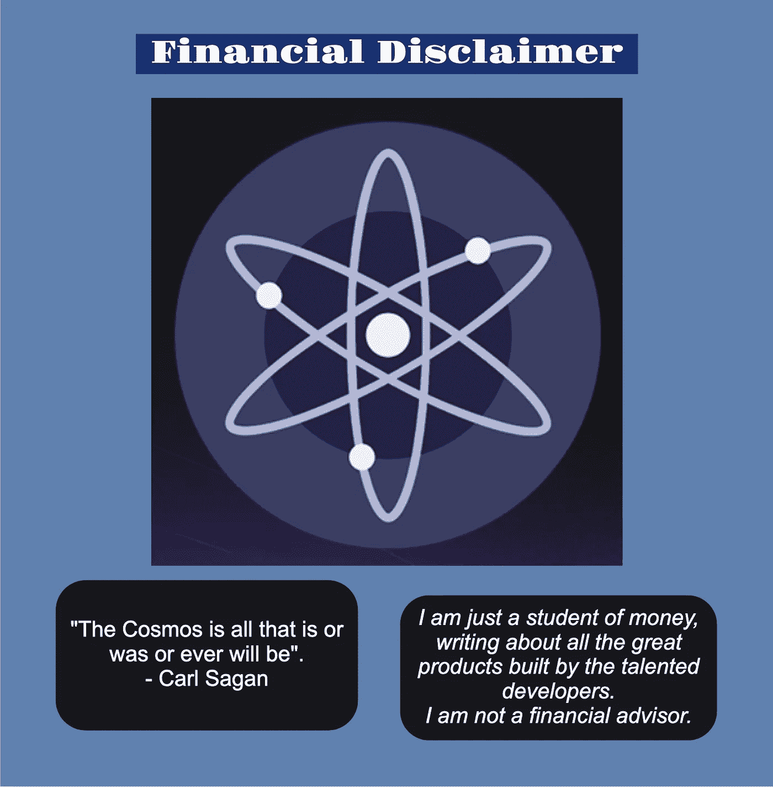

# 到达宇宙后要做的前 10 件事

> 原文：<https://medium.com/coinmonks/the-first-10-things-to-do-when-you-arrive-in-the-cosmos-b91be9b00b8b?source=collection_archive---------4----------------------->

你听说过所有进入宇宙生态系统的优秀应用吗？你是不是刚刚进入宇宙去查看了？

欢迎光临！

你想知道去哪里和做什么吗？

这里是任何一个新宇航员可以做的 10 件事，让你有一个好的开始。

# **一个**

设置一个 Keplr 钱包。

先设置一个 Chrome 扩展 Keplr 钱包，因为你会收到全功能版本。然而，移动版本也是可用的，但是它没有所有的功能。

***哪里下载***——[https://www.keplr.app/](https://www.keplr.app/)

***看视频***——[https://youtu.be/1-mee8mLdhc](https://youtu.be/1-mee8mLdhc)

> 交易新手？尝试[加密交易机器人](/coinmonks/crypto-trading-bot-c2ffce8acb2a)或[复制交易](/coinmonks/top-10-crypto-copy-trading-platforms-for-beginners-d0c37c7d698c)

# **两个**

在您最喜欢的中央交易所购买 ATOM，并将其提取到您的 Keplr Cosmos 钱包地址。

幸运的是，ATOM 在世界各地的许多中央交易所都有售，这些交易所仍然是菲亚特入口最常见的地方。

**https://messari.io/asset/cosmos/markets 哪里买原子**——[哪里买原子](https://messari.io/asset/cosmos/markets)

如果你来自以太坊或另一个 EVM 连锁店，用 ETH 替换 ATOM 是另一个很好的选择。一种方法是使用 Sifchain DEX，在这里你可以连接你的 MetaMask 钱包和你的新 Keplr 钱包

***SIF chain DEX***—[https://sifchain-dex.redstarling.com/#/swap?from=ceth&to = uatom&滑移=1.0](https://sifchain-dex.redstarling.com/#/swap?from=ceth&to=uatom&slippage=1.0)

# **三个**

在渗透指数上沉积一些原子。

确保留下几个 ATOM 来支付汽油费(现在和将来)和赌注(见下文)。

***渗透指数***——[https://app.osmosis.zone/assets](https://app.osmosis.zone/assets)

***看视频【https://youtu.be/1nqVjP3XEzs】***——

# **四个**

在渗透过程中把你的一些原子交换到渗透压中。虽然交易(掉期)在渗透上是免费的，但您会希望在您的 Keplr 渗透钱包中有 OSMO，以支付提取您交换的任何代币、下注 OSMO 代币或流动性池交易的汽油费。

***渗透指数***——【https://app.osmosis.zone/】T4

# **五个**

赌一些你的新代币！转到 Keplr 仪表盘，点击 Cosmos Hub，然后点击 ATOM。

根据你的预算，至少赌 10 个原子。空投定期给原子赌注者。这是一个与新的 dApps 互动和学习的绝佳机会，而不必先投资自己的资金。

***Keplr 仪表盘***——[https://wallet.keplr.app/#/dashboard](https://wallet.keplr.app/#/dashboard)

***看视频***——[https://youtu.be/no3RX51aq5U](https://youtu.be/no3RX51aq5U)

# **六个**

选择一个验证器，并明智地这样做。不幸的是，Keplr 的仪表盘只显示投票权；然而，试着根据良好的正常运行时间(99%-100%)、参与度(治理提案投票)和佣金来选择你的验证器。我认为 5%的佣金，最多 10%是合理的。

***Mintscan*** 有宇宙中所有区块链的很多统计:[https://www.mintscan.io/cosmos/validators](https://www.mintscan.io/cosmos/validators)

但是，我最喜欢分析的地方(也是我最喜欢的验证器之一)是 ***智能赌注***:[https://cosmos.smartstake.io/](https://cosmos.smartstake.io/)

就我个人而言，我更喜欢委托给活跃在社区中并做出贡献的验证者；然而，这不是必需的。一旦你熟悉这些，你可以随时重新委托你的赌注代币。你不必取消赌注。

# **七个**

此外，在其他区块链的股份代币，并帮助保护网络。我有很多最爱；但是，至少包括 OSMO、JUNO 和 SCRT 令牌。如果你的预算允许的话，从每个价值 100 美元的代币开始。这将帮助您赢取赌注奖励，参与治理投票，并获得空投资格。

这些都可以从 Osmosis DEX 上的 ATOM 交换到各自的 Keplr 钱包地址。再次，确保你在每个钱包地址留下一些油费代币。

# **八个**

参观不同的区块链，探索宇宙生态系统。在撰写本文时，共有 49 个主权区块链。

***Mintscan***——[https://hub.mintscan.io/overview](https://hub.mintscan.io/overview)

***区划图***—[https://mapofzones.com/](https://mapofzones.com/)

# **九**

了解有关空投和跟踪您未来的资格。

***one airdrops***——[https://airdrops.one/](https://airdrops.one/)

***cosmos ug***——[https://cosmospug.com/airdrops/](https://cosmospug.com/airdrops/)

***宇宙空投***——[https://www.cosmosairdrops.io/](https://www.cosmosairdrops.io/)

# Ten**en**

参观蓬勃发展的 NFT 市场，从那里链接到周围的艺术和创作者正在创造的社区。虽然对 Cosmos 生态系统来说相对较新，但 NFT 的势头正在增强，相关社区正在快速增长。

***星门***——[https://app.stargaze.zone/marketplace](https://app.stargaze.zone/marketplace)

***帕萨特***——[https://market.passage3d.com/](https://market.passage3d.com/)

***Omniflix*T51—[https://omniflix.market/home](https://omniflix.market/home)**

***sta hh*T57—[https://stashh.io/collections](https://stashh.io/collections)**

**T61knowledge**—[https://knowhere.art/](https://knowhere.art/)

***Talis*——https://talis.art/**

***mantle place***——[https://marketplace.assetmantle.one/](https://marketplace.assetmantle.one/)

***环路***——【https://nft.loop.markets/】环路

有了这十个步骤，你就开始在宇宙中奔跑。生态系统充满活力，不断发展，有许多优秀的社区和人们热切地分享并愿意提供帮助。

***我这里可以到达*** :

推特— @KaasKop_Opa

中—[https://medium.com/@KaasKop_Opa](/@KaasKop_Opa)

循环—[https://www.loop.markets/user/52879](https://www.loop.markets/user/52879)

