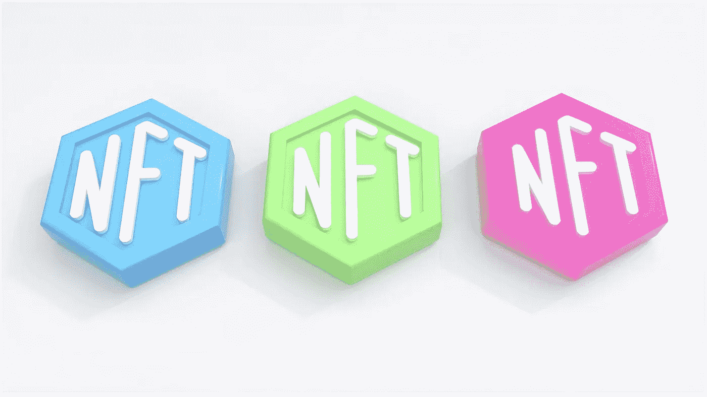
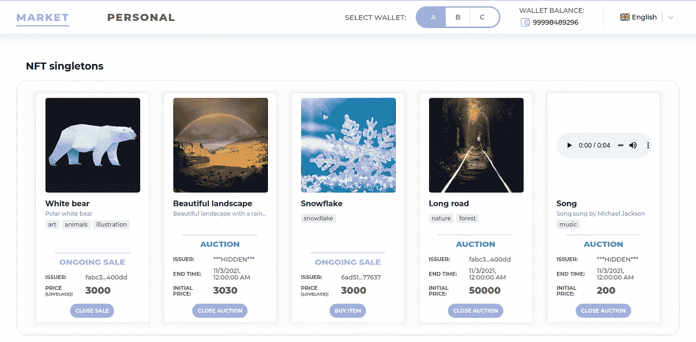
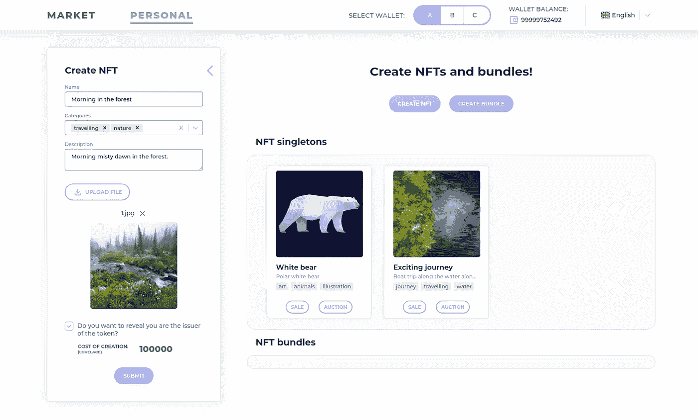
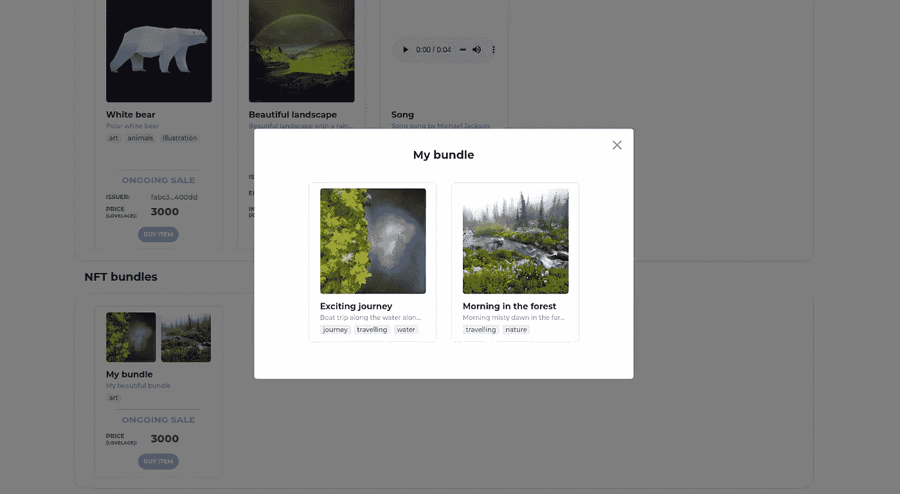
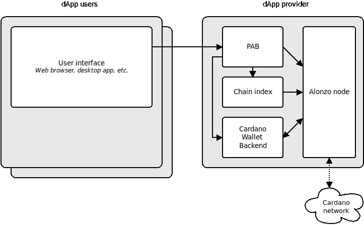

# 卡尔达诺的第一个 NFT 市场

> 原文：<https://medium.com/coinmonks/the-first-nft-marketplace-on-cardano-496bc08298c9?source=collection_archive---------12----------------------->

[IOG](https://apply.workable.com/io-global/) 邀请我们参加 2021 年 Cardano 智能合约测试。我们毫不犹豫地同意了，今天我们非常自豪地成为世界上第一批开发[普路托斯](https://docs.cardano.org/plutus/learn-about-plutus)用例的五家公司之一。

我们需要学习普路托斯平台框架来参与 Cardano 协作。普路托斯有很高的准入门槛，因为它要求开发人员拥有 Haskell 函数式语言(普路托斯核心，Cardano 的智能合约语言，使用 Haskell 代码库)的知识以及区块链经验。因为我们的工程师从 2018 年就开始用函数式风格编程，并且已经掌握了 Haskell，所以我们选择了 Cardano，集成进行得很顺利。从那以后，我们已经在区块链项目上工作了一年多。

# 项目概述

在测试普路托斯智能合约在实际应用中的表现时，我们与 IOG 内部团队密切合作。我们的开发人员测试了 IPFS 协议，帮助寻找漏洞，并参与了如何改进它的头脑风暴。

主要任务是在新的平台上设计和开发应用程序。我们也可以从组织者列表中选择一个想法，我们也这样做了。从 2021 年 8 月到 12 月，我们的五人团队一直致力于该项目的实施，促成了第一个 NFT 市场的开发，并在卡尔达诺区块链举行了拍卖。

我们开发了一个智能合同应用程序，它是与区块链交互的应用程序的后端。这意味着我们已经编写了构造事务的代码和验证事务的代码。我们为手动测试创建了一个前端，并为应用程序的用户创建了一个令人惊叹的用户界面。在开始开发应用程序之前，我们还为其设计了特定的架构和实现规范。

要在我们的平台上创建 NFT，您需要遵循以下步骤:

*   将关联的元数据(可以是任何文件，如图像)上传到存储库。这一步需要内容寻址能力，IPFS 协议通过给每个文件分配一个唯一的标识符(一个加密散列)来提供这一能力；
*   直接铸造代币，代币将进入区块链创造者的钱包。

我们的 NFT 交易平台的智能合约的主要功能是在用户钱包中的令牌和内容标识符之间提供直接链接。我们市场的用户有以下选择:

*   创建他们自己的不可替换的令牌；
*   将 NFT 合并到集合中；
*   发起拍卖；
*   决定拍卖的价格和持续时间。

出售国家森林交易和拍卖所得的佣金用于资助该平台。

# 问题和解决方案

在我们参与时，IOG 不支持智能合同，也不支持帮助我们理解某些事情的文档。所有开发都经过了模拟测试。随着阿隆佐 hard fork 的发布，一个增加了创建智能合约和 dApps 的能力的更新，人们发现它不支持许多功能。我们详细介绍了我们遇到的问题以及它们如何影响项目的启动:

## 1.元数据存储(与 NFT 相关的图像、视频或音频文件)。

众所周知，在网络上存储文件会大大增加交易成本。此外，每个单元最多分配 16 KB 的存储空间(由于事务大小的限制)。这意味着要存储大文件，你必须首先像一个经典的沙拉食谱一样将它们切成小方块，然后想出一个方法将这些小块组合成原始的蔬菜文件。

该解决方案改编自现有的以太坊区块链实践。我们决定使用 IPFS，一种分布式文件存储系统。该文件被上传到 IPFS，并被分配一个内容 ID，该 ID 是其内容的散列。该系统之所以能够工作，是因为哈希继续唯一地标识文件(换句话说，它们为内容分配了可寻址性)。

这个解决方案一举两得:

*   允许您用某个东西唯一地标识 NFT(从而使令牌不可替换)；
*   允许您在链中只存储一个短的散列，而不是一个大文件。

## 2.存储内容 ID，它是在文件上传到 IPFS 后生成的。

在以太坊中，每个令牌都是一个智能合约，允许您使用存储。在 Cardano 中，所有的代币都是本地的，由分类帐支持，其行为类似于主要货币 ADA。在 Cardano 中，令牌仅由一个 PolicyID 和一个不可变的资产名称表示，允许您惟一地标识、转移和跟踪它。

我们有两个选择来解决这个问题:

1.  使用资产的名称进行存储——这是令牌中唯一可以存储不变内容的地方；
2.  在一些脚本(例如，市场脚本)的数据中保留所有散列，并可以选择更改它们。很多其他相关信息也可以存储在那里。

为了使令牌尽可能轻便，我们决定将内容标识符存储在令牌名称中，并将其他信息(如令牌的描述)存储在脚本数据中。

## 3.普路托斯框架总体准备就绪。

这个图书馆当时还是全新的实验性的，Cardano 网络不支持智能联系人。自定义智能合同开发语言和执行平台普路托斯是与我们的市场应用程序同时开发的，所以有些东西经常不工作。

尽管如此，我们还是做好了准备，并努力跟上普路托斯的最新进展，向 IOG 工程师提供反馈。我们一直在与普路托斯的开发者和测试项目的其他成员讨论如何修复在专门的 Discord 社区中出现的错误。在内部监督组，我们也得到了内部核心团队的支持。

## 4.现有的交易规模限制。

Cardano 的最大事务大小是 16 KB。脚本消耗的计算步骤(CPU)和随机存取存储器(RAM)的数量也是有限的。

事实证明，我们的脚本太大，无法在线运行。后来发现这是由于使用了普路托斯框架状态机抽象。抽象是非常昂贵的，因为它增加了许多代码，使脚本变得更大。

为了解决大小限制的问题，我们不得不通过移除状态机的使用来重写整个实现。

## 5.PAB 不支持远程(浏览器)钱包。

要购买 NFT，用户必须通过浏览器界面导航到自己的浏览器钱包，输入密码，提交交易(熟悉 MetaMask 的人都知道这个方案)。

然而，我们发现普路托斯应用程序框架不支持 PAB 与远程(浏览器)钱包的集成。这是最重要的问题，只是在工作过程中才发现。当时不可能找到真正的解决办法。

没错，我们并没有马上放弃，而是计划了一个通过 Cardano Wallet 后端启动应用程序的替代方案。我们决定在本地部署 PAB 以及 Cardano wallet、链式索引和 Cardano-node 应用程序。因此，dApp 用户在他的计算机上运行所有的应用程序，并且使用具有完整节点的本地钱包。作为提供者，我们承诺存储他的所有数据并代表他采取行动。

这个脚本违反了隐私政策，看起来对用户没有吸引力，用户必须让我们访问他的钱包。因此，我们无法在 testnet 上实现脚本和启动项目。

截至本文撰写时(2022 年 9 月)，PAB 仍未在浏览器钱包模式下工作。任何 DeFi 应用程序必须能够与浏览器钱包一起工作。必须做更多的工作来探索替代解决方案，以允许应用程序为广泛的用户运行。

# 数字

开发这个应用程序花了 5 个月的时间。这需要一个五人团队的努力:

*   一名前端开发人员；
*   三个普路托斯和前端开发人员；
*   一个项目经理。

我们使用以下技术栈来创建应用程序:Haskell、PureScript、NixOS、Docker 和 TypeScript。

> 交易新手？试试[加密交易机器人](/coinmonks/crypto-trading-bot-c2ffce8acb2a)或者[复制交易](/coinmonks/top-10-crypto-copy-trading-platforms-for-beginners-d0c37c7d698c)

‍