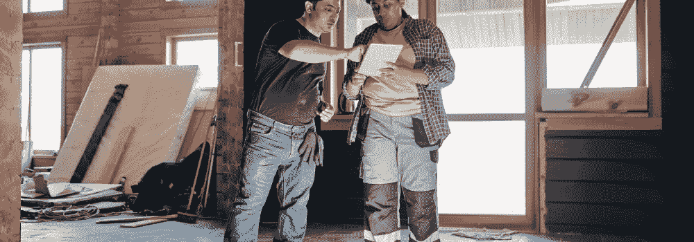

# 固定和翻转策略

> 原文：<https://medium.com/coinmonks/the-fix-and-flip-strategy-4b34b9e97035?source=collection_archive---------42----------------------->

遵循固定和翻转策略的投资者通常被称为“房屋翻转者”，通常具有木工或家居装修背景。最终，修复和翻转策略是有翻新经验的投资者的理想选择，因为这可以帮助他们扩大利润，降低翻转过程中发现隐藏问题的风险。

# 什么是固定和翻转策略？

修复和翻转策略是一种投资方法，包括购买过时或不良房屋，意图快速修复，然后转售获利。

虽然这在理论上听起来很简单，但固定和翻转策略确实存在内在风险。例如，购买不良资产需要彻底的检查和有效的评估，或者投资者冒着超出预算进行必要维修的风险。此外，获得低于市场的价格需要大量的跑腿工作，以发现提前取消抵押品赎回权的房屋和陷入困境的房主。

修复和翻转策略并不新鲜，但随着房价飙升，翻转房屋仍然是投资者进入市场的一种有吸引力的方式，无需支付最高价格。通常，房产经纪人会通过寻找不良房产、提前取消抵押品赎回权以及拖欠税款或对房产有留置权的房主来寻求交易。

# 固定和翻转策略案例研究

作为一个购房者，你所购买的房产的状况可能从不适于居住到简单的过时。想象一下，你发现了一处状况不佳的待售房产，标价为 120，000 美元。计算出必要的投资和潜在的利润将有助于你谈判。

你首先要预算出所有必要的维修费用，以使房子适于居住。如果有剩余的钱，你会想考虑所有你能投资的升级，以使房产对当地买家更有吸引力。如果你计划投资 35，000 美元到房产，你可能估计修理后的价值(ARV)将增加到 175，000 美元。

一旦你和卖家谈判，他们接受了一个合理的出价，就进入下一步。你现在有了一处投资房产，并且有了一个目标，那就是在装修上花费尽可能少的时间和金钱，以最小化风险，最大化回报。如果你花 110，000 美元买下它，在你支付修理费后，你还有 30，000 美元的潜在利润等着你。

在几个月的时间里，你可以把这个破旧的家变成一个更新的家庭住所，你可以带着 3 万美元的利润投入到你的下一笔投资中。

# 底线

修复和翻转策略可以应用于几乎任何市场，通过购买一个破旧或过时的房屋，并花钱进行修复。投资者能够在房产中建立即时权益，允许他们为快速销售提供有竞争力的销售价格或收取优惠的租赁费。

> 交易新手？试试[加密交易机器人](/coinmonks/crypto-trading-bot-c2ffce8acb2a)或者[复制交易](/coinmonks/top-10-crypto-copy-trading-platforms-for-beginners-d0c37c7d698c)