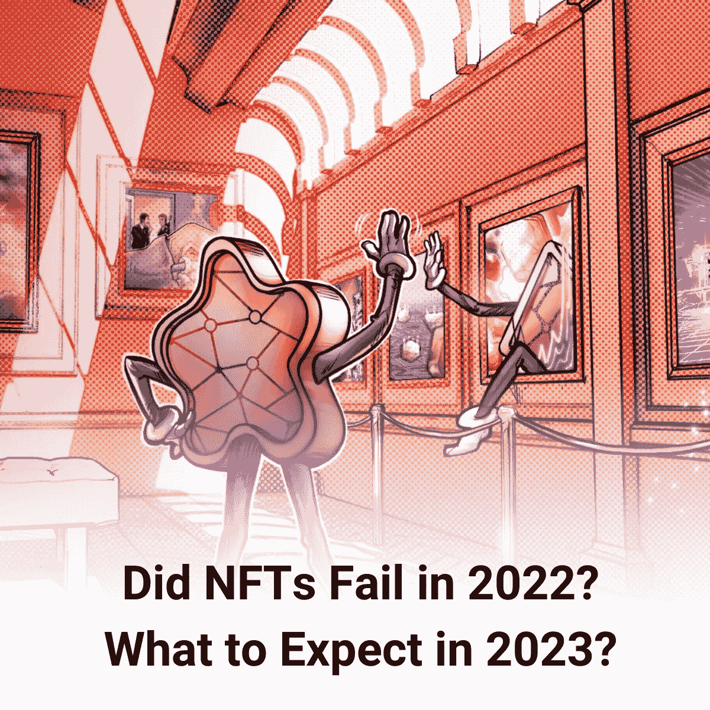

# NFTs 2023 预测:展望未来的回顾

> 原文：<https://medium.com/coinmonks/the-forecasts-of-nfts-2023-a-look-back-for-a-look-forward-9399e36fafed?source=collection_archive---------15----------------------->

支持 NFTs 的著名企业家 Gary Vaynerchuck 提到了一些严重影响 NFT 市场的因素，如供应过剩、贪婪和不合格项目。他在一篇 Twitter 帖子中强调了 NFT 行业当前的问题和他对明年的预测。

今年，Vaynerchuck 将重点放在了媒体和社交媒体用户的恐惧、不确定性和怀疑(FUD)上。人们关注的焦点是不断萎缩的交易量和最低价。

他提到了一年前的预测，当时他预测“在 2021 年 NFT 繁荣期间获得牵引力的 98–99%的 NFT 项目将以失败告终，甚至为零。你可以看到它确实发生在真实的市场中。

 [## 2022 年更新的被动收入最佳的 15 家非正规金融机构

### 什么是 NFT 硬币？

medium.com](/@libraryoftrader/top-15-best-nfts-with-passive-income-updated-in-2022-8368cd5971eb) 

# NFTs 有什么问题？

*NFTs have experienced a tumultuous year. — Source: Analytics Insight*

Vaynerchuck 用来预测 NFT 市场的基准是减缓市场增长的三个主要问题，包括:

*   供应过剩:他指出许多名人、有影响力的人、体育联盟和大品牌的参与导致了 NFT 供应的激增。平心而论，有些项目是真正的经营者的杰作。然而，大多数 NFT 项目并不是因为供需失衡，这就产生了等待破灭的泡沫。
*   **短期贪婪** : NFT 用户可能会被通过推出交易型非流通股项目快速获利的趋势所触发。因此，它会导致骗局和基本面不佳的项目亏损。冲刺淘金需要很多技巧和思考，而不仅仅是速度。区块链监测软件公司 DEXterlab 从 5 月底到 6 月初对 1，300 多人的 NFT 购买习惯进行了调查，结果是 64.3%的受访者说他们购买 NFT 是“为了赚钱”，而不到 42%的人旨在通过 NFT 获利。
*   **运营不佳**:在创始人对商业、长期社区发展、员工日常运营、需求创造等方面没有足够扎实的知识的情况下，很容易启动一个 NFT 项目。因此，在混乱的价格波动中，这些项目很容易濒临崩溃。

**那么，2022 年密码市场的事件告诉了我们什么？**

痛苦的黑客攻击和 CeFi(中央金融)崩溃，就像 FTX 的腐败一样，肯定动摇了密码产业。然而，巨大的技术进步，特别是 Web3，已经惠及许多个人。 [NFTs](/@libraryoftrader/bored-ape-nft-why-is-it-expensive-61598dc65185) 对于世界各地的用户来说已经变得可访问、可靠和安全，迎来了一个透明、可靠和自治的社区。它完全改变了我们对金钱、所有权、身份和社区的考虑。根据 Coindesk 的说法，2023 年可能会继续采用互联网的经济层。

 [## FTX 灾难:为什么它会深刻影响加密市场？

### FTX 的惨败严重影响了许多公司，甚至整个加密行业。因此，许多人把……

medium.com](/coinmonks/the-ftx-disaster-why-does-it-profoundly-impact-the-crypto-market-f738a1cc7735) 

**2023 年，NFT 何去何从？**

*NFT Forecasts in 2023 — Source: NFTA*

Gary Vaynerchuck 的预测是，2023 年可能不会出现像 2021 年那样的市场繁荣。他将加密和 NFT 行业与 20 世纪 90 年代末和 21 世纪初的互联网繁荣进行了比较，以洞察无数倒闭的公司，而最强大的公司则占据了主导地位。

[https://medium . com/@ libraryoftrader/the-future-of-nfts-missions-or-optimistry-a95f 7520786 e](/@libraryoftrader/the-future-of-nfts-illusions-or-optimism-a95f7520786e)

荒谬的供应量推动许多项目像 Pets.com 一样崩溃。只有 1-3%的项目成为下一个亚马逊和 eBays。然而，NFT 用户不愿意做功课来挑选有利可图的项目进行明智的决策，不仅是为了短期收益，也是为了长期利润。

Coindesk 已经发布了一些引人注目的 2023 年 NFT 预测。这篇文章强调了 DeFi 对 2023 年的预测。

**DeFi(分散金融)将保持增长势头。总的来说，它运行得完美无缺，而 CeFi(中央财政)却遭遇了许多令人毛骨悚然的崩溃，尤其是 FTX 事件。像比特币基地和比特斯坦普这样受到高度监管的公司证明了监管和发展可持续环境的力量。这些公司通过安全的智能合约为资产提供担保，从而使用户能够掌握流动性，并对自己的投资拥有更大的控制权。**

 [## 如何评价一个 NFT 的价值？

### NFT 是一个新的领域，最近引起了公众的极大关注。因此，测量 NFTs 的价值是…

medium.com](/coinmonks/how-to-evaluate-the-value-of-an-nft-d4078f1a98ba) 

一些令人兴奋的例子是 [GMX](https://gmx.io/) ，一个分散的永久交易所，和 [1inch Pro](https://1inch.pro/) ，一个监管合规的平台，用于连接传统金融(TradFi)和 DeFi。2023 年很可能会有支付的过渡，比如自保管钱包，合成资产，预测市场。

该行业的真正力量在于基础设施，这有助于它抵御艰难的市场环境。这些特性将大大加快 DeFi 在 2023 年的采用和发展，尤其是在 CeFi 面临严重灾难的时候。

请继续关注我们的下一篇文章，更新对 2023 年 NFTs 的更多预测，例如

*   对 ZK 的大量采用
*   金融资产的虚拟化
*   开始利用区块链数据
*   不可替代代币的扩张为其持有者提供了价值

同时，您可以阅读深入研究密码市场的其他文章，例如

 [## FTX 的崩溃，币安的领先地位，以及密码市场

### 币安现在正式退出对 FTX 的救助，而 FTX 已经面临严重的偿付能力问题。本周早些时候，CZ…

medium.com](/coinmonks/ftxs-collapse-binance-s-leading-position-and-the-crypto-market-1bcdd56e85e7)  [## FTX:崛起、衰落和重生？

### FTX 的破产案现在是密码市场的焦点。密码投资者和交易者可能见过很多…

medium.com](/coinmonks/ftx-the-rise-the-fall-and-the-rebirth-b21c639bdb87)  [## 2022 年的密码英雄:那些给密码行业带来清晰的人

### 看起来今年的加密市场不景气。在余波中有许多戏剧…

medium.com](/coinmonks/the-crypto-heros-in-2022-those-who-bring-clarity-to-the-crypto-industry-de76c5b54277)  [## 2022 年的密码英雄:那些活跃了密码行业的人

### 继 2022 年的加密英雄名单之后，本文新增了三位对加密市场做出贡献的人物…

medium.com](/coinmonks/the-crypto-heroes-in-2022-those-who-have-livened-up-the-crypto-industry-a5deb8bc4cb1) 

除了 Medium，您还可以通过以下方式关注我们

*   [库的交易员](http://bit.ly/3GQsIiY)
*   [脸书](http://bit.ly/3XyoeTY)
*   [推特](http://bit.ly/3XHQRhK)
*   [领英](http://bit.ly/3ihv3cu)
*   [Reddit](http://bit.ly/3imq76f)
*   [Quora](http://bit.ly/3VcaEUK)
*   [Tiktok](http://bit.ly/3VibUpx)

> 交易新手？试试[加密交易机器人](/coinmonks/crypto-trading-bot-c2ffce8acb2a)或者[复制交易](/coinmonks/top-10-crypto-copy-trading-platforms-for-beginners-d0c37c7d698c)
> 
> 加入 Coinmonks [电报频道](https://t.me/coincodecap)和 [Youtube 频道](https://www.youtube.com/c/coinmonks/videos)获取每日[加密新闻](http://coincodecap.com/)

## 另外，阅读

*   [复制交易](/coinmonks/top-10-crypto-copy-trading-platforms-for-beginners-d0c37c7d698c) | [加密税务软件](/coinmonks/crypto-tax-software-ed4b4810e338)
*   [网格交易](https://coincodecap.com/grid-trading) | [加密硬件钱包](/coinmonks/the-best-cryptocurrency-hardware-wallets-of-2020-e28b1c124069)
*   [密码电报信号](/coinmonks/top-3-telegram-channels-for-crypto-traders-in-2021-8385f4411ff4) | [密码交易机器人](/coinmonks/crypto-trading-bot-c2ffce8acb2a)