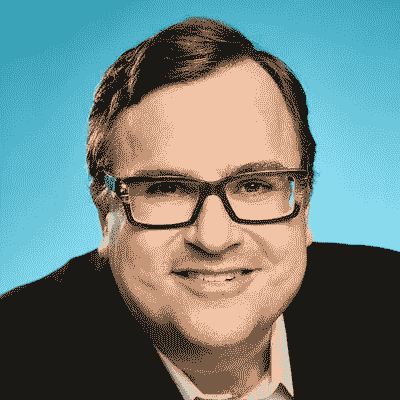
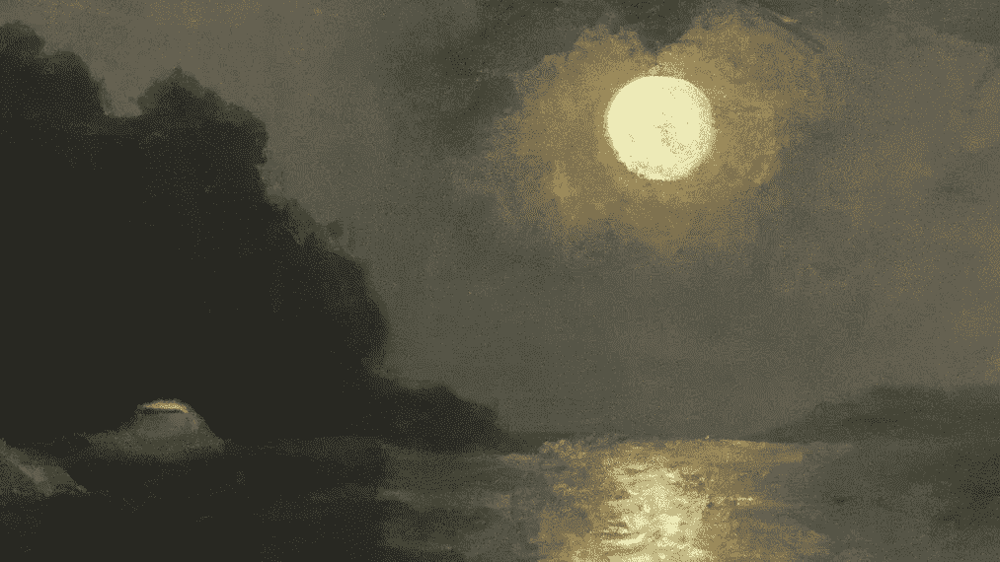

# LinkedIn 创始人推出人工智能艺术 NFT 系列

> 原文：<https://medium.com/coinmonks/the-founder-of-linkedin-launches-an-ai-art-nft-collection-8bb510adc1c3?source=collection_archive---------25----------------------->

虽然感觉最近每个人都在赶 NFT 的潮流，但 LinkedIn 创始人雷德·霍夫曼推出了自己的 Dall-E 生成的人工智能艺术系列，作为索拉纳·NFT 系列，这尤其有趣。该项目名为“不可翻译的单词:Mn GATA ”,目前正在通过神奇的伊甸园发射台进行拍卖。Dall-E 是可用的最强大的人工智能艺术生成工具之一，已经制作了一些美丽和令人难以置信的艺术品。你可以在下面的链接中看到一些里德的作品。

魔法伊甸园链接:

[https://magiceden.io/auction/uw_mangata](https://magiceden.io/auction/uw_mangata)

见证如此多来自 Web 2 的有影响力的构建者踏上 Web 3 前沿的旅程令人难以置信。

在一个扩展的 Twitter 帖子中，Reid 思考了人工智能艺术和 NFTs 的交叉点上的可能性。

【https://twitter.com/reidhoffman/status/1550163436281090049? s = 20&t = erbdo 5 ahnvgrkjt 31 p 0 clg

“一图胜千言。”

"但是 DALL 的情况正好相反:一个单词抵得上一千张图片."

“DALL 如何同时创造数字丰富性和数字稀缺性让我印象深刻。”

"然而，任何人都可以“右键单击保存”一个 DALL 原件，然后无限复制."

"输入:NFTs——一种让数字资产变得稀缺和独特的技术."

“当你将两项最重大的技术变革结合在一起时，会发生什么？他们怎么可能走到一起？”

——人工智能艺术家雷德·霍夫曼

正如你们中的一些人所知，在过去的几个月里，我一直在涉足人工智能艺术，并致力于一个完全由人工智能生成的 NFT 作品集。鉴于目前的市场状况，在这种环境下从事 NFT 的项目会让人感到士气低落。具有更大影响力和范围的人正在努力出售他们的收藏品，但我仍然对 NFTs 和人工智能艺术在未来几个月彻底改变数字收藏品领域的潜力持乐观态度。

祝里德和他的货好运。愿他为其他人踏上他的足迹铺平道路。

感谢您的阅读。

看看我在推特上未经过滤的想法:

【https://twitter.com/wasifmrahman 

在 LinkedIn 上关注我的职业生涯:

[https://www.linkedin.com/in/wasifmrahman/](https://www.linkedin.com/in/wasifmrahman/)

我对媒体的另一个想法是:

 [## 瓦西夫·拉赫曼-中号

### 阅读瓦西夫·拉赫曼在媒介上的作品。Web 3 德根 Ex Populus 营销伙伴关系总监。每天…

medium.com](/@wasifmrahman) 

> 交易新手？试试[加密交易机器人](/coinmonks/crypto-trading-bot-c2ffce8acb2a)或者[复制交易](/coinmonks/top-10-crypto-copy-trading-platforms-for-beginners-d0c37c7d698c)