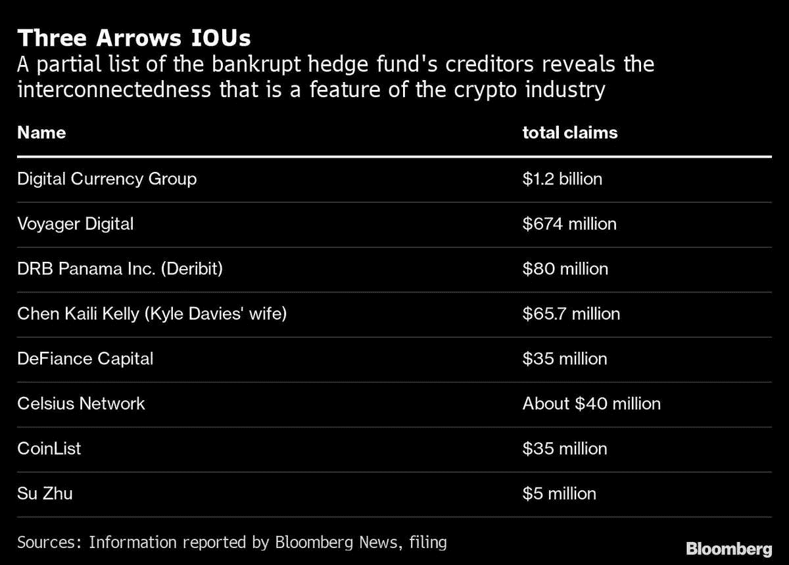
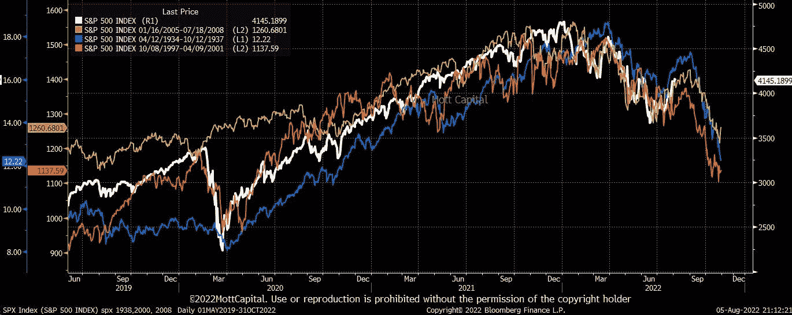

# 2022 年密码崩溃的四幕

> 原文：<https://medium.com/coinmonks/the-four-acts-of-2022s-crypto-collapse-9d06911418a9?source=collection_archive---------10----------------------->

The Bear Market Says “Hello Fren”​

总之，2022 年密码崩溃分为四幕，三幕结束，还有一幕:

> *第一幕:2020–21——市场狂热*
> 
> *第二幕:Q1 2022——杠杆零售勇敢向前冲*
> 
> *第三幕:Q2 2022——勇敢向前冲的杠杆工具*
> 
> 第四幕:接下来是什么？继续阅读…

**第一幕(完成)**:从 2020 年的 DeFi 夏季开始，零售杠杆和牛市狂热将 TVL(总价值锁定在各种区块链上)和代币价格推至不可持续和不切实际的高位。2020 年末推出的 Terra Luna 具有许多优点，是疯狂的缩影；在大约 18 个月的时间里，它的市值从零增长到超过 400 亿美元，在 2022 年 4 月达到顶峰，几周后跌至 0 美元)

**第二幕(完成)**:比 Terra 更广泛的是，不可持续的膨胀性原生令牌奖励驱使用户耕种，然后将他们的收入倾倒在所有协议和链上。极高且短暂的收益率(有时达到 1000% APY)意味着用户从一个项目到另一个项目追逐收益率和免费的象征性空投，一路向上。一旦回报放缓或停止，APYs 就变得不可实现，用户就会逃离。

这是第一次下跌，并在 2022 年的前几个月引发了广泛的痛苦和进一步的抛售(再次，Terra Luna 已经成为这种情况的典型)。那些有杠杆的人被扫地出门，导致流动性进一步下降。负反馈环看到所有项目的消费者需求下降，推动代币价格越来越低。价格趋势的逆转降低了散户投资者对价格疯狂上涨的借贷需求。较低的借贷需求意味着较低的贷款利率。所有这些都在一个反馈循环中周而复始地推动价格，随着庞氏骗局式的上涨逆转，TVL &用户#的价格暴跌。

**第三幕(完成)**:随着消费者恐慌性抛售、去杠杆化并集体逃离 crypto，TVL 股市大幅下挫，但随后企稳，甚至有所回升(如上图 Defillama.com 图表所示)。但在表面之下，一切并不顺利。到 5 月和 6 月，这引发了高杠杆和相互关联的机构基金，如 Voyager、Celsius、Three Arrows 的崩溃，导致 5 月至 6 月的另一次巨大抛售和 TVL 的逃离(即价值缩水和资金离开 DeFi)，如 Defillama.com 图表所示。

第四幕(即将上演):市场现在发现自己正处于十字路口。要么底部已经到位，第四幕将是回归稳定/新一轮牛市；或者表面下隐藏着进一步的危险，这将使市场进一步下跌。到目前为止，没有杠杆或杠杆很低的基金还能持有。然而，除了少数例外，他们的表现或多或少地跟随了下跌 50-90%的整体市场。第四幕的关键问题是他们会投降并被迫出售吗？如果市场复苏或恢复牛市，他们可以避免这种情况，但如果象征性价格继续下跌，他们将被迫减少损失，或者面对对损失不满的投资者的大规模赎回，他们将别无选择。或者两者都有。像前三个“行为”一样，这将创造一个新的底部，可能比以前的低点再低 50-80%。呀！

是什么导致了这种决裂，不管是这种还是那种？它会朝哪个方向发展？我们往下想。我们正在跟踪的关键驱动因素(括号中是我们近期的预期)包括:

*   不断增长的通货膨胀(持续高企)意味着消费者购买力将会萎缩，尤其是对固定收入的大部分人口而言，需求将会下降；
*   高利率(未来还会有更多的加息)意味着企业、房主、信用卡用户或任何借款人的成本将会飙升。100 万美元的抵押贷款利率上升 4%意味着每年额外增加 4 万美元的贷款服务成本；
*   乌克兰战争/俄罗斯制裁(拖延)意味着食品、能源和关键原材料中断数月以上，更不用说粮食和化肥中断导致大范围饥荒的可怕可能性了。上一次粮食受到类似干扰时(2010 年，由于干旱导致产量下降，俄罗斯禁止小麦出口)，价格翻了一倍，严重依赖俄罗斯粮食的国家迎来了阿拉伯之春。
*   中国 Covid 0:(制造业中断和缓慢/负增长将持续)

TLDR:我们持悲观态度，预计随着今年剩余时间的展开，这些趋势将表现为消费者需求下降、收入缩水、投资活动减少以及最终失业率上升。一句话:一场衰退，一场同样会打击科技行业的衰退。鉴于加密与技术市场的相关性，我们预计加密将跟随市场下跌。

最后一点:私人和公共之间存在分歧，这种分歧可能会持续下去:即使象征性价格和公共科技公司的股价大幅下跌，风险投资支持的加密公司也在一定程度上免受价格下跌的影响。有趣的是，优质项目的估值继续大幅上升，尽管可能没有去年那么高。为什么？风险投资通常有 8-12 年的时间跨度，并从融资最好的几年中套现 100 亿美元，因此他们(我们)可以从长计议。(没有月度或季度赎回来推动销售)。

数据说明了一切。例如，年初至今(截至 2022 年 7 月)，风险投资在加密领域的投资超过 183 亿美元，接近 2020 年投资额的三倍，并有望超过 2021 年创纪录的 324 亿美元(来源:摩根大通)

 [## 什么冬天？秘密风投继续他们的投资狂欢

### 你必须给加密爱好者这么多:仍然年轻但被击败的资产的真正信徒是一个…

fortune.com](https://fortune.com/2022/07/27/crypto-winter-crypto-vc-investments-fundraising/) 

对于宪章派来说，过去似乎也暗示着下跌。@MichaelMOTTCM 有一张图表，用白线比较了近年来标准普尔 500 指数与标准普尔 500 指数(1994 年至 1997 年、1997 年至 2001 年和 2005 年至 2008 年)类似的繁荣到萧条时期。

2022 年的剩余时间看起来是相当困难的时期。话虽如此，不管第四幕是什么样子，我们仍然非常看好 crypto 的长期前景。我们已经看到了我们投资组合的转变，核心的 King River 加密相关持股，如 [Paystand](https://www.paystand.com/) 、 [ConsenSys](https://consensys.net/) 、[不可变](https://www.immutable.com/)、 [ZenLedger](https://www.zenledger.io/) 和 [Discord](https://discord.com/) 在熊市周期中表现良好。

> 加入 Coinmonks [电报频道](https://t.me/coincodecap)和 [Youtube 频道](https://www.youtube.com/c/coinmonks/videos)了解加密交易和投资

# 另外，阅读

*   [加密货币储蓄账户](/coinmonks/cryptocurrency-savings-accounts-be3bc0feffbf) | [YoBit 审核](/coinmonks/yobit-review-175464162c62)
*   [Botsfolio vs nap bots vs Mudrex](/coinmonks/botsfolio-vs-napbots-vs-mudrex-c81344970c02)|[gate . io 交流回顾](/coinmonks/gate-io-exchange-review-61bf87b7078f)
*   [CoinFLEX 评论](https://coincodecap.com/coinflex-review) | [AEX 交易所评论](https://coincodecap.com/aex-exchange-review) | [UPbit 评论](https://coincodecap.com/upbit-review)
*   [AscendEx 保证金交易](https://coincodecap.com/ascendex-margin-trading) | [Bitfinex 赌注](https://coincodecap.com/bitfinex-staking) | [bitFlyer 点评](https://coincodecap.com/bitflyer-review)
*   [Bitget 回顾](https://coincodecap.com/bitget-review)|[Gemini vs block fi](https://coincodecap.com/gemini-vs-blockfi)cmd |[OKEx 期货交易](https://coincodecap.com/okex-futures-trading)