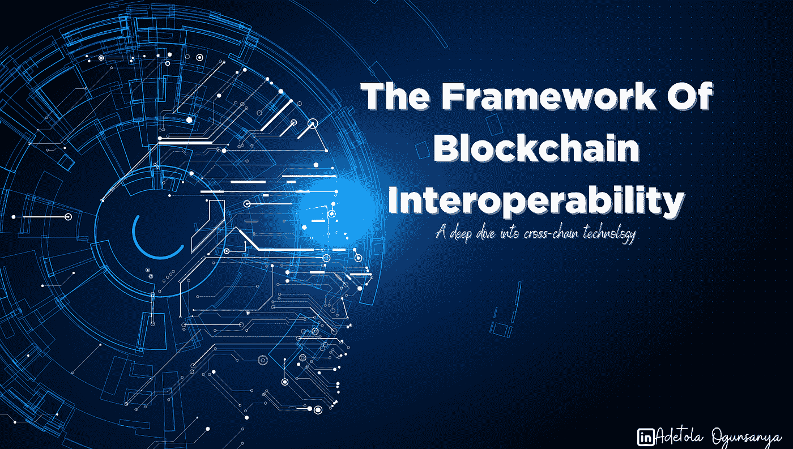
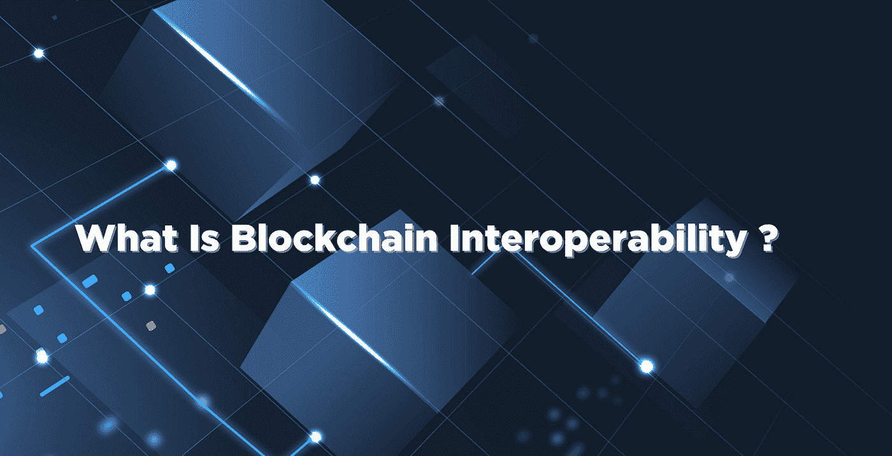
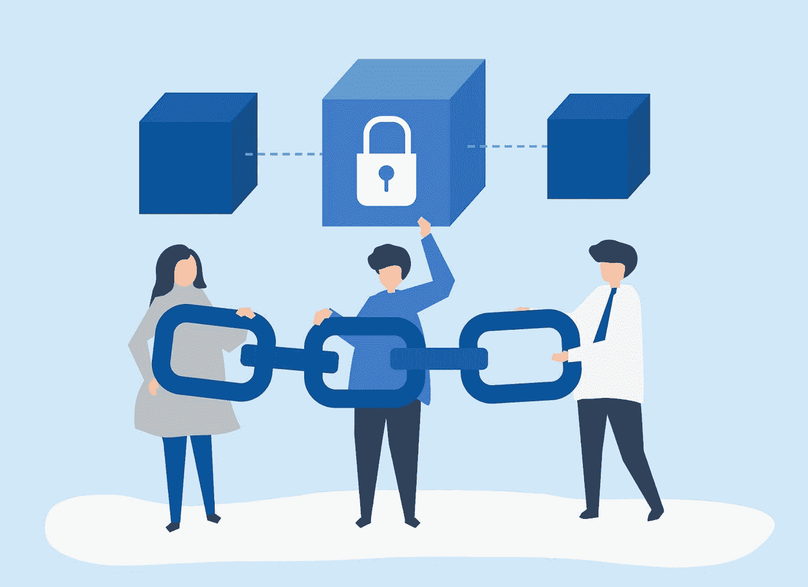
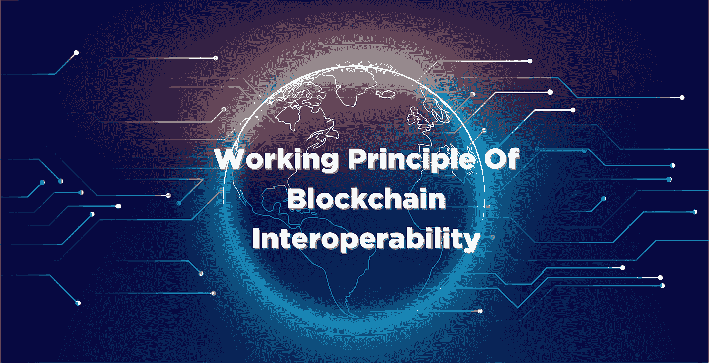
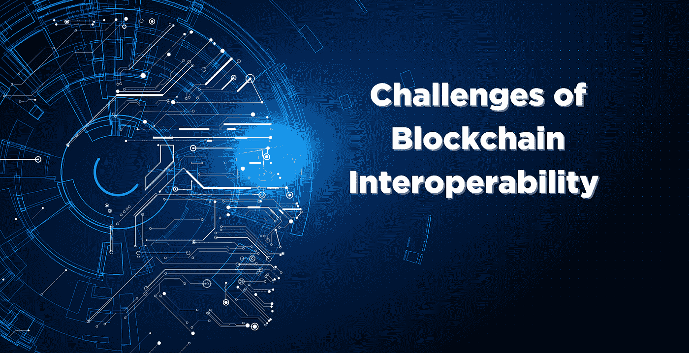
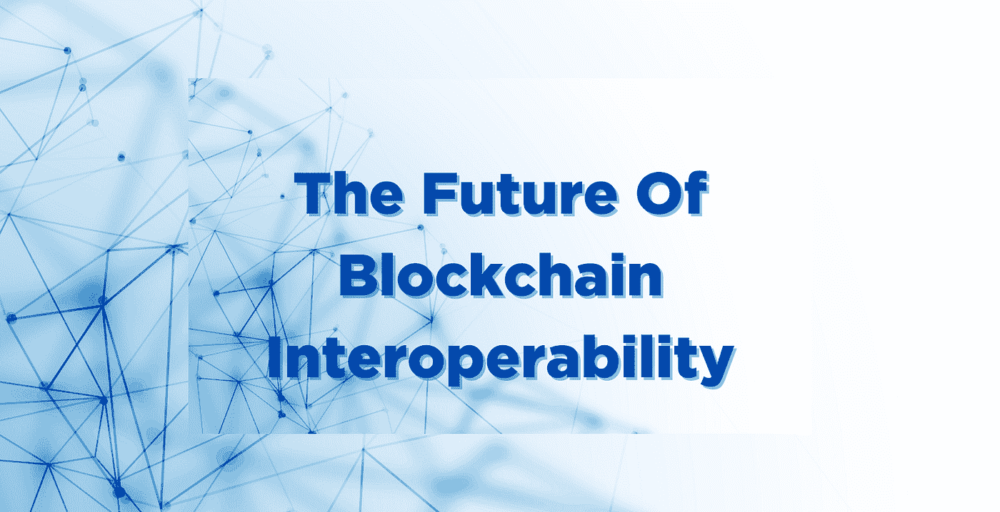

# 区块链互操作的框架

> 原文：<https://medium.com/coinmonks/the-framework-of-blockchain-interoperability-227d02f67724?source=collection_archive---------33----------------------->

[**Photo**](https://www.freepik.com/free-vector/combination-circuit-head-shape-artificial-intelligence-moral-electronic-world-illustration_14803707.htm)

> **"** *"区块链互操作性是一种操作方法，它支持不同区块链之间的通信，以及它们如何共享数字资源和数据。"此外，它们有效工作的能力反过来让用户能够完全访问区块链技术必须提供的服务*r

**最近，我们见证了新区块链扩展解决方案概念的大量涌入。由于所有其他项目都利用了其对应项目的[限制](/coinmonks/the-unsolved-mystery-of-the-blockchain-trilemma-1a468073ccee),问题仍然是所有这些项目如何相互连接，向用户交付无缝和内聚的服务？**

**要完全理解区块链的互操作性，你必须一直读到最后。**

# **你会学到什么**

**这篇文章将有助于你理解以下主题:**

*   **什么是区块链互通？**
*   **什么是跨链协议？**
*   **什么是多链技术？**
*   **区块链互操作框架**
*   **区块链互操作性的挑战**
*   **互操作性扩展解决方案；宇宙和波尔卡多特**
*   **区块链互操作性的未来。**

# **什么是区块链互通？**

****

**[Photo](https://www.freepik.com/free-photo/blockchain-technology-background-gradient-blue_17122274.htm)**

**区块链的[互操作性](https://cointelegraph.com/blockchain-for-beginners/what-is-blockchain-interoperability-a-beginners-guide-to-cross-chain-technology)可以被解释为支持各种区块链在共享数字资源和数据方面的通信的操作方法。此外，他们有效工作的能力是充分利用这项技术潜力的基本要求**

# **什么是跨链协议？**

****

**[photo](https://www.freepik.com/author/rawpixel-com)**

**跨链协议**为许多区块链网络之间的数据共享铺平了道路，并促进了这些区块链网络之间的互操作性**。区块链的跨链协议是使用户能够在各种区块链之间进行交互而不需要中介的项目。**

**由于组成和编程的差异，BTC 很难与以太坊区块链互动，因为他们都在隔离的区块链。**

**那么，我们如何将它们连接起来，为用户提供区块链技术所能提供的最佳服务呢？**

**跨链协议有助于桥接独立的区块链，而无需第三方交换。**

# **什么是多链技术？**

****

**[Photo](https://www.freepik.com/free-photo/business-network-background-connecting-dots-technology-design_21629675.htm)**

**多链技术的立场是，独立的区块链之间的交互不应该受制于桥接协议。**

**多链协议处于互操作性的前沿，因为它们不再需要网桥。(宇宙，波尔卡多特，EVM 兼容区块链)**

**因此，两个或更多不相关的区块链可以使用基础设施层安全直接连接，从而创建一个区块链互联网基础设施。**

**跨链桥的安全问题由多链生态系统(也称为 0 层链)解决，如 Cosmos 和 Polkadot。**

# **区块链互操作的工作原理**

****

**作为一个加密本地人，您肯定遇到过这样的情况:您希望使用由不同区块链支持的令牌进行交易。**

**这些交易可能需要你通过中间人，这可能是一个交易所或桥梁。如果有一个平台可以消除所有中介，并为新的甚至先前存在的区块链之间的内聚通信提供空间，并且是可扩展和可负担的，会怎么样？**

**让我们看看有助于区块链之间互操作性的各种操作。**

## **侧链和继电器**

**最初是在 2014 年 10 月 22 日由 Adam Back 在一篇 25 页的研究论文中提出的，他将其描述为双向钉住机制。 [HashCash](http://hashcash.org) 的发明者和 [Blockstream](http://blockstream.com) 的现任 CEO。他将其描述为**

> **“一种双向挂钩机制，允许以固定或其他确定的汇率在侧链之间交换硬币。”**
> 
> **他还在他的出版物中说"*钉住的侧链是其资产可以从其他链输入和返回的侧链；即支持双向挂钩资产的侧链。”***

**现在我们可以将侧链定义为通过双向 peg 机制与主链相互作用的独立区块链。**

**他们经常将其误解为“第 2 层扩展解决方案”侧链可以运用它们独特的[共识](https://www.coindesk.com/markets/2017/03/04/a-short-guide-to-blockchain-consensus-protocols/)机制，从而提高可伸缩性、隐私性和安全性，而无需依赖任何外部中介。**

****侧链示例****

**比特币 mainnet 的， [Liquid Network](https://blockstream.com/liquid/) 是 Blockstream 创建的开源侧链，实现了侧链必不可少的属性。**

**灵动网络的块发现时间仅为一分钟，这意味着它超过比特币 10 分钟的块时间 10 倍。**

****兼容以太坊的侧链。****

**对于在以太坊区块链上运行的侧链，它必须与 EVM(以太坊虚拟机)兼容。智能合同通常用 EVM 本地语言编写。**

**原产于区块链以太坊互联网的 PolygonPOS ，是一个证据确凿的架构侧链，它利用了以太坊的安全性，但却因 Polygon 的速度而蓬勃发展，它主导了 EVM 兼容侧链的舞台。**

**平均每秒 7000 TXN，油费比以太坊便宜一万倍**

**中继链是集成层。它可以发行一个令牌用于所有侧链的价值交换。中继链可以为不同的侧链提供智能合约，以便与信息和资源进行交互和交换。**

**此外，与任何侧链相比，它通常为更多数量的验证节点腾出空间，从而提供更强大的安全性，从而避免在价值交换上的重复花费。**

**一个例子是以太坊上可以读取比特币链的 [BTCRelay](http://btcrelay.org/) 智能合约。它已被用于创建以太坊彩票等应用，尽管比特币无法读取以太坊链。**

**[波尔卡多特](http://polkadot.network)也使用了中继链机制，它将信息来回传递给不同的区块链(被称为 [Parachain](https://polkadot.network/parachains/) )。**

## **神谕和公证人**

**神谕和公证人是不同区块链之间的桥梁，有时是区块链和外部世界之间的桥梁。它们为智能合同提供了链外信息，这有利于执行某些协议。**

**Oracles 可以使用分散的设计，通过允许不同来源的信息来增加信任和可靠性。**

**对于一个公证方案，2016 年，Vitalik 指出“当链 A 上的某个事件发生时，一个或多个可信节点同意在链 B 上执行某个动作”，反之亦然。可信节点是公证方案的关键。公证方案的一个重要特征是，它们充当想要交易的用户之间的中介。**

**公证人可以是交易所网络或受控交易所。公证人的诚信可能是影响公证制度运作的唯一因素。例子是像[币安](http://binance.com)、[比特外汇](http://bitforex.com)等集中交易所。**

## **哈希表锁**

**HashtimeLock 契约(HTLC)，通常是一个链外伸缩解决方案，使用智能契约来定义有时间限制的事务。它涉及锁定资产，在满足某一条件(付款确认)时予以释放。这些 escrows 促进了点对点转移，从而降低了交易对手风险。**

**像公证方案一样，它是一种不要求两个区块链之间预先存在信任关系的机制。**

**我们有比特币闪电网络作为案例研究。双方必须投入一定数量的比特币来启动支付通道。只要支付渠道保持开放，比特币就被锁定，无法释放。通过这个渠道可以来回转移的比特币总量，就是最初承诺的比特币总量。**

**另外，[雷电网络](https://raiden.network/)利用以太坊的区块链的智能合同来解决雷电网络的低效率和可用性问题**

## **区块链路由器**

**与网络服务系统中使用的互联网路由器类似，区块链路由器充当资源和数字资产的基础端口，并促进各种区块链网络之间的区块链间连接。**

**在区块链路由器网络设计中，不同的区块链网络**

**如[比特币](http://bitcoin.org)，以太坊，[币安智能链](http://bnbchain.org)等**

**被称为末端部分，在**

**路由网络。子链不能彼此直接通信，它们只能与区块链路由器通信。**

**子链上的每条数据都保存在区块链上，这有助于在它们之间建立信任桥梁。**

> **安联区块链网络实施 Ann-router 以实现跨区块链的互操作性，在其[白皮书](https://alicliimg.clewm.net/049/389/1389049/1484820492640c2baf37ea3e4f9fd77bd52c2a1e9bbbe1484820484.pdf)中指出“ ***Ann-Router 将打破跨链的通信障碍，实现跨链的连接、通信、信任”*****

# **区块链互操作性的挑战**

****

**对于生态系统的可扩展性，区块链提供的可互操作通信的概念似乎是一个很好的选择，但有一个滞后的问题阻碍了这些胜利。**

**回顾过去，我们可以看到中本聪发明比特币的动机。**

**正如比特币的[白皮书](https://bitcoin.org/bitcoin.pdf)所述，这是一种规避现有金融体系的手段。这获得了大量的采用，直到 Vitalik 出版了他的白皮书。他向世界展示了在区块链可以建造很多可能性。**

**所以我们有以太坊，一个区块链，作为其他发明家构建他们的去中心化应用(Dapps)的基础。**

**下面列出了困扰区块链互操作性可持续性的问题。**

*****不兼容语言&验证机制-*****

**大多数先前存在的区块链不使用相同的语言，也不使用相同的共识机制。这些差异是反对区块链互操作性的主要绊脚石。**

*****安全和隐私:*** 中介的不断中断，违背了去中心化的整个概念，因为一些互操作机制需要信任，这是区块链生态系统长期以来面临的主要问题之一。**

# **互操作性扩展解决方案- Cosmos & Polkadot**

****

**[照片](https://www.freepik.com/free-photo/abstract-flowing-neon-wave-background_15474089.htm)**

**Polkadot 和 Cosmos 是两个主要的项目，致力于建立区块链之间的互操作性。**

**宇宙被描述为，**

> ***一个快速扩张的独立、互联的区块链生态系统，通过实施开发人员友好的应用程序组件构建，并与开创性的 IBC(区块链间通信)协议相连接***

****宇宙****

**Cosmos 是由 Jae Kwon 在 2014 年开发的。他提出了一个区块链，这将有助于区块链作为一个整体相互交流，并提出了一个项目，这将使开发人员创建分散的应用程序变得不那么复杂和耗时。**

**Cosmos 有一个名为“Atom”的本地令牌，用于在其生态系统中实现验证和治理。**

**宇宙有三个主要支柱:Tendermint Core、Cosmos SDK 和 IBC。**

****嫩薄荷****

**这有三层操作:网络、共识和治理，以及应用。基本上，Tendermint 将 Cosmos 的共识层和网络层集成为一体，同时分离出应用层。这一层帮助开发人员轻松地构建新的区块链，而无需经历从零开始的严格过程，**

****Cosmos SDK****

**这是一套工具，使开发人员能够构建兼容 Cosmos 的分散式应用程序，避免他们不得不从头开始编写每一行代码。**

****IBC(区块链国家间通信)****

**这使得参与宇宙生态系统和外部链的各种区块链之间的交互和数字资产成为可能。**

## **波尔卡多特**

**波尔卡多特是由加文·伍德提出的想法，他是以太坊项目的联合创始人。他继续为区块链创建了一个跨链缩放模型，正如其[光纸](https://polkadot.network/Polkadot-lightpaper.pdf)上所写的**

> **" *Polkadot 是下一代区块链协议，它将专门构建的区块链的整个网络联合在一起，允许它们在大规模下独立运行和无缝协作。***

**它有自己的本机令牌，称为“点”，用于其共识机制和治理。**

**这种跨链技术的工作原理有四个关键要素。**

****继电器链****

**这是 Polkadot 网络的核心，它有助于管理共享安全性、跨链互操作性和一致性。**

****副链****

**副链指的是所有与波尔卡多特有关的区块链变种。他们可以使用自己的本地令牌、特殊功能和用例。**

****副线程****

**给现收现付模式贴上标签。这些链不需要持续连接到网络。它帮助 parachain 临时参与 Polkadot 安全，而无需租用专用的 para chain 插槽。**

****桥梁****

**桥使副线程和副链能够与外部网络(如比特币和以太坊)连接和交互。**

# **区块链互操作的未来**

****

**[照片](https://www.freepik.com/free-vector/network-mesh-wire-digital-technology-background_10136775.htm)**

**区块链工业的快速增长仍然让人精神错乱，挫折也依然存在。作为一个整体，系统需要找到一种方法，作为一个单一的单元运行，以获得更好的用户体验。**

**互操作性技术旨在将先前存在的和新创建的链之间的所有间隙连接在一起。这似乎与这项技术的目标相去甚远。为什么？**

**正如所发表的，Vitalik 在这篇 [Reddit 帖子](https://www.reddit.com/r/ethereum/comments/rwojtk/comment/hrngyk8/?utm_source=share&utm_medium=web2x&context=3)中为 Mulitichain 做了一个案例，他描述了跨链协议的安全问题。未来的多链是哪一个诞生的问题？**

**一些先前存在的区块链没有与其他链(比特币)交互的选项。**

**这个问题仍然存在，但我们有一些项目试图打破障碍，推动区块链互操作性解决方案。**

**我们有[克罗诺斯](http://cronos.org)、[匡特](http://quant.network)、[宇宙](http://cosmos.network)、[波尔卡多特](http://polkadot.network)、[联盟板块、](http://allianceblock.io)以及更多。**

**如果 Satoshi 重新浮出水面，使比特币成为一个灵活的链条，这将是一个重大突破，还是不是？**

**请在评论中留下你的想法，并为之鼓掌。**

**你喜欢读这篇文章吗？**

**我为区块链的初创公司写内容，为开发者和用户牵线搭桥。**

**在-AdetolaO@hotmail.com 联系我**

**[Linkedin](https://www.linkedin.com/in/adetola-ogunsanya-7634901aa/) ， [Twitter](http://www.twitter.com/zoeyhs_) 。**

> **交易新手？尝试[加密交易机器人](/coinmonks/crypto-trading-bot-c2ffce8acb2a)或[复制交易](/coinmonks/top-10-crypto-copy-trading-platforms-for-beginners-d0c37c7d698c)**
> 
> **多样化的密码持有，了解币安的选择**
> 
> **加入 Coinmonks [电报频道](https://t.me/coincodecap)和 [Youtube 频道](https://www.youtube.com/c/coinmonks/videos)获取每日[加密新闻](http://coincodecap.com/)**

## **另外，阅读**

*   **[复制交易](/coinmonks/top-10-crypto-copy-trading-platforms-for-beginners-d0c37c7d698c) | [加密税务软件](/coinmonks/crypto-tax-software-ed4b4810e338)**
*   **[网格交易](https://coincodecap.com/grid-trading) | [加密硬件钱包](/coinmonks/the-best-cryptocurrency-hardware-wallets-of-2020-e28b1c124069)**
*   **[密码电报信号](/coinmonks/top-3-telegram-channels-for-crypto-traders-in-2021-8385f4411ff4) | [密码交易机器人](/coinmonks/crypto-trading-bot-c2ffce8acb2a)**
*   **[最佳加密交易所](/coinmonks/crypto-exchange-dd2f9d6f3769) | [印度最佳加密交易所](/coinmonks/bitcoin-exchange-in-india-7f1fe79715c9)**
*   **面向开发者的最佳加密 API**
*   **最佳[密码借贷平台](/coinmonks/top-5-crypto-lending-platforms-in-2020-that-you-need-to-know-a1b675cec3fa)**
*   **[免费加密信号](/coinmonks/free-crypto-signals-48b25e61a8da) | [加密交易机器人](/coinmonks/crypto-trading-bot-c2ffce8acb2a)**
*   **[杠杆代币](/coinmonks/leveraged-token-3f5257808b22)终极指南**