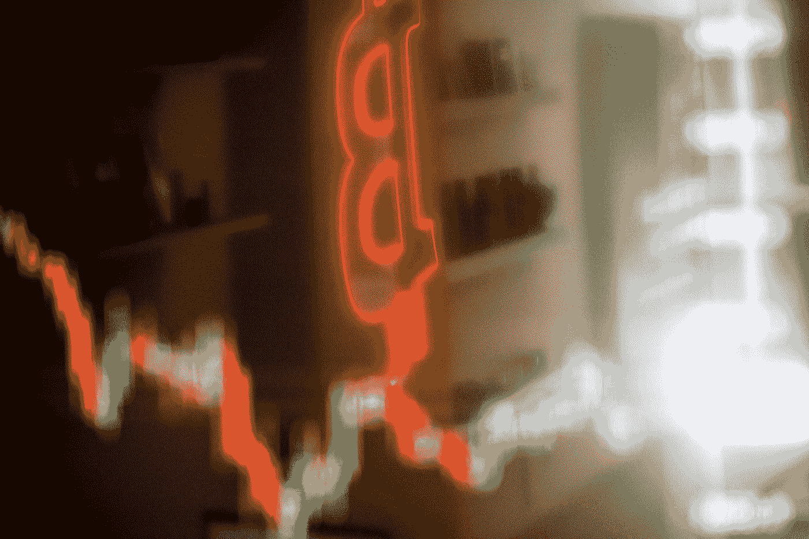

# FTX 事件——人类的缺陷和失败

> 原文：<https://medium.com/coinmonks/the-ftx-affair-of-human-flaws-and-failures-78faae716002?source=collection_archive---------21----------------------->

2022 年 5 月 16 日，西班牙巴塞罗那的一家比特币交易所。(摄影:安吉尔·加西亚/彭博)

史蒂文·博伊基·辛德利

上周，我写了一篇关于第三大加密交易所 FTX 价值 320 亿美元的内爆以及其创始人山姆·班克曼-弗里德(SBF 饰)可能的犯罪活动的文章。我预测了传染病，其他恐怖事件的出现，这些在几天之内就发生了，并继续增长，甚至加速。

然后我暗示说，许多 cryptoverse 的建造者忽略了传统金融在过去 1000 年中学到的教训。有人对我大喊大叫。我将从不同的角度再试一次。

首先，要知道 FTX 事件一直在蔓延，烧毁了它所经过的一切。这远远没有结束，每天都给大多数无辜的人带来新的痛苦。我怀疑我们还没有看到它的一半。可能更少。

这是一个坏演员在几个亲密同伙的纵容下犯下的(他们现在都已经逃离美国，试图找到去迪拜的路，因为迪拜没有引渡条约)。在一个喧闹的地方，SBF 是迷人的、能言善辩的、年轻的和相当谦虚的。然而他愚弄了所有人。据说明智的投资者和风投元老给了他几十亿。名人和政治家都想和他在一起。前白宫通讯联络主任、亿万富翁安东尼·斯卡拉穆奇甚至将他形容为“下一个摩根大通”。

超过 10 万名小玩家被引诱把他们的钱托付给他。他们失去了投资的每一分钱。这个世界上没有政府保险。

现在发现的东西令人难以置信。100 多家公司已经成立，成为他的帝国的一部分。储户的资金(据说安全地存放在区块链上)被自由地借出，并与完全不相关的项目混合在一起(这是法律绝对禁止的；任何在传统金融领域尝试这种做法的人都将面临牢狱之灾。阿拉米达研究公司(SBF 的贸易公司)的年轻首席执行官在一个真正令人震惊的 54 秒视频剪辑【https://www.youtube.com/watch?v=YpkgjLFBuDY[】中描述了他的公司的风险管理，这几乎令人难以置信。](https://www.youtube.com/watch?v=YpkgjLFBuDY)

安非他明的使用受到鼓励。软件安全，嗯，像纸一样薄(甚至有消息称，他有一个“后门”进入软件，允许他移动加密货币，这可能是 FTX 的其他人都不知道的)。

正如一位权威人士所描述的，这是一场失控的少年兄弟会聚会，没有成年人的身影。

这个场景正是最初的区块链技术哲学家试图解决的核心问题所在。他们想要建立一个“不可信”的系统，也就是说，没有任何个人、公司或国家行为者可以干涉或贬低这个系统。其意图是没有人可以信任，因此没有人可以违背这种信任。背信弃义的是人类，就像 SBF 的情况一样。把人类排除在循环之外，就不需要信任了。

只有你不能。不总是。

不过也有例外。最大的链上 Defi 加密交换被称为 Uniswap。在其短暂的生命中，它已经处理了 1 万亿美元的交易，在买家和卖家之间移动各种加密令牌。任何地方都没有人类。没有法律实体，没有 CEO，没有经纪人，没有董事会，没有呼叫中心。只是强化代码。这是它应该工作的方式。

但是人类通常是经济和交易生态系统的一部分；想象一个不真实的世界就像科幻小说一样。正因为如此，不信任的乌托邦往往无法实现。

考虑隐密体的边界，真实世界和区块链之间的界限空间。在这里，真实世界的货币和加密货币、真实世界的地契和 NFT、真实世界的司法系统和智能合约之间存在必要的握手。这些边界总是有人。银行、集中交易经理、州证明人、法官和律师、软件开发商。所有这些人都可能有人类的缺陷。错误、无能、不合逻辑的偏好、偏见，甚至是明显的渎职，就像 SBF 的情况一样。

有人的地方就有风险。

我可能在这里逆流而上，但我不认为的或三箭之都的朱(另一个壮观的崩溃)或 Terra Luna 的权道(另一个壮观的崩溃)进入 crypto 偷钱。我相信这不是最初的犯罪意图。他们未能理解金融风险的复杂世界，而灰色、安静和匿名的后台银行技术官僚和监管官僚对此非常了解。

因此，在宏观熊市第一次到来时，这些善意的密码企业家发现自己跌入了一个陌生的洞穴。然后，当他们冒着越来越大的风险试图再次“做好”时，他们看不到任何东西。

上周发生的事情与区块链的技术没有什么关系，而是与分散在不断增长的加密生态系统中的人类的存在的必要性有关。然而，不信任仍然是一个诱人的前景。

有缺陷的人类和完美的代码。那座桥还没有建成。

Steven Boykey Sidley 是约翰尼斯堡大学 JBS 的实践教授，也是《超越比特币:去中心化金融和银行的终结》一书的合著者。

*这篇文章最初刊登在《每日特立独行》上*

> *交易新手？试试* [*密码交易机器人*](/coinmonks/crypto-trading-bot-c2ffce8acb2a) *或* [*复制交易*](/coinmonks/top-10-crypto-copy-trading-platforms-for-beginners-d0c37c7d698c)
> 
> *加入 Coinmonks* [*电报频道*](https://t.me/coincodecap) *和* [*Youtube 频道*](https://www.youtube.com/c/coinmonks/videos) *获取每日* [*加密新闻*](http://coincodecap.com/)

# 另外，阅读

*   [复制交易](/coinmonks/top-10-crypto-copy-trading-platforms-for-beginners-d0c37c7d698c) | [加密税务软件](/coinmonks/crypto-tax-software-ed4b4810e338)
*   [网格交易](https://coincodecap.com/grid-trading) | [加密硬件钱包](/coinmonks/the-best-cryptocurrency-hardware-wallets-of-2020-e28b1c124069)
*   [密码电报信号](/coinmonks/top-3-telegram-channels-for-crypto-traders-in-2021-8385f4411ff4) | [密码交易机器人](/coinmonks/crypto-trading-bot-c2ffce8acb2a)
*   [最佳加密交易所](/coinmonks/crypto-exchange-dd2f9d6f3769) | [最佳加密交易所](/coinmonks/bitcoin-exchange-in-india-7f1fe79715c9)
*   [开发人员的最佳加密 API](/coinmonks/best-crypto-apis-for-developers-5efe3a597a9f)
*   最佳[密码借贷平台](/coinmonks/top-5-crypto-lending-platforms-in-2020-that-you-need-to-know-a1b675cec3fa)
*   [免费加密信号](/coinmonks/free-crypto-signals-48b25e61a8da) | [加密交易机器人](/coinmonks/crypto-trading-bot-c2ffce8acb2a)
*   [杠杆代币](/coinmonks/leveraged-token-3f5257808b22)终极指南