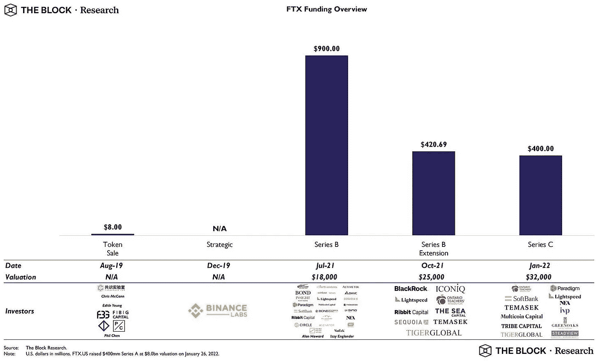

# FTX 的资产负债表

> 原文：<https://medium.com/coinmonks/the-ftx-balance-sheet-2ac755b86d2?source=collection_archive---------0----------------------->

# 当信任消失时，流动性很重要。FTX 充满泡沫的资产负债表背后是什么👀

unsplash

11 月 10 日(星期四)披露的 FTX 资产负债表的一些注释(根据 [**《金融时报》**](https://www.linkedin.com/feed/) )

👉一项 100 亿美元的资产业务在 xls 电子表格上运行🤯

👉一个指向 80 亿美元“隐藏的、内部标签不佳的法定账户”的脚注，让人们看到了无能的程度🤬

👉在报告之日，资产价值超过负债 7 . 22 亿美元。然而，流动资产显然不足以支付提款，引发银行挤兑，导致 FTX 申请破产保护。

👉总体而言，流动资产仅占负债的 10%。回收率是任何人对流动性较低的资产的猜测，可能导致最多 50%的回收率。债权人和储户将承担高达 80 亿美元的总损失。

👉债权人中，Genesis 和 BlockFi 分别被欠 2 亿美元和 2.15 亿美元。我猜这两个会有更多的后续👀

👉FTX 拥有罗宾汉 7.6%的股份，占其资产的 50%以上。可能的清算正在打压胡德的股价。FTX 的风险投资者直接购买 HOOD 会更好。

👉90%的 FTX 资产要么是“流动性较差”的代币，要么是“非流动性”的参与证券。流动性较差的代币资产在一周内暴跌 65%，引发了 FTX 的银行挤兑。

👉事实上，FTX 利用了其专有的 FTT 代币，该代币在几天内损失了 90%的价值。

👉血清(SRM)和索拉纳(SOL)令牌是 FTX 资产负债表上的下一个大风险敞口。尽管 SRM 估价没有多大意义[待定]

👉“其他投资”代表了 15 亿美元的巨额资金，占总资产的 15%。这凸显了 FTX 在风险投资领域的影响力。它的缺席将被深深地感受到。植入的项目可以忘记资本要求。

👉值得一提的是，FTX 在 1 月 22 日以 320 亿美元的估值融资，现在价值为 0(实际上为负)。参与的风险投资者，如红杉、安大略教师基金、软银、Paradigm 等，现在已经注销了他们的投资。

👉这样一个整体在资产负债表中的重要性仍在解释之中。公平地说，FTX 更像是一家银行，而不是一家交易所。现在看起来很清楚，他们在利用债权人的资金投资于各种各样的参与。监管不力是事故的部分原因。

👉由于币安的 CZ，此事一经公开，就引发了一股退出热潮。这是典型的银行挤兑。另一个提醒是，信任实际上是最重要的，信任的证明甚至更重要。

**关于—**

*360 Advisory LLC 是一家总部位于波士顿的 RIA 公司，管理投资，包括加密*

👉[上午 9 点至 30 点](https://twitter.com/930AM2)🐰🕳

**来源—**

👉[https://twitter.com/kadhim/status/1591545782229925889?s=20&t = bildvmdr 07 ekmgaclo 9 wtg](https://twitter.com/kadhim/status/1591545782229925889?s=20&t=bILdVMdR07EKmgaCLO9wTg)

👉FTX 资产负债表揭晓[https://www . ft . com/content/0 C2 a55 b 6-d34c-4685-8a8d-3c 9628 f1 f185](https://www.ft.com/content/0c2a55b6-d34c-4685-8a8d-3c9628f1f185)

> 交易新手？试试[密码交易机器人](/coinmonks/crypto-trading-bot-c2ffce8acb2a)或[复制交易](/coinmonks/top-10-crypto-copy-trading-platforms-for-beginners-d0c37c7d698c)