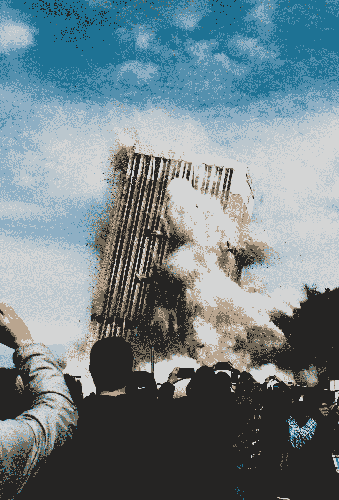
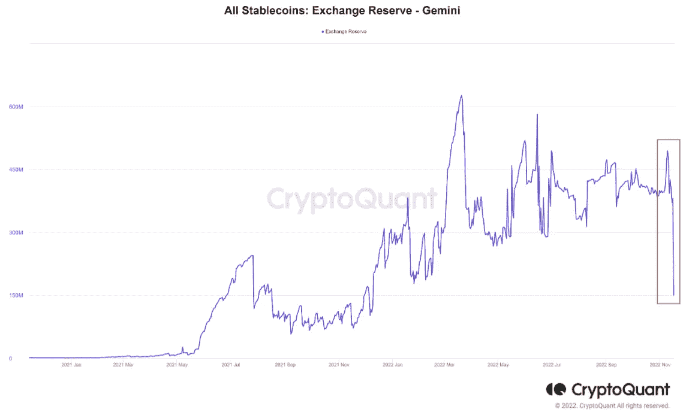
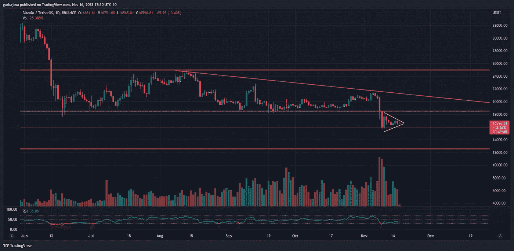
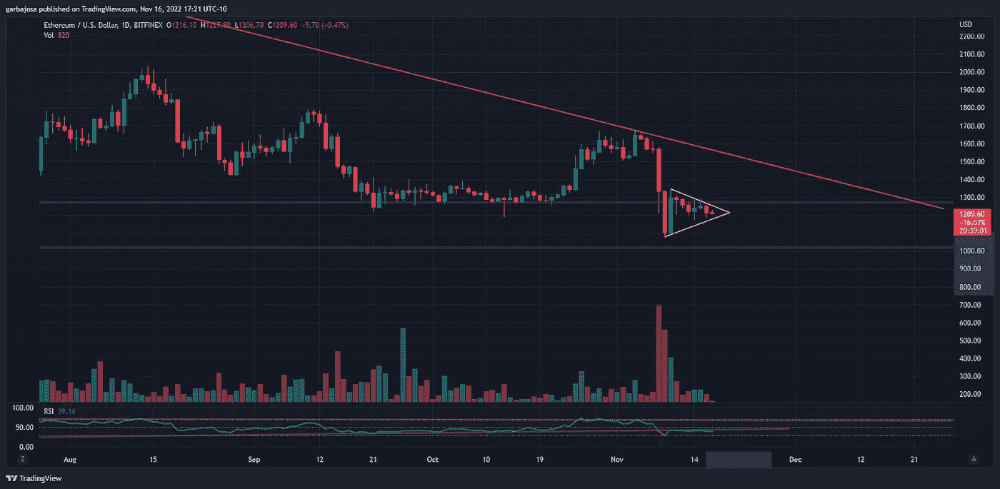
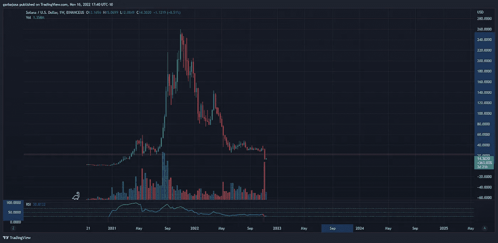
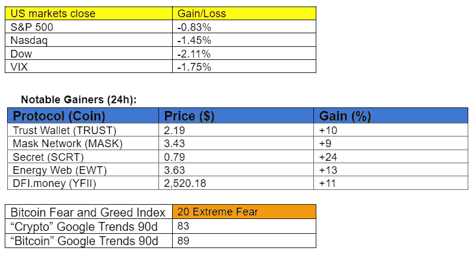

# FTX 的崩溃向我们展示了 DeFi 如何在长期内获胜。

> 原文：<https://medium.com/coinmonks/the-ftx-collapse-shows-us-how-defi-wins-in-the-long-run-b03bf5de6549?source=collection_archive---------13----------------------->

## 秘密征服#128

***最好的每日新闻、见解和阿尔法来源。***

Photo by [Micah Williams](https://unsplash.com/@mr_williams_photography?utm_source=medium&utm_medium=referral) on [Unsplash](https://unsplash.com?utm_source=medium&utm_medium=referral)

***密码市场是一个狂野、奇妙而令人生畏的地方；不要一个人跋涉！订阅加密征服者，让我们成为您的向导。***

**S** [***订阅***](https://tradergabi.substack.com/subscribe?) ***到此每日简讯，永不错过一期。*(零成本)**

**概述**

*   Gemini Earn 是信任、DeFi 和自我保管钱包重要性的另一个光辉例子。
*   市场:熊市标志着进一步的下行风险。
*   正好赶上:THORChain 推出了单面压桩拱顶。
*   NFTs:阿迪达斯推出可穿戴 NFTs。
*   我的五分钱:**DeFI 如何长期取胜。**

早上好，家人，

集中交易所是交易、交换加密资产和利用衍生品进行投机的绝佳平台，但长期储存加密资产仍有风险。

举个例子，双子座交易所是最近受到 FTX 危机影响的。👇

尽管高度监管的交易所很可能保持 1:1 的资产支持，但对于 Gemini Earn 计划来说，情况并非如此。相反，该计划允许用户通过将全部托管权转移给 Gemini 来赚取资产收益，Gemini 反过来又将加密资产借出以产生收益。

双子座将资产借给创世创造收益。对用户来说不幸的是，由于 FTX 的风险敞口，Genesis 刚刚宣布破产。因此，Gemini Earn 现在已经暂停提款。

失去信任的结果是，Gemini exchange 用户在一天内提取了 4.83 亿美元！

*来源:*[*CryptoQuant*](https://cryptoquant.com/quicktake/6375755aa0baa363969f4fe4-Institutions-are-leaving-the-Gemini-Exchange?utm_source=twitter&utm_medium=sns&utm_campaign=Quicktake&utm_content=mignolet)

双子座的出埃及记是一个很好的例子，如果你打算长期呆在密码中，现在不是信任的时候。相反，是时候学习和利用自我保管钱包和 DeFi 的不可信系统。

# 市场更新🌍

BTC/USDT·1D

毫无疑问，加密作为一种投机资产，目前处于 2018 年以来最糟糕的境地。BTC 触及两年低点，在与 FTX 相关的所有传染风险继续解除后，似乎有望进一步下行。在 BTC 日线图上创建一个看跌的三角旗形态突出了这个空间的整体情绪。这种模式通常伴随着进一步的下跌。根据技术分析，价格到达 12.5 千美元支撑位的概率似乎是一个可能的情景，但它是否会以这种方式结束还有待观察。BTC 收盘下跌 1.41%，至 16，662 美元。

*高清* [*图表*](https://www.tradingview.com/x/4CQkuKMP/) 。

**1D ETH/USD**

以太坊的日线图非常类似于 BTCs 的日线图，在之前的 12.5 美元支撑下方形成一个熊市。如果这种模式以类似书本的方式进行，价格下跌的百分比与三角旗的茎相同，那么在未来几天到几周内，ETH 将达到 750 美元。ETH 收盘下跌 3.01%，至 1215 美元。

*高分辨率* [*图表*](https://www.tradingview.com/x/nhdi9lhU/) 。

**索尔/美元 1D**

如果投资者目光长远，风险容忍度高，索拉纳可能会成为一个回报/风险高度失衡的机构。Solana 上的开发和活动与其他层相比仍然很高，但对网络的信任却处于历史最低点。索拉纳离开 FTX 对电视网来说是一个净净的利好，尽管价格持续下跌。如果看跌的三角旗准确地发挥出来，索尔将触及低于 5 美元的价格。

从这一点来看，它仍可能触及 0 美元，但索拉纳总有可能幸存下来，并在下一个牛市周期达到 257 美元的前高点。这使得回报/风险比为 5500/1，即 5500%的回报与 100%的下行风险之比，即 0 美元。

*高清* [*图表*](https://www.tradingview.com/x/nl11Rh4O/) 。

# 新闻观察📰

THORChain“赚”上线。分散式 DeFi 平台 THORChain 推出了它的 live Saver 金库，用户可以在这里赚取单边收益**。**

**FTX 崩盘新闻供稿:**

*   Genesis，crypto lending unit，[停止](https://decrypt.co/114778/genesis-suspending-client-withdrawals-lending-arm-citing-ftx-impact)客户提款；锁定 28 亿美元。币安首席执行官 CZ 正在考虑对贷款资产的潜在投标。
*   加州[催促](https://twitter.com/CoinDesk/status/1593008363381456896?s=20&t=VUrQqzHI3YxiikT6_mBRtQ)暂停 Salt 的加密贷款许可证。
*   有消息称，FTX 员工被鼓励在现已破产的交易所保留毕生积蓄。
*   山姆·班克门-弗里德继续他奇怪的推特咆哮，说“去他妈的监管者”，然后赞扬昨天的那群人。
*   前证券交易委员会官员怀疑 FTX 崩溃将促使国会对加密法规采取行动。
*   新加坡国有投资机构淡马锡[将 2 . 1 亿美元的 FTX 投资减记为零。](https://twitter.com/WuBlockchain/status/1593077552427728898?s=20&t=VUrQqzHI3YxiikT6_mBRtQ)
*   阿拉米达研究公司前联合创始人直言:

*   乔纳森·曼发布 FTX 惨败主题曲:

**新闻花絮:**

*   共和党人确保了美国众议院的多数席位，并将为加密法案开辟道路。
*   制刀扩展为[仲裁](https://twitter.com/MakerDAO/status/1592188855511228417?s=20&t=VUrQqzHI3YxiikT6_mBRtQ)和[渗透](https://twitter.com/CoinDesk/status/1592920457849733122?s=20&t=VUrQqzHI3YxiikT6_mBRtQ)。
*   zkSync [筹集了](https://twitter.com/CryptoGucci/status/1593061022515929088?s=20&t=VUrQqzHI3YxiikT6_mBRtQ)4 . 58 亿美元，并计划在下一个里程碑时开源。
*   StarkNet [在以太坊部署](https://twitter.com/CryptoGucci/status/1593061028048216064?s=20&t=VUrQqzHI3YxiikT6_mBRtQ) ERC-20 代币合约。；STRK 令牌尚不可用。
*   Aave 正在关注隐私的第二层 Aztec 上直播。

**NFT &元宇宙更新🐵**

*   阿迪达斯[发布了其首款可穿戴 NFT 系列产品虚拟恐惧。](https://twitter.com/adidasoriginals/status/1592971519634059264?s=20&t=VUrQqzHI3YxiikT6_mBRtQ)

# 我的五分钱…

***人类决定<不可改变的代码。***

就在我们说话的时候，加密技术正在经历一场革命。对用户来说，FTX 的崩溃仍然是一个悲剧事件，但从混乱中也可以看到一些积极的一面。

正如昨天的时事通讯所指出的，DeFi 正在经历一个蓬勃发展的事件。这是对不可信系统的加密精神的证明，在这种系统中，不可变的代码保护资产免受空间中人类行为者的误导。

这只是开始。

这些事件是 DeFi 的转折点。对于这个领域中每一个被误导的参与者，分散系统的力量都会变得更强大。虽然 DeFi 每天都有所改善，但随着时间的推移，对中央集权实体的信任会缓慢但肯定地恶化。

随着越来越多的实体披露对 FTX 的风险敞口以及易犯错误的行为者的任何未来灾难，这种趋势将会继续。集中玩家相互交织的本质带来的负面影响让人们对 DeFi 的力量有了广泛的认识，这是一个肯定会坚持下去的强大叙事。

这将需要很长时间才能完全显现，但这就是 DeFi 最终获胜的方式。

# ***加布里埃尔***

*关注我的* [*推特*](https://twitter.com/web3_gabri) *每日更新！*

**仅供娱乐之用。从不理财建议**

> 交易新手？尝试[加密交易机器人](/coinmonks/crypto-trading-bot-c2ffce8acb2a)或[复制交易](/coinmonks/top-10-crypto-copy-trading-platforms-for-beginners-d0c37c7d698c)