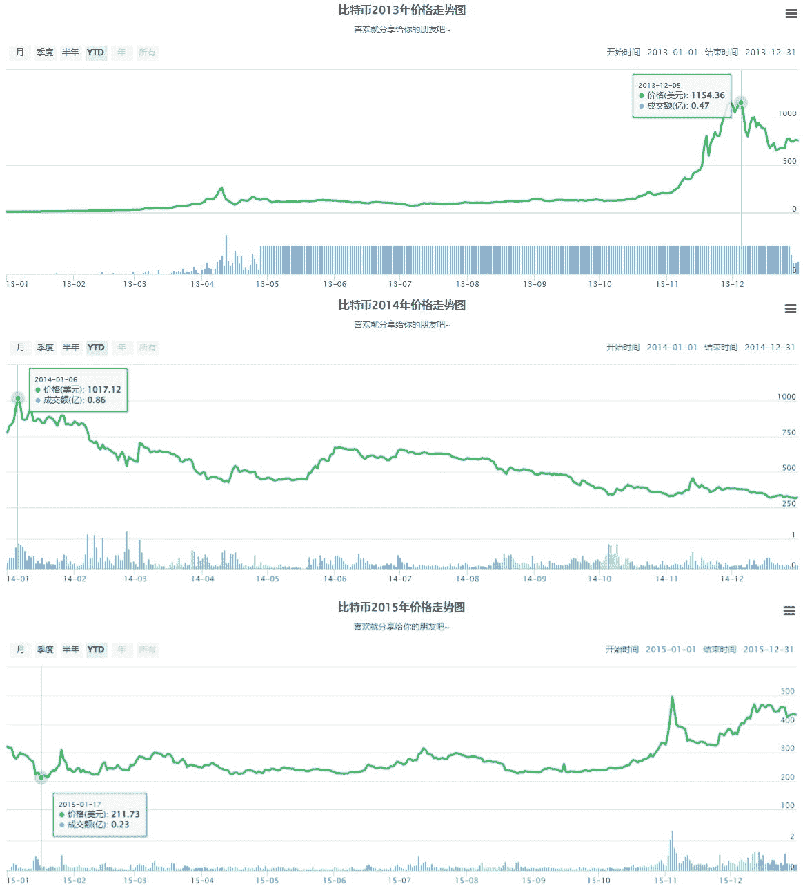

# FTX 站台爆炸，他的 2000 BTC 无法撤回

> 原文：<https://medium.com/coinmonks/the-ftx-platform-exploded-and-his-2-000-btc-could-not-be-withdrawn-f459bd51da26?source=collection_archive---------16----------------------->

11 月加密领域最具爆炸性的事件是震动整个市场的 FTX 爆炸事件。随着第一声巨响，连锁反应接踵而至。交易平台相继出现挤兑，部分平台关闭了存取款，让玩家措手不及。

FTX platform goes bankrupt

FTX 现在已经进入破产申请程序。早期不提现的玩家，现在完全无法操作；被套的用户大多是平台相对忠实的玩家。希望越大，失望越大。

有一名球员现在无法提取他抵押在 FTX 的 2000 BTC。他现在已经绝望了。即使 BTC 跌至 16250 美元，它的资产也超过了 3200 万美元。

现在只能期待，FTX 破产清算后，个人资产能够得到保护，能够获得相应的赔偿；但这种可能性很低，就像曾经倒闭的领先交易平台 Mt.Gox 一样。

The 2000 BTC on the FTX platform cannot be withdrawn

牛市从 2013 年开始，年底 BTC 价格涨到 1154 美元，是当时的历史高点，之后进入下行周期。

2014 年价格从 1017 美元跌到 300 美元，2015 年甚至跌到 171 美元，这一轮熊市最大跌幅超过 85%。

2014 年 2 月，顶级交易平台 Mt.Gox 遭到黑客攻击，共计 85 万 BTC 被盗。三天后，Mt.Gox 申请破产保护。

但当时平台受损用户仍在维权路上，至今未能追回资产。维权之路没有尽头。

BTC price K line from 2013 to 2015

在集中交易平台上，用户操作相对更方便，多重认证，相对保证了用户资产的安全。但是一旦发生重大事故，比如跑路，就完全无能为力，会随着平台一起毁灭。

比如 2014 年的 Mt.Gox，2022 年的 FTX，以及其他知名的交易平台，总共已经倒闭了 75 家交易平台，未来可能还会有平台爆发。

想要在密码市场保护个人财产的玩家必须学会使用数字钱包。只有掌握了私钥，他们才能掌握自己的钱包。

Partially closed trading platforms in 2022

**如何使用数字钱包？**

数字钱包可以存储加密资产。用户创建钱包并生成一组私钥或助记符。只有保住了助记符，他们才能保住自己的钱包。

常用的钱包如 Metamask，imToken，BitPie 等。，一般选择去中心化、完全开源的钱包系统，在本地存储私钥。

或者硬件钱包，比如账本，在本地生成钱包助记符，无需联网，没有助记符泄露的风险，相对更安全。

Common digital wallets

**使用数字钱包需要注意哪些问题？**

数字钱包的使用是有门槛的，一不小心就很容易被盗。一旦助记符被盗或丢失，钱包就不再是自己的了，得到助记符的人可以随意操作钱包。

用钱包登录或者和一些项目互动。如果项目有风险，钱包也有被偷的风险。

以密码世界的黑客市场为例，如果某个项目漏洞被黑客发现，整个项目都可能被黑，资产可能被盗，平台上的玩家也面临风险。

如果一个钱包是存储主要的加密资产，钱包要尽量保持纯净，不要做过多的交互，因为如果不知道是哪个操作，就会埋下安全隐患。

尤其是经常造币各种 NFT，做交互测试的玩家，最好注册一个新钱包参与。

Bitcoin’s current price is $16,500

在集中式平台上，可能存在平台暴露风险；使用数字钱包，存在助记符被盗的风险，一不小心钱包就会归零。

密码市场波动很大，有时暴涨和暴跌只发生在一瞬间。想在这个行业有所收获，首先要做好基础。

这段时间比特币价格上下波动，涨跌受市场消息影响很大。

The bankruptcy of Mt.Gox causes a large number of users’ assets to go to zero

合约玩家可能会在短期内平仓，现货玩家也会影响看价时的心情。
如果你想在市场上有所收获，你必须调整自己的心态。当市场不确定的时候，最好只是观望，不要操作。

以上只是我个人观点，没有投资建议。我是初晓·钱恩，我正在关注元宇宙和 web3。​​​​

> 交易新手？试试[加密交易机器人](/coinmonks/crypto-trading-bot-c2ffce8acb2a)或者[复制交易](/coinmonks/top-10-crypto-copy-trading-platforms-for-beginners-d0c37c7d698c)