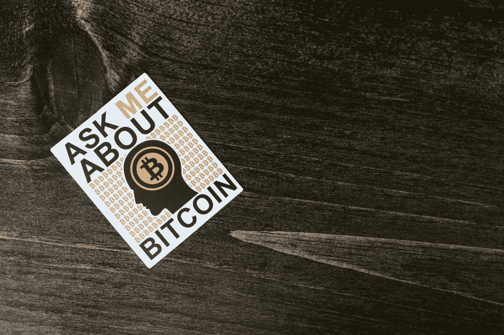

# 比特币的未来:预测和可能性

> 原文：<https://medium.com/coinmonks/the-future-of-bitcoin-predictions-and-possibilities-70f04d0e4a2d?source=collection_archive---------34----------------------->

Source photo [White Photograph on the Table · Free Stock Photo (pexels.com)](https://www.pexels.com/photo/white-photograph-on-the-table-8369834/)

> 从顶级交易者那里复制交易机器人。免费试用。

自 2009 年问世以来，比特币取得了长足的发展。投资者和公众对它表现出相当大的兴趣，一些主要的商家已经开始广泛接受它。然而，第一个也是最著名的比特币的未来会是怎样的呢…