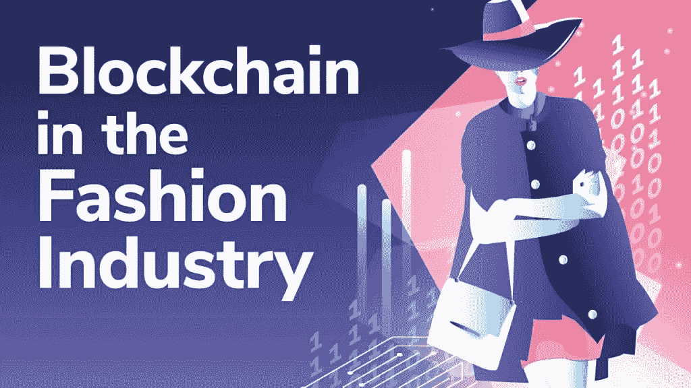
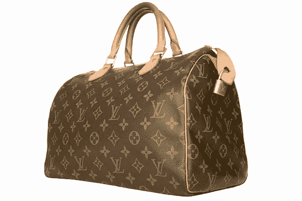
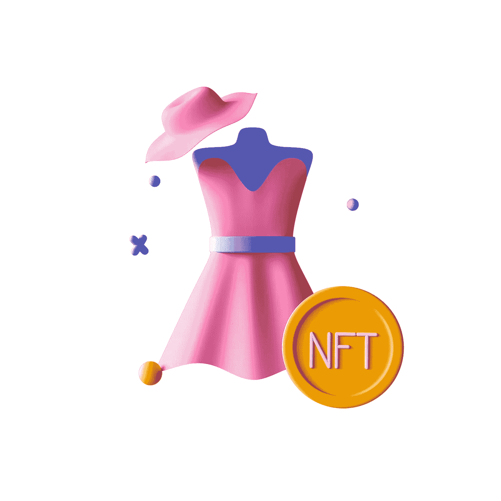
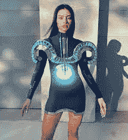

# 区块链在时尚行业的未来

> 原文：<https://medium.com/coinmonks/the-future-of-blockchain-in-the-fashion-industry-6834899fb695?source=collection_archive---------18----------------------->

Source: Moralis Academy

区块链最初用于加密货币，如比特币。然而，区块链提供了多种用例，即游戏；登特兰、供应链、金融和时尚，等等。在这篇文章中，我们将看到区块链给时尚界带来的好处。

我们将涵盖区块链技术在奢侈品、零售和数字时尚中的三个应用领域。

# **奢侈时尚产业**

由于互联网的渗透，世界正被推向一个更加以电子商务为中心的购物体验，越来越多的企业建立在网上。人们不仅购买生活必需品，还购买服装、化妆品、衣服、鞋子以及许多与时尚相关的东西。然而，在不太了解服装的情况下，购买或购买服装仍然存在许多问题，尤其是在奢侈时尚产品方面。

LV Bag — Hard to differentiate between Original and Counterfeit

由于信任问题，人们仍然对在网上购买奢侈品感到犹豫。如果一个人想要增加在线销售，假冒一直是最迫切需要解决的问题之一。例如，贾芳想从普拉达买一个包，她在一个电子商务网站上找到了这个包，并阅读了它的描述和评论。她想在网上购买，但这个包的成本是 3200 美元，她认为最好推迟购买，从商店线下购买。原因是她知道假冒行业的存在，她很有可能会得到一个假包，并担心会损失一大笔钱。如今，奢侈时尚行业的许多公司**都在努力寻找解决这个持续问题的方案**。

区块链可以对打假起到举足轻重的作用。在区块链注册的商品几乎不可能被伪造。如果在分销过程中，一件真品被换成了赝品，区块链的记录会清楚地显示事件发生的时间，并且很容易找到赝品的来源。区块链技术允许消费者从最初的生产阶段到二手市场，访问奢侈品的历史和真实性证明。

Arianee 已经开发了一个协议，使用区块链给实体贵重物品一个数字身份，并像护照一样显示所有以前的所有者和交易，包括物品最后一次服务的时间。

# **服装行业的供应链**

使用区块链技术可以收集和保存的大量供应链数据对于优先考虑可持续产品的时尚公司来说可能是一个宝贵的资源。例如，通过披露有关其采购和生产程序的信息，参加[#谁做我的衣服](http://fashionrevolution.org/tag/who-made-my-clothes/)活动的时装公司可能会增加其真实性。

通过区块链技术可以获得和存储的大量供应链信息可能是时尚公司的**强大资产**，这些公司专注于上述举措，旨在降低许多时尚品牌供应链的高度不透明性。这将为品牌和所有利益相关者带来更高的共享价值，品牌将赢得客户群的声誉和信任。

成品对环境和社会的影响是巨大的。奢侈品牌和零售商很难监控哪些材料最终会出现在成品中，以及原材料的来源和条件，以及哪些产品是由哪些材料制成的。为了帮助克服不透明和低效的供应链带来的问题，时装公司和零售商正在转向区块链技术。

例如，供应商可以使用区块链技术交流和维护有关原材料原产地的数据。通过这样做，生产中使用的每一种材料都有了永久的、不可撤销的记录。由于区块链可以转换为二维码并分配给每个产品，因此可以快速汇总和自我验证，任何人都可以通过二维码或 NFC 读卡器访问。通常，制造信息会保存在内部系统中。因此，买家只需利用手机读取二维码，就可以了解产品的完整历史及其对环境和社会的影响。

# **元宇宙数码时尚**

近年来，时尚行业迅速加快了向数字世界的转移。由于游戏和元宇宙社区的快速发展，数字服装似乎有望加入我们不断发展的衣柜。

Buy Digital Dress using NFTin Metaverse

人们现在可以在数字服装平台上以新的方式与时尚联系起来，从购买可穿戴设备到投资不可替代货币(NFT)。数字时尚的普及正在持续发展。数字可穿戴设备——虚拟角色可以在游戏或元宇宙平台中穿着的衣服——和时尚 NFT——用加密货币购买的限量收藏品——彼此非常不同。另一个选择是购买可以覆盖在你真实形象上的数字服装。

Digital Clothing

以 [DressX](https://dressx.com/) 为例，这是一个市场，人们可以在这里购买可以叠加在现实生活照片上的数字服装；或者是[的制作者](https://www.thefabricant.com/)，对 NFT 感兴趣的人可以使用加密货币为他们创造和购物。

# 参考

[https://www . multi law . com/multi law/multi law _ News/multi law _ News/block chain _ fashion _ article . aspx](https://www.multilaw.com/Multilaw/Multilaw_News/Multilaw_News/Blockchain_fashion_article.aspx)

[https://www . ftaccelerator . it/blog/区块链-科技-未来-时尚/](https://www.ftaccelerator.it/blog/blockchain-technology-future-fashion/)

 [## 时尚界的区块链-时尚界区块链将腾飞的 8 个理由-道德…

### 众所周知，时尚行业，尤其是奢侈品牌，在快速发展的过程中姗姗来迟

道德学院](https://academy.moralis.io/blog/blockchain-in-fashion-8-reasons-blockchain-in-the-fashion-industry-will-take-off)  [## 谁制作了我的服装档案——时尚革命

### 印度秘密项目。来自印度秘密项目的公平贸易时尚是一个社会企业…

www.fashionrevolution.org](https://www.fashionrevolution.org/tag/who-made-my-clothes/) 

> 交易新手？尝试[加密交易机器人](/coinmonks/crypto-trading-bot-c2ffce8acb2a)或[复制交易](/coinmonks/top-10-crypto-copy-trading-platforms-for-beginners-d0c37c7d698c)