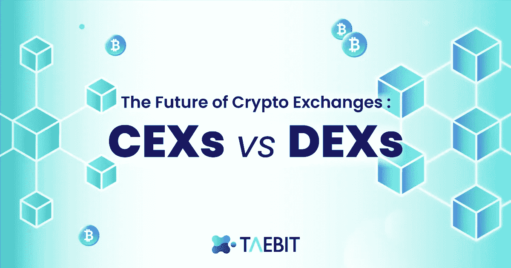
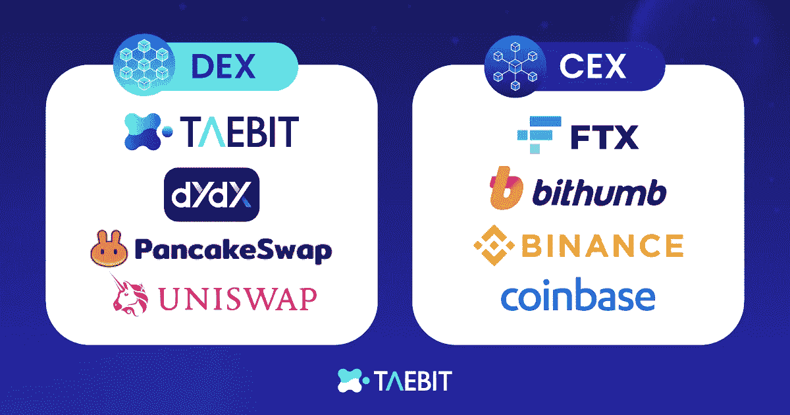

# CEXs vs DEXs:密码交换的未来

> 原文：<https://medium.com/coinmonks/the-future-of-crypto-exchanges-cexs-vs-dexs-b1481d231df9?source=collection_archive---------37----------------------->

# 人们在哪里交易加密货币最多？

Defi 越来越受欢迎，通过加密交易所吸引新人进入市场，加密交易所是用户无缝即时购买、出售和交易加密货币的门户。

加密货币交易所——集中式交易所(cex)和分散式交易所(dex)——是绝大多数交易和投资发生的地方，每天交易数十亿美元。在每日交易量最大的加密货币交易所中，前五大交易所是集中式的，由一个中央机构/公司运营，其中币安遥遥领先。分散式交易所不依赖于中央机构，而是由智能合约和 dApps 来运营，以实现交易自动化。通过提供更低的费用、更多的隐私和更少的监管，dex 越来越受欢迎。

# 分散交易所(dex)的优势是什么？

DEX 是一个分散的交易所，是一个 P2P 市场，交易在加密交易者之间进行。DEX 的核心价值是不信任，也就是说没有中介可以依赖。DEX 的用户可以进行更高级的下单，比如设置限价单。与纳斯达克类似，所有这些交易都由交易所自己通过“订单簿”处理，该“订单簿”根据当前的买卖订单确定特定加密货币的价格。

通过省去收取交易费用的中介实体，dex 能够比它们的集中式对手更快、更便宜地完成交易。2021 年末，领先的 DEX——unis WAP——对 10 万美元的交易收取 0.05%的交易费，而币安、比特币基地和北海巨妖的 CEXs 分别收取 0.1%、0.2%和 0.2%的交易费。使用分散式交易所还能让用户以更高的效率在多个链之间转移数字货币。由于分散的交易所可以连接到自我管理的加密货币钱包，用户可以装载和卸载他们选择的货币，并在理论上无限次转换这些货币。集中式交易所通常会根据交易频率或特定账户的年龄来锁定用户的资金。

# 在分散交易所(DEX)购买 crypto 安全吗？

分散式交易所为投资者提供了购买数字资产并保持对其私钥的完全控制的绝佳机会。用户可以将他们选择的数字钱包连接到 Uniswap、Sushiswap 和 Curve 等主要的分散式交易所。一旦连接上，他们可以交换任何他们想要转换成不同货币的资产。当用户了解他们的订单会如何影响某些市场条件时，与 DEX 交易是安全的。例如，一家大型加密货币对冲基金可能利用一个集中交易所发出 5 亿美元的买入指令，以确保其买入不会导致基础资产价格大幅波动。虽然这个问题是小众的，但它代表了理解投资加密货币的最安全方式的重要性。

# 集中交易所的缺点是什么？

集中式交易所的平均费用较高，限制了用户自主管理自己的资金，但它们也提供了一个免受监管压力的屏障，对于不希望管理自己私人钥匙和钱包的交易员来说，可能是一个更安全的选择。集中式交易所还面临着一波反弹和指责，指责它们缺乏透明度，涉嫌价格操纵。多年来，这些公司中有几家以不透明的方式经营其订单簿，导致缺乏透明度和投资者普遍不信任。

# CEX 和德克斯有什么不同？

总体而言，分散式交易所收费较低，个人对资金的控制权也大得多。相比之下，集中式交易所更容易使用，通常提供更多的流动性，并消除了个人可能管理不当的风险。

# 一个新指标的出现:泰比特

# 泰比特·德克斯的愿景

作为外汇交易的下一代，Taebit 结合了 dex 和 CEXs 的优点。Taebit 是一个革命性的新型分散式交易所，它将允许用户获得无缝流动性、低交易费用和资金自助存储的好处，同时引入了有史以来第一个链上加密货币外汇交易平台**。外汇市场是世界上最大的金融市场，日均交易量超过 6.6 万亿美元。与加密市场类似，外汇交易市场 24/7 全天候运营，对来自世界任何地方的个人开放。**

创建 Taebit 的目的是为自营投资者提供工具和平台，让他们能够参与建立在区块链基础上的快速、安全的外汇市场。使用不同价格的各种加密货币会使 crypto 中的心理核算变得非常困难，特别是当不同平台和货币系统之间的面值不同时。Taebit 将直接插入 Alkemy mint 平台，允许用户创建稳定的货币，直接跟踪本国货币或任何货币，如澳元、美元和 aKRW。ISS(内部稳定互换)系统将使增强互换成为可能，通过压力函数以理想价格向市场提供流动性。

> **用户将能够获得这些新的稳定货币，并在 Taebit 平台上使用它们，以便交易他们希望交易的任何外汇头寸或市场。**

# Taebit & Alkemy:释放新生市场的力量

大多数分散式交易所都有强大的自动做市算法。尽管如此，他们要求用户上传美元挂钩的稳定货币或连锁店的本国货币，以便进行交易和投资。Alkemy stablecoin minting 平台和 Taebit 的外汇市场相结合，允许投资者在同一个中心内交易多种货币。

交易者可以根据个人喜好用韩元、欧元和美元来命名他们的加密资金，并立即使用这些资金投资于外汇市场。由于[**python Network**](https://pythnetwork.medium.com/pythiad-1-the-journey-so-far-c4c951271805)通过 Solana 区块链将来自前 50 大交易公司和交易所的市场数据连接到任何智能合约，价格数据将是准确和反应性的。Alkemy 和 Taebit 的组合不仅在许多地方增加了易用性，而且还利用了 [**Serum**](https://www.projectserum.com/) 自动做市引擎，以便在执行交易时实现最有效的价格。

# 分散交易所(dex)的未来

分散式交易所的未来将高度依赖于它们吸收集中式交易所最佳方面的能力，并将它们整合成一个无所不包的平台。 [**Taebit**](https://taebit.io/) 更进一步，将世界上第一个多货币稳定货币市场引入区块链，**允许参与者以闪电般的速度和最低的费用交易他们选择的货币。**

跟随我们一起了解☯️

> 白皮书:[https://taebit.gitbook.io/taebit-1/](https://taebit.gitbook.io/taebit-1/)
> 
> 推特:[https://twitter.com/TaebitDEX](https://twitter.com/TaebitDEX)
> 
> 不和:[https://discord.gg/gBjqjFXmn2](https://discord.gg/gBjqjFXmn2)
> 
> 电报:[https://t.me/+4kkLYgMPtZw3NjJl](https://t.me/+4kkLYgMPtZw3NjJl)

> 交易新手？试试[加密交易机器人](/coinmonks/crypto-trading-bot-c2ffce8acb2a)或者[复制交易](/coinmonks/top-10-crypto-copy-trading-platforms-for-beginners-d0c37c7d698c)