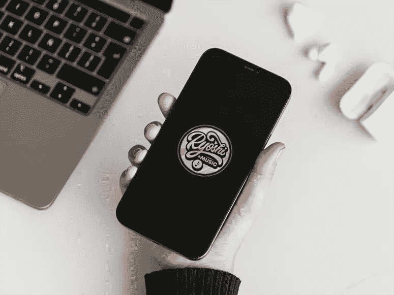
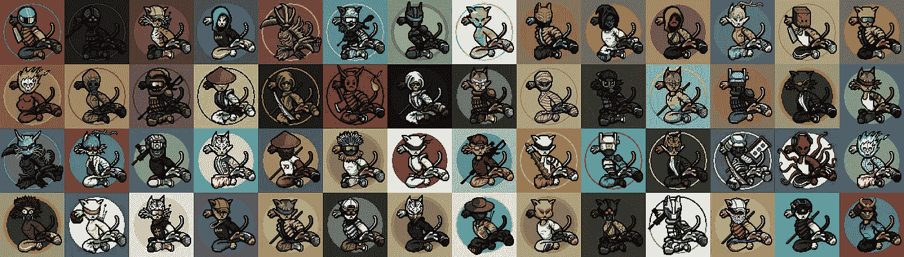
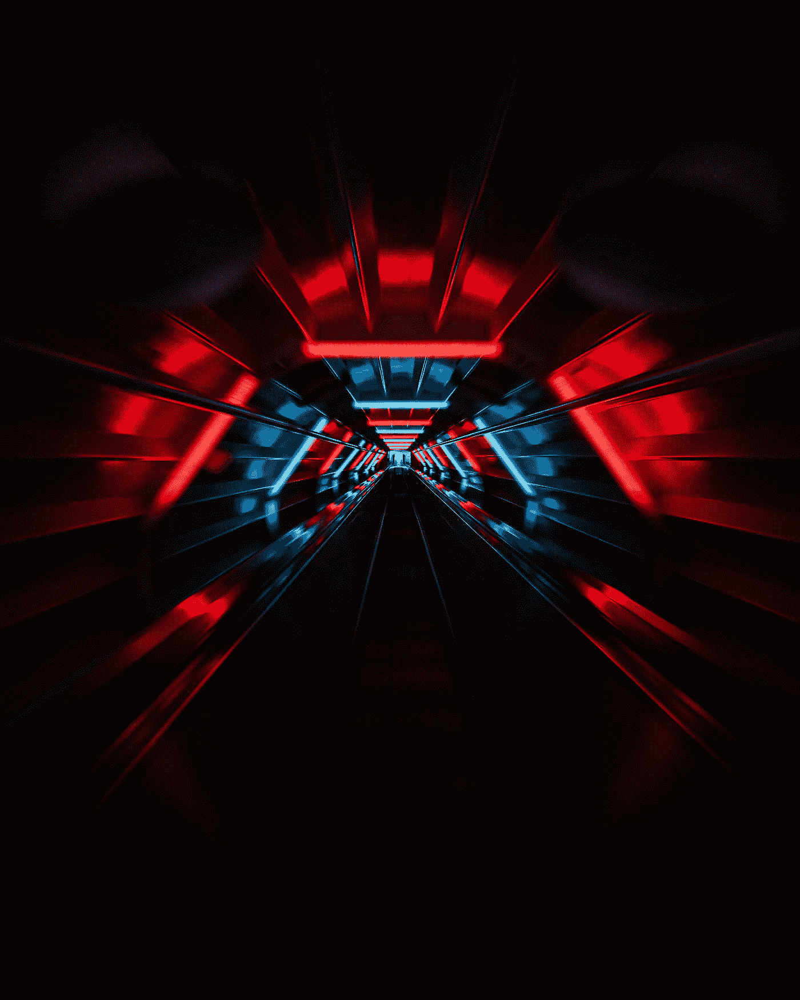

# 密码的未来掌握在我们手中

> 原文：<https://medium.com/coinmonks/the-future-of-crypto-lies-in-the-palm-of-our-hands-7d3414516bd0?source=collection_archive---------3----------------------->

**海千山千**

**翻译:**“海洋千，高山千”

***意为***——指狡猾的老狐狸，某人什么都见过，因此可以处理任何情况，通常是通过狡猾。

问候各位远见者。

值此 token 创立一周年之际，我们希望你们每一个人都做得很好，坚持不懈。

让我们来谈谈我们愿景的未来…

我们都是良史。

我们社区发生了很多事情。权力下放和接受是我们都在努力的目标。为了我们的代币，要达到实用的顶点，必须翻越许多高山。即使面对斗争和挫折，我们社区的奉献精神和火花依然闪耀。想象和实现统一成功的能力必须处于这一伟大征服的最前沿。

我们不能忘记我们是谁。

**一年前…**

去年，妻子创造了我们心爱的龙志的视觉象征，作为伟大的龙志的见证。愿景是在任何市场的任何方面实现真正的分散化。

这一愿景今天仍然适用，我们要衷心感谢我们所有的龙志同胞，感谢他们将这一愿景置于一切之上。

我们的社区是万里挑一的。我们将继续这条道路，向世界展示未来始于同一个愿景。

这是我们的时代。

我们必须随波逐流

*《站台》*

我们的 Ryoshi+音乐工作人员一直在努力为我们带来一个伟大的实用工具，这将是 Ryoshi 愿景的一颗闪亮的星星。这个新的音乐平台——移动应用——旨在成为音乐加密的行业标准。

该应用融合了所有主流流媒体平台的最佳方面和功能，允许用户创建和构建 web3 中的音乐平台所能提供的最友好、最具创意和沉浸式的体验。

所有用户都可以通过这个平台制作、播放和交易他们喜欢的歌曲和混音。

还将有由 Ryoshi+ Music 工作人员主持的现场活动，抽奖活动，以赢得罕见的独特的 NFT Ryoshi+Music，还有更多活动有待宣布！

最重要的是，这个新平台将提升艺术家的价值，并为我们自己的本土标志*ryoshi 的愿景*以及我们更大的生态系统提供更多的用途。

**守护者拥强**

我们的龙骑士卫队

自创立以来，NFT 龙狮护卫队(官方的龙狮愿景)的唯一目的一直是一样的——守护愿景。在不到一年的时间里，我们的目标已经从一个简单的帮助扩展愿景的营销计划，发展到了我们现在所处的位置。

随着我们的眼睛死盯着更广阔的视野，我们现在可以发展龙志的警卫项目，并在龙志的视野内将我们的 NFT 发展成为新发现的新兴公用事业。随着许多新的、令人兴奋的、突破性的项目在密码领域兴起(如元宇宙)，我们将继续我们卑微的使命——触及**每一个钱包**；但是*现在，*此外，每个造币厂都有奖励给每个龙狮守卫持有者相关的**效用利益**。

**一首守护之歌**

Ryoshi 卫士对 Ryoshi+音乐平台的影响将涉及 Ryoshi+音乐生态系统的多个方面。

随着 Ryoshi+ Music 项目的进一步发展，Ryoshi 的卫士将帮助引领 web2 功能如何顺利过渡到这个新的 Web3 设计的进程。音乐产业向元宇宙的多层次过渡/引入将是一项伟大的事业，随着新的想法被具体化为真正的发展和原型，Ryoshis Guard 正计划无缝地放弃这项事业。

Ryoshis Guard 团队及其开发人员了解适应这一领域的重要性。随着元宇宙的发展和变化，他们将抓住每一个机会，利用前沿的创新和概念。这将最终转化为 Ryoshi+ Music 的成功。

**元宇宙**

目前，Ryoshis Guard 在 Shib:元宇宙(Shiba Inu 社区的官方元宇宙)拥有大量土地，并计划将其开发为多功能虚拟财产。我们的最终目标是为我们在元宇宙购买的地块创造收益/收入流，这有可能转化为所有 ryoshi Guard NFT 持有者和 Ryoshis Vision 核心社区的收益流。

*考虑到这一点…*

许多细节(如分配的百分比、整体结构和布局)目前仍有待确定。但是我们随时准备克服任何困难。

我们所有人内心都有着相同的愿景。

**激发运动**

我们的龙狮护卫队 NFT 持有者将总是能够从所有当前的龙狮护卫队项目中受益，并且他们将是第一个收获即将到来的许多好处的人…

作为拥有一个守卫的激励措施的一部分，Ryoshi 的守卫持有者将是第一个通过测试的人，并使用 Ryoshi+ Music 的 Alpha/V1 平台。

此外,《龙狮护卫队 NFT》的持有者还将成为第一个**获得**特殊权限**的**人，该权限与目前正在开发的《龙狮+音乐》未来即将推出的音乐项目有关。****

**所有守卫持有人**都将获得作为**第一个**购买并持有未来任何 Ryoshis 守卫 NFT 收藏的固有利益；直接推动了龙狮+音乐的未来**成功**。

**即将出现的合作伙伴关系**

Ryoshis Guard 目前正致力于战略合作伙伴关系，将很快宣布。

正如我们在加密领域的许多人都非常了解的那样，伟大的新加密合作伙伴关系是复杂的，他们要处理 IRL 合同和条款以及 NDA 的合同和条款。因此，关于我们目前正在努力的不同伙伴关系，可以说的很少。

然而，毫无疑问，到时候我们的*社区*将会是第一个**知道**任何**合作关系的**。****

**路线图**

最后但肯定不是最不重要的，Ryoshis 的卫队将发布一个官方的 NFT 路线图的基础上，我们的销售到目前为止。这个路线图将在我们继续打造每一名后卫直到最后一刻(RG #10，000)的过程中制定。随着每一个新的里程碑的实现，我们的路线图将触发*大规模的*专属于我们的警卫社区的赠品。

此外，随着我们朝着 10，000 mints 的目标前进，任何关于新项目发布的更新和更多信息都将随时可用。这些惊人的新想法加上我们目前的营销策略将继续成为我们所有人的驱动力。

*话虽如此…*

祝我们大家周年纪念日快乐！

***#守卫视野*** 😼

免责声明:这是一个动态文档，在发布时是最新的。细节如有变更，恕不另行通知。本文件中包含的任何信息都不是财务建议、投资建议、交易建议或任何其他类型的建议。Ryoshis 的愿景总是建议在做任何财务决定之前咨询财务顾问。

*如果您确实购买了包括 Ryoshis Guard 或其他伞状资产在内的 Ryoshis Vision 资产，您理解并同意您不是在购买证券或投资。*

*您同意并理解，对于您在投资加密货币时可能遭受的任何个人损失或税收，Ryoshis 的愿景永远不会被追究责任或受到责备。*

*您同意 Ryoshis 视觉团队“按原样”展示产品，无需提供任何支持或服务。*

*您理解并同意，Ryoshis Vision 不负责也无法验证您当地与加密货币相关的法规。*

您理解 Ryoshis 的视觉没有注册为数字货币，并且您接受与您当地政府的规章制度相关的所有责任。

*在你进行任何形式的购买之前，一定要确保你符合当地政府、税收法律和法规。*