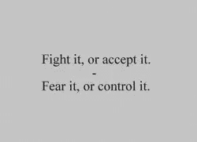
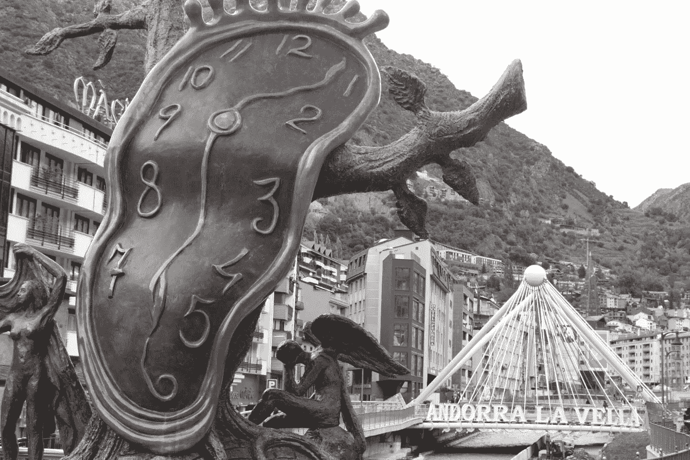
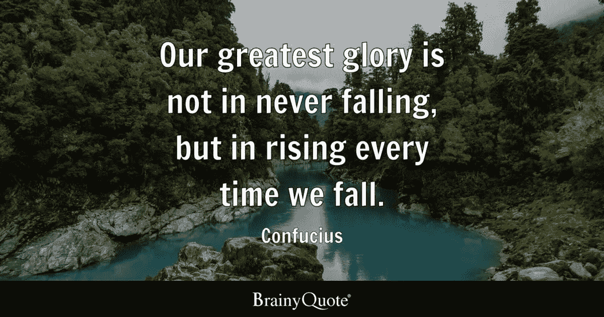
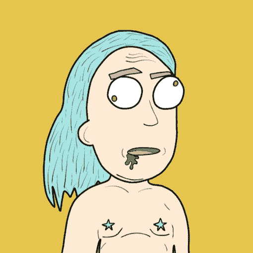

# Crypto/NFT 的未来(我们必须抵制 CBDC 的)🪙

> 原文：<https://medium.com/coinmonks/the-future-of-crypto-nfts-we-must-resist-cbdc-s-8e86d8220a3d?source=collection_archive---------18----------------------->

把这里所说的一切都当成猜测，永远是 DYOR…

如果社会不开始(迅速)认识到当权者并没有把人类的最大利益放在心上，那么我全心全意地相信，区块链，这种令人惊叹的技术，将被用来反对我们，以获得更多的控制、利润和操纵，而有利于老大哥。

我们为什么喜欢 crypto？一些德根人(现在)可能会说“为了利润，兄弟！!"但是，一旦大规模采用发生，或被强加给我们，这种高水平的波动性将在不久的将来开始稳定，这些巨大的快速收益可能在某种程度上已经结束…

我们可能喜欢加密，因为它发送速度极快，在某些情况下可以立即发送，或者因为它是“匿名的”…

其他人可能喜欢他们可以向世界上任何地方的任何人发送任何商品或服务的加密(货币),不问任何问题，只要他们接受加密。

不管你参与加密/网络 3/NFT/区块链空间的原因是什么，事实仍然是在不久的将来，我们的政府(老大哥)将过渡到一个无纸化社会，在那里我们将**“一无所有，幸福快乐”…**

有什么比必须印刷纸币、兑换黄金/白银、雇用会计来计算数字或交易牲畜更便宜的呢？？？区块链算法根据你设置(编码)的边界对交易说 100%是或否。

> 我们真的认为老大哥不想要这样一种社会，在这种社会中，他们不必在某种意义上“管理系统”，他们可以让算法成为整个金融系统的看门人，而这通常需要 1000 名员工来维护。他们当然想要这个！
> 对他们来说更低的成本，更多的控制，100%是/否的机器人行动，100%的人将支付他们强加给我们的“税”，他们将完全控制人们如何/在哪里/做什么/为什么/何时花自己的钱…

在我们接受老大哥不可避免地“给我们”的贿赂(没有什么是免费的…)之前，我们必须坐下来，真正地问自己，我们是否希望这个系统完全控制我们的货币供应…

> 他们将有能力(在不久的将来)做中国已经在做的事情…在他们的 CBDC 实施一个社会信用体系，如果你不是一个“杰出公民”,你可能会从你的信用评分中扣分，并且可能没有资格购买生存所需的某些商品或服务…

我对未来的看法是，WEF/世卫组织/美联储和所有其他管理世界的三个字母银行行长将向人们发放“基本收入津贴”……正如我们在 covid time 看到的那样，这种情况发生了……他们直接给每个公民数千美元……这不是因为他们真正关心我们，想帮助我们……不，这是因为他们希望我们在所有事情上都完全依赖他们……因为当我们依赖某样东西/某个人来支持我们时，我们就不再拥有这种权力。

我能预见到的摆脱这种反乌托邦式的未来的唯一方法是，如果我们不让老大哥控制/监管区块链。

> 想象一下，当 *WEF* 说**“如果我们发现一个钱包地址向另一个地址发送比特币或任何其他不被接受的加密货币，我们有权追踪发送者的 IP 地址，派政府官员到你家，逮捕你(或更糟……)……”**

在这种情况下，我们几乎都将被迫只使用他们的数字货币…如果我们不勇敢地面对老大哥，说我们不再承认他们控制/监管我们世界经济的权威，这就是我们正在走向的方向。

老大哥会如何提出引入这一新的经济体系？如果我不得不打赌，我敢打赌他们会等待，或者更有可能创造一个事件，在这个事件中，人们会留下来寻找领导…像重大的经济崩溃/疫情/战争等…(一些煽动恐惧的事情)当我们最需要的时候，他们会给我们他们的解决方案，最终的解决方案…

我问你……世卫组织，有谁能告诉别人，他们能或不能买任何他们想要的东西？！？！没有人应该对其他人有权力，因为我们都是一体的。

以自由的名义，反抗！✊🏼

_ _ _ _ _ _ _ _ _ _ _ _ _ _ _ _ _ _ _ _ _ _ _ _ _ _ _ _ _ _
_ _ _ _ _ _ _ _ _ _ _ _ _ _ _ _ _ _ _ _ _ _ _ _ _

**永远小心！！！⚠️**

*这一点我怎么强调都不为过！保持高度警惕，留意你点击的每一个链接、你做的每一笔交易和你接触的每一个人，因为这个领域骗子很多，即使是最好看的项目也会被撤下。*

点击所有链接之前，要再三检查，确保它们是你要找的官方链接。此外，在给自己或他人发送任何有价值的东西之前，要再三检查所有的钱包地址。

> [*推特*](https://www.twitter.com/metadadsxyz)[*不和*](https://discord.gg/Cv8v2Ert8m)[*YouTube*](https://www.youtube.com/channel/UC7pbtSBs9nRJHK6coMhCR8g)[*抖音*](https://www.tiktok.com/@thedudescrypto)[*insta gram*](https://www.instagram.com/metadadsxyz)[*Spotify 播客*](https://open.spotify.com/episode/5U8vXE9HDAsGbSbebw9p62?si=2rZIigw-Tw2pCxjxmkbYzQ)
> 
> 请发送 Polygon Matic 到这个 Eth 地址或 Eth Tokens 来支持我和我的家庭🙏🏼
> ***0xb 53 b 3978333 e 11 c 382 ab 619 f 02 f 469 A8 c 70750 af***

_________________________________________________________________

感谢阅读:]

## 干杯，
泰，又名“纨绔子弟”

**其他一些我的博文:**
[web 3 的 5 个败笔](/coinmonks/5-downfalls-of-web3-cd5dc8ade4fd)
[5 + 5 不欢而散的战术](/coinmonks/5-tips-for-a-better-discord-nft-crypto-edition-ff9b039d0359)
[Crypto 101:初学者指南](/coinmonks/crypto-101-a-beginners-guide-345d440bd163)
[NFT 5 大最佳实践(营销&社区成长)](/coinmonks/top-5-nft-best-practices-marketing-and-community-growth-7025e26eb50c)
[Web3 基础知识](/coinmonks/web3-basics-252121357f33)

> 交易新手？尝试[加密交易机器人](/coinmonks/crypto-trading-bot-c2ffce8acb2a)或[复制交易](/coinmonks/top-10-crypto-copy-trading-platforms-for-beginners-d0c37c7d698c)