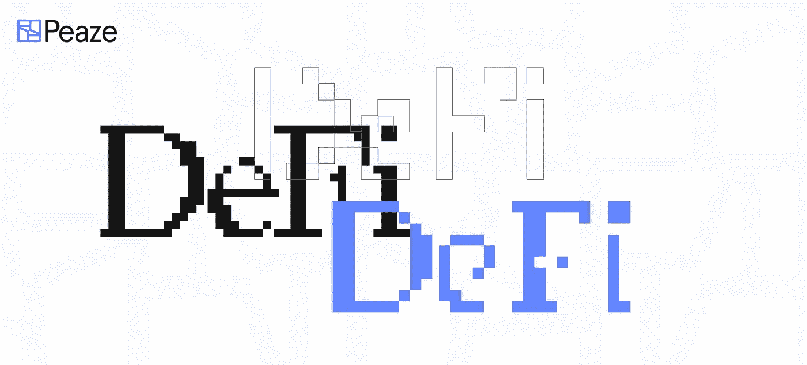
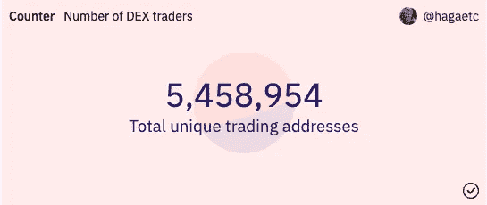

# DeFi 的未来

> 原文：<https://medium.com/coinmonks/the-future-of-defi-9fe8665bbd1?source=collection_archive---------21----------------------->

> 为了详细说明用户体验对 DeFi 的生存能力有多重要，我们请来了一位专家来共同撰写本文——[Anon Intern](https://twitter.com/AnonNgmi)、 [Apollo DAO](https://apollo.farm/) 的创始人和 [Settlers.build](https://twitter.com/Settlers_build) 的联合创始人

# 什么是分权金融？

分散金融可以定义为建立在区块链上的金融应用程序，其功能和基础设施可以通过智能合同进行公开验证，任何人都可以通过智能合同访问该应用程序。DeFi 是 web3 中一个相对较新的循环，一个简化的术语，概括了链上金融提供的工具和资源的广度。这些机构履行与传统金融机构相同的职能，提供贷款，赚取存储资金的利息，并进行各种类型的交易。不同之处在于推动这些宝贵操作的效率和透明度——Defi 不依赖过时的软件，而是提供即时转账和每日退货，所有这些都无需批准或漫长的流程。去中心化的本质是建立和维护一种架构，为每个人提供基本的金融产品，而没有大公司经营的银行的官僚作风。

加密借贷和点对点数字资产交换在 2018 年左右开始出现，但确切的术语“DeFi”直到 2019 年初才出现。据 CoinTelegraph 报道，现在至少有 20 种不同类型的 DeFi，所有这些都可以应用于金融系统的各个方面，包括支付处理、借贷和投资。DeFi 中有三个主要功能推动了最大的交易量:分散的交易所允许用户像买卖股票经纪账户一样买卖加密资产；流动性池的运作类似于一个储蓄账户，允许用户将其资金存入金库，并以使用其资金为交换获得红利；此外，没有文书工作的连锁借贷也减少了，并允许对借出的资金立即收取利息。

DeFi 创造了一个没有第三方或审批系统干预的交易环境，允许用户要求对自己的资产和证券进行控制。在这个生态系统中，所有参与者都是平等的，每个人都有获得回报的机会。然而，虽然区块链提供了许多优于传统金融轨道的优势，但它也带来了挑战。随着生态系统的持续增长，其巨大的潜力受到了一个主要障碍的限制:吸引大规模的采用。那么是什么阻止了他们呢？ ***用户体验*** 。

# DeFi 中用户体验的重要性:

为了让 DeFi 蓬勃发展，人们不能知道他们正在使用 DeFi。DeFi 如何在链上扩展，直到我们可以轻松地让更多的人参与进来？尽管一些 deep DeFi 技术很酷，但这并不是每个人目前都应该建造的地方。有时候，工程师可以过度设计东西，制造这些超级复杂的系统，这无疑令人印象深刻，但这是否会推动大规模采用呢？通常，答案是“不”

目前有一种市场二分法定义了 dapps 如何构建他们的用户流:web3 maximalists 和那些寻求中间立场的人。像[曲线](https://curve.fi/)这样的最大化主义者，在花哨的图形、笨拙的流程和难以使用的体验上吹捧自己，因为他们没有瞄准对加密好奇或即将成为用户的观众；他们想要鲸鱼，庄稼中的奶油——这很好。还有像[earning](https://yearn.finance/vaults)这样的平台，它们建立了一个相对容易理解的平滑界面，crypto 还没有从行话中消失，但在大多数情况下，普通投资者可以理解。然后，金融应用有两个价值主张:推动其使用的货币激励和实现这些激励的便利性。在 Web2 中， [Mint](https://mint.intuit.com/) 将我们所有的投资平台和银行账户与您的资产净值的强大可视化和管理连接起来；Venmo 支持点对点支付，可轻松连接到银行或信用卡；Robinhood 通过快速的 KYC 和银行支持的交易使股票市场投资无缝衔接。因此，作为 web3 基础设施的建设者，我们有证据声称我们的技术更好，但如果我们不接受挑战，建立一个可以与 web2 相媲美的体验，这项技术将不会有机会见天日。用户体验就是产品。

A singular important image. Thanks, Fredrik and Dune!

# 入职策略

我们必须致力于让更多人参与 DeFi，并根据广泛的用户反馈设计 UX 产品。每天都在构建和改进的技术对未开发的用户市场几乎负有义务，以使那些最需要它的人能够访问它，这构成了今天使用它的大多数人。我们看到非洲社区通过加密改变了他们的社区运作和交易方式，拉丁美洲的社区获得了稳定的货币，避免了巨大的暴政和通货膨胀。为未来的大量用户抽象出复杂性将使获得这种自由变得更加容易。这可以通过改进语言来简化学习曲线，为更具技术挑战性的资源提供平易近人的教育，或者简单地完全隐藏任何 web3 或加密，并利用后端技术来实现。

钱包是使这个过程对开发者和用户都更容易的下一步。它不仅要易于设置，还要易于管理和使用。成为你的资产的自我保管人是非常有价值的，但是对于大多数用户来说只是有时需要或者有益。钱包和保管解决方案必须在安全性和易用性之间架起一座桥梁。Peaze 正在努力做到这两点。或者，可以为希望对其资产承担更多责任的用户实施一些保护措施，如使用分类账或多签名钱包来存放资金，并利用 [Etherscan](https://etherscan.io/) 或其他块浏览器来验证您正在与正确的合同进行交互。但是，即使如此，这些方法目前对于普通人来说还是太先进了。

# 在分散的基础设施中建立信任

总之，有几个因素在起作用，它们决定了用户的接受和保留，这篇文章的深度主要强调了 DeFi 的用户体验方面。作为这篇文章的共同作者，我们的共同观点是，我们与加密市场的其他人分享的信心来自于在其中建立的人们。开发这些平台和合同所采用的以科学和研究为中心的方法需要大量的时间和资源，自然，只有后端基础设施经过严格的测试和验证，用户才能有效地与 web 或移动应用程序进行交互。也许 web3 只是一个大型的测试环境，它正在走向全球金融部门大规模颠覆的地平线。但是，随着监管环境的改变，合同和钱包的安全性得到加强，平台经过战斗考验，DeFi 将继续增长，最终，功率、速度和经济优势将会不言自明，我们将拥有下一个 10 亿用户。

> 交易新手？试试[加密交易机器人](/coinmonks/crypto-trading-bot-c2ffce8acb2a)或者[复制交易](/coinmonks/top-10-crypto-copy-trading-platforms-for-beginners-d0c37c7d698c)