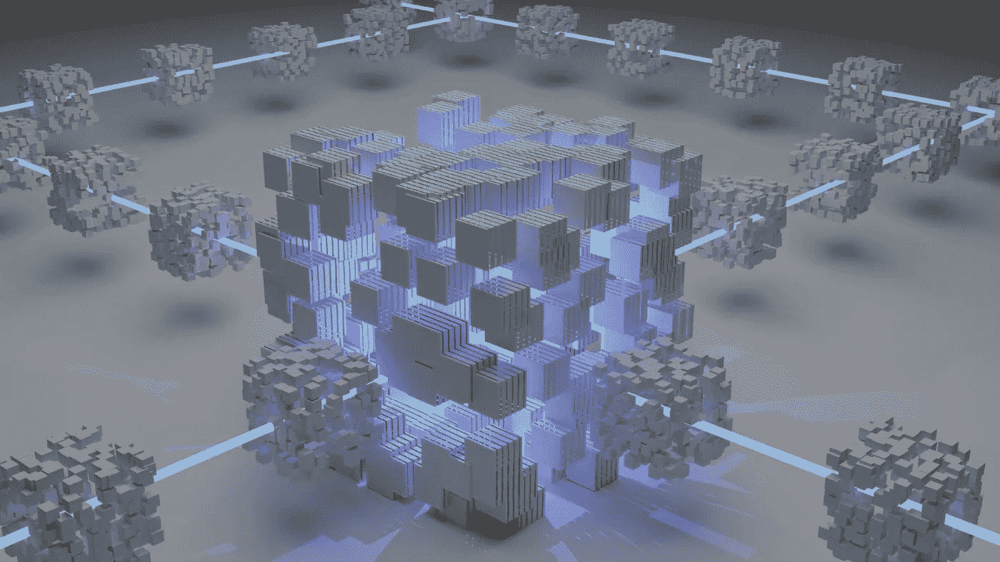
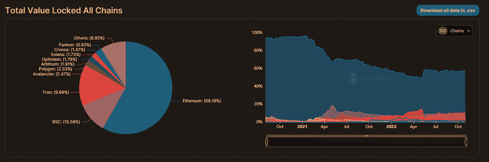

# DeFi 的未来——新兴进化

> 原文：<https://medium.com/coinmonks/the-future-of-defi-emerging-evolution-e5438ad4b325?source=collection_archive---------24----------------------->

# 宇宙的法则

帕累托分布，换句话说，80-20 法则，经常被用来描述社会内部的财富分配。这个原则似乎仍然适用；然而，在最近几十年里，数字变得更有利于小群体。

作为普通公民，我为什么要关心帕累托原则？

如果我们抛开往往伴随着负面情绪的财富差异偏见，我们会看到似乎驱动整个宇宙的力学。一旦你在谷歌上搜索帕累托分布的例子，你会被从我们行为的重要性到自然现象的例子淹没。

这个世界几乎在每一个方面都导致中央集权，好像是一种默认状态。

逆水行舟，分散建设，需要很大的努力。这需要有意识的行动。

# 范式的转变

什么是开始的范式？

范式类似于我们行动的方案，我们遵循的一套规则。它的移动可以比作棋盘上棋子的突然变化或规则的完全改变。

今天我们能看到什么样的转变？

通过合作、专业化和外包的世界演变。

[https://tenor.com/bxkGe.gif](https://tenor.com/bxkGe.gif)

社会越进步，我们看到的各个领域的专家就越多。就个人而言，不是每个人都能或有时间去修车或准备一顿精致的饭菜。企业实施外包战略，而不是创建单独的部门。即使在国家层面也可以看到类似的机制，以半导体行业为当今世界的生动例子。

密码行业是否已经成熟到可以经历这样的转变？

为了回答这个问题，让我们对这个行业有一个总体的了解。

比特币是一个相对封闭的环境。以太坊多年来已经建立了其庞大的生态系统，但应用程序仍然局限于与 EVM 兼容，以便在生态系统内工作，或者不得不使用目前质量不达标的网桥。最重要的是，我们有像 Solana 这样的大型连锁店，每笔交易都由主链处理，慢慢导致网络拥塞和昂贵的费用。

每一个生态系统都有自己的世界，这个世界并不总是对合作开放，或者并不像它本可以做到的那样容易。

说到 DeFi 也是这样吗？

# DeFi 的问题是

分散融资的增长是一种有意识的行动，旨在实现分散化并赋予个人权力。在 DeFi 之前，人们慢慢地被剥夺了所有的支付选择，因为那些不符合传统金融业所写的叙事，其银行系统和法定货币依赖于对特定国家权力的信念。

毕竟，你的法定货币只是一张纸。只有国家这么说，人民相信，它才有价值。有人记得魏玛共和国的恶性通货膨胀吗？

[https://schoolshistory.org.uk/topics/european-history/weimar-nazi-germany/hyperinflation-germany-1923/](https://schoolshistory.org.uk/topics/european-history/weimar-nazi-germany/hyperinflation-germany-1923/)

对于那些不熟悉这个术语的人，请注意。恶性通货膨胀不是非常高的通货膨胀。这是对某种货币失去信心，导致通货膨胀飙升，因为这种货币失去了价值，变成了一张废纸。

想象一下，人们对美元失去信心，并拒绝接受美元作为支付手段。在这种情况下会发生什么？

好吧，好吧…让我们回到正题。

DeFi 仍处于起步阶段，存在各种问题。

诈骗项目，技术漏洞，危险的桥梁，农场池倾销代币零售，等等。然而，在谈论这些问题时，我们可能会迷失在细节中，失去大局——这在现代世界中太常见了。

细节丰富，却看不到更大的图景。

那么真正的问题是什么？

告诉我 DeFi 世界中的大部分流动性是由什么构成的？

Stablecoins。

那又怎样？这是一枚稳定币，加密世界的一部分，以太坊的 ERC 20 合约。

的确如此。但是它与什么有关呢？

与美元的关系。

[https://tenor.com/xqzf.gif](https://tenor.com/xqzf.gif)

你使用的任何稳定币都是伪装的数字美元。虽然这在日常的加密世界中并不重要，但从长远来看却有着巨大的影响。有些人可能会说，在真正去中心化的密码世界里，监管权力无关紧要。

我不能说我同意，但即使……监管权适用于美元，正因为如此，它适用于密码行业的大部分流动性。

它将美元发行者——美国——的权力扩展到密码世界，扩展到“*分散金融*”的世界。

*-你疯了兄弟。在你的文章中再写一行内心独白，希望这会让你看起来更理智。*

soo……如果一夜之间美国监管机构说除了 USDC，所有使用 stablecoin 的人都将被视为罪犯——就像任何使用 TornadoCash 的人一样，会怎么样？

# 隐约可见的集权

DeFi 还有一个与文章开头相关的问题——集中化。

我在这里说的不是权力集中或治理本身。我说的是 DeFi 协议提供的流动性集中化。

如前所述，加密生态系统往往是相当封闭的环境，虽然有人试图将生态系统联系起来，但这并不像看起来那么简单。

让我们看看以太坊及其巨大的 DeFi 空间，并将其与宇宙或波尔卡多特生态系统进行比较。

在 DeFi 夏季期间，当各种 DeFi 项目积累了巨大的流动性和以其象征性价格表示的价值时，流动性被锁定在给定的生态系统中。全新的项目无法为其他网络的协议和用户提供任何实用工具。与宇宙和波尔卡多特微不足道的价值相比，以太坊已经有了巨大的发展。

增长和炒作有利于那些已经处于特权地位的人。

[https://defillama.com/chains](https://defillama.com/chains)

快进到今天，我们看到各种各样的桥梁比 DeFi Summer 的好得多。我并不是说现在的桥梁是经过战斗考验的，可以安全使用。我要说的是，与其他桥梁相比，我们目前有一些质量和安全性更高的桥梁。此外，行业看到了桥接的重要性以及协议与其他生态系统连接的重要性，从而导致了 LayerZero 等协议的诞生。

# 多链未来

正如个人、企业和国家走向专业化和合作。区块链世界也遵循同样的原则。

Polkadot 正在建造它的 XCM 大桥，Cosmos 已经发射了 IBC，LayerZero 承诺为太空提供高质量的桥梁。行业似乎已经接受了高质量桥梁的使用在不久的将来将不可避免的事实，并据此采取行动。

为什么？

因为未来是多链的。

即使在今天，从更大的角度来看，我们也可以看到生态系统正在以类似的方式构建。

[https://tenor.com/bozXI.gif](https://tenor.com/bozXI.gif)

以太坊及其总结，雪崩与子网，波尔卡多特和 Parachains，宇宙和它的专门协议的整个生态系统。专业项目之间的合作是显而易见的，并将引领与项目架构相关的下一个高级趋势。

它和 DeFi 有什么联系？

分散的金融也在跟随专业化的趋势。看看宇宙生态系统中的渗透作用，我们看到一个完全专注于提供 DeFi 相关实用程序的协议。Polkadot 的 Acala 是高度专业化协议的另一个例子，它为生态系统中的其他项目提供了价值。更不用说像 AAVE 这样的以太坊巨人了。

好的……所以我们在仍然封闭的生态系统中有专家项目。你可能会问，这种多链视觉在哪里？

德尔福实验室最近提出了一个 DeFi 中心的论点，其中流动性不会分散在各种生态系统中，而是汇聚到一个 DeFi 中心，为整个加密行业提供与 DeFi 相关的实用程序和服务。

我将在这里阻止你想象一个充满 API 的中心，让用户困惑他们应该选择哪个，应该避免哪个。

毕竟我们看到和使用的只是一个前端，为用户提供易用的实用工具。这就是为什么创建一个上面有用户友好的 UI，下面有多种协议的应用程序，将会改变整个行业的游戏规则。

我们已经有了这样的协议，但这些协议仅限于它们自己的生态系统。DeFi Hub 的想法可以将它们全部合并到主跨链 DeFi place 中。

客户并不关心用来制作酒精饮料的正确温度和谷物结构——嗯……我想我们大多数人都不关心这些细节。我们所关心的是一种我们喜欢喝的像样的饮料。

类似的机制也适用于普通用户。他们希望获得高质量的服务，而不是亲自检查每一个细节。

快速、便宜和用户友好——这些是客户关心的原则，也是 DeFi Hub 理念所体现的原则。

# 在不久的将来

我们从使用现金和传真转向使用数字银行账户和云存储的速度有多快？

不久前，你还可以用实物金币支付服务或商品。就在不久前，我们还在大肆宣传第一款 iPhone。

现在呢？

政府发行的数字货币、无人机送货、视觉刺激充斥社会的社交媒体、我们在各种平台上生活的数字生活，以及戈培尔只能梦想的信息泡沫。

一切都变得比以往任何时候都更加相互关联。

[https://tenor.com/bMxH3.gif](https://tenor.com/bMxH3.gif)

这就是密码产业在不久的将来的样子——在互联的细胞内*。*

项目要么合作，寻求联系，要么注定成为过去的影子。假设这些不是由大型 Web2 公司发布的协议，这些公司有大量的资金支持和重要的附属关系，它们将通过将其规则强加于集中式应用程序来生存——我们已经看到了这样的协议，不是吗？

但是您不希望将您的协议与质量不达标的协议联系起来。毕竟，你危及你的客户和你的声誉。

我们提到的 DeFi Hub 必须由高质量的协议组成，这些协议不仅受用户的委托，也受其他团队的委托。

熊市让项目有机会建立高质量的协议，实现关键的升级，并随着时间的推移而成熟。没有来自投资者和市场的压力。开发人员不必匆忙工作，而是可以对将要发布的所有内容进行双重和三重检查。

是时候为另一场牛市和另一场客户争夺战做准备了。

[https://tenor.com/uDuj.gif](https://tenor.com/uDuj.gif)

AAVE、Synthetix、Maker DAO 和许多其他成熟的协议在这次熊市中不断发展，以巩固其地位并提供比以前更高的质量。我们不打算在这里讨论细节，因为事情可能会改变，演变或被拒绝。要寻找的关键是，尽管市场环境恶劣，流动性低，但该项目是否巩固了自己的地位。

最重要的是，我们看到项目升级其机制和令牌组学，为用户提供更好的服务，为投资者提供更确定的未来增长。

# 结论

密码行业是否已经成熟到可以经历这样的转变？

回到最初的问题，我们看到空间随着每个趋势和每个市场周期而演变。加密慢慢地但肯定地成为主流，在不久的将来，区块链技术将取代当前的数据存储系统。

DeFi 将成为 web 3/元宇宙世界不可分割的一部分，这只不过是我们今天使用的互联网的演变。

如果你想了解元宇宙的概念，看看如何利用它，这里有文章的链接。

[https://hacker noon . com/the-元宇宙-一个你无法逃脱的未来](https://hackernoon.com/the-metaverse-a-future-you-cannot-escape?ref=hackernoon.com)

大量高质量的专业枢纽将是建设元宇宙数字经济的关键。世界正慢慢向 web3 转变。如果你怀疑这一点，寻找涉及进入加密行业和 web 3/元宇宙的知名公司的标题。把日期写下来，看看这个数字是如何以不可思议的速度增长的——而市场环境也不像一年前那么好了。

那么 crypto 是否已经足够成熟，可以向专业化转变了呢？

在我看来，每次熊市，加密行业都在巩固其基础。如果我们看看上一次熊市期间的加密世界，并与我们今天看到的进行比较，差异是惊人的。

在下一轮牛市中，我们会看到什么样的消费化和主流化水平？

加密有多重要？

为了揭开这个面纱，我们必须等待，但是未来是被建造的，而不是被发现的。

记住这一点，并采取行动，让自己的未来值得活下去。

下次见！

~法医。

如果你喜欢这篇文章，请在推特上告诉我——https://twitter.com/ModernEremite

[https://tenor.com/s0CM.gif](https://tenor.com/s0CM.gif)

资源:

1.  【https://defillama.com/chains 
2.  [https://feed.rekt.news/](https://feed.rekt.news/?ref=hackernoon.com)
3.  [https://en.wikipedia.org/wiki/Pareto_distribution](https://en.wikipedia.org/wiki/Pareto_distribution?ref=hackernoon.com)
4.  [https://www . Britannica . com/event/魏玛共和国的恶性通货膨胀](https://www.britannica.com/event/hyperinflation-in-the-Weimar-Republic?ref=hackernoon.com)
5.  [https://members . Delphi digital . io/reports/finding-a-home-for-labs/](https://members.delphidigital.io/reports/finding-a-home-for-labs/?ref=hackernoon.com)
6.  [https://www . cbpp . org/research/poverty-and-inequality/a-guide-to-statistics-on-historical-trends-in-income-inequality](https://www.cbpp.org/research/poverty-and-inequality/a-guide-to-statistics-on-historical-trends-in-income-inequality?ref=hackernoon.com)
7.  [https://www . coin desk . com/policy/2022/08/21/逮捕龙卷风-现金-开发商-抽奖-荷兰-加密-社区-抗议/](https://www.coindesk.com/policy/2022/08/21/arrest-of-tornado-cash-developer-draws-dutch-crypto-community-protest/?ref=hackernoon.com)
8.  https://unsplash.com/photos/_rZnChsIFuQ

> 交易新手？试试[密码交易机器人](/coinmonks/crypto-trading-bot-c2ffce8acb2a)或[复制交易](/coinmonks/top-10-crypto-copy-trading-platforms-for-beginners-d0c37c7d698c)