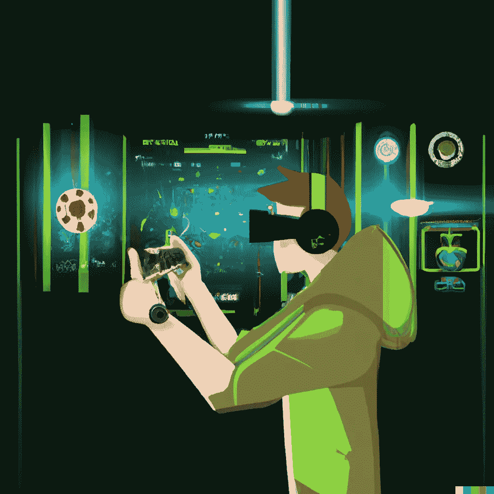

# 游戏的未来:区块链技术如何变革行业

> 原文：<https://medium.com/coinmonks/the-future-of-gaming-how-blockchain-technology-is-revolutionizing-the-industry-d6f7c8669914?source=collection_archive---------11----------------------->

Image created with [**DALL·E**](https://labs.openai.com/) **AI**

**区块链游戏**，也被称为加密游戏，是游戏行业中一个相对较新且快速增长的领域，它使用区块链技术来创建独特的、分散的、通常只有数字的游戏体验。

在游戏中使用区块链技术提供了优于传统游戏模式的几个优势，包括增强的安全性、增加的透明度以及创建真正独特且不可改变的游戏内资产的能力。

## 优势

区块链游戏最显著的优势之一是它提供了更高的安全性。由于区块链技术使用分散的计算机网络来记录和验证交易，黑客获得敏感信息或操纵游戏数据的难度要大得多。

这意味着玩家可以享受自己喜爱的游戏，而不必担心个人信息的安全性或游戏内资产的完整性。它还允许游戏开发者在不需要中央服务器的情况下创建复杂的多人游戏，而中央服务器可能是黑客的潜在目标。

区块链博彩的另一个优势是它提供了更高的透明度。因为区块链的所有交易都在公共账本上记录和验证，任何人都有可能确切地看到游戏是如何进行的，交易的是什么资产。

这种透明度有助于在玩家和游戏开发者之间建立信任，也可以为希望改进游戏的游戏设计师提供有价值的见解。

## 适应性

区块链游戏最令人兴奋的方面之一是创造真正独特和不可改变的游戏资产的能力。因为区块链技术允许创建独一无二的、玩家可以拥有和交易的数字资产，所以它为游戏设计者开辟了新的可能性。

例如，游戏设计师可以创建一个虚拟世界，玩家可以收集和交易独特的虚拟物品，如稀有武器或特殊能力。这些物品在游戏之外可能有真正的价值，因为它们可以在数字资产交易所买卖。

区块链技术在游戏中的另一个潜在用途是创造和交易不可替代代币(NFT)的能力。NFT 是独一无二的数字资产，不可复制，也不能与其他同等价值的东西交换。在加密货币的世界中，它们经常被用来代表收藏品或数字艺术等事物。

在游戏世界中，NFT 可以用来代表游戏中独特的物品或成就，给玩家一种新的方式来展示他们的技能和成就。

## 最后的想法

总体而言，与传统游戏模式相比，在游戏中使用区块链技术具有广泛的优势。从增强的安全性和增加的透明度到创建独特和不可变的游戏内资产的能力，区块链游戏将彻底改变行业，为玩家提供令人兴奋的新方式来享受他们最喜爱的游戏。

感谢阅读，让我知道你最喜欢的区块链游戏有哪些！

> 从顶级交易者那里复制交易机器人。免费试用。