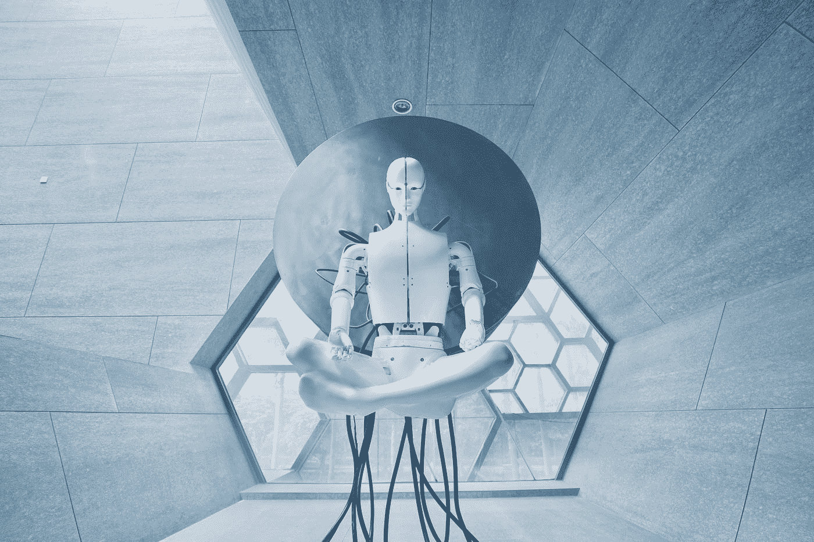

# 第二次机器战争的未来

> 原文：<https://medium.com/coinmonks/the-future-of-machine-war-ii-5736203a35b2?source=collection_archive---------58----------------------->

Photo by [Aideal Hwa](https://unsplash.com/@aideal?utm_source=medium&utm_medium=referral) on [Unsplash](https://unsplash.com?utm_source=medium&utm_medium=referral)

2021 年末，我写了一篇关于人工智能 vs 区块链的文章。我意识到它比我想象的要近。

 [## 人工智能 vs .区块链:机器战争的未来

### 人工智能是计算机领域的热门话题。科幻小说让 A.I 更加神奇。这是一个…

blog.cryptostars.is](https://blog.cryptostars.is/artificial-intelligence-vs-blockchain-the-future-of-machine-war-b685d208ba20) 

# Web2 正在引领一个…