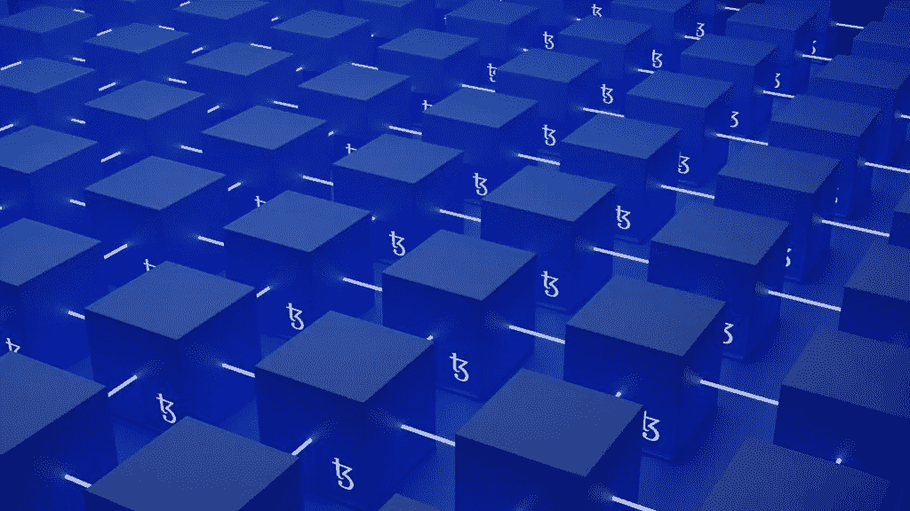

# NFTs 的未来:数字艺术及其他

> 原文：<https://medium.com/coinmonks/the-future-of-nfts-digital-art-and-beyond-ad5f8887276c?source=collection_archive---------20----------------------->

你听说过 NFTs 吗？如果没有，那你就有得吃了。NFT 是区块链技术中最令人兴奋的方面之一，在未来几年里，它们只会变得更加普遍。本文将讨论 NFT，它们如何在区块链上工作，以及可能从这项技术中受益的行业。

## 什么是 NFT？

NFT 是可以在区块链市场上买卖的数字资产。与普遍的假设不同，非艺术作品就其定义而言并不是艺术。它们是可以用于许多不同用例的数字辅助。

NFT 代表“不可替代的代币”，因为每个 NFT 都是独一无二的，不能与同类型的另一个 NFT(如比特币)进行交易。此外，通过在 NFT 市场上销售代表艺术品或其他物品的 NFT，NFT 已经成为将数字艺术货币化的流行方式。此外，NFTs 还可以用于在区块链的游戏如分散土地和元宇宙上买卖数字房地产(土地)。

此外，NFT 在 NBA 很受欢迎，因为他们出售致胜投篮和最著名的新秀动作。我们看到数字资产的非金融资产的繁荣，但它们已经跨越到实物资产，如房地产。

## 区块链简化

在我们深入研究 NFT 之前，有必要理解 NFT 运行在区块链上。区块链使用加密技术创建了一个安全链，用于记录不可渗透、防篡改和透明的交易。存储在这些块中的数据不能被改变或复制。

## 到物理证明的 NFTs 桥

你可能听说过 Bored Ape NFTs，这个数字房子卖了 50 万美元，Snoop Dogg 收藏了一批 NFTs。但是 NFT 正在向实体销售过渡。

房产所有权现已公开。[在佛罗里达州坦帕市](https://www.tampabay.com/news/real-estate/2022/02/11/nft-house-sells-for-654k-in-historic-auction-tampa-condo-up-next/?itm_source=parsely-api)，2022 年 2 月 10 日，一栋房屋被拍卖成 NFT，并以 654310 美元的价格售出。这栋房子成为美国第一栋作为 NFT 出售的房子。

获胜者将获得一个数字令牌——它将记录房屋所有权，结构为单一财产有限责任公司。

## NFTs:各种可能性的大杂烩

有可能获得 NFT 奖的名单很长。一些可能性是医疗记录、学校记录、契约、汽车名称、政府记录、进口记录、库存、供应链记录和投票芭蕾。

此外，营销机构欣然接受 NFT 能为顾客和他们的客户做的事情。他们可以通过创造排他性、奖励制度以及与其他粉丝和收藏家的社区意识，让消费者更接近他们喜爱的产品。

随后，在区块链铸造的 NFT 可以记录奢侈品的原产地，以验证其真实性。NFTs 的可能应用才刚刚开始，很可能很快就会爆发。

## 区块链当前面临的挑战

以太坊是支持智能合约和 NFT 的主要令牌和区块链。然而，还有其他区块链支持智能合约，如 Solenia 和 Flow。以太坊允许“智能合约”功能，使 NFT 能够存储在区块链上，并在用户之间进行交易。

和比特币一样，并非所有的区块链都不具备这一功能，也不能存储 NFT。然而，随着更多的区块链采用智能合约等功能并不断发展，这种情况可能会在未来发生变化。

随后，Etherium 区块链公司使用了一种被称为工作证明(PoW)的验证系统。工作证明是一个服务器网络，它们竞争赢得一批交易，这些交易将永远锁定在区块链上。

简单地说，这就像一个全球服务器网络在竞争解决一个复杂的数学问题。虽然这已被证明是不可破解的，但它是能量密集型的。

同样，比特币也使用电力，这因其能耗而受到批评。PoW 需要一个计算机网络来竞争解决和验证程序块。

许多加密货币矿工正在转向可再生能源，并找到利用电力产生的热量的方法。然而，以太坊计划转而使用利益验证系统(PoS)。PoS 也是一种加密货币共识机制，用于处理交易和在区块链中创建新块，但它更节能。

" [**利益证明 PoS**](https://en.m.wikipedia.org/wiki/Proof_of_stake) 协议是针对[【区块链】](https://en.m.wikipedia.org/wiki/Blockchain)的一类[共识机制](https://en.m.wikipedia.org/wiki/Consensus_(computer_science))，它通过按照持有相关加密货币的数量比例选择验证者来工作。"拥有一定数量加密货币的计算机或计算机组赢得区块并被记录到区块链上。

## 领养比我们想象的要近

非功能性测试迟早会融入日常生活。该技术尚未被广泛采用，而且还很年轻。然而，事实证明，这是可以做到的，根据最近出售的一所房子作为 NFT。

2021 年，NFTs [产生了超过 230 亿英镑的交易量。](https://www.forbes.com/sites/ninabambysheva/2021/12/23/nfts-generated-over-23-billion-in-trading-volume-in-2021/?sh=17a4e3cd5f0a)越来越多的投资者支持 NFT 在元宇宙的项目和营销。投入到 NFTs 中的资金、营销、开发、创造力和聪明才智可以推动 NFTs 闪电般的技术进步。这项新技术拥有巨大的潜力，可以彻底改变我们与数字世界的互动方式。

> 加入 Coinmonks [电报频道](https://t.me/coincodecap)和 [Youtube 频道](https://www.youtube.com/c/coinmonks/videos)了解加密交易和投资

# 另外，阅读

*   [Bookmap 点评](https://coincodecap.com/bookmap-review-2021-best-trading-software) | [美国 5 大最佳加密交易所](https://coincodecap.com/crypto-exchange-usa)
*   [如何在 FTX 交易所交易期货](https://coincodecap.com/ftx-futures-trading) | [OKEx vs 币安](https://coincodecap.com/okex-vs-binance)
*   [CoinLoan 审查](https://coincodecap.com/coinloan-review) | [YouHodler 审查](/coinmonks/youhodler-4-easy-ways-to-make-money-98969b9689f2) | [BlockFi 审查](https://coincodecap.com/blockfi-review)
*   XT.COM 评论[币安评论](https://coincodecap.com/profittradingapp-for-binance) |