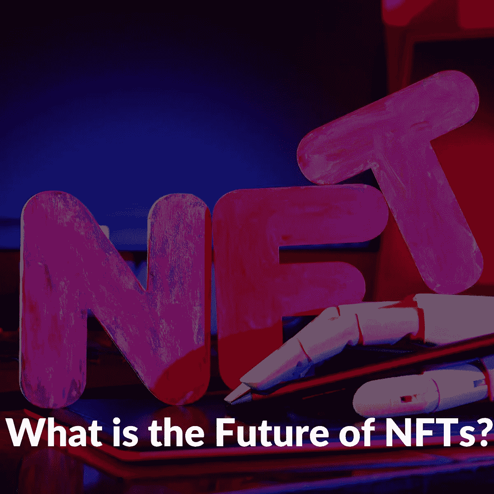

# NFTs 的未来:幻想还是乐观？

> 原文：<https://medium.com/coinmonks/the-future-of-nfts-illusions-or-optimism-a95f7520786e?source=collection_archive---------10----------------------->

对于投资者和内容创作者，尤其是艺术家来说，NFT 已经上升到值得考虑的投资项目的榜首。艺术品第一次有了一种全新的方式，通过不可替代的代币(NFT)而不是概念上的方式为创作者赚钱。

[无聊猿游艇俱乐部(BAYC)](/@libraryoftrader/bored-ape-nft-why-is-it-expensive-61598dc65185) 、[隐猫](https://en.wikipedia.org/wiki/CryptoKitties)、[隐朋克](https://www.larvalabs.com/cryptopunks)、[稀有佩佩](http://rare-pepe.com/)等。是受喜欢冒险的投资者和名人欢迎的 NFT 平台。您可以找到有关参与 NFT 市场的名人的信息，如阿姆、史努比·道格、吉米·法伦、贾斯汀比伯等。

NFT 于 2012 年首次推出，作为比特币区块链上代表实物资产的彩色硬币代币。然后只用了六年就有了爆炸。具体来说，从 2018 年到 2022 年初，NFT 就像是世界各地的一种国际现象。2021 年，NFT 艺术品销售额达到 25.1 亿美元。

 [## 区块链技术:你想知道的一切

### 如何简单解释区块链？

medium.com](/@libraryoftrader/blockchain-technology-everything-you-want-to-know-8539f1771d61) 

根据[研究和市场](https://www.globenewswire.com/news-release/2022/06/14/2461868/0/en/Global-Non-Fungible-Tokens-NFT-Market-Report-2022-Increasing-Influence-of-Celebrities-Revolutionizing-the-Gaming-Industry-and-Continuing-Rise-in-Demand-for-Digital-Artworks.html)的数据，NFTs 的价值预计将从 2022 年的 30 亿美元增加到 2027 年的 130 亿美元以上。然而，这份报告是在 6 月份发表的，而金融市场的情况可能会在一眨眼之间发生变化。

[根据彭博的统计，最近 NFT 的交易量从峰值](https://observer.com/2022/09/nft-trading-volume-plunges-97-since-january-raising-questions-about-their-future/)下降了 97%。因此，提出 NFT 未来的问题是合理的。一些乐观主义者表示，投资的减少并不一定预示着非技术产业的未来。

你为什么不加入我们来打破这种担忧呢？

# 乐观主义者或魔术师，但低迷是真实的！

NFT 交易量从 2022 年 1 月的 170 亿美元暴跌至 9 月的 4.66 亿美元，这让许多人担心非金融交易的未来。NFT 最大的市场之一 OpenSea 的交易量在 8 月份下降了 99%。具体来说，OpenSea 见证了从 5 月份的 27 亿英镑到 8 月份的 934 万英镑的交易。

此外，Bored Ape 游艇俱乐部的热门 NFT 价格暴跌 53%，而 CryptoPunks 的价格从峰值下跌 20%。

加密货币危机或加密冬天在 NFTs 的衰落中扮演了重要角色。因为大多数令牌是建立在基于加密的区块链上的。NFTs 交易量的下降与 Crypto.com、比特币基地、BlockFLi 等许多加密公司的大规模裁员同时发生。

 [## 如何度过难熬的密码寒冬？

### 加密市场就像过山车。它用许多巨大的胜利吸引和愉悦人们，尽管他们可能会遭受…

medium.com](/@libraryoftrader/how-to-get-through-the-tough-cryptos-winter-4b047aba4196) 

# 这次垮台只是暂时的，不是吗？

嗯，很难确定这个问题的正确答案。换句话说，它将人们分为对 NFT 的未来抱有希望的人和对数字艺术的未来不太乐观的人

当投资某些东西时，尤其是 NFTs——一种独特的数字艺术货币化的新形式，我们可以也应该希望最好的事情发生，但不能只期待最好的事情。投资者需要从现实的角度看问题，这让我们对 NFT 市场的涨跌都有所预期。

2022 年 9 月 28 日，一辆 crypto 朋克 NFT 以 450 万美元的价格售出。的确，与黄金时期相比，这个数字相当低。然而，这并不坏，因为价值仍然很高。

虽然通过 NFTs 出售艺术品似乎是艺术家和创作者的一种趋势，但一些人对这种形式表现出困惑甚至争论。NFT 艺术品的价值取决于有多少人愿意购买它们，而不是艺术品本身的质量。这个概念违背了艺术品的纯粹出处。

我们不完全同意任何一方。不要抱怨我们如此矛盾，然而许多艺术家加入 NFTs 是为了从他们辛勤工作的艺术项目中赚取更多，这可能是一种奖励。同时，我们也同意，有多少人愿意购买艺术品并不是决定其价值的唯一因素。

**你可能会对其他一些文章感兴趣，比如:**

 [## 无聊的猿 NFT:为什么它很贵？

### 无聊猿 NFT 是最著名的 NFT 符号之一，吸引了许多有影响力的艺术家交易或显示所有权…

medium.com](/@libraryoftrader/bored-ape-nft-why-is-it-expensive-61598dc65185)  [## NFT 为假人解释道

### 作为一个交易者，利用更传统的交易工具——如股票、商品、期权或期货——进行…

medium.com](/@libraryoftrader/nft-explained-for-dummies-f8a53cdc1e28)  [## 铸造 NFT 意味着什么？你需要知道的一切

### 介绍

medium.com](/@libraryoftrader/what-does-minting-nft-mean-everything-you-need-to-know-c14e94e707dd)  [## 2022 年更新的被动收入最佳的 15 家非正规金融机构

### 什么是 NFT 硬币？

medium.com](/@libraryoftrader/top-15-best-nfts-with-passive-income-updated-in-2022-8368cd5971eb)  [## 什么是多克斯 NFT？在 NFT 空间里，你会选择被解绑还是被解绑？

### 什么是多克斯 NFT？

medium.com](/@libraryoftrader/what-is-a-doxxed-nft-will-you-choose-to-be-doxxed-or-undoxxed-in-the-nft-space-6d3558527b1a) 

无论如何，NFT 遭受的失败并不是它结束的信号。请订阅我们的媒体简介，继续关注我们的更新。

 [## 交易者图书馆-媒体

### 在媒体上阅读来自商人图书馆的文章。LibraryofTrader 是一个团购平台，专门提供…

medium.com](/@libraryoftrader) 

另外，你可以找到我们👇

交易者博客库:[https://libraryoftrader.net/blogs](https://libraryoftrader.net/blogs)

https://www.facebook.com/libraryoftrader[脸书](https://www.facebook.com/libraryoftrader)

推特:【https://twitter.com/libraryoftrader 

领英:[https://www.linkedin.com/company/library-of-trader/](https://www.linkedin.com/company/library-of-trader/)

https://www.reddit.com/user/Library_Of_Trader

quora:[https://www.quora.com/profile/Library-of-Trader](https://www.quora.com/profile/Library-of-Trader)

> 交易新手？尝试[加密交易机器人](/coinmonks/crypto-trading-bot-c2ffce8acb2a)或[复制交易](/coinmonks/top-10-crypto-copy-trading-platforms-for-beginners-d0c37c7d698c)