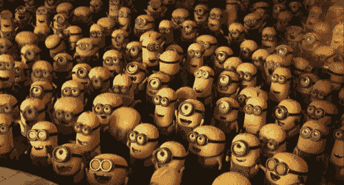

# NFTs 的未来——总结

> 原文：<https://medium.com/coinmonks/the-future-of-nfts-summary-ca7530c13628?source=collection_archive---------14----------------------->

## 以下是从这篇关于非功能性思维的文章中以“知识药丸”的形式总结出来的要点。

Photo by [Masaru Suzuki](https://unsplash.com/@orenarypaladin?utm_source=medium&utm_medium=referral) on [Unsplash](https://unsplash.com?utm_source=medium&utm_medium=referral)

以下是从这篇关于非功能性思维的文章中以“知识药丸”的形式总结出来的要点。它会让你更接近 NFTs 的想法，与图形不合标准的个人资料图片几乎没有任何关系。

然而，花时间阅读原始文章将有助于您更好地了解由于使用不可替代的令牌技术而即将发生的社会变化。

让我们回顾一下最重要的几点。

## **比特币**

比特币的引入创造了一种新的资金转移方式。

但无论从技术上还是从社会角度来看，比特币都不仅仅是转移资金。它可能让我们以各种方式重建社会的大部分。

## **数据库**

当今世界是建立在数据库基础上的，这导致了将我们的个人数据委托给许多可信任的第三方。随着时间的推移，我们将越多的数据委托给一些实体，我们就变得越依赖。

## **新媒体**

互联网的出现给社会带来了巨大的变化。

突然间，人们意识到你不必成为《纽约时报》的在线发布者，也不必成为沃尔玛的网上销售者。个人有机会表达自己，并与世界各地的人联系。

进一步革命的基础已经建立。

## **消费化**

一旦我们不再谈论技术本身，技术就被消费化了。

使用 NFTs 的乐趣和方便性使得 crypto 的消费化成为可能，而无需谈论技术。人们对这项技术的图形方面比对它的可能性和前景更感兴趣。

## **扭曲的图像**

比特币、Web3 和 NFTs 的扭曲形象来自于试图通过理论而非实践来理解它。这就好像你在读如何骑自行车，却从未见过自行车本身。

一个人不做就不能理解某事。

## **激励**

对任何大公司或品牌来说，最主要的激励是货币化，不管是不是直截了当。最终结果是利润或建立社区来赚钱。

## **骨料等级**

每个人都属于某个团体。

在个人层面上，作为两个不同甚至对立社区的成员，我们可能非常相似。然而，如果我们从总体水平来看，差异将会非常明显。

作为个体，我们可能是相似的，但作为一个群体，我们是不同的。

## **分配**

艺术品分销正在从互联网出现之前的商业模式向后互联网商业模式转变。

传统的艺术画廊和类似的地方将会继续存在，但是事情将会改变。

## **使技术大众化**

更广泛的受众让你有更大的机会找到一群真正喜欢你的风格并愿意购买你的创意的人。

对于所有从事创造性职业的人来说，进入全球市场和全球观众是一个游戏规则的改变者。当我们，作为一个社会，将获得体面的技术来转移无形资产时，艺术和创造力的传播将大大加速。

## **生活方式 NFTs**

作为一个 BAYC NFT 的持有者，你可以自由使用特许经营权，甚至可以根据你拥有的 Ape 创建自己的品牌。这是一个改变游戏规则的想法，因为你不是唯一负责发展你的品牌。

这就是社区如何在全球范围内扩展并获得数百万追随者的方法。

## **视觉艺术**

今天的非传统艺术是主要的视觉艺术，但是音乐也可以并且几乎肯定会发生各种各样的事情。

制作真正好的游戏就像拍电影一样。这个过程需要时间和金钱，也需要极有才华的人。这比把一个随机的 NFT 收藏放进一些低质量的游戏要复杂得多。

## **社会无形资产**

人类生来就是在叙事中生活和思考的。这是个人和社会组织自己的方式。

人权，通用汽车，美国。这些东西都不存在。这些只是允许我们以一致的方式组织人员和资源的框架。这就是你如何从 150 人的社会发展到数百万人的社会。

## **媒介**

一个有电视的社会和一个没有电视的社会是不同的，正如一个有互联网的社会和一个没有互联网的社会是截然不同的。

每一次新技术或服务被消费化，我们最终都会得到一个略有不同的社会。

## **社会建构**

法律也是一种社会建构。

纸张有意义的唯一原因是，作为一个社会，我们在很久以前就同意了它。在几十年和几个世纪的过程中，它固化了太多，我们甚至不再意识到潜在的社会协议。

房子本身是很有形的，但住在里面的权利不是。

## **真正的元宇宙**

真正的元宇宙是我们将在不久的将来看到的互联网。

增强现实将永远伴随着我们。在我们的谈话中，我们会谈论一些事情，并把它展示在我们面前。它将是我们每天使用的另一层互联网。

## **web 2 的问题**

整合的生态系统受限于创造者公司的意愿。

Twitter 可能不希望有人使用它的平台，这是一个完全明智的商业决定。没有偏见或感情，纯粹的业务。问题是，一旦你被禁止使用 Twitter 这样的平台，你就被切断了与全球短信中心的联系。

这不仅仅是一个商业决策，更有意义。

## **现代流亡者**

如果不利用哪怕是元宇宙的一小部分，我们将无法生活在现代社会中。一旦我们被禁止进入元宇宙，与朋友社交、找工作和使用基本服务就变得不可获得。

## **残局**

任何能够让上帝的眼睛看着人们的系统都不会被国家所容忍，因为它太有影响力和强大而无法独立存在。

中国正在建设和使用的社会信用体系与元宇宙可能的样子出奇地相似。抛开视觉效果不谈，使用的机制和可能性惊人地相似。

## **CBDC 的力量**

在纽约，你如何阻止一个人乘坐出租车？

你必须逮捕这个人。否则，你既没有权力也不可能合法地阻止别人打车。

当我们使用 CBDCs 引入和推广元宇宙时，在几秒钟内，我们将能够扳动开关，取消特定区域的出租车使用权限或整体服务。

## **1 亿非技术人员**

在接下来的几年里，我们将会看到越来越多的品牌和机构发行 NFT。

对 NFT 默认的做法是使用它；而比特币的默认设置是什么都不做。这就是为什么用户体验和界面必须易于导航和使用。

## UX——我们正在招人！

用户必须确保他的资金和 NFTs 是安全的，即使他的技术知识有限。

交易必须容易进行，并且识别和防止每个潜在用户的错误。在多区块链的世界里，为了减少甚至消除用户之间的界限，必须建立共同的标准。

## **与机构的博弈**

如果我们在 90 年代初对互联网保持和现在对 Web3 一样的态度，互联网就永远不会成为今天的样子。

## **影响**

我们今天所能产生的影响可能会为后代和 NFT 的技术奠定基础。因此，我们不能在小社区内独自玩游戏；否则，我们将最终成为一个被遗忘和忽视的小众群体。

NFT 可以代表任何不可替代的链外资产，并将其转移到元宇宙，使我们能够在链外和链内世界之间建立桥梁。

## **最简单的策略**

消除情感偏见——买一枚硬币或 NFT，假设它会归零。

保持活跃——智慧来自经验。你不能让它短路。

## **变化的世界**

没有什么比在一个慢慢萎缩的行业工作更痛苦的了。

你和其他人一样努力，但你无法战胜整个市场。经济不断发出信号，我们所要做的就是保持警惕，观察世界，并在时机到来时做出改变。

浏览发展中的行业，看看哪里需要你的核心技能。学习一点点，把你的核心技能转移到其他任务上，这将是一个改变人生的决定。

## **结论**

保持活跃，学习，尝试，帮助建设未来。

这里是关于 NFTs 的[原创文章](/coinmonks/the-future-of-nfts-according-to-punk-6529-5bf9b519cc51?source=user_profile---------0----------------------------)的链接。

如果你想了解 NFT 技术的真实想法，而不是听除了情感刺激之外没有任何价值的仇恨评论，我强烈推荐你阅读它。

尽情享受吧！

~法医。

 [## JavaScript 不可用。

### 编辑描述

twitter.com](https://twitter.com/ModernEremite) 

> 交易新手？试试[密码交易机器人](/coinmonks/crypto-trading-bot-c2ffce8acb2a)或[复制交易](/coinmonks/top-10-crypto-copy-trading-platforms-for-beginners-d0c37c7d698c)