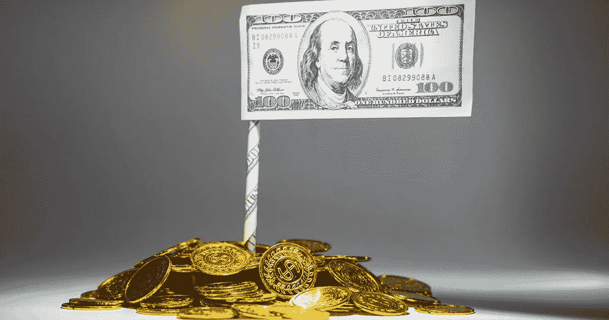
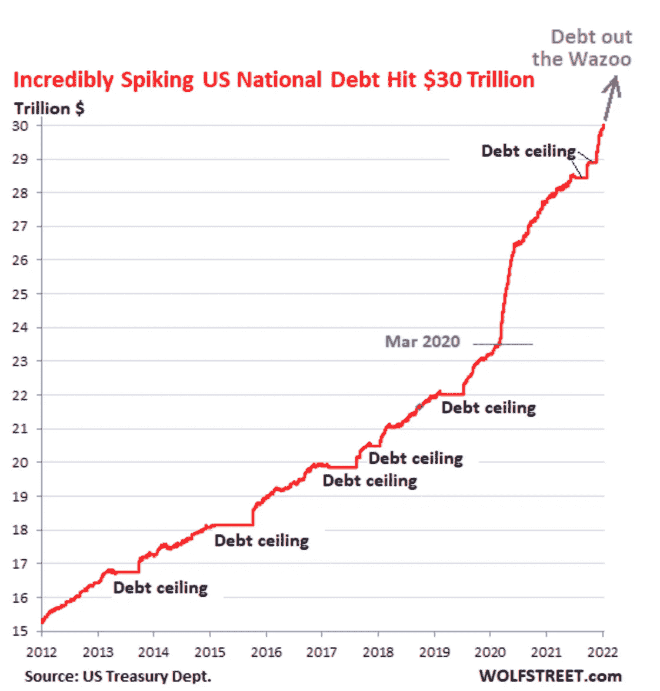
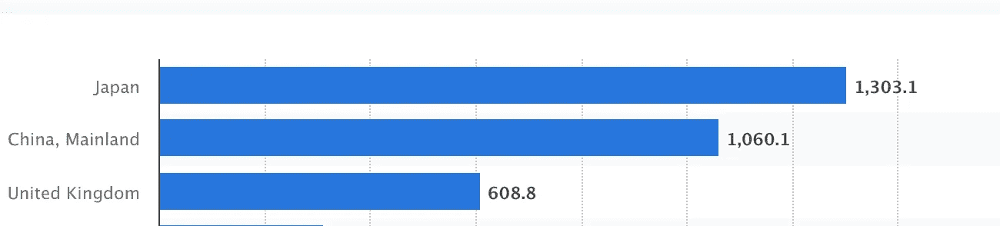
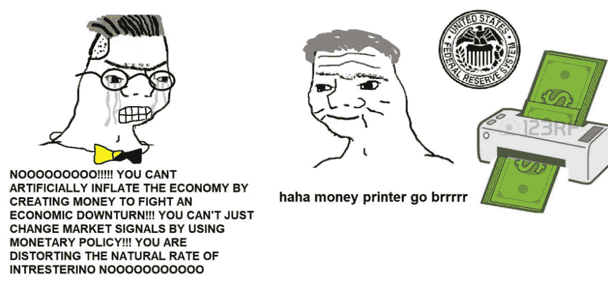
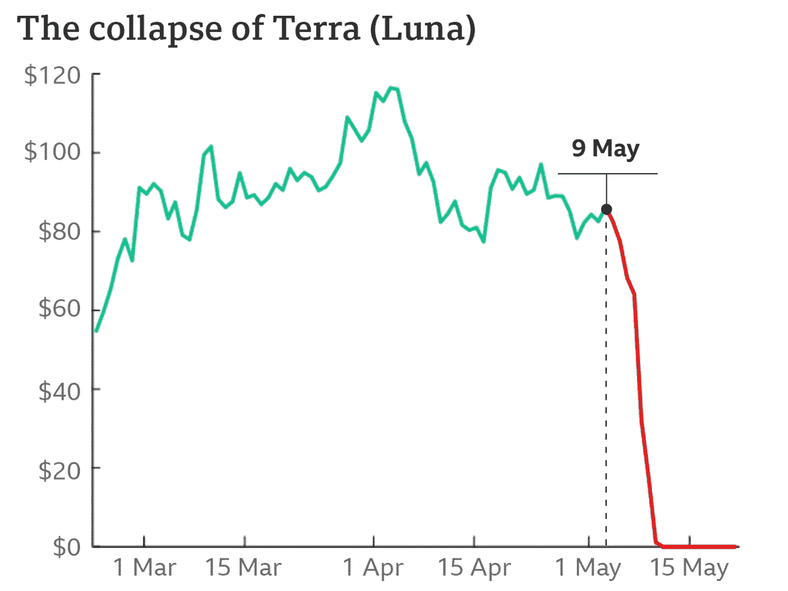

# Stablecoins 的未来:死为英雄还是活着成为恶棍

> 原文：<https://medium.com/coinmonks/the-future-of-stablecoins-die-a-hero-or-live-to-become-the-villain-80908e651e01?source=collection_archive---------14----------------------->

> 你要么死得像个英雄，要么活得足够长，看着自己变成恶棍。
> 
> ——黑暗骑士

随着美联储收紧货币政策，市场流动性正在迅速枯竭。因此，加密市场也面临着冬天。随着 Terra-Luna 危机和 Celsius 银行挤兑危机的相继爆发，公众对 Crypto 的不信任正在增长。比特币现在在 21k 级别交易，比时间高点低了 70%左右。

现在越来越多的人赌空头。他们认为，即使美联储的紧缩政策随着时间的推移而结束，股票和房地产市场复苏，加密货币市场也可能无法复苏。真的是这样吗？在这篇文章中，我想在“美国将如何试图维持其美元霸权”的框架下分析这个问题。

> 交易新手？试试[加密交易机器人](/coinmonks/crypto-trading-bot-c2ffce8acb2a)或者[复制交易](/coinmonks/top-10-crypto-copy-trading-platforms-for-beginners-d0c37c7d698c)

场景一:稳定的货币在美元的寄生虫下生存。

第一种情况是 stablecoins 并入现有系统。换句话说，它来到传统的金融领域，和股票、债券一样被对待。在这种情况下，最初的意识形态和主动性——去中心化——完全消失了。

那为什么美联储会把稳定的硬币揽入怀中呢？因为它有稳定债券给美联储带来的实际好处:成为美国债券的新买家。

自 2008 年本伯南克(Ben Bernanke)开启的 QE 时代以来，美国国债收益率在每次经济低迷期间都会下降。这是因为美联储购买了更多的美国国债以降低利率，而投资者在艰难时期更喜欢安全的资产。此外，美国通过迫使中国和日本等贸易顺差国家用贸易所得美元回购美国国债来保持低利率。

The US national debt has soared rapidly due to the QE after the COVID outbreak in Mar 2020

然而，事情发生了变化，由于 covid 后 QE 数额空前，美国国债已经从 23T 美元暴涨到 30T 美元。美联储持有超过 6 万亿美元，相当于整个美国国债的 20%。美联储现在正在实施 QT，即出售他们的国债(从技术上来说，他们不是在出售债券，只是不额外购买，而是等待到期日的到来，但无论如何)。这意味着曾经的市场最大买家现在正转向市场最大卖家。这肯定会给美国国债收益率带来上行压力。

Major foreign holders of U.S. treasury securities as of January 2022 (in billion U.S. dollars)

问题是谁将购买他们的债券。自 10 年前以来，中国一直在不断减少他们的持有量，沙特阿拉伯似乎从更多购买中撤退，因为现在拜登和 MBS 之间存在不和谐。本质上，由于美联储印了太多的钱，商品本身正在失去魅力。看起来日本是唯一一个吸收市场巨大销售量的买家。

因此，美国需要找到一个新的债券买家，以保持低收益率并维持其美元霸权。我发现 stablecoins 可能是下一个候选人。

除了基于算法的 stablecoins 如 Dai 或 Terra(最近已经崩溃)，大多数 stablecoins 都以法定货币和实物资产为抵押。然而，加密市场是一个蓬勃发展的市场，缺乏法规和合规性。这就是为什么私人银行现在能够以一种类似于共同基金的形式，如购买债券和股票，自行管理客户的现金。

[https://www . barrons . com/articles/tether-foreign-debt-crypto-stable coin-terra-51653075219](https://www.barrons.com/articles/tether-foreign-debt-crypto-stablecoin-terra-51653075219)

那么，如果政府干预呢？例如，如果政府依法强制所有稳定的债券持有，比方说至少 70%的美国国债，会怎么样？那么系统将如下进行:

*   私人稳定硬币公司铸造硬币，购买美国国债
*   他们向外国投资者出售他们的稳定资本。
*   稳定的货币市场规模增长
*   更多稳定的硬币被铸造出来，他们购买更多的美国债券。
*   …

这最终将成为向外国投资者出售美国债券的新渠道。这将创造巨大的购买量。当前密码市场的市值总和约为 1 万亿美元，稳定密码市场的市值总和约为 0.1 亿美元。假设市场将长期增长，稳定的公司可能会取代中国作为加密市场最大买家之一的角色。

通过这种方式，稳定的银行可以成为美国国债的新买家。在这种情况下，稳定的货币成为美元霸权的新守护者。具有讽刺意味的是，这与他们最初的“去中心化”和“反美元”精神正好相反。这就是为什么我称之为“活得足够长，看着自己变成恶棍”。

***场景二:军权下放殉难***

第一种情况不是解决美国问题的根本办法。稳定的债券可能会暂时成为新的债券买家，但总有一天，美国将不得不面对其庞大的债务和泛滥的流动性。因此，第二种情况是美国立即解决流动性问题——这是一种灾难性的情况。

全球储备货币不可避免地遭遇特里芬悖论。为了维持美元霸权，美国应该承担不断增加的国债，解决这一问题的根本办法是烧掉和解决溢出的债务。在这种情况下，稳定的硬币可以成为很好的祭品。

如前所述，大多数基于法定货币的稳定货币持有实物资产和抵押品。然而，由于最近的市场状况。实物资产的价值大幅下降。不信任稳定的同事是不可避免的后果。这可能会引发第二次 Terra-Luna 崩溃，在最糟糕的情况下，这将淹没整个加密市场，从而烧毁流动性过剩。

那为什么要牺牲稳定的收入而不是股票或房地产呢？第一个原因很明显。从长期来看，它有挑战当前美元霸权的潜力。第二个原因是，尽管许多公司和养老基金相互交织，房地产也与普通人的债务和抵押贷款相互交织，但地下市场只是投机者储存剩余流动性的口袋。

然而，问题是密码市场的衰落也会冲击传统金融市场。在最坏的情况下，这会引发一场经济危机。然后，故事又回到了美中贸易战。美国可能会发起一场负和鸡游戏，在这场游戏中，他们自己也会受损，但会对中国经济产生更严重的影响。

无论如何，在这种情况下，美国政府可能会故意将经济引向低迷，并在试图挑战政府和美元体系的投机性加密市场上承担所有责任。这就是“壮烈牺牲”的场景。

***结论:***

总之，稳定密码和加密市场有两种不同的情况

情景 1:稳定的货币成为美国国债的新买家，成为美元体系的下一个守护者

场景 2: Stablecoins 和整个加密市场受到美国政府的惩罚和蹂躏，并作为试图对抗美元体系的失败烈士死去。