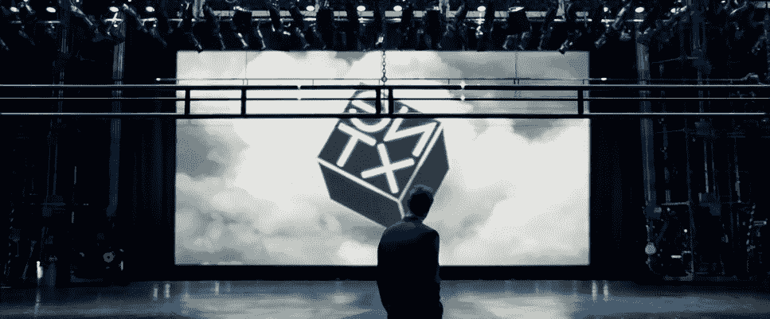

# 大家对 web3 和 NFTs 的误解是什么

> 原文：<https://medium.com/coinmonks/the-future-of-the-internet-is-not-what-you-think-1c4d71fdd43?source=collection_archive---------2----------------------->

听说过 crypto 和 NFTs 是新的互联网吗？

有没有想过这实际上意味着什么，以及所有这些炒作是关于什么？

我做到了。

所以我调查了一下。严重地。这的确很吸引人。

一个公司可以在 web2 中构建的任何东西，也可以在 web3 中构建，但没有公司。一个社区…