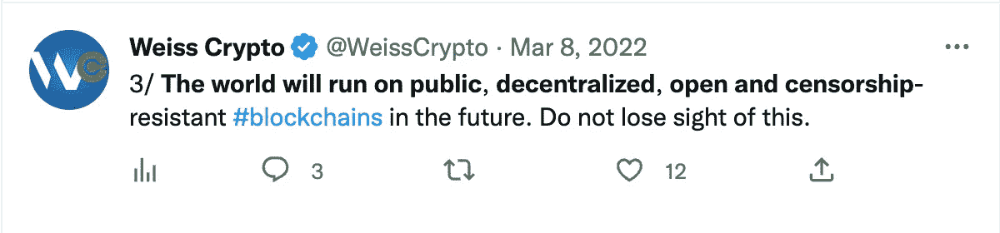
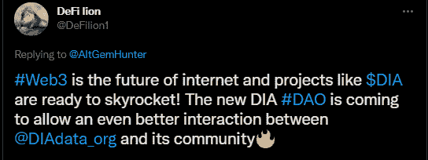

# 工作的未来是分散的:DAOs 简介

> 原文：<https://medium.com/coinmonks/the-future-of-the-work-model-is-decentralized-an-intro-to-daos-cf7bc8261174?source=collection_archive---------30----------------------->

基于分散的协作和组织，Dao 是组织人类合作和治理的新颖模型。通过利用区块链技术，他们为替代工作提供了新的范例。以下是方法。

人类见证了许多技术革命，这些革命改变了我们的工作方式。任何熟悉互联网的人都会注意到，人类正在走向一个激进的(如果不是完全的)去中心化和社区管理组织的新时代。

从[传统的中央集权组织层级](https://smallbusiness.chron.com/traditional-hierarchical-organizational-structure-26174.html)到更多的[民主自治组织](https://cointelegraph.com/news/our-democracy-will-better-evolve-because-of-daos-says-animoca-s-yat-siu)的工作模式出现了偏差，这种范式转变由 DAOs 牵头。

这一范式转变的关键是用被称为 DAOs 的以人为本的民主结构取代中央集权的垄断。

> “分散的自治组织正在扰乱整个行业。从金融到社交网络再到慈善事业，这些代码驱动、社区管理的实体正在改变我们的工作方式。”— [**世界经济论坛**](https://www.weforum.org/whitepapers/decentralized-autonomous-organizations-beyond-the-hype)

本文旨在讨论什么是 Dao，现在存在的 Dao 的类型，以及公司和组织从去中心化中获得的好处。

# **向您介绍 DAOs**

DAO 代表分散的自治组织，它们是没有中央领导的实体。这意味着这种组织内的决策是自下而上制定的，而不是高度集中的组织中普遍存在的自上而下的层级结构。

Dao 是建立在透明规则基础上的公司，这些规则用计算机代码编写，并由智能契约正确定义。

正如所建议的，Dao 是:

*   **分散化**:Dao 的主要特点是由他们的社区拥有和管理。
*   自治的:Dao 由他们的成员管理，独立于中央权力机构，如政府或任何个人。
*   组织:Dao 由拥有共同利益的人组成，没有单一的领导者。他们共同拥有公司，并在项目及其平台内一起工作，通常跨越国界。

# **刀的景观，是什么样子的？**

大多数 Dao 要么面向技术，要么面向社会。

面向技术的 Dao 通常专注于加密领域的构建。他们倾向于在链上执行更多的动作。

**以社交为导向的 Dao**主要是为了连接人群，并为他们寻找互动和聚会的新方式而存在。他们的治理更多时候是链外的，或者不存在。

他们也可以根据他们参与的行业、他们的组织方式或他们提供的服务进行分类。一些类型的 Dao 包括:

*   **Protocol DAOs** 帮助项目和协议从社区的核心贡献者那里汲取力量，以建设社区。ERC-20 代币(代表权利、所有权和资产的可交换代币)通常向社区发行，在市场上具有二级价值，使持有者能够享有治理权。作为令牌持有者，您有权提议、投票和实施影响网络的提案，通过参与社区，您可以成为项目的所有者和运营者。
*   在互联网上的一群陌生人之间建立合作和友谊。它们是为社区发展而优化的，而不是以利润为导向的，并为你提供了一个认识其他人并与他们互动的平台。
*   投资道(Investment DAO):作为投资道的成员，你和其他成员可以集中资源投资于你们都相信的项目。投资道主要是关于回报的。
*   **Grant Dao**是一种针对现有项目的社区支持形式。通过拨款，这些 Dao 寻求为新的 Web3 贡献者开辟道路，推进更广泛的生态系统，并支持有前途的项目。
*   **服务 Dao**充当人才聚集者，将人力资本聚集在一起，用于特定项目。
*   **媒体 Dao**制作公共内容。从这些内容中获得的回报在整个团队中共享，而治理也是公共的。利益相关者可以帮助决定要涵盖的主题，也可以通过管理资源做出贡献。
*   **收藏家 DAOs** 围绕某些资产或收藏品团结贡献者。NFT 是一种常见的收藏选择。
*   创造者 Dao 就像以个人为中心的粉丝俱乐部。除了纯粹的粉丝之外，利益相关者也可以积极地为那些支持他们超级粉丝的创作者的组织做贡献。

道的景观才刚刚开始，但已经相当广阔了。

无论你在寻找什么或想做什么，总有一种“道”适合你，不管你从事什么行业，也不管你想获得什么样的利益。

# **Dao 提供的优势**

中央集权的公司传统上依赖于劳动力，通常通过工资来控制。然而，Dao 试图依靠一个[去中心化的框架](https://cointelegraph.com/decentralized-automated-organizations-daos-guide-for-beginners/what-is-decentralized-autonomous-organization-and-how-does-a-dao-work)来实现价值的创造，在这个框架中，你作为一个工作者或用户，与其他利益相关者一起，拥有实体的真正所有权。Dao 内部的领导是流动的和自治的。因此，作为贡献者而不是雇员，为了社区和个人的成长，你自然会被鼓励要真实、有创意、以结果为导向。

Dao 成员通过[投票权](https://limechain.tech/blog/dao-voting-mechanisms-explained-2022-guide/)获得授权。投资者还可以在全球范围内自动或匿名发送、接收或存储价值。此外，Dao 通常帮助社会处理限制性的官僚系统。

Dao 不仅激励个人参与，还从根本上改变了贡献者对努力和劳动的看法。

所有的工作都是基于追求一个更大的目标，其中的好处是共享的。主人翁精神充满了创造和成功的感觉——很明显，作为一名员工，你会在经济上和心理上更有动力去支持同事，提升他人的工作，摒弃自我，比传统员工做得更好。

> “今天的组织结构对少数人要求太多，而对其他所有人要求不多。”——[**伦敦商学院管理实验室主任加里·哈默尔**](https://www.garyhamel.com/about)

*DAO 是未来的组织结构，许多组织已经利用 DAO 工作模式显著提高了产出、参与度、社区教育、个人成长和收入。*

这种组织的一个典型例子是 DIA。

# **迪亚刀**

DIA DAO 是一个框架，使您和整个社区能够开发和发展 DIA 生态系统，获得奖励，并在娱乐的同时进行联系。

DIA DAO 是一个很好的 DAO 实践的例子，它正逐步走向完全的去中心化。

在这个走向成熟的旅程中，DIA 的下一个里程碑是完成其运营基础设施、激励机制以及 DIA 社区组织和动员的论坛。

DIA 已经将大多数垂直公司引入 DAO，并建立了一个框架来有效地运行其运营。此外，DIA 作为一个组织，受益于"一体行动"工作模式，因为它可以通过有效分配职责、利用社区技能、激励社区参与以及建立"一体行动"对"一体行动"的关系，利用分散的员工队伍来实现其目标。

# **DIA DAO 正在塑造工作的未来**

考虑到 DIA 对[道学](/dia-community-hub/dia-dao-accounting-for-oracles-of-the-past-and-present-68d3e2f56366?source=your_stories_page-------------------------------------)的采用，以及它如何不断改变传统的商业模式，组织开展业务的方式有可能发生结构性转变。

*DAOs 将彻底改变企业和组织的运作方式，DIA 正在成为市场领导者！*

考虑到 DAO 通过众筹筹集资金的速度等因素，更多的公司将灌输 DAO 工作模式，以获得它所提供的好处。

今天就加入这个行列，成为像 DIA DAO 这样的工作 DAO 社区的积极成员吧！通过加入 DIA WorkDAO [Discord](https://t.co/strg6OtBVi) ，你可以开始学习、运用和发展你的技能，同时在 Web3 中建立一个文件夹。

如需了解更多信息，请查看他们的 [Twitter](https://twitter.com/DIAdata_org) 、 [LinkedIn](https://www.linkedin.com/company/diadata-org/) 、 [Telegram](https://t.me/DIAdata_org) 、 [GitHub](https://github.com/diadata-org) 和 [Medium。](https://medium.com/dia-insights)别忘了还可以查看一下[DIA 的 Alpha Deck](https://content.diadata.org/wp-content/uploads/2022/04/DIA-DAO-Alpha-Deck.pdf/) 和[这里的](/dia-community-hub/5-simple-steps-to-start-contributing-and-earning-eth-on-dia-dao-6c5819204cb6)是加速整个过程的分步指南。