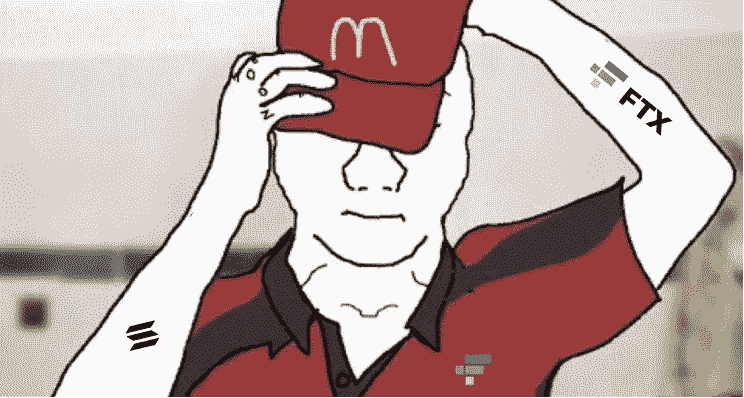
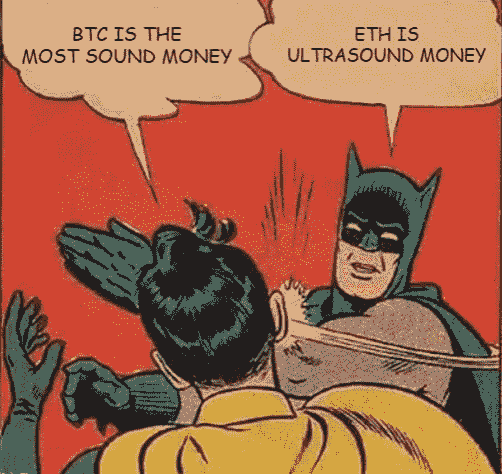

# 比赛刚刚开始

> 原文：<https://medium.com/coinmonks/the-game-has-just-started-28b1c5d8bf2?source=collection_archive---------6----------------------->

在 crypto，没有无聊的一天。尽管第二大交易所已经倒闭，但这个空间每天都让我兴奋不已。我对其未来持谨慎乐观的态度，同时我也意识到任何新兴行业都面临着系统性和内在的风险。我希望我没有被炒作蒙蔽双眼，成为更大的傻瓜观念的牺牲品。请叫我出来，如果你认为我是完全不正确的加密，这样我就可以停止成为更大的傻瓜。但首先，听我说完。

以下是我的观点，我希望它能给你一些启示和鼓励，让你开始探索 crypto 和 DeFi，它可能什么都不是。

FTX 的倒台似乎让加密领域的所有进步化为乌有，这是一种耻辱。然而，如果你密切关注这个案例，你会发现这个失败与 crypto 没有任何关系，也与区块链没有任何关系。FTX 的失败完全是由于贪婪和糟糕的风险管理。显然，这是加密的“雷曼”时刻，许多人认为这是加密的死亡。然而，我选择相信资本主义假说。高级(更便宜、更好、更快、无需许可、更透明)技术应该战胜低级技术，会被采用，人们会用他们的资源投票。

FTX 秋天有胜利吗？最近几个月，人们对山姆·班克曼·弗里德(SBF 饰)的看法发生了转变。他试图推动一项法案来规范 DeFi 的前端，以利于与国会山讨价还价，从而成为 DeFi 的头号恶棍。这与 DeFi 的动机是矛盾的，因为 DeFi 的整个目的是不需要许可和透明的。该法案将偏离我们的目的，从而杀死 DeFi。

当我们看到事实浮出水面时，我对未经许可和不可信的系统的信念自秋季以来显著上升。FTX，尽管是一个加密交易平台，但“我欠你的”机制仍然存在，就像在任何中央交易所一样。这与货币信用理论中研究的基于债务的旧银行模型是一样的。这是一个可以利用的系统，只要在短期内有足够的信任，但从长期来看，这是一个定时炸弹。请参考世界债务钟，它不断上升，无法偿还，等待着内爆的一天。

[https://www.usdebtclock.org/world-debt-clock.html](https://www.usdebtclock.org/world-debt-clock.html)

一位智者曾经说过，你有没有想过为什么银行要花那么多钱在中央商务区租豪华的办公室或做广告？这样做是为了确保始终保持信任，因为他们不能让用户对系统失去信心。

假设同样的银行挤兑发生在 TradFi，如果我们集体对一家选定的银行进行银行挤兑，结果将是相同的，因为部分准备金银行，除了银行由政府担保。当损害足够严重时，印钞机将被触发，从而将问题推迟，实际上是对现有货币持有者征税。尽管如此，这绝不是对 SBF 所谓不当行为的支持。

根据 crypto twitter 的调查，裙带资本主义和裙带关系在 FTX 非常普遍。在一个假设的情况下，假设 SBF 可以从最后贷款人那里筹集资金来帮助他摆脱困境，债务循环将继续，导致更大的债务，并促成下一个万亿美元的债务时钟。

为了克服这种剥削，我们应该寻找有供应上限的健全货币，甚至是超声波货币。比特币之所以被开发出来，是因为整个货币体系是建立在信任的基础上的，因此才有了“不要相信，要验证”这句话。加密比以往任何时候都更重要，因为我们迫切需要一个自我保管的资产。同样，DeFi 比以往任何时候都更加重要，因为我们迫切需要一个自我监控的金融系统。

DeFi 应用承诺无信任和无许可，但实际上，我们可能离它还有很长的路要走。说到这里，愿景是明确的，理想主义者和信仰者不会休息，直到我们达到理想的去中心化状态。这是值得追求的东西。

由于我们仍处于该领域的早期阶段，涉足加密领域并非易事。学习和监控发展所需的时间和精力是很重要的。但是，如果你愿意，这是完全有可能的。但愿如此，如果 crypto 被广泛采用，如果你现在就放弃它，你可能会失去它的光辉岁月。我个人认为最好坚持到底。

感谢阅读，请继续关注更多加密和定义内容！

作为我的新年决心的一部分，我将分享我在 crypto 的经历，以讲述由我工作中的朋友& crypto OGs 激发的更好的故事。

*免费加密&股票连同推荐启动你的旅程:*[*https://docs . Google . com/spreadsheets/d/1 f2bx-xkvmezorxdzqavgckina 1 PME _ uI9pa _ c4l 4-DM/edit？usp =分享*](https://docs.google.com/spreadsheets/d/1f2bX-xKvmEzOrxDZqAvgCkIna1pmE_uI9pa_C4l4-DM/edit?usp=sharing)

> 交易新手？尝试[加密交易机器人](/coinmonks/crypto-trading-bot-c2ffce8acb2a)或[复制交易](/coinmonks/top-10-crypto-copy-trading-platforms-for-beginners-d0c37c7d698c)