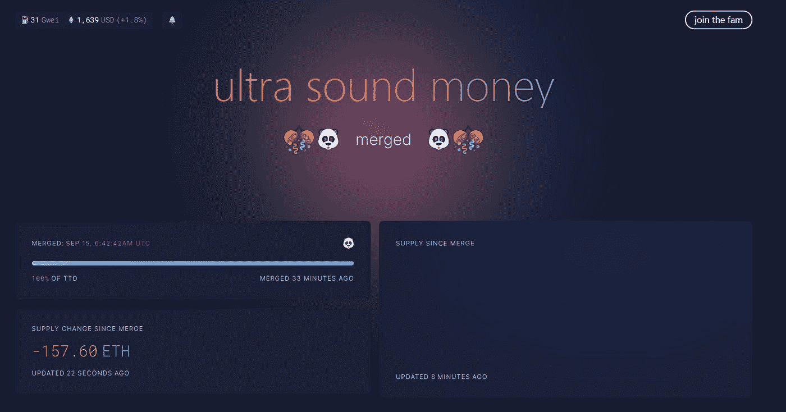

# ETHW 生态系统的创世纪 NFT 甲壳虫乐队在 4 天内上涨了 2200 倍

> 原文：<https://medium.com/coinmonks/the-genesis-nft-beatles-of-the-ethw-ecosystem-has-risen-2-200-times-in-4-days-5e6e5aaf2779?source=collection_archive---------19----------------------->

9 月 15 日，以太坊合并成功，从 POW 到 POS，以太坊开启新时代。

但是矿机的计算能力依然存在，矿机的部分计算能力已经转移到 ETHW 网络上继续挖掘。ETHW 这些天也有不错的涨幅，从合并前的 5 美元左右涨到现在的 11 美元。

ETHW 网络目前非常火爆，一批推广 POW 的玩家也开始在 ETHW 网络上搭建生态。

在过去的几天里，ETHW 网络创造了 NFT 甲壳虫乐队，这是非常受欢迎的。自 9 月 25 日上线以来，到今天 4 天涨了 2200 多倍。

Beatles NFT floor price 22ETHW

什么是披头士 NFT？

甲壳虫乐队是 ETHW 网络上的第一个 NFT 项目。在 Nuwton 平台交易，公开售价 0.01ETHW。

这个系列一共 9400 个，目前持有的地址数是 4200 个。楼面价一度涨至 29.8ETHW，涨幅近 3000 倍；现在楼面价 22ETHW，250 多美元，也涨了 2200 多倍。

目前，披头士还没有发布一张图片。从官方宣传来看，是一组设计精美，形象各异的披头士。不知道图放出来之后是涨还是跌。

Beatles NFT

**为什么披头士 NFT 能涨 2000 多倍？**

以太坊的合并导致了 ETHW 网络的推出。ETHW 网络的主要推动者是“包”和湾区 aWSB 俱乐部社区的成员。他们发起以太坊网络的分叉，想维护矿工的利益，维护采矿利润。

但在 VitalikButerin 的推动下，以太坊走向了 POS 路线，开启了新的篇章；虽然 ETHW 仍然是 pow 方法，但是没有人能够对这种生态发展在未来会如何做出结论。

网络上线后，生态必须同步发展。完善的生态系统才能吸引更多的项目和玩家，健康发展。披头士是 ETHW 生态系统的创世 NFT。

Ethereum Merger on September 15

以太坊成功合并后，aWSB 社区正在为甲壳虫 NFT 做准备。

aWSB 是一个高质量的区块链主题社区，有持续的语音互动，几个核心人物，流动的嘉宾和观众，以及对各种热点话题的讨论。

通过社区推广，转化社区用户，推广 AMA 活动等。，已经积累了早期用户。白名单造币 0.01ETHW 造币 2，公售 0.01ETHW，公售 5 分钟售罄。

Beatles NFT has not been opened yet

铸造价格为 0.01ETHW，差不多是 0.12 美元，这是对生态最初支持者的空投奖励。目前的底价是 22ETHW，也就是 250 美元。对于整个 NFT 市场来说，价格仍有上涨空间。

ETHW 叉依然火热，作为一款创世纪 NFT，也获得了更多的关注和讨论；同时，社群推广和目前的低市值更容易推动上涨。
aWSB 继续做语音交互

**披头四 NFT 会继续崛起吗？**

谁也说不准，市场是波动的，谁也无法准确判断。如果 ETHW 网络能够长期发展，生态上需要高质量的项目，作为创世纪 NFT 更容易维持高价。

再加上社区的不断推广，设计意向，以及楼面价的现值，可能还有上涨空间。

但是作为 ETHW 网络上的项目，它是独立于 Nuwton 平台的，而不是主流的 Opensea 平台。如果想跨链，增加影响力，扩大受众可能更难。

再加上目前的市场状况，如果 NFT 不继续运营和赋能，只是一波人气，跌了就很难再爬起来了。

文章的半天时间，楼面价又降到了 16.7ETHW。

OpenTigers on the ETHW Network

当然，如果你赶不上《创世纪》的披头士，也可以关注 ETHW 网的 OpenTigers 第二季。它处于白名单阶段。不知道会有多大空间？

以上只是我个人的看法和总结，不含投资建议，读者的任何投资行为与作者无关。

我是褚小莲，我在了解区块链，关注元宇宙和 NFT，关注 web3。

> 交易新手？试试[加密交易机器人](/coinmonks/crypto-trading-bot-c2ffce8acb2a)或者[复制交易](/coinmonks/top-10-crypto-copy-trading-platforms-for-beginners-d0c37c7d698c)