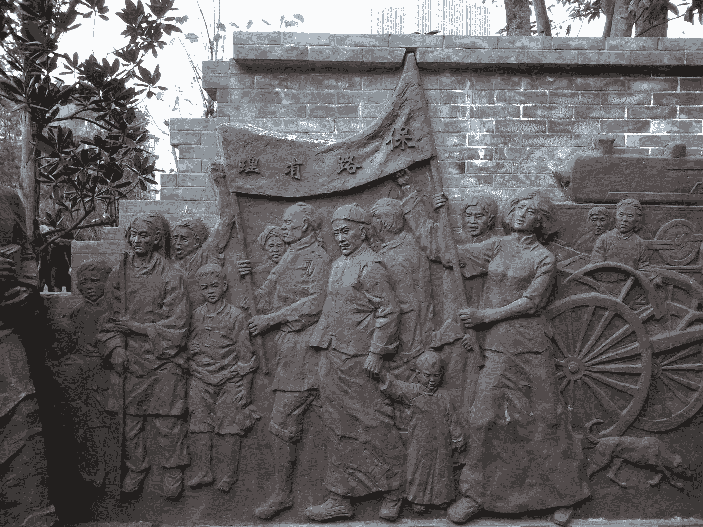

# 全球铜的前景对中国来说是一个战略困境

> 原文：<https://medium.com/coinmonks/the-global-copper-scenario-is-a-strategic-dilemma-for-china-4fa46f1369fa?source=collection_archive---------17----------------------->

中华人民共和国(PRC)有巨大的政治、经济和战略利益来维持**铜业现在和未来的强劲势头。随着铜价在 2020 年创下历史新高，全球最大的铜消费国将其生产活动水平提高至 2011 年以来的最高水平，同时在 2020 年 6 月**进口 656，483 吨。****

**** [## 中国的铜进口继续以创纪录的速度在较低的价格采矿。计算机输出缩微胶片

### 年初至今，铜进口增长 8.1%，但上海库存降至 7 个月低点。

www.mining.com](https://www.mining.com/web/chinas-copper-imports-continue-at-record-pace-on-lower-prices/) 

随着世界转向****能源转型和电动汽车需求的增长，这些数字通常会越来越高。****

****除了国内铜产量的扩大，中国对金属的国际影响力还体现在非洲(钴和锂)、东南亚(镍)和南美洲(铜)。******** 

# ********秘鲁拉斯邦巴斯铜矿********

******铜正成为世界上最有价值的大宗商品之一。******

******秘鲁的 Las Bambas 矿就是一个例子。今年，中国的 MMG 正面临着来自拉斯邦巴斯当地土著居民的限制。******

******中华人民共和国(PRC)与秘鲁土著群体**之间的关系历史与铜行业密切相关。********

******自从中国 MMG 于 2014 年 4 月**以 58.5 亿美元从嘉能可购买 Las Bambas 矿以来，该矿业公司就一直面临秘鲁土著团体对该矿生产控制地位的持续反对——例如在 [**2019**](https://www.spglobal.com/commodity-insights/en/market-insights/latest-news/metals/120321-mmg-to-halt-las-bambas-copper-mine-operations-mid-december-if-roadblocks-remain) 宣布的不可抗力以及在[**2021**](https://www.spglobal.com/commodity-insights/en/market-insights/latest-news/metals/120321-mmg-to-halt-las-bambas-copper-mine-operations-mid-december-if-roadblocks-remain)**的路障阻碍——这为一个国家开发了产出**********

******拉斯邦巴斯的土著群体反对中国的采矿活动和商业的原因有很多，比如劳工和报酬问题；环境问题和当地对煤矿破坏的不满。******

******但中国的 MMG 表示，希望借此机会为秘鲁经济做出贡献。他们努力给土著群体充分的合作理由。他们因此被邀请于 2022 年 5 月 6 日 在 [**与该公司进行会谈。**](https://www.reuters.com/world/americas/peruvian-protesters-agree-attend-talks-over-mmgs-shut-copper-mine-2022-05-07/)******

****就国内而言，大部分铜矿都是从中国大陆政治上极其敏感的地区——西藏、新疆、内蒙古——开采出来的，因此中国共产党(CCP)的政治成本是巨大的。更不用说从刚果民主共和国(DRC)的危险国家提取的钴和锂了。****

****财大气粗伴随着高昂的政治成本。中国也不想把这一优势让给美国或任何其他国家。但我们看到的石油和天然气行业对俄罗斯在乌克兰行动的强烈反对，引发了一场关于全球金属矿商和生产商的新讨论——以及中国在多大程度上影响对金属行业至关重要的地缘政治趋势。****

**** [## 金属 2.0:地缘政治的游戏规则改变者

### 镍和锂—电动汽车(EV)电池

medium.com](/coinmonks/metals-2-0-the-game-changers-in-geopolitics-da643974401f) 

# 全球铜的情况

在 [**【智利】**](https://www.mining.com/web/bhp-eyes-10-billion-chilean-investments-but-only-with-legal-certainty/) 和 [**厄瓜多尔**](https://miningdigital.com/automation-and-ai/bhp-expands-interest-stake-ecuador-cascanbel-copper-gold-project) 可以找到有价值的铜生产资产，但是刚果民主共和国(DRC)正在规划一些世界上最大的铜矿，用于未来的大宗商品。在这一点上，地缘政治趋势可能会对必和必拓和特斯拉等公司产生影响，这两家公司都是未来大宗商品发展的关键角色——看看中国金属行业最近的事件就能解释这种战略困境。

 [## 中国能源短缺可能刺激铜和铝需求——ANZ

### 路透 8 月 25 日电---中国的能源短缺可能导致对铜和铝的需求增加，因为中国的电力需求将持续增长

www.reuters.com](https://www.reuters.com/world/china/chinas-energy-shortage-could-boost-copper-aluminium-demand-anz-2022-08-25/) 

我认为，中国未来可能会面临艰难的决定，即增加对俄罗斯大宗商品**的敞口所带来的后果，特别是铜和镍等金属，俄罗斯拥有这些金属的产能和战略储备，可以在未来继续向中国供应这些关键金属。**

**中国也不太可能卷入 [**ESG 范式转变**](/coinmonks/paradigm-shifts-indigenous-groups-mining-projects-during-global-commodity-supercycle-44b5d3b34aaf) 以及相关问题，因为他们的海外经济项目依赖于这些来自俄国的重要商品出口。这将有利于中国未来面对美国的战略困境。**

** [## 高盛——电池金属的牛市已经结束。

### 据石英，高盛预测，汽车制造商将找到一些缓解金属短缺在短期内，但随着…

medium.com](/coinmonks/goldman-sachs-bull-market-for-battery-metals-is-over-ab3a41e29d48) 

任何关注金属开采和政治转型的人都会知道，铜和镍等金属与智利和印度尼西亚的政治密切相关。点击此链接了解为什么智利新政府对铜矿 **越来越严厉。**

据报道，一个巨大的天坑出现在加拿大公司伦丁矿业公司在印度尼西亚的一个矿场附近。为此，智利矿业监管机构迫使该公司停止在该地区的所有采矿活动。关于所发生的事情，调查仍在进行中，但据推测，该地区可能被铜矿过度开采。

这是一个经典的故事，讲述了由于 [**环境、社会、治理(ESG)**](/coinmonks/paradigm-shifts-indigenous-groups-mining-projects-during-global-commodity-supercycle-44b5d3b34aaf) 框架以及采矿作业对当地社区的影响，政府和公司正面临更大的压力。在公众呼吁解决社会不平等问题后，智利新政府在总统加里埃尔·硼酸的领导下已经完成了新宪法的定稿。

 [## 走向绿色正在推动全球铜短缺

### 2050 年净零碳目标是不可能的，因为随着需求翻倍，我们无法开采足够的铜

medium.com](/the-dock-on-the-bay/going-green-is-driving-a-world-copper-shortage-94f573fc34a7) 

印尼投资部长宣布 [**印尼总统佐科·维多多吊销采矿许可证**](https://www.mining.com/web/indonesia-revokes-thousands-of-mining-permits-covering-over-3m-hectares/) **。据报道，由于政府的土地重新分配计划，2000 多份采矿许可证被吊销。以 PT Bayan Resources 等煤矿公司的违规行为为例，政府声称，土地再分配计划将有助于为矿业部门的新企业创造公平的竞争环境。**

印度尼西亚的政治和经济与采矿作业、外国投资以及围绕自然资源领土的各种种族纠纷密切相关。 [**电池金属**](/coinmonks/goldman-sachs-bull-market-for-battery-metals-is-over-ab3a41e29d48) 已经成为印尼未来经济发展相当重要的一部分。这也使得他们更容易受到对 [**中国和**](/coinmonks/russias-and-china-s-nickel-strategy-a-national-champion-to-stabilize-sanctions-82b48c141296) 俄国的制裁。

维多多政府在处理政治反对派方面面临着国内外的压力。印度尼西亚即将举行的民主选举结果显示，维多多是否愿意下台，这是一个有争议的问题。印度尼西亚如何以及是否会发生政治转型，将是一个重要信号，表明在不久的将来，世界上一些最关键的金属将如何供应。

# **俄罗斯和中国会调整产业政策吗？**

这些金属对全球经济变得如此重要，以至于俄罗斯(以及其他国家)必须仔细考虑其工业如何避免美国和欧盟的制裁。避免因俄罗斯入侵乌克兰而遭受制裁的巨大打击，将是他们捍卫俄罗斯民族主义政策的整体战略中的一大成就。

 [## 范式转变:俄罗斯的金属兼并和北极战略

### 金属合并

medium.com](/coinmonks/paradigm-shifts-russias-metal-merger-and-the-arctic-strategy-f930f8c1f731) 

俄罗斯商品的走势以及制裁对相关产业的影响，都将影响到俄罗斯与中国的关系，这也将引起美国和欧盟的高度关注。

事实是，俄中战略仍不确定会走多远，尽管中国国家主席和习主席近平支持袖手旁观弗拉基米尔·普京，不考虑乌克兰战争。在我看来，这在很大程度上表明了两国在世界政治中的共同利益。

奥运会无疑是做出这种声明的最大舞台之一。

我认为，中国未来可能会面临艰难的决定，即增加对俄罗斯大宗商品**的敞口，尤其是铜和镍等金属，俄罗斯拥有这些金属的产能和战略储备，可以在未来继续向中国供应这些关键金属。**

**中国也不太可能卷入 [**ESG 范式转变**](/coinmonks/paradigm-shifts-indigenous-groups-mining-projects-during-global-commodity-supercycle-44b5d3b34aaf) 以及与依赖俄罗斯这些重要商品出口的海外经济项目相关的问题。这将有利于中国未来面对美国的战略困境。**

**为了更广泛地了解金属行业正在发生的事情，我建议阅读我写的这篇关于 2022 年 3 月伦敦金属交易所(LME)镍交易危机的文章。它包括关于中国、印度尼西亚、澳大利亚和特斯拉的信息。我在这篇文章中的总体观点是，金属行业将成为未来一个国家战略中更大的因素，而特斯拉和必和必拓等公司正在承受地缘政治十字路口的负担，特别是在俄罗斯入侵乌克兰之后。**

** [## ESG 原则和面向商品领导的未来价值

### 理解未来商品的全球现象是这个故事的目的。我希望你喜欢它并且…

medium.com](/data-driven-fiction/esg-principles-and-the-value-of-future-facing-commodities-leadership-bfb9ac45b5e0) 

> 交易新手？尝试[加密交易机器人](/coinmonks/crypto-trading-bot-c2ffce8acb2a)或[复制交易](/coinmonks/top-10-crypto-copy-trading-platforms-for-beginners-d0c37c7d698c)********