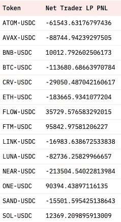

# 作为一个 LP 的好，坏和丑

> 原文：<https://medium.com/coinmonks/the-good-the-bad-and-the-ugly-of-being-an-lp-af484b3d1cca?source=collection_archive---------10----------------------->

所有交易所都需要流动性来促进交易。更多的流动性导致更低的滑点和更好的执行价格。流动性提供者(LP)向交易所提供流动性，以换取一些回报。这篇文章涵盖了在 AMM 风格的 DEX(例如 Phezzan、Uniswap)上做 LP 的好、坏和丑。

## 好人

大多数 dex 会奖励一部分交易费给 LP。比如 Uniswap 把交易费用 100%奖励给 LP。Phezzan testnet 目前将交易费用的 70%奖励给 LP。如果一个 DEX 上有很多交易量，LP 就能赚很多交易费。

(Uniswap ETH-USDC pool’s trading fees history)

Uniswap 的 USDC 联邦理工学院池在过去 14 个月中收取了 2.1778 亿美元的费用。这些费用都给了有限合伙人。

传统上，只有专业的做市商才能为交易所提供流动性。AMM 风格的 dex 允许任何人提供流动性。为了吸引更多的流动性，大多数 AMM 风格的 dex 通过流动性挖掘计划奖励有限合伙人。奖励一般有 20% — 300%的 APR，LP 通常以 DEX 的原生代币形式获得奖励。

因此，成为一名 LP 听起来很棒，有交易费和流动性挖掘奖励，对吗？没那么快。

## 坏事

大多数 AMM 风格的有限合伙人都在赔钱。Bancor 分析了 Uniswap V3 上的 17 个池，覆盖了 Uniswap 的 TVL 的 43%(https://arxiv . org/pdf/2111.09192 . pdf)。在 17 个被分析的资金池中，只有 3 个的有限合伙人有正收益。

大多数 AMM 风格的 dex 通过流动性挖掘项目补贴有限合伙人来解决这个问题。然而，从长远来看，这种战略是不可持续的。dex 不可能永远为 LPs 的损失买单。让情况变得更糟的是，有限合伙人可能会损失惨重，甚至连流动性挖掘的回报都不足以弥补有限合伙人的损失。永久协议 V2 (Perp V2)，一个 AMM 风格的永久 DEX，不能吸引足够的 LP(谁想赔钱？)所以他们的团队本身就得是 LP。

(Perpetual Protocol team’s liquidity share of all TVL, from Twitter @crypto_noodles)

不用说，永久协议的团队作为一个 LP 正在亏损。

(Perpetual Protocol team’s PnL as an LP, from Twitter @crypto_noodles)

那么，为什么 AMM 风格指数的有限合伙人会亏损呢？

## 丑陋的

AMM 式 dex 中的有限合伙人在提供流动性时会遭受非永久性损失(IL)。非永久性损失是将资产作为 LP 投资于 AMM 风格的 DEX 和持有相同资产之间的区别。简而言之，只要 LP 存款和从 AMM 式 DEX 中提取流动性的价格不同，LP 就会遭受非永久性损失。

AMMs 中的 LP 是交易者的交易对手。在 Uniswap 的 USDC 联邦理工学院池中，有限合伙人从联邦理工学院和 USDC 的同等美元价值开始。如果 ETH 的价格上涨，这意味着交易商正在购买 ETH，因此 LPs 的 ETH 被卖给 USDC。LP 持有 ETH 和 USDC 会更好(因为当 ETH 价格上涨时 LP 会卖出 ETH)。如果 ETH 的价格下跌，这意味着交易商正在出售 ETH，因此有限合伙人被迫出售 USDC 来购买 ETH。同样，有限合伙人持有瑞士联邦理工学院和 USDC 会更好(因为有限合伙人在瑞士联邦理工学院价格下跌时购买瑞士联邦理工学院)。唯一一种情况是，如果 ETH 的价格回到 LPs 的进场价格，LPs 的情况不会比不 LPing 的情况更糟。

如果 USDC 联邦理工学院的价格上涨，这意味着交易者做多。因此，有限合伙人将持有空头头寸，然后亏损，因为 ETH 价格上涨，但有限合伙人持有 ETH 空头头寸。这是双向的，所以有限合伙人不亏损的唯一情况是当 ETH 的价格回到有限合伙人的进场价格，这种情况很少发生。

对于大多数 Uniswap 池，赚取的 LP 费用少于在特定时间范围内发生的非永久性损失。有限合伙人实际上是在赔钱。即使 Uniswap V3 将 100%的交易费交给有限合伙人，这种情况还是会发生。

非永久性损失的存在主要是因为资产管理系统中的有限合伙人被迫进行不良交易。AMM 算法让有限合伙人逆价格波动交易，所以无论资产价格上涨或下跌，有限合伙人都会亏损。

除了非永久性的损失，AMM 的资本效率低下也是有限合伙人的噩梦。dYdX(订单簿)和 Perp V2 (AMM)在一些池中有大致相同的 TVL，但在相同的交易中，dYdX 只有 Perp V2 的 1/10。对于相同的交易体验，dYdX 在相同的资金池中只需要 V2 的 1/10 的流动性。作为有限合伙人收取的交易费用大致等于投资美元/ TVL *交易量。在其他条件不变的情况下，作为 LP 投资的 1 美元，orderbook 指数将获得比 AMM 风格指数高 10 倍的交易费用回报。

## 一线希望

那么 LP 怎么挣钱呢？

1)通过 LPing 指数，给予足够的交易费用和流动性挖掘奖励。费森·V1 可能属于这个阵营。派对不可能永远持续，但趁现在还在，好好享受吧。

2)通过用期权对冲头寸。例如，跨骑([https://www.investopedia.com/terms/s/straddle.asp)](https://www.investopedia.com/terms/s/straddle.asp))允许用户通过价格变动来赚钱。有限合伙人从空头交易中获得的收入可以抵消非永久性损失。但有限合伙人需要支付溢价，而且多空交易只能覆盖一定比例的价格变动。LP 可能需要成为交易专家才能走这条路。

3)以订单簿形式索引。费森·V2 将会是一个纯秩序册风格的敏捷，同时允许每个人都成为 LP。Phezzan Protocol 将与专业的做市商和初创公司合作，创建自动策略，用户可以通过点击鼠标来选择不同的做市商 bot 策略。把它想象成在 Uniswap 流动性池中增加流动性，只是这次不会有非永久性的损失。更多详情，请看*我们对 Phezzan 协议的愿景 Mainnet V2*(https://medium . com/@ Phezzan/Our-Vision-for-Phezzan-Protocol-Mainnet v2-c 527 c 7 FBD 7 c 9)。

> 交易新手？试试[密码交易机器人](/coinmonks/crypto-trading-bot-c2ffce8acb2a)或[复制交易](/coinmonks/top-10-crypto-copy-trading-platforms-for-beginners-d0c37c7d698c)

就这样，伙计们！如果你有兴趣成为一名 LP，或者对如何提高 Phezzan 协议的 LP 收入有一些想法，请加入我们的 [*Discord*](https://discord.gg/X5t3dhAU) 服务器。我们希望收到您的来信！