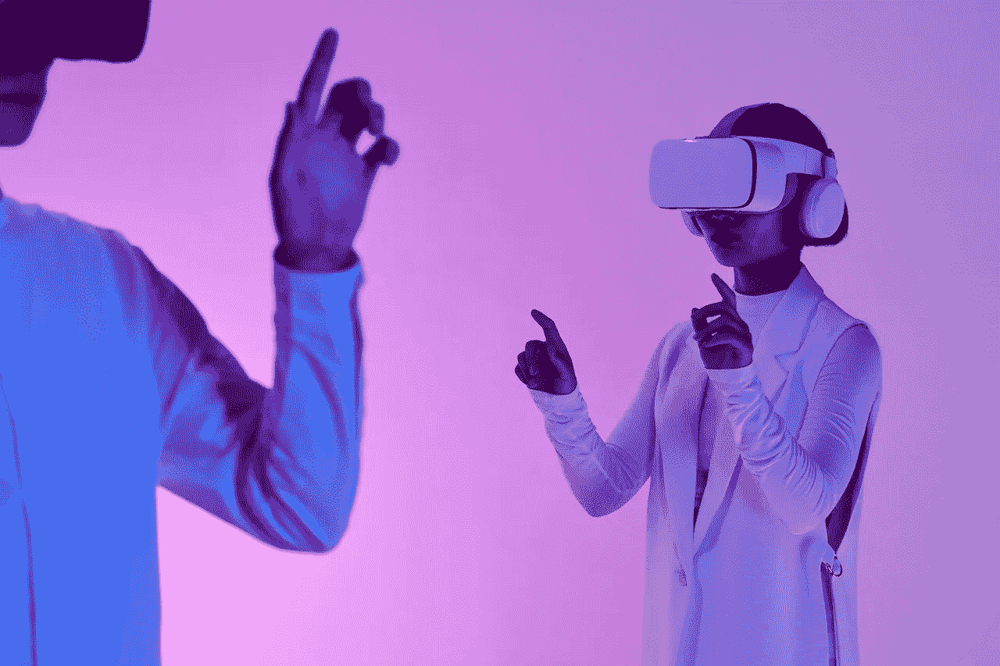

# 伟大的技能转变:人工智能和新兴技术的勇敢新世界

> 原文：<https://medium.com/coinmonks/the-great-skills-shift-a-brave-new-world-of-artificial-intelligence-and-emerging-technologies-f8ac630581c9?source=collection_archive---------26----------------------->

Photo by Michelangelo Buonarroti: [https://www.pexels.com/photo/two-people-playing-vr-box-8728556/](https://www.pexels.com/photo/two-people-playing-vr-box-8728556/)

人工智能(AI)正在迅速改变工作世界，许多专家认为，人工智能对就业的影响在未来几年只会继续增长。根据一些估计，2030 年将存在的所有工作中有 85%还没有被发明出来，技术变革的快速步伐可能会对未来所需的技能和知识类型产生重大影响。

## 在人工智能时代快速发展的技术技能领域导航

如今，员工面临的一个关键挑战是，大多数技术技能的**半衰期不到三年**。这意味着随着新技术和方法的出现，今天有价值的技能和知识可能会很快过时。在快速采用人工智能和其他先进技术的行业中尤其如此，如制造业、医疗保健和金融。

## 发展在不断变化的工作环境中茁壮成长所需的技能和知识

为了应对这种快速变化的未来工作，员工必须具备适应新技术和新行业的技能和知识。这可能包括学习新的技术技能，如编程或数据分析，或发展更一般的技能，如解决问题，批判性思维和创造力。

## 元宇宙改变我们工作和学习方式的潜力

Photo by MART PRODUCTION: [https://www.pexels.com/photo/curly-girl-wearing-vr-googles-8471974/](https://www.pexels.com/photo/curly-girl-wearing-vr-googles-8471974/)

元宇宙有可能彻底改变我们对工作和教育的看法。通过创建身临其境的交互式虚拟环境，元宇宙可以让员工以新的方式进行协作和交流，并访问各种资源和机会，而不管他们身在何处。

## Web3 技术在工作和教育领域的变革潜力

Photo by Morthy Jameson: [https://www.pexels.com/photo/tablet-leaning-on-a-laptop-9588219/](https://www.pexels.com/photo/tablet-leaning-on-a-laptop-9588219/)

Web3 技术，如区块链和分散应用程序(dApps)，也有可能改变我们的工作和学习方式。例如，区块链可以用来创建安全透明的技能和成就记录，让工人更容易向潜在雇主展示他们的优势和能力。分散式应用程序(dApps)可用于创建交互式学习体验和平台，使员工能够以更具吸引力和沉浸感的方式学习新技能和知识。

## 以下是一些可能受到这些新兴技术影响的潜在未来工作:

## 虚拟医疗保健提供商

随着远程医疗和其他虚拟医疗保健技术的使用越来越多，可能需要擅长远程提供医疗保健服务的专业人员，包括在线诊断和治疗患者。

## 虚拟教育讲师

随着越来越多的教育机构采用虚拟学习平台和技术，可能会需要擅长设计和提供虚拟教育内容和体验的专业人员。

## 虚拟现实治疗师

随着虚拟现实技术变得越来越先进，对于能够熟练使用虚拟现实来帮助患者应对焦虑、抑郁和其他心理健康问题的专业人士的需求可能会越来越大。

## 虚拟现实记者

随着虚拟现实技术变得越来越流行，可能需要熟练使用虚拟现实来创造身临其境和引人入胜的新闻体验的记者。

## 虚拟现实调解人

随着虚拟现实技术变得越来越先进，可能需要能够熟练使用虚拟现实的调解员来促进各方之间的争议解决和谈判。

## 虚拟事件协调员

随着虚拟活动的日益普及，可能需要擅长协调和管理虚拟活动(包括网络研讨会、会议和其他在线聚会)的专业人士。

# 结论

要想在瞬息万变的职场中取得成功，跟上最新发展并准备好适应新技术和新方法是至关重要的。投资终身学习和持续教育可以帮助员工走在这些变化的前面，为未来的工作做好更好的准备。让我们拥抱工作的未来和它带来的所有令人兴奋的机会。

> 交易新手？在[最佳密码交易所](/coinmonks/crypto-exchange-dd2f9d6f3769)上尝试[密码交易机器人](/coinmonks/crypto-trading-bot-c2ffce8acb2a)或[复制交易](/coinmonks/top-10-crypto-copy-trading-platforms-for-beginners-d0c37c7d698c)